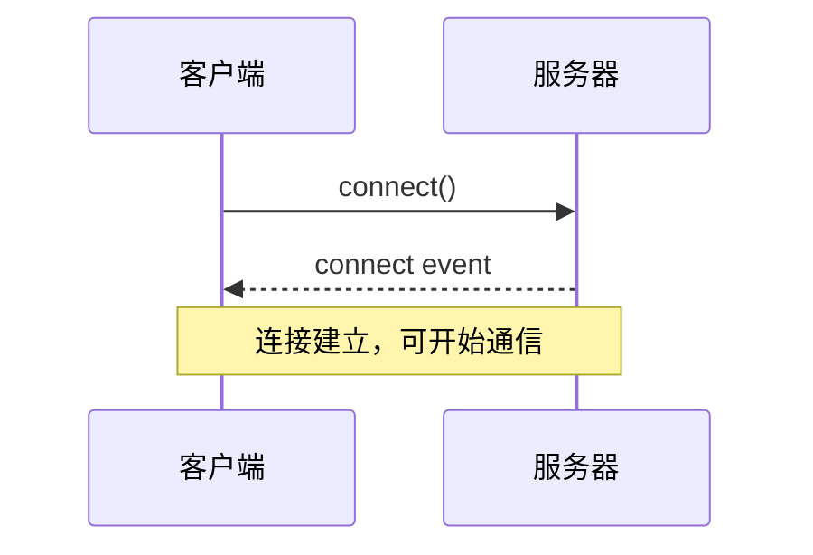
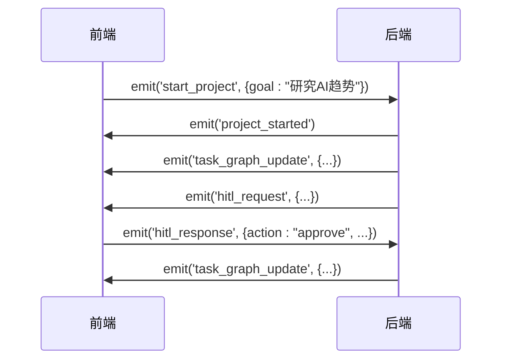

# API参考

<cite>
**本文档中引用的文件**
- [profiles.py](file://src/sentientresearchagent/server/api/profiles.py)
- [projects.py](file://src/sentientresearchagent/server/api/projects.py)
- [websocket.py](file://src/sentientresearchagent/server/api/websocket.py)
- [events.py](file://src/sentientresearchagent/server/websocket/events.py)
- [projectService.ts](file://frontend/src/services/projectService.ts)
- [websocketService.ts](file://frontend/src/services/websocketService.ts)
- [websocket.ts](file://frontend/src/types/websocket.ts)
</cite>

## 目录
1. [简介](#简介)
2. [RESTful API 参考](#restful-api-参考)
3. [WebSocket API 参考](#websocket-api-参考)
4. [客户端代码示例](#客户端代码示例)
5. [错误码与高级选项](#错误码与高级选项)

## 简介
本API参考文档详细说明了Sentient Research Agent系统的公开接口，涵盖RESTful API和WebSocket API。系统通过分层架构支持项目管理、代理配置和实时状态同步。RESTful端点用于执行一次性操作（如创建项目），而WebSocket连接则用于实时推送任务图更新、人工干预请求（HITL）等事件。所有API均设计为无状态且可预测，确保开发者能够可靠地集成和调试。

## RESTful API 参考

### `/api/projects` - 项目管理
此端点用于创建和检索项目。

#### GET 请求
获取所有项目的列表。
- **URL**: `/api/projects`
- **响应格式**:
```json
{
  "projects": [
    {
      "id": "string",
      "title": "string",
      "goal": "string",
      "status": "running|completed|failed",
      "created_at": "datetime"
    }
  ],
  "current_project_id": "string"
}
```

#### POST 请求
创建一个新项目并立即启动执行。
- **URL**: `/api/projects`
- **请求体 (JSON)**:
```json
{
  "goal": "string", // 项目目标，必填
  "max_steps": "integer" // 最大执行步数，默认250
}
```
- **成功响应**:
```json
{
  "project": { /* 项目对象 */ },
  "message": "Project created and started"
}
```

**Section sources**
- [projects.py](file://src/sentientresearchagent/server/api/projects.py#L68-L97)

### `/api/projects/<project_id>` - 特定项目操作
此端点用于对特定项目进行操作。

#### GET 请求
获取指定项目的详细信息。
- **URL**: `/api/projects/{project_id}`
- **路径参数**: `project_id` (字符串)
- **响应格式**: 返回包含项目元数据和当前状态的对象。

#### DELETE 请求
删除指定项目。
- **URL**: `/api/projects/{project_id}`
- **路径参数**: `project_id` (字符串)
- **成功响应**: `{ "message": "Project deleted successfully" }`

**Section sources**
- [projects.py](file://src/sentientresearchagent/server/api/projects.py#L100-L158)

### `/api/projects/<project_id>/switch` - 切换项目
将系统上下文切换到另一个项目。

- **URL**: `/api/projects/{project_id}/switch`
- **HTTP方法**: POST
- **路径参数**: `project_id` (字符串)
- **成功响应**:
```json
{
  "project": { /* 切换后的项目对象 */ },
  "message": "Switched to project {project_id}"
}
```

**Section sources**
- [projects.py](file://src/sentientresearchagent/server/api/projects.py#L120-L138)

### `/api/projects/<project_id>/save-results` - 保存项目结果
将项目结果持久化存储。

- **URL**: `/api/projects/{project_id}/save-results`
- **HTTP方法**: POST
- **成功响应**:
```json
{
  "message": "Project results saved successfully",
  "saved_at": "iso_timestamp",
  "metadata": { /* 元数据 */ }
}
```

**Section sources**
- [projects.py](file://src/sentientresearchagent/server/api/projects.py#L160-L218)

### `/api/projects/<project_id>/load-results` - 加载项目结果
从持久化存储中加载项目结果。

- **URL**: `/api/projects/{project_id}/load-results`
- **HTTP方法**: GET
- **成功响应**: 返回包含`graph_data`和`metadata`的结果包。

**Section sources**
- [projects.py](file://src/sentientresearchagent/server/api/projects.py#L220-L245)

### `/api/profiles` - 代理配置文件管理
管理系统的代理配置文件。

#### GET 请求
获取所有可用的代理配置文件。
- **URL**: `/api/profiles`
- **响应格式**:
```json
{
  "current_profile": "string",
  "profiles": [
    {
      "name": "string",
      "description": "string",
      "is_current": "boolean"
    }
  ],
  "total_count": "integer"
}
```

**Section sources**
- [profiles.py](file://src/sentientresearchagent/server/api/profiles.py#L28-L42)

#### POST 请求 (`/api/profiles/<profile_name>/switch`)
切换到指定的代理配置文件。
- **路径参数**: `profile_name` (字符串)
- **成功响应**:
```json
{
  "success": true,
  "profile": "string",
  "system_info": { /* 系统信息 */ }
}
```

**Section sources**
- [profiles.py](file://src/sentientresearchagent/server/api/profiles.py#L58-L85)

## WebSocket API 参考

### 连接与认证
WebSocket连接建立在HTTP之上，使用Socket.IO协议。客户端通过连接到服务器根路径（`window.location.origin`）来建立连接。无需显式认证，连接权限由会话控制。



**Diagram sources**
- [websocketService.ts](file://frontend/src/services/websocketService.ts#L15-L45)
- [events.py](file://src/sentientresearchagent/server/websocket/events.py#L15-L25)

### 消息事件类型

#### `task_graph_update` - 任务图更新
当任务图状态发生变化时，服务器向所有连接的客户端广播此事件。

- **消息结构 (JSON)**:
```json
{
  "all_nodes": { /* 节点ID到节点数据的映射 */ },
  "graphs": { /* 子图结构 */ },
  "overall_project_goal": "string",
  "project_id": "string"
}
```
- **发送时机**: 任何项目状态变更后，例如节点完成或失败。
- **客户端处理逻辑**: 前端使用`useTaskGraphStore.getState().setData(data)`更新全局状态，并根据`project_id`进行项目隔离。

**Section sources**
- [websocketService.ts](file://frontend/src/services/websocketService.ts#L100-L200)
- [events.py](file://src/sentientresearchagent/server/websocket/events.py#L100-L115)

#### `hitl_request` - 人工干预请求
当系统需要人工输入时触发此事件。

- **消息结构 (JSON)**:
```json
{
  "request_id": "string",
  "checkpoint_name": "string",
  "context_message": "string",
  "data_for_review": "object",
  "node_id": "string",
  "current_attempt": "integer",
  "timestamp": "iso_string"
}
```
- **发送时机**: 在执行关键决策点前，例如验证搜索结果质量。
- **客户端处理逻辑**: 将请求存入Zustand store，触发HITL模态框显示，等待用户响应。

**Section sources**
- [websocketService.ts](file://frontend/src/services/websocketService.ts#L202-L260)
- [events.py](file://src/sentientresearchagent/server/websocket/events.py#L100-L115)

#### `project_switched` - 项目切换通知
当项目被成功切换时广播此事件。

- **消息结构 (JSON)**:
```json
{
  "project_id": "string",
  "project_data": { /* 新项目的完整状态 */ },
  "timestamp": "iso_string"
}
```
- **发送时机**: `handle_switch_project`事件处理成功后。
- **客户端处理逻辑**: 更新本地store中的当前项目ID和项目数据，刷新UI以反映新项目。

**Section sources**
- [websocketService.ts](file://frontend/src/services/websocketService.ts#L342-L370)
- [events.py](file://src/sentientresearchagent/server/websocket/events.py#L100-L115)

#### `project_restored` - 项目状态恢复
当请求的项目状态被成功恢复时发送。

- **消息结构 (JSON)**: 与`task_graph_update`相同，但包含完整的项目历史记录。
- **发送时机**: `handle_restore_project_state`或`handle_request_project_restore`成功后。
- **客户端处理逻辑**: 使用`setProjectData`和`switchToProject`方法恢复项目状态。

**Section sources**
- [websocketService.ts](file://frontend/src/services/websocketService.ts#L410-L470)
- [events.py](file://src/sentientresearchagent/server/websocket/events.py#L100-L115)

### 客户端发起的事件

#### `start_project`
客户端请求启动一个新项目。
- **参数 (JSON)**:
```json
{
  "goal": "string",
  "max_steps": "integer",
  "project_id": "string" // 可选
}
```

#### `switch_project`
客户端请求切换到另一个项目。
- **参数 (JSON)**:
```json
{
  "project_id": "string"
}
```

#### `hitl_response`
客户端对`hitl_request`作出响应。
- **参数 (JSON)**: 结构定义于`HITLResponse`接口。



**Diagram sources**
- [websocketService.ts](file://frontend/src/services/websocketService.ts#L500-L550)
- [events.py](file://src/sentientresearchagent/server/websocket/events.py#L100-L115)

## 客户端代码示例

### curl 命令示例
创建一个新项目：
```bash
curl -X POST http://localhost:8000/api/projects \
  -H "Content-Type: application/json" \
  -d '{"goal": "Analyze the impact of quantum computing on cryptography", "max_steps": 100}'
```

获取所有项目：
```bash
curl http://localhost:8000/api/projects
```

### JavaScript 客户端代码片段
使用`projectService`创建项目：
```javascript
import projectService from '@/services/projectService'

async function createNewProject() {
  try {
    const result = await projectService.createProject(
      "Research renewable energy advancements",
      200
    )
    console.log("Project created:", result.project.id)
  } catch (error) {
    console.error("Failed to create project:", error.message)
  }
}
```

使用`websocketService`发送HITL响应：
```javascript
import websocketService from '@/services/websocketService'

function submitHITLResponse(requestId, action) {
  if (websocketService.isConnected()) {
    websocketService.sendHITLResponse({
      request_id: requestId,
      checkpoint_name: "FinalReview",
      node_id: "node-123",
      action: action,
      timestamp: new Date().toISOString()
    })
  }
}
```

### Python 客户端代码片段
使用`requests`库与REST API交互：
```python
import requests

def create_project(goal: str, max_steps: int = 250):
    url = "http://localhost:8000/api/projects"
    payload = {"goal": goal, "max_steps": max_steps}
    response = requests.post(url, json=payload)
    
    if response.status_code == 201:
        return response.json()["project"]
    else:
        raise Exception(f"Error: {response.json()['error']}")

# 使用示例
try:
    project = create_project("Investigate blockchain scalability solutions")
    print(f"Created project: {project['id']}")
except Exception as e:
    print(e)
```

## 错误码与高级选项

### 错误码列表
| HTTP状态码 | 错误码/消息 | 描述 |
| :--- | :--- | :--- |
| 400 | `project_goal not provided` | 创建项目时未提供目标 |
| 400 | `project_id is required` | 切换项目时缺少项目ID |
| 404 | `Project not found` | 请求的项目不存在 |
| 500 | `Failed to start project execution` | 项目创建成功但执行启动失败 |

### 高级选项

#### 消息压缩 (`enable_ws_compression`)
WebSocket连接默认启用GZIP压缩以减少网络带宽消耗。该功能在Socket.IO服务器端自动配置，无需客户端干预。

#### 批量更新 (`ws_batch_size`)
系统通过`optimized_broadcast_service`实现批量状态更新，将短时间内产生的多个状态变更合并为单个`task_graph_update`事件发出，显著降低网络I/O和前端重渲染频率。

#### 自动保存与恢复
系统实现了多层自动保存机制：
1.  **前端localStorage**: 客户端定期将项目状态备份到浏览器存储。
2.  **服务端异步保存**: 通过`auto_save_project`事件，服务端将权威状态持久化。
3.  **恢复策略**: 连接恢复时，优先尝试从服务端加载，其次回退到前端备份。

此机制确保即使发生意外断线，用户的工作进度也能最大程度地恢复。

**Section sources**
- [websocketService.ts](file://frontend/src/services/websocketService.ts#L700-L750)
- [events.py](file://src/sentientresearchagent/server/websocket/events.py#L500-L550)