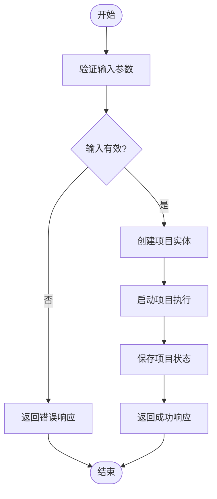

# REST API

<cite>
**本文档中引用的文件 **  
- [system.py](file://src/sentientresearchagent/server/api/system.py)
- [projects.py](file://src/sentientresearchagent/server/api/projects.py)
- [profiles.py](file://src/sentientresearchagent/server/api/profiles.py)
- [validation.py](file://src/sentientresearchagent/server/utils/validation.py)
- [config.py](file://src/sentientresearchagent/config/config.py)
- [project_structure.py](file://src/sentientresearchagent/core/project_structure.py)
</cite>

## 目录
1. [简介](#简介)
2. [项目生命周期管理](#项目生命周期管理)
3. [代理配置文件管理](#代理配置文件管理)
4. [系统信息与健康检查](#系统信息与健康检查)
5. [认证机制](#认证机制)
6. [状态码说明](#状态码说明)
7. [客户端代码示例](#客户端代码示例)

## 简介
本API文档详细描述了Sentient Research Agent系统的REST API接口，涵盖项目管理、代理配置文件管理和系统信息获取三大核心功能。所有端点均基于Flask框架实现，提供JSON格式的请求和响应数据。API设计遵循RESTful原则，使用标准HTTP方法进行资源操作。

**Section sources**
- [system.py](file://src/sentientresearchagent/server/api/system.py#L0-L345)
- [projects.py](file://src/sentientresearchagent/server/api/projects.py#L0-L589)
- [profiles.py](file://src/sentientresearchagent/server/api/profiles.py#L0-L110)

## 项目生命周期管理
项目生命周期管理API允许用户创建、读取、更新和删除研究项目。每个项目代表一个独立的研究任务，包含目标、执行状态和结果数据。

### 创建项目
创建新项目并立即启动执行。



**Diagram sources **
- [projects.py](file://src/sentientresearchagent/server/api/projects.py#L18-L100)

#### POST /api/projects
创建一个新的研究项目。

**请求参数**
- **方法**: POST
- **URL**: `/api/projects`
- **内容类型**: `application/json`

**请求体 (Schema: Pydantic)**
```json
{
  "goal": "string", // 项目目标，长度3-1000字符
  "max_steps": "integer" // 最大执行步骤，默认250
}
```

**成功响应 (201 Created)**
```json
{
  "project": {
    "id": "string",
    "title": "string",
    "goal": "string",
    "status": "string",
    "created_at": "string"
  },
  "message": "Project created and started"
}
```

**错误响应**
- **400 Bad Request**: 输入验证失败
- **500 Internal Server Error**: 服务器内部错误

**curl示例**
```bash
curl -X POST http://localhost:5000/api/projects \
  -H "Content-Type: application/json" \
  -d '{
    "goal": "分析人工智能在医疗领域的应用前景",
    "max_steps": 300
  }'
```

**Python requests示例**
```python
import requests

url = "http://localhost:5000/api/projects"
data = {
    "goal": "分析人工智能在医疗领域的应用前景",
    "max_steps": 300
}

response = requests.post(url, json=data)
print(response.json())
```

**Section sources**
- [projects.py](file://src/sentientresearchagent/server/api/projects.py#L18-L100)
- [validation.py](file://src/sentientresearchagent/server/utils/validation.py#L17-L62)

### 获取所有项目
检索系统中所有项目的列表。

#### GET /api/projects
获取所有项目的基本信息。

**请求参数**
- **方法**: GET
- **URL**: `/api/projects`

**成功响应 (200 OK)**
```json
{
  "total_count": 2,
  "projects": [
    {
      "id": "proj_1",
      "title": "AI in Healthcare",
      "goal": "Analyze AI applications in healthcare",
      "status": "RUNNING",
      "created_at": "2024-01-01T00:00:00Z"
    },
    {
      "id": "proj_2",
      "title": "Blockchain Analysis",
      "goal": "Research blockchain technology trends",
      "status": "COMPLETED",
      "created_at": "2024-01-02T00:00:00Z"
    }
  ]
}
```

**错误响应**
- **500 Internal Server Error**: 服务器内部错误

**curl示例**
```bash
curl -X GET http://localhost:5000/api/projects
```

**Section sources**
- [projects.py](file://src/sentientresearchagent/server/api/projects.py#L18-L35)

### 获取特定项目
根据项目ID获取详细的项目信息。

#### GET /api/projects/{project_id}
获取指定项目及其当前状态。

**请求参数**
- **方法**: GET
- **URL**: `/api/projects/{project_id}`
- **路径参数**:
  - `project_id` (string): 项目的唯一标识符

**成功响应 (200 OK)**
```json
{
  "project": {
    "id": "string",
    "title": "string",
    "goal": "string",
    "status": "string",
    "current_step": 0,
    "total_steps": 0,
    "created_at": "string",
    "updated_at": "string"
  },
  "execution_context": {
    "is_running": true,
    "current_node": "string",
    "progress_percentage": 0
  }
}
```

**错误响应**
- **404 Not Found**: 项目不存在
- **500 Internal Server Error**: 服务器内部错误

**curl示例**
```bash
curl -X GET http://localhost:5000/api/projects/proj_123
```

**Section sources**
- [projects.py](file://src/sentientresearchagent/server/api/projects.py#L102-L135)

### 切换项目
将系统上下文切换到另一个项目。

#### POST /api/projects/{project_id}/switch
切换到指定的项目。

**请求参数**
- **方法**: POST
- **URL**: `/api/projects/{project_id}/switch`
- **路径参数**:
  - `project_id` (string): 要切换到的项目的唯一标识符

**成功响应 (200 OK)**
```json
{
  "project": {
    "id": "string",
    "title": "string",
    "goal": "string",
    "status": "string"
  },
  "message": "Switched to project {project_id}"
}
```

**错误响应**
- **500 Internal Server Error**: 服务器内部错误

**curl示例**
```bash
curl -X POST http://localhost:5000/api/projects/proj_123/switch
```

**Section sources**
- [projects.py](file://src/sentientresearchagent/server/api/projects.py#L137-L150)

### 删除项目
永久删除指定的项目及其相关数据。

#### DELETE /api/projects/{project_id}
删除指定的项目。

**请求参数**
- **方法**: DELETE
- **URL**: `/api/projects/{project_id}`
- **路径参数**:
  - `project_id` (string): 要删除的项目的唯一标识符

**成功响应 (200 OK)**
```json
{
  "message": "Project deleted successfully"
}
```

**错误响应**
- **404 Not Found**: 项目未找到
- **500 Internal Server Error**: 服务器内部错误

**curl示例**
```bash
curl -X DELETE http://localhost:5000/api/projects/proj_123
```

**Section sources**
- [projects.py](file://src/sentientresearchagent/server/api/projects.py#L152-L169)

## 代理配置文件管理
代理配置文件管理API允许用户查询和切换不同的智能体配置文件，这些配置文件定义了智能体的行为模式和能力。

### 获取所有配置文件
检索系统中所有可用的代理配置文件。

#### GET /api/profiles
获取所有可用的代理配置文件，并标记当前激活的配置文件。

**请求参数**
- **方法**: GET
- **URL**: `/api/profiles`

**成功响应 (200 OK)**
```json
{
  "current_profile": "deep_research_agent",
  "profiles": [
    {
      "name": "deep_research_agent",
      "description": "深度研究专家，擅长复杂问题分解",
      "type": "research",
      "capabilities": ["decomposition", "synthesis", "critical_thinking"],
      "is_current": true
    },
    {
      "name": "general_agent",
      "description": "通用智能体，适用于各种任务",
      "type": "general",
      "capabilities": ["basic_research", "summarization"],
      "is_current": false
    }
  ],
  "total_count": 2
}
```

**错误响应**
- **500 Internal Server Error**: 服务器内部错误

**curl示例**
```bash
curl -X GET http://localhost:5000/api/profiles
```

**Section sources**
- [profiles.py](file://src/sentientresearchagent/server/api/profiles.py#L10-L40)

### 获取特定配置文件详情
获取指定配置文件的详细信息。

#### GET /api/profiles/{profile_name}
获取特定代理配置文件的详细信息。

**请求参数**
- **方法**: GET
- **URL**: `/api/profiles/{profile_name}`
- **路径参数**:
  - `profile_name` (string): 配置文件名称

**成功响应 (200 OK)**
```json
{
  "name": "deep_research_agent",
  "description": "深度研究专家，擅长复杂问题分解",
  "type": "research",
  "model": "gpt-4o",
  "temperature": 0.7,
  "capabilities": ["decomposition", "synthesis", "critical_thinking"],
  "tools": ["web_search", "file_reader", "data_analyzer"],
  "is_current": true
}
```

**错误响应**
- **500 Internal Server Error**: 服务器内部错误

**curl示例**
```bash
curl -X GET http://localhost:5000/api/profiles/deep_research_agent
```

**Section sources**
- [profiles.py](file://src/sentientresearchagent/server/api/profiles.py#L41-L72)

### 切换配置文件
将系统使用的代理配置文件切换到指定的配置文件。

#### POST /api/profiles/{profile_name}/switch
切换到指定的代理配置文件。

**请求参数**
- **方法**: POST
- **URL**: `/api/profiles/{profile_name}/switch`
- **路径参数**:
  - `profile_name` (string): 要切换到的配置文件名称

**成功响应 (200 OK)**
```json
{
  "success": true,
  "profile": "deep_research_agent",
  "previous_profile": "general_agent",
  "message": "Successfully switched to profile deep_research_agent"
}
```

**错误响应**
- **400 Bad Request**: 切换失败
- **500 Internal Server Error**: 服务器内部错误

**curl示例**
```bash
curl -X POST http://localhost:5000/api/profiles/deep_research_agent/switch
```

**Section sources**
- [profiles.py](file://src/sentientresearchagent/server/api/profiles.py#L74-L100)

### 获取当前配置文件
获取当前激活的代理配置文件信息。

#### GET /api/profiles/current
获取当前正在使用的代理配置文件。

**请求参数**
- **方法**: GET
- **URL**: `/api/profiles/current`

**成功响应 (200 OK)**
```json
{
  "name": "deep_research_agent",
  "description": "深度研究专家，擅长复杂问题分解",
  "type": "research",
  "is_current": true
}
```

**错误响应**
- **404 Not Found**: 无激活的配置文件
- **500 Internal Server Error**: 服务器内部错误

**curl示例**
```bash
curl -X GET http://localhost:5000/api/profiles/current
```

**Section sources**
- [profiles.py](file://src/sentientresearchagent/server/api/profiles.py#L102-L110)

## 系统信息与健康检查
系统信息API提供系统状态、健康状况和调试信息的访问。

### 系统信息
获取系统的综合信息和统计数据显示。

#### GET /api/system-info
获取系统信息和统计数据。

**请求参数**
- **方法**: GET
- **URL**: `/api/system-info`

**成功响应 (200 OK)**
```json
{
  "version": "1.0.0",
  "uptime": "12h34m",
  "memory_usage": "512MB",
  "cpu_usage": "45%",
  "active_projects": 3,
  "total_executions": 150,
  "cache_status": {
    "enabled": true,
    "size": 850,
    "max_size": 1000
  }
}
```

**错误响应**
- **500 Internal Server Error**: 服务器内部错误

**curl示例**
```bash
curl -X GET http://localhost:5000/api/system-info
```

**Section sources**
- [system.py](file://src/sentientresearchagent/server/api/system.py#L15-L25)

### 健康检查
执行系统健康检查。

#### GET /api/health
健康检查端点。

**请求参数**
- **方法**: GET
- **URL**: `/api/health`

**成功响应 (200 OK)**
```json
{
  "status": "healthy",
  "initialized": true,
  "timestamp": "2024-01-01T00:00:00Z"
}
```

**curl示例**
```bash
curl -X GET http://localhost:5000/api/health
```

**Section sources**
- [system.py](file://src/sentientresearchagent/server/api/system.py#L45-L55)

### 就绪状态检查
获取系统的就绪状态。

#### GET /readiness
获取系统就绪状态。

**请求参数**
- **方法**: GET
- **URL**: `/readiness`

**成功响应 (200 OK)**
```json
{
  "ready": true,
  "components": {
    "system_initialized": true,
    "websocket_hitl_ready": true,
    "cache_ready": true,
    "execution_engine_ready": true
  },
  "websocket_hitl_status": {
    "connected": true,
    "clients": 1
  },
  "timestamp": "2024-01-01T00:00:00Z"
}
```

**curl示例**
```bash
curl -X GET http://localhost:5000/readiness
```

**Section sources**
- [system.py](file://src/sentientresearchagent/server/api/system.py#L57-L95)

## 认证机制
本系统目前采用基于环境变量的简单认证机制，未来计划支持更复杂的认证方式。

### API密钥认证
通过环境变量配置API密钥进行认证。

**配置方式**
```bash
export SENTIENT_LLM_API_KEY="your-api-key-here"
export SENTIENT_ENV="production"
```

**配置模型 (Pydantic)**
```python
class LLMConfig(BaseModel):
    provider: str = "openai"
    model: str = "gpt-4"
    temperature: float = 0.7
    api_key: Optional[str] = Field(default_factory=lambda: os.getenv("OPENAI_API_KEY"))
```

**验证逻辑**
```python
def validate_api_keys(self) -> List[str]:
    missing_keys = []
    if self.llm.provider == "openai" and not self.llm.api_key:
        missing_keys.append("OpenAI API key")
    return missing_keys
```

**安全建议**
- 在生产环境中始终设置`SENTIENT_ENV=production`
- 使用强随机密钥作为`FLASK_SECRET_KEY`
- 通过环境变量而非代码硬编码API密钥

**Section sources**
- [config.py](file://src/sentientresearchagent/config/config.py#L21-L43)
- [config.py](file://src/sentientresearchagent/config/config.py#L378-L590)

## 状态码说明
API响应使用标准HTTP状态码表示操作结果。

| 状态码 | 含义 | 说明 |
|--------|------|------|
| 200 | OK | 请求成功，返回预期数据 |
| 201 | Created | 资源创建成功 |
| 400 | Bad Request | 请求参数无效或缺失 |
| 404 | Not Found | 请求的资源不存在 |
| 500 | Internal Server Error | 服务器内部错误 |

**错误响应通用格式**
```json
{
  "error": "错误描述信息"
}
```

**Section sources**
- [projects.py](file://src/sentientresearchagent/server/api/projects.py#L18-L355)
- [profiles.py](file://src/sentientresearchagent/server/api/profiles.py#L10-L110)
- [system.py](file://src/sentientresearchagent/server/api/system.py#L15-L345)

## 客户端代码示例
提供常用编程语言的客户端调用示例。

### Python requests库示例
```python
import requests
import json

class SentientClient:
    def __init__(self, base_url="http://localhost:5000"):
        self.base_url = base_url
        self.session = requests.Session()
    
    def create_project(self, goal: str, max_steps: int = 250):
        """创建新项目"""
        url = f"{self.base_url}/api/projects"
        data = {"goal": goal, "max_steps": max_steps}
        response = self.session.post(url, json=data)
        return response.json()
    
    def get_projects(self):
        """获取所有项目"""
        url = f"{self.base_url}/api/projects"
        response = self.session.get(url)
        return response.json()
    
    def switch_profile(self, profile_name: str):
        """切换代理配置文件"""
        url = f"{self.base_url}/api/profiles/{profile_name}/switch"
        response = self.session.post(url)
        return response.json()

# 使用示例
client = SentientClient()
project = client.create_project("分析量子计算的发展趋势")
print(json.dumps(project, indent=2, ensure_ascii=False))
```

### curl命令行示例
```bash
# 创建项目
curl -X POST http://localhost:5000/api/projects \
  -H "Content-Type: application/json" \
  -d '{
    "goal": "研究可再生能源技术的最新进展",
    "max_steps": 200
  }'

# 获取所有项目
curl -X GET http://localhost:5000/api/projects

# 切换配置文件
curl -X POST http://localhost:5000/api/profiles/deep_research_agent/switch

# 获取系统健康状态
curl -X GET http://localhost:5000/api/health
```

**Section sources**
- [projects.py](file://src/sentientresearchagent/server/api/projects.py#L18-L355)
- [profiles.py](file://src/sentientresearchagent/server/api/profiles.py#L10-L110)
- [system.py](file://src/sentientresearchagent/server/api/system.py#L15-L345)