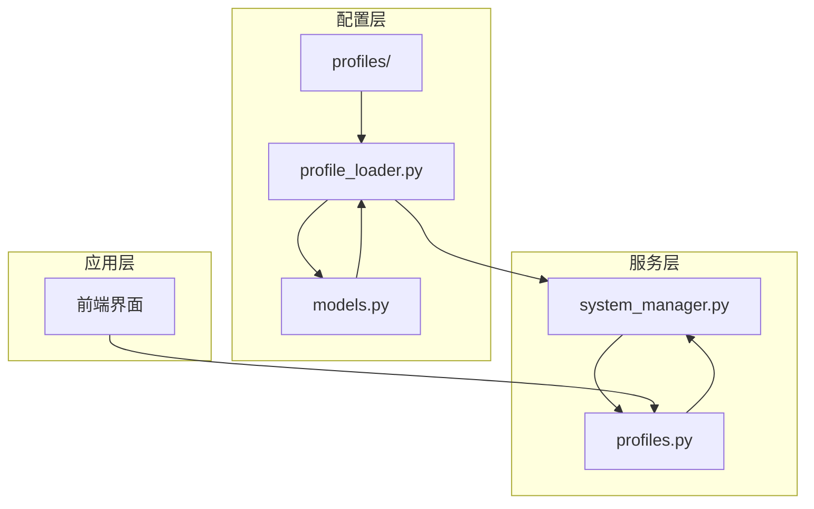
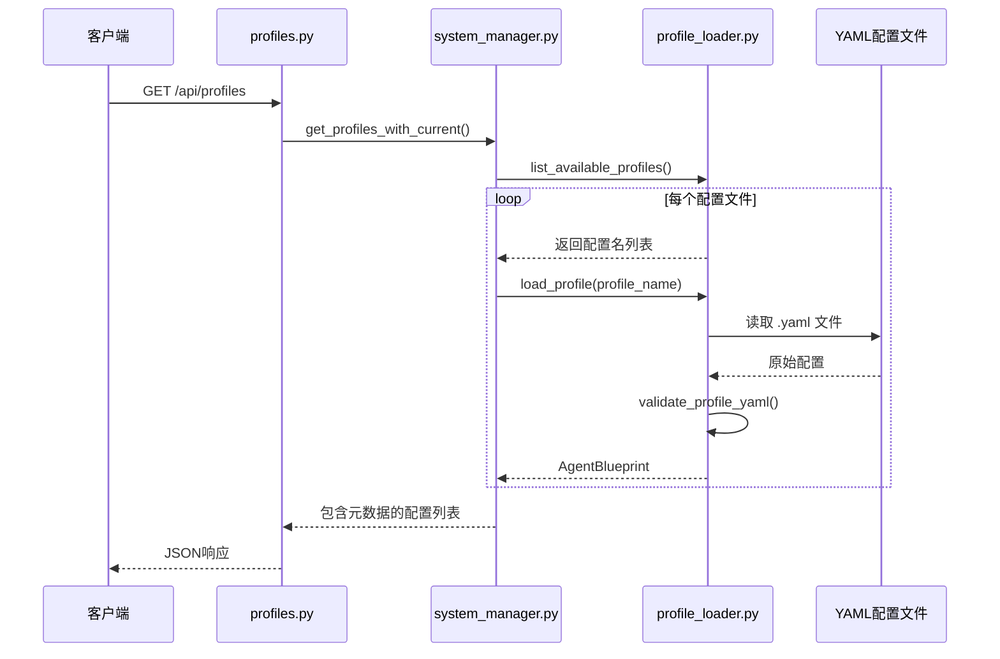
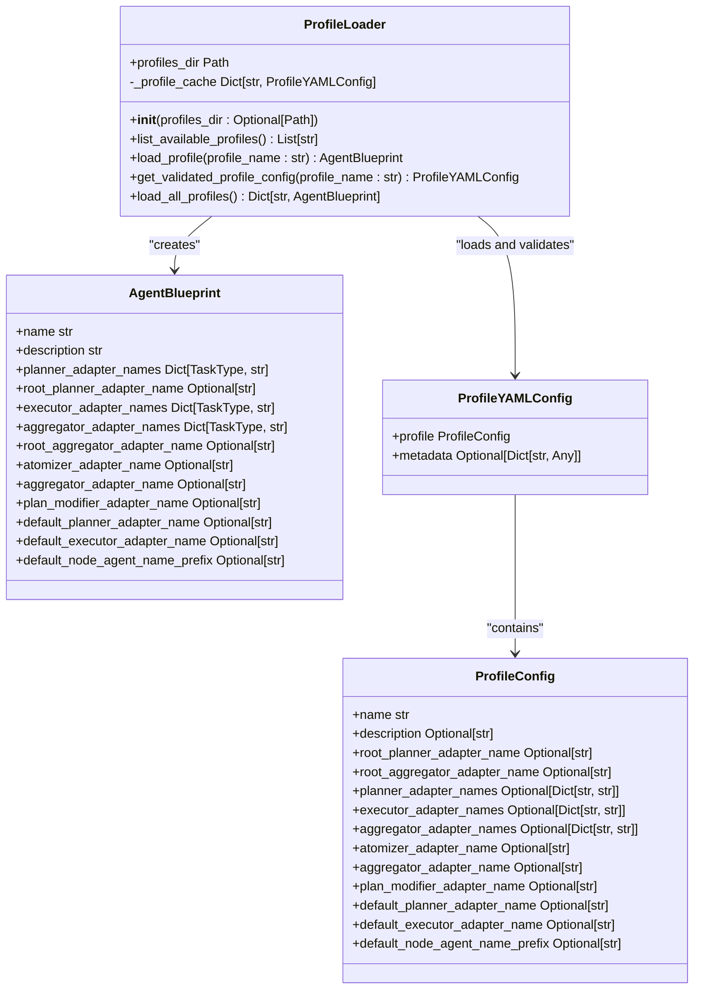
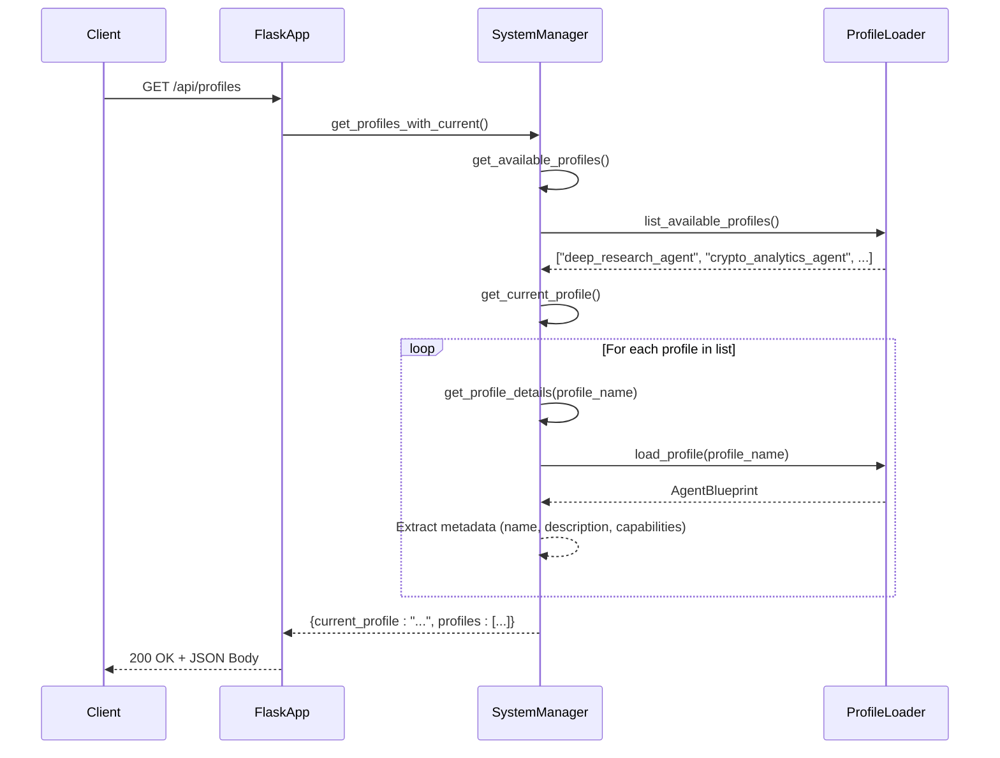
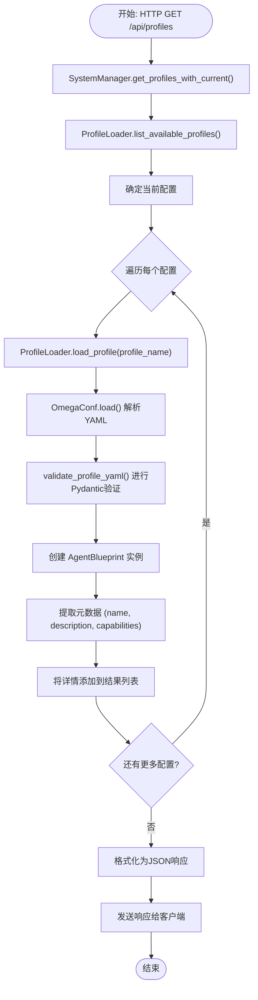
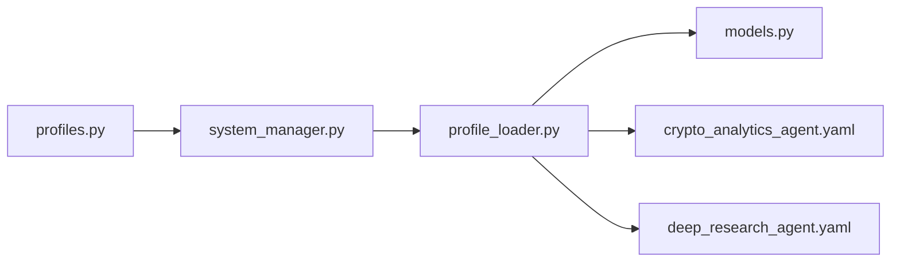

# 代理配置文件API

<cite>
**本文档中引用的文件**  
- [profiles.py](file://src\sentientresearchagent\server\api\profiles.py)
- [profile_loader.py](file://src\sentientresearchagent\hierarchical_agent_framework\agent_configs\profile_loader.py)
- [deep_research_agent.yaml](file://src\sentientresearchagent\hierarchical_agent_framework\agent_configs\profiles\deep_research_agent.yaml)
- [crypto_analytics_agent.yaml](file://src\sentientresearchagent\hierarchical_agent_framework\agent_configs\profiles\crypto_analytics_agent.yaml)
- [models.py](file://src\sentientresearchagent\hierarchical_agent_framework\agent_configs\models.py)
- [system_manager.py](file://src\sentientresearchagent\core\system_manager.py)
</cite>

## 目录
1. [简介](#简介)
2. [项目结构](#项目结构)
3. [核心组件](#核心组件)
4. [架构概述](#架构概述)
5. [详细组件分析](#详细组件分析)
6. [依赖分析](#依赖分析)
7. [性能考虑](#性能考虑)
8. [故障排除指南](#故障排除指南)
9. [结论](#结论)

## 简介
本API文档旨在为`/profiles`端点提供全面的技术说明，重点描述如何通过REST接口获取和管理代理配置文件。这些配置文件（如`deep_research_agent`、`crypto_analytics_agent`）定义了智能体在执行任务时的行为模式、能力集和工作流程。文档将深入解析GET请求获取所有可用配置列表的机制，阐述返回的ProfileDTO数据结构，并解释其与YAML配置文件的映射关系。此外，还将探讨配置文件如何影响后续任务执行，并介绍`profile_loader.py`的加载机制及其对配置热更新的支持。

## 项目结构
该项目采用模块化设计，核心功能围绕分层智能体框架展开。代理配置文件位于`hierarchical_agent_framework/agent_configs/profiles/`目录下，以YAML格式存储。负责加载这些配置的逻辑封装在`profile_loader.py`中，而对外提供REST API服务的代码则位于`server/api/profiles.py`。系统管理器`system_manager.py`作为协调中心，连接了配置加载、智能体蓝图创建和运行时状态管理。

**图示来源**
- [profiles.py](file://src\sentientresearchagent\server\api\profiles.py)
- [profile_loader.py](file://src\sentientresearchagent\hierarchical_agent_framework\agent_configs\profile_loader.py)
- [models.py](file://src\sentientresearchagent\hierarchical_agent_framework\agent_configs\models.py)

**节来源**
- [profiles.py](file://src\sentientresearchagent\server\api\profiles.py)
- [profile_loader.py](file://src\sentientresearchagent\hierarchical_agent_framework\agent_configs\profile_loader.py)

## 核心组件
核心组件包括`ProfileLoader`类，它负责从磁盘读取YAML文件并利用Pydantic模型进行严格的验证；`AgentBlueprint`类，它是配置文件在内存中的表示形式，包含了智能体的所有行为规则；以及`SystemManager`类，它管理当前激活的配置并协调整个系统的运行。API路由通过`create_profile_routes`函数注册，将HTTP请求映射到相应的处理方法。

**节来源**
- [profile_loader.py](file://src\sentientresearchagent\hierarchical_agent_framework\agent_configs\profile_loader.py#L1-L50)
- [system_manager.py](file://src\sentientresearchagent\core\system_manager.py#L1-L100)

## 架构概述
系统架构遵循清晰的分层模式。最底层是静态的YAML配置文件，它们被`ProfileLoader`加载并验证后，转化为动态的`AgentBlueprint`对象。`SystemManager`持有对当前`AgentBlueprint`的引用，并根据其定义来指导任务图的构建和执行。REST API作为外部交互的入口，通过调用`SystemManager`的方法来获取配置信息或切换当前配置，从而实现了配置的动态管理和查询。

**图示来源**
- [profiles.py](file://src\sentientresearchagent\server\api\profiles.py#L10-L30)
- [system_manager.py](file://src\sentientresearchagent\core\system_manager.py#L400-L450)
- [profile_loader.py](file://src\sentientresearchagent\hierarchical_agent_framework\agent_configs\profile_loader.py#L50-L100)

## 详细组件分析

### ProfileLoader 分析
`ProfileLoader`是配置管理的核心。它使用OmegaConf库解析YAML文件，并通过`validate_profile_yaml`函数将其转换为强类型的`ProfileYAMLConfig` Pydantic模型，确保了配置的完整性和正确性。加载后的`AgentBlueprint`会被缓存，以提高重复访问的性能。

#### 类图

**图示来源**
- [profile_loader.py](file://src\sentientresearchagent\hierarchical_agent_framework\agent_configs\profile_loader.py#L50-L100)
- [models.py](file://src\sentientresearchagent\hierarchical_agent_framework\agent_configs\models.py#L700-L800)

### REST API 分析
`profiles.py`文件定义了`/api/profiles`端点的GET方法。该方法通过`SystemManager`的`get_profiles_with_current`接口获取所有可用配置的列表，并将每个配置的详细信息（由`get_profile_details`提供）整合成一个JSON响应。响应中会明确标记出当前正在使用的配置。

#### 序列图

**图示来源**
- [profiles.py](file://src\sentientresearchagent\server\api\profiles.py#L10-L30)
- [system_manager.py](file://src\sentientresearchagent\core\system_manager.py#L400-L480)

### 配置文件分析
YAML配置文件是定义智能体行为的源头。例如，`crypto_analytics_agent.yaml`不仅定义了基础的规划器、执行器等，还通过`metadata.capabilities`字段声明了其特定能力，如“实时价格和市场数据分析”、“DeFi TVL评估”等。这些元数据在API响应中被直接暴露，供前端展示。

#### 流程图

**图示来源**
- [crypto_analytics_agent.yaml](file://src\sentientresearchagent\hierarchical_agent_framework\agent_configs\profiles\crypto_analytics_agent.yaml)
- [profile_loader.py](file://src\sentientresearchagent\hierarchical_agent_framework\agent_configs\profile_loader.py#L100-L150)

**节来源**
- [crypto_analytics_agent.yaml](file://src\sentientresearchagent\hierarchical_agent_framework\agent_configs\profiles\crypto_analytics_agent.yaml)
- [profile_loader.py](file://src\sentientresearchagent\hierarchical_agent_framework\agent_configs\profile_loader.py#L100-L200)

## 依赖分析
`profiles.py` API严重依赖于`system_manager.py`提供的业务逻辑，而`system_manager.py`又依赖于`profile_loader.py`来加载和验证配置。`profile_loader.py`本身依赖于`models.py`中的Pydantic模型来进行数据验证。这是一个典型的单向依赖链，确保了各层之间的解耦。

**图示来源**
- [profiles.py](file://src\sentientresearchagent\server\api\profiles.py)
- [system_manager.py](file://src\sentientresearchagent\core\system_manager.py)
- [profile_loader.py](file://src\sentientresearchagent\hierarchical_agent_framework\agent_configs\profile_loader.py)

**节来源**
- [profiles.py](file://src\sentientresearchagent\server\api\profiles.py)
- [system_manager.py](file://src\sentientresearchagent\core\system_manager.py)
- [profile_loader.py](file://src\sentientresearchagent\hierarchical_agent_framework\agent_configs\profile_loader.py)

## 性能考虑
`ProfileLoader`内置了缓存机制（`_profile_cache`），这避免了每次API调用都重新解析和验证YAML文件，极大地提升了响应速度。然而，这也意味着如果在运行时修改了YAML文件，更改不会立即生效，因为旧的`AgentBlueprint`仍存在于缓存中。要实现真正的热更新，需要一种机制来清除缓存或监听文件变化。

## 故障排除指南
当`/api/profiles`端点返回空列表或错误时，应首先检查`hierarchical_agent_framework/agent_configs/profiles/`目录是否存在且可读。其次，确认YAML文件的语法是否正确，特别是`metadata.capabilities`等关键字段。最后，查看日志中是否有来自`ProfileLoader`的验证失败信息，这通常能指出具体的配置问题。

**节来源**
- [profile_loader.py](file://src\sentientresearchagent\hierarchical_agent_framework\agent_configs\profile_loader.py#L150-L200)
- [profiles.py](file://src\sentientresearchagent\server\api\profiles.py#L10-L30)

## 结论
`/profiles`端点提供了一个强大而灵活的接口，用于查询和管理智能体的配置。通过结合YAML配置文件、Pydantic验证和REST API，系统实现了配置的声明式定义和动态查询。理解`ProfileLoader`的缓存行为对于部署和维护至关重要。未来可以在此基础上扩展，支持安全的配置热更新，进一步提升系统的灵活性。