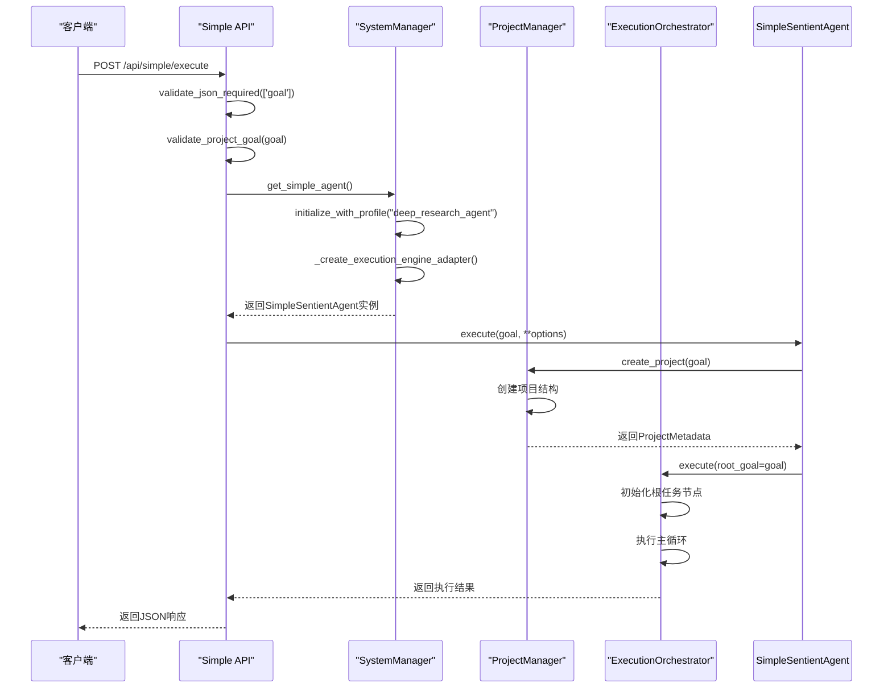

# 简易任务提交API

<cite>
**本文档引用的文件**
- [simple_api.py](file://src\sentientresearchagent\server\api\simple_api.py)
- [project_manager.py](file://src\sentientresearchagent\core\project_manager.py)
- [execution_orchestrator.py](file://src\sentientresearchagent\hierarchical_agent_framework\orchestration\execution_orchestrator.py)
- [system_manager.py](file://src\sentientresearchagent\core\system_manager.py)
- [validation.py](file://src\sentientresearchagent\server\utils\validation.py)
</cite>

## 目录
1. [简介](#简介)
2. [请求格式与参数说明](#请求格式与参数说明)
3. [内部调用链分析](#内部调用链分析)
4. [WebSocket进度推送机制](#websocket进度推送机制)
5. [集成示例](#集成示例)
6. [应用场景](#应用场景)

## 简介
简易任务提交接口为开发者提供了一种快速启动研究任务的便捷方式。该接口通过封装复杂的底层流程，允许用户仅需一个简单的POST请求即可触发完整的任务执行周期。当接收到请求后，系统会自动创建项目、初始化任务图、启动执行引擎，并通过WebSocket实时推送执行进度。此接口特别适用于需要快速原型验证和自动化测试的场景，极大地降低了使用复杂智能代理系统的门槛。

## 请求格式与参数说明
简易任务提交接口通过`/api/simple/execute`端点接收POST请求。请求体必须为JSON格式，包含必需的研究目标描述（`goal`）和可选参数。

### 必需参数
- **goal**: 字符串类型，表示研究任务的目标描述。长度需在3到1000个字符之间。

### 可选参数
- **options**: 对象类型，包含额外的执行选项。
- **enable_hitl**: 布尔类型，默认为`false`，用于指定是否启用人工干预（HITL）模式。
- **profile_name**: 字符串类型，用于指定使用的代理配置文件名称。

请求示例：
```json
{
  "goal": "分析2023年全球加密货币市场趋势",
  "options": {
    "max_steps": 200
  },
  "enable_hitl": false
}
```

**Section sources**
- [simple_api.py](file://src\sentientresearchagent\server\api\simple_api.py#L0-L175)
- [validation.py](file://src\sentientresearchagent\server\utils\validation.py#L17-L62)

## 内部调用链分析
简易任务提交接口的内部调用链清晰地展示了从接收到请求到完成任务执行的完整流程。



**Diagram sources**
- [simple_api.py](file://src\sentientresearchagent\server\api\simple_api.py#L0-L175)
- [system_manager.py](file://src\sentientresearchagent\core\system_manager.py#L232-L246)
- [project_manager.py](file://src\sentientresearchagent\core\project_manager.py#L91-L126)
- [execution_orchestrator.py](file://src\sentientresearchagent\hierarchical_agent_framework\orchestration\execution_orchestrator.py#L128-L192)

**Section sources**
- [simple_api.py](file://src\sentientresearchagent\server\api\simple_api.py#L0-L175)
- [system_manager.py](file://src\sentientresearchagent\core\system_manager.py#L232-L246)
- [project_manager.py](file://src\sentientresearchagent\core\project_manager.py#L91-L126)
- [execution_orchestrator.py](file://src\sentientresearchagent\hierarchical_agent_framework\orchestration\execution_orchestrator.py#L128-L192)

## WebSocket进度推送机制
系统通过WebSocket实现执行进度的实时推送。`ExecutionOrchestrator`在执行过程中，利用`NodeUpdateManager`将节点状态更新批量发送给前端。这种机制确保了即使在高并发环境下，也能高效地传递大量状态更新信息。`OptimizedBroadcastService`负责管理WebSocket连接，支持消息批处理、压缩和差异更新，从而显著降低了网络开销和延迟。

**Section sources**
- [system_manager.py](file://src\sentientresearchagent\core\system_manager.py#L358-L386)
- [execution_orchestrator.py](file://src\sentientresearchagent\hierarchical_agent_framework\orchestration\execution_orchestrator.py#L128-L192)

## 集成示例
以下提供了两种轻量级的集成示例，展示了如何在不同环境中调用简易任务提交接口。

### 浏览器JavaScript调用
```javascript
fetch('/api/simple/execute', {
  method: 'POST',
  headers: { 'Content-Type': 'application/json' },
  body: JSON.stringify({
    goal: '研究人工智能在医疗诊断中的应用',
    enable_hitl: false
  })
})
.then(response => response.json())
.then(data => console.log('任务执行结果:', data));
```

### Python脚本批量提交
```python
import requests

def submit_task(goal, profile_name=None):
    url = "http://localhost:5000/api/simple/execute"
    payload = {
        "goal": goal,
        "options": {"profile_name": profile_name} if profile_name else {}
    }
    response = requests.post(url, json=payload)
    return response.json()

# 批量提交多个任务
tasks = ["分析新能源汽车市场", "研究区块链技术发展"]
for task in tasks:
    result = submit_task(task, "deep_research_agent")
    print(f"任务 '{task}' 的执行ID: {result['execution_id']}")
```

**Section sources**
- [simple_api.py](file://src\sentientresearchagent\server\api\simple_api.py#L0-L175)

## 应用场景
简易任务提交接口主要适用于以下两种核心场景：

1. **原型验证**: 开发者可以快速测试不同的研究目标和配置，无需深入了解复杂的内部架构，即可评估系统的性能和效果。
2. **自动化测试**: 在CI/CD流水线中，可以通过脚本批量提交任务，自动化地验证系统功能和稳定性，确保每次代码变更后的质量。

**Section sources**
- [simple_api.py](file://src\sentientresearchagent\server\api\simple_api.py#L0-L175)
- [system_manager.py](file://src\sentientresearchagent\core\system_manager.py#L232-L246)