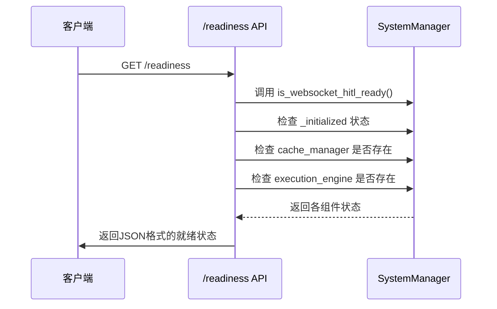

# 系统信息API

<cite>
**本文档引用的文件**  
- [system.py](file://src/sentientresearchagent/server/api/system.py)
- [system_manager.py](file://src/sentientresearchagent/core/system_manager.py)
- [fastapi_server.py](file://fastapi_server.py)
</cite>

## 目录
1. [简介](#简介)
2. [系统状态获取接口](#系统状态获取接口)
3. [系统控制操作](#系统控制操作)
4. [健康检查与就绪探针](#健康检查与就绪探针)
5. [认证与权限要求](#认证与权限要求)
6. [集成建议与自动化运维](#集成建议与自动化运维)
7. [总结](#总结)

## 简介
本API文档详细说明了用于获取系统运行状态和执行系统级控制操作的REST端点，主要围绕`/system`相关路径展开。通过这些接口，用户可以查询系统的当前运行状况、版本信息、活动会话数等关键指标，并可触发如切换配置文件等管理操作。核心功能由位于`core/system_manager.py`的`SystemManagerV2`组件驱动，该组件负责协调所有内部服务的状态。

**Section sources**
- [system.py](file://src/sentientresearchagent/server/api/system.py#L0-L345)
- [system_manager.py](file://src/sentientresearchagent/core/system_manager.py#L87-L486)

## 系统状态获取接口
系统提供了多个GET端点来获取详细的运行时信息。

### `/api/system-info`
此端点返回系统的综合信息，包括当前配置、组件状态和运行时统计。

**响应体字段定义：**
- `config`: 当前执行配置摘要。
  - `hitl_enabled`: 布尔值，表示人机交互（HITL）是否启用。
  - `max_steps`: 整数，表示最大执行步数限制。
  - `profile`: 字符串，表示当前激活的代理配置文件名称。
- `components`: 各核心组件的度量信息。
  - `orchestrator`: 执行协调器的类型和状态。
  - `scheduler`: 任务调度器的性能指标。
  - `hitl`: HITL服务的运行指标。
  - `agent_selector`: 代理选择器的指标。
  - `context_builder`: 上下文构建器的缓存命中率等指标。
- `state`: 当前任务图的状态。
  - `nodes`: 当前任务图中的节点总数。
  - `graphs`: 子图数量。
  - `state_stats`: 各种节点状态（如待处理、进行中、已完成）的统计。

### `/readiness`
此端点提供系统的就绪状态，用于判断系统是否已准备好接收流量。

**响应体字段定义：**
- `ready`: 布尔值，表示系统整体是否就绪。
- `components`: 各个子系统的就绪状态。
  - `system_initialized`: 核心系统管理器是否已完成初始化。
  - `websocket_hitl_ready`: WebSocket HITL服务是否可用。
  - `cache_ready`: 缓存管理器是否已准备就绪。
  - `execution_engine_ready`: 执行引擎是否已加载。
- `websocket_hitl_status`: 包含WebSocket连接客户端数、待处理请求等详细状态的对象。
- `timestamp`: 状态检查的时间戳。



**Diagram sources**
- [system.py](file://src/sentientresearchagent/server/api/system.py#L100-L150)
- [system_manager.py](file://src/sentientresearchagent/core/system_manager.py#L400-L420)

**Section sources**
- [system.py](file://src/sentientresearchagent/server/api/system.py#L100-L150)
- [system_manager.py](file://src/sentientresearchagent/core/system_manager.py#L400-L420)

## 系统控制操作
目前系统支持通过POST方法进行配置文件切换等管理操作。

### `POST /api/system/switch-profile`
此端点允许动态切换系统正在使用的代理配置文件。

**请求体示例：**
```json
{
  "profile_name": "deep_research_agent"
}
```

**成功响应体：**
- `success`: 布尔值，表示操作是否成功。
- `profile`: 字符串，表示新切换到的配置文件名称。
- `message`: 操作结果的描述性消息。
- `system_info`: 切换后调用`get_system_info()`返回的最新系统信息。
- `profile_details`: 新配置文件的详细信息。

**失败响应体：**
- `success`: `false`
- `error`: 错误的详细信息。
- `profile`: 请求尝试切换的配置文件名称。

此操作会清除当前的任务图状态并重新初始化所有依赖于配置文件的组件。

```mermaid
flowchart TD
A[客户端发送 POST 请求] --> B{验证 profile_name}
B --> |无效| C[返回 400 错误]
B --> |有效| D[调用 system_manager.switch_profile()]
D --> E[清除当前任务图状态]
E --> F[加载新配置文件]
F --> G[重新初始化 NodeProcessor 和 ExecutionOrchestrator]
G --> H[更新当前 profile]
H --> I[返回包含新 system_info 的 JSON 响应]
```

**Diagram sources**
- [system_manager.py](file://src/sentientresearchagent/core/system_manager.py#L450-L486)

**Section sources**
- [system_manager.py](file://src/sentientresearchagent/core/system_manager.py#L450-L486)

## 健康检查与就绪探针
系统内置了标准的健康检查端点，便于与容器编排平台集成。

### `/api/health`
这是一个简单的健康检查端点，主要用于确认服务进程是否存活。

**响应示例：**
```json
{
  "status": "healthy",
  "initialized": true,
  "timestamp": "2024-01-01T00:00:00Z"
}
```

### Kubernetes 集成建议
建议在Kubernetes部署中同时使用`livenessProbe`和`readinessProbe`。

- **Liveness Probe**: 可指向`/api/health`。如果此探针失败，Kubernetes将重启Pod。
- **Readiness Probe**: 必须指向`/readiness`。只有当此探针返回`ready: true`时，Pod才会被加入到服务的负载均衡池中，确保不会将流量导向尚未完全启动的实例。

这能有效避免在系统初始化完成前就接收用户请求，提高服务的稳定性。

**Section sources**
- [system.py](file://src/sentientresearchagent/server/api/system.py#L70-L90)

## 认证与权限要求
根据现有代码分析，当前的系统信息API端点（如`/api/system-info`, `/readiness`）**未实现任何认证机制**。这意味着任何能够访问服务器网络的客户端都可以调用这些接口。

**安全建议：**
在生产环境中，强烈建议为这些管理端点添加身份验证层（如JWT令牌或API密钥），以防止敏感的系统信息泄露和未经授权的控制操作。

**Section sources**
- [system.py](file://src/sentientresearchagent/server/api/system.py#L0-L345)

## 集成建议与自动化运维
以下是如何利用此API实现自动化运维脚本的示例。

### 场景：自动化部署后的健康检查
在CI/CD流水线中，部署新版本后，可以编写一个脚本来等待服务完全就绪。

```python
import requests
import time

def wait_for_system_readiness(base_url, timeout=300):
    """等待系统变为就绪状态"""
    start_time = time.time()
    while time.time() - start_time < timeout:
        try:
            response = requests.get(f"{base_url}/readiness", timeout=10)
            if response.status_code == 200:
                data = response.json()
                if data.get("ready"):
                    print("✅ 系统已就绪！")
                    return True
        except requests.RequestException as e:
            print(f"⚠️ 连接失败: {e}")
        
        print("⏳ 系统尚未就绪，等待5秒后重试...")
        time.sleep(5)
    
    raise TimeoutError("❌ 等待系统就绪超时")

# 使用示例
wait_for_system_readiness("http://localhost:5000")
```

### 场景：监控系统集成
可以定期调用`/api/system-info`并将关键指标（如节点数、HITL状态）推送到Prometheus或Grafana等监控系统，以便实时观察系统负载和性能趋势。

**Section sources**
- [system.py](file://src/sentientresearchagent/server/api/system.py#L0-L345)
- [system_manager.py](file://src/sentientresearchagent/core/system_manager.py#L87-L486)

## 总结
本文档详尽地描述了基于`SystemManagerV2`组件的系统状态与控制API。`GET`方法提供了丰富的系统诊断信息，而`POST`方法则支持动态配置切换。虽然当前API缺乏认证，但其清晰的结构和丰富的数据使其非常适合用于健康检查、监控和自动化运维场景。未来应优先考虑增加安全认证以提升生产环境的安全性。