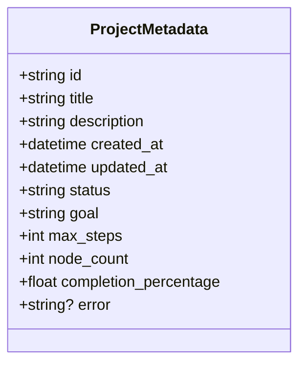
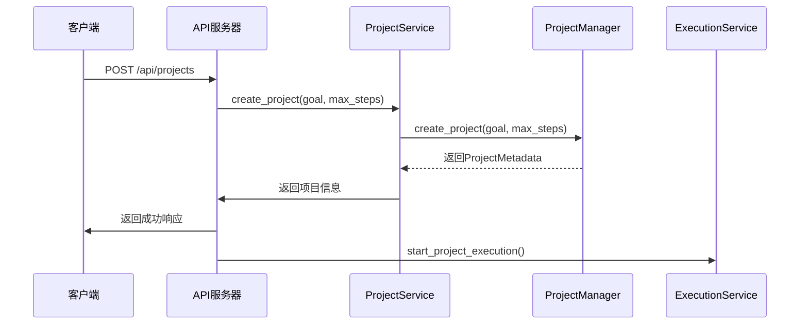
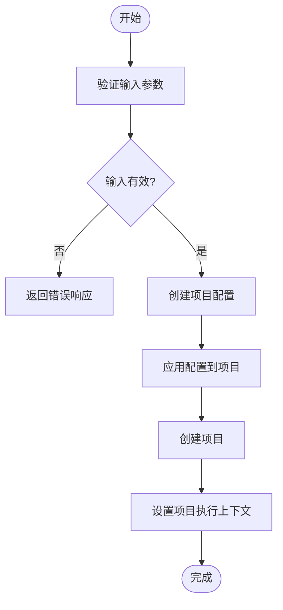
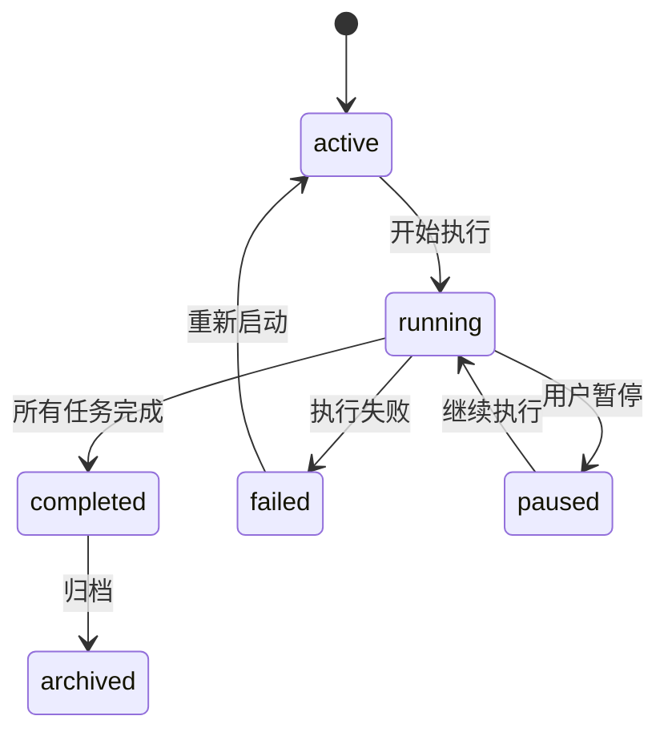
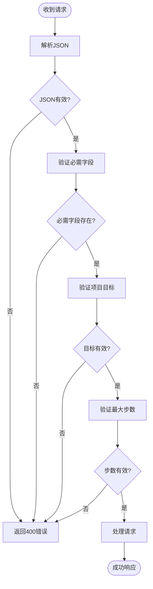
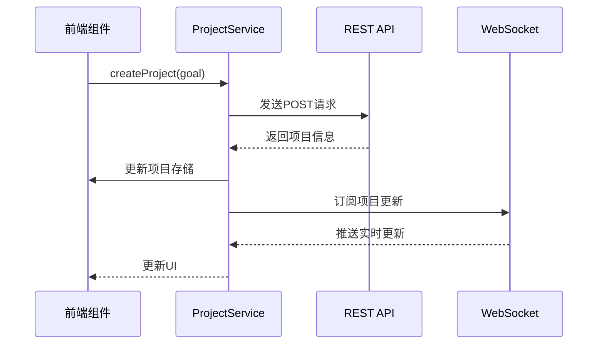

# 项目管理API

<cite>
**本文档引用的文件**
- [projects.py](file://src\sentientresearchagent\server\api\projects.py)
- [project_manager.py](file://src\sentientresearchagent\core\project_manager.py)
- [projectService.ts](file://frontend\src\services\projectService.ts)
</cite>

## 目录
1. [简介](#简介)
2. [核心端点](#核心端点)
3. [请求与响应模型](#请求与响应模型)
4. [项目生命周期管理](#项目生命周期管理)
5. [配置继承机制](#配置继承机制)
6. [状态变更规则](#状态变更规则)
7. [错误处理](#错误处理)
8. [客户端集成](#客户端集成)

## 简介
本API文档详细描述了项目管理REST API，涵盖了`/projects`端点下的所有操作。该API允许用户创建、查询、切换和删除研究项目，并支持自定义配置。API通过`projects.py`中的路由定义与`core/project_manager.py`的实现逻辑相结合，实现了完整的项目生命周期管理。

**Section sources**
- [projects.py](file://src\sentientresearchagent\server\api\projects.py#L1-L50)
- [project_manager.py](file://src\sentientresearchagent\core\project_manager.py#L1-L50)

## 核心端点
项目管理API提供了以下HTTP端点：

```mermaid
graph TD
A[GET /api/projects] --> B[获取所有项目]
C[POST /api/projects] --> D[创建新项目]
E[POST /api/projects/configured] --> F[创建带配置的项目]
G[GET /api/projects/{project_id}] --> H[获取特定项目]
I[POST /api/projects/{project_id}/switch] --> J[切换到指定项目]
K[DELETE /api/projects/{project_id}] --> L[删除项目]
M[POST /api/projects/{project_id}/save-results] --> N[保存项目结果]
O[GET /api/projects/{project_id}/load-results] --> P[加载项目结果]
Q[GET /api/projects/{project_id}/download-report] --> R[下载项目报告]
```

**Diagram sources**
- [projects.py](file://src\sentientresearchagent\server\api\projects.py#L50-L355)

### 创建项目
使用`POST /api/projects`端点创建新项目。

**请求示例 (curl):**
```bash
curl -X POST http://localhost:8000/api/projects \
  -H "Content-Type: application/json" \
  -d '{
    "goal": "分析比特币市场趋势",
    "max_steps": 200
  }'
```

**Python客户端调用:**
```python
import requests

response = requests.post(
    "http://localhost:8000/api/projects",
    json={
        "goal": "分析比特币市场趋势",
        "max_steps": 200
    }
)
result = response.json()
print(result["message"])
```

**Section sources**
- [projects.py](file://src\sentientresearchagent\server\api\projects.py#L100-L150)

### 获取项目列表
使用`GET /api/projects`端点获取所有项目。

**请求示例 (curl):**
```bash
curl -X GET http://localhost:8000/api/projects
```

**Python客户端调用:**
```python
import requests

response = requests.get("http://localhost:8000/api/projects")
projects = response.json()
for project in projects:
    print(f"项目: {project['title']}")
```

**Section sources**
- [projects.py](file://src\sentientresearchagent\server\api\projects.py#L60-L80)

### 切换项目
使用`POST /api/projects/{project_id}/switch`端点切换到指定项目。

**请求示例 (curl):**
```bash
curl -X POST http://localhost:8000/api/projects/proj_abc123/switch
```

**Python客户端调用:**
```python
import requests

response = requests.post(
    "http://localhost:8000/api/projects/proj_abc123/switch"
)
result = response.json()
print(f"已切换到项目: {result['project']['title']}")
```

**Section sources**
- [projects.py](file://src\sentientresearchagent\server\api\projects.py#L200-L230)

## 请求与响应模型
API使用基于Pydantic的模型进行请求和响应验证。

### ProjectMetadata 模型


**Diagram sources**
- [project_manager.py](file://src\sentientresearchagent\core\project_manager.py#L18-L44)

### 成功响应示例
```json
{
  "project": {
    "id": "proj_abc123",
    "title": "分析比特币市场趋势",
    "description": "分析比特币市场趋势...",
    "created_at": "2024-01-15T10:30:00",
    "updated_at": "2024-01-15T10:30:00",
    "status": "active",
    "goal": "分析比特币市场趋势",
    "max_steps": 200,
    "node_count": 0,
    "completion_percentage": 0.0
  },
  "message": "Project created and started"
}
```

**Section sources**
- [projects.py](file://src\sentientresearchagent\server\api\projects.py#L140-L150)

## 项目生命周期管理
项目生命周期管理涉及从创建到执行再到结果保存的完整流程。



**Diagram sources**
- [projects.py](file://src\sentientresearchagent\server\api\projects.py#L100-L150)
- [project_manager.py](file://src\sentientresearchagent\core\project_manager.py#L91-L126)

### 初始化流程
当创建新项目时，系统会执行以下初始化流程：
1. 生成唯一的项目ID
2. 创建标准化的项目目录结构
3. 设置线程本地项目上下文
4. 基于目标生成智能标题
5. 初始化项目元数据
6. 将项目设置为当前活动项目
7. 启动项目执行服务

**Section sources**
- [project_manager.py](file://src\sentientresearchagent\core\project_manager.py#L91-L126)

## 配置继承机制
系统支持自定义配置的继承和应用。



**Diagram sources**
- [projects.py](file://src\sentientresearchagent\server\api\projects.py#L358-L393)

### 自定义配置
使用`POST /api/projects/configured`端点创建带自定义配置的项目。

**请求示例:**
```json
{
  "goal": "深度研究人工智能发展趋势",
  "config": {
    "llm": {
      "provider": "openai",
      "model": "gpt-4-turbo",
      "temperature": 0.5
    },
    "execution": {
      "max_concurrent_nodes": 5,
      "enable_hitl": true
    }
  },
  "max_steps": 300
}
```

**Section sources**
- [projects.py](file://src\sentientresearchagent\server\api\projects.py#L155-L190)

## 状态变更规则
项目状态遵循特定的变更规则和生命周期。



**Diagram sources**
- [project_manager.py](file://src\sentientresearchagent\core\project_manager.py#L25-L25)

### 状态更新
项目状态在以下情况下自动更新：
- **创建**: 状态设为'active'
- **开始执行**: 状态变为'running'
- **完成**: 当所有节点完成时，状态变为'completed'
- **失败**: 当关键任务失败时，状态变为'failed'
- **暂停**: 用户手动暂停时，状态变为'paused'

**Section sources**
- [project_manager.py](file://src\sentientresearchagent\core\project_manager.py#L25-L25)

## 错误处理
API提供详细的错误码和消息。

### 常见错误码
| 错误码 | 含义 | 可能原因 |
|-------|------|---------|
| 400 | 请求无效 | 缺少必需参数或参数格式错误 |
| 404 | 项目未找到 | 提供的project_id不存在 |
| 500 | 服务器内部错误 | 系统执行过程中发生异常 |

**请求验证流程:**


**Diagram sources**
- [projects.py](file://src\sentientresearchagent\server\api\projects.py#L105-L115)

**Section sources**
- [projects.py](file://src\sentientresearchagent\server\api\projects.py#L100-L150)

## 客户端集成
前端通过`projectService.ts`集成项目管理API。



**Diagram sources**
- [projectService.ts](file://frontend\src\services\projectService.ts#L23-L476)

### 前端服务方法
`ProjectService`类提供了以下主要方法：

| 方法 | 描述 |
|------|------|
| `createProject()` | 创建新项目并更新前端存储 |
| `switchProject()` | 切换到指定项目，优先使用WebSocket |
| `saveProjectResults()` | 保存项目结果，支持localStorage回退 |
| `loadProjectResults()` | 加载项目结果，支持localStorage回退 |

**Section sources**
- [projectService.ts](file://frontend\src\services\projectService.ts#L23-L476)

### 前端集成示例
```typescript
// 在React组件中使用
import projectService from '@/services/projectService';

async function handleCreateProject() {
  try {
    const result = await projectService.createProject('分析新能源汽车市场');
    console.log('项目创建成功:', result.project.title);
  } catch (error) {
    console.error('项目创建失败:', error.message);
  }
}

async function handleSwitchProject(projectId: string) {
  try {
    const result = await projectService.switchProject(projectId);
    console.log('已切换到项目:', result.project.title);
  } catch (error) {
    console.error('切换项目失败:', error.message);
  }
}
```

**Section sources**
- [projectService.ts](file://frontend\src\services\projectService.ts#L23-L476)