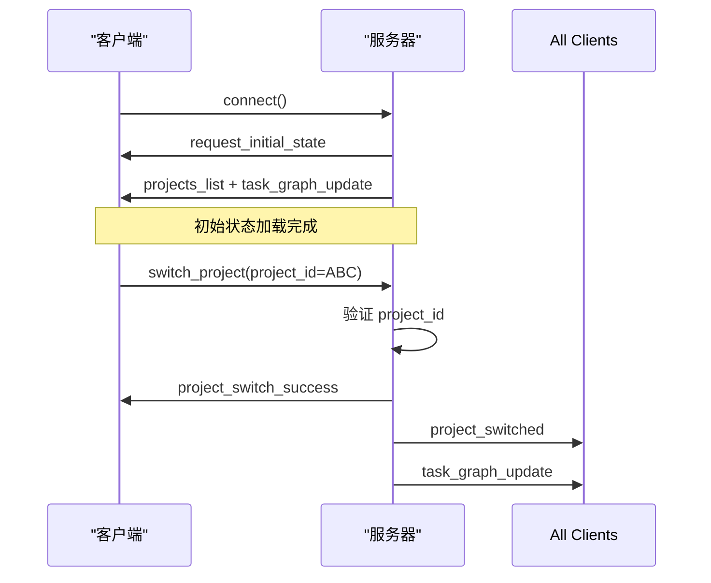
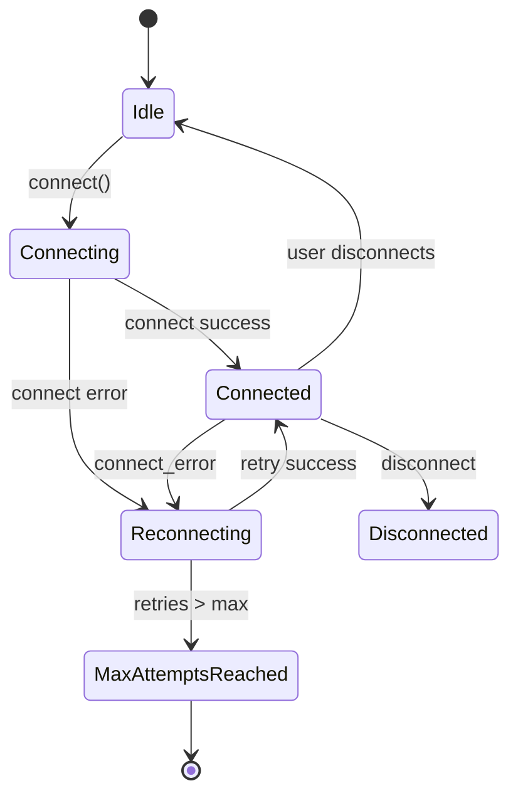

# WebSocket API

<cite>
**本文档中引用的文件**
- [websocketService.ts](file://frontend/src/services/websocketService.ts)
- [websocket.ts](file://frontend/src/types/websocket.ts)
- [events.py](file://src/sentientresearchagent/server/websocket/events.py)
- [hitl.py](file://src/sentientresearchagent/server/websocket/hitl.py)
- [config.py](file://src/sentientresearchagent/config/config.py)
</cite>

## 目录
1. [介绍](#介绍)
2. [连接建立与会话管理](#连接建立与会话管理)
3. [事件类型与消息结构](#事件类型与消息结构)
4. [客户端响应逻辑](#客户端响应逻辑)
5. [心跳机制与错误恢复](#心跳机制与错误恢复)
6. [性能优化配置](#性能优化配置)
7. [代码示例](#代码示例)

## 介绍
本系统通过WebSocket提供实时通信接口，支持项目状态更新、人机交互（HITL）请求、项目切换和状态恢复等核心功能。服务端基于Flask-SocketIO实现，客户端使用Socket.IO-client进行连接。该API确保了前后端之间的低延迟、双向实时数据同步，是整个应用实时性的基础。

**Section sources**
- [events.py](file://src/sentientresearchagent/server/websocket/events.py#L1-L748)
- [websocketService.ts](file://frontend/src/services/websocketService.ts#L1-L1012)

## 连接建立与会话管理
WebSocket连接在客户端初始化时自动建立。客户端调用`connect()`方法，向服务器发送`connect`事件。服务器收到后，立即触发`handle_request_initial_state()`，推送初始状态，包括项目列表和当前项目的任务图。

会话管理采用项目ID（project_id）作为上下文隔离的关键。所有状态更新、项目切换和恢复操作都必须携带`project_id`。当用户切换项目时，前端通过`switch_project`事件通知服务器，服务器验证项目存在性后，广播`project_switched`事件给所有客户端，并附带新项目的数据。这确保了多项目环境下的状态一致性。



**Diagram sources**
- [events.py](file://src/sentientresearchagent/server/websocket/events.py#L100-L150)
- [events.py](file://src/sentientresearchagent/server/websocket/events.py#L300-L350)
- [websocketService.ts](file://frontend/src/services/websocketService.ts#L100-L150)

**Section sources**
- [events.py](file://src/sentientresearchagent/server/websocket/events.py#L100-L350)
- [websocketService.ts](file://frontend/src/services/websocketService.ts#L100-L200)

## 事件类型与消息结构
### task_graph_update (任务图更新)
此事件由服务端主动推送，用于同步任务图的最新状态。

- **触发条件**: 项目启动、节点状态变更、执行步骤完成。
- **JSON结构**:
  - `all_nodes`: 对象，包含所有节点的ID和详细信息（目标、状态、结果等）。
  - `graphs`: 对象，描述节点间的依赖关系图。
  - `overall_project_goal`: 字符串，项目的总体目标。
  - `project_id`: 字符串，可选，当前更新所属的项目ID。
  - `current_project`: 对象，可选，当前项目的元数据。

### hitl_request (人机交互请求)
当系统需要人工干预时，会发出此请求。

- **触发条件**: 根据`ExecutionConfig`中的HITL策略，在计划生成后、修改计划后或特定检查点被触发时。
- **JSON结构**:
  - `request_id`: 字符串，唯一标识此次请求。
  - `checkpoint_name`: 字符串，检查点名称（如"root_plan_review"）。
  - `context_message`: 字符串，提供给用户的上下文信息。
  - `data_for_review`: 对象，可选，需要用户审查的具体数据。
  - `node_id`: 字符串，关联的节点ID。
  - `current_attempt`: 数字，当前尝试次数。
  - `timestamp`: 字符串，ISO格式的时间戳。

### project_started (项目已启动)
- **触发条件**: `start_project`事件处理成功，项目开始执行。
- **JSON结构**: 包含一个`message`字段和`project`对象。

### project_switched / project_switch_success (项目已切换)
- **触发条件**: 成功切换到另一个项目。
- **JSON结构**: 包含`project_id`和`project_data`（即`task_graph_update`的数据）。

### project_restored (项目状态已恢复)
- **触发条件**: 响应`request_project_restore`事件，成功从持久化存储中恢复项目状态。
- **JSON结构**: 包含完整的`project_data`，与`task_graph_update`相同。

### node_trace_data (节点追踪数据)
- **触发条件**: 响应`request_node_trace`事件，返回指定节点的详细执行追踪。
- **JSON结构**: 包含`node_id`和`trace`对象，`trace`对象内有多个阶段（stages）的详细信息。

**Section sources**
- [events.py](file://src/sentientresearchagent/server/websocket/events.py#L150-L700)
- [websocketService.ts](file://frontend/src/services/websocketService.ts#L200-L500)

## 客户端响应逻辑
客户端通过`onMessage`处理程序监听所有WebSocket事件，并根据事件类型执行相应逻辑。

- **task_graph_update**: 接收后，首先提取`project_id`，将数据存入`taskGraphStore`的`projectData`映射中。然后检查当前活动的项目ID是否与更新的`project_id`匹配，若匹配则调用`setData()`更新UI显示。
- **hitl_request**: 将收到的请求直接存入`taskGraphStore`的`hitlRequest`状态。状态更新会触发UI组件（如`HITLModal`）重新渲染，从而弹出人机交互模态框供用户操作。
- **project_switched**: 更新`taskGraphStore`和`projectStore`中的`currentProjectId`，并调用`switchToProject()`方法加载新项目的数据以更新视图。
- **其他事件**: 如`node_trace_data`等，通常由专门的UI组件（如`NodeTracingModal`）监听和处理。

```mermaid
flowchart TD
A[WebSocket 消息到达] --> B{事件类型}
B --> |task_graph_update| C[提取 project_id]
C --> D[存储至 projectData 缓存]
D --> E{project_id == currentProjectId?}
E --> |是| F[调用 setData() 更新 UI]
E --> |否| G[仅缓存，不更新 UI]
B --> |hitl_request| H[验证请求完整性]
H --> I[调用 setHITLRequest()]
I --> J[触发 HITL 模态框显示]
B --> |project_switched| K[更新 currentProjectId]
K --> L[调用 switchToProject() 加载数据]
```

**Diagram sources**
- [websocketService.ts](file://frontend/src/services/websocketService.ts#L200-L500)

**Section sources**
- [websocketService.ts](file://frontend/src/services/websocketService.ts#L200-L500)

## 心跳机制与错误恢复
系统内置了稳健的心跳和重连机制来应对网络不稳定。

- **心跳**: Socket.IO库本身会处理底层的心跳（ping/pong），保持连接活跃。
- **断线检测**: 当发生`disconnect`或`connect_error`事件时，客户端进入错误恢复流程。
- **自动重连**: 客户端实现指数退避重连算法。首次重连等待约1秒，每次失败后等待时间乘以1.5（上限30秒），最多尝试10次。重连成功后，会触发`connect`事件。
- **状态恢复**: 在`connect`事件处理中，客户端会等待1秒（连接稳定期），然后检查是否有`currentProjectId`。如果有，则自动调用`requestProjectRestore(projectId)`向服务器请求恢复该项目的完整状态，确保不会丢失数据。



**Diagram sources**
- [websocketService.ts](file://frontend/src/services/websocketService.ts#L100-L150)
- [websocketService.ts](file://frontend/src/services/websocketService.ts#L500-L600)

**Section sources**
- [websocketService.ts](file://frontend/src/services/websocketService.ts#L500-L600)

## 性能优化配置
以下配置项位于`ExecutionConfig`中，对WebSocket性能有直接影响：

- **ws_batch_size**: 整数，默认50。定义了在一次WebSocket消息中批量发送的最大状态更新数量。较大的值可以减少网络往返次数，但会增加单次消息的延迟。
- **enable_ws_compression**: 布尔值，默认true。启用后，会对WebSocket消息的有效载荷进行压缩（如gzip），显著减小传输的数据量，尤其适用于大型任务图。
- **enable_diff_updates**: 布尔值，默认true。启用后，服务端只发送自上次更新以来发生变化的节点数据，而不是完整的任务图，极大提升了效率。
- **ws_batch_timeout_ms**: 整数，默认100。即使未达到`ws_batch_size`，也会在此毫秒数后强制发送批次，防止更新被无限延迟。

这些配置可以在`sentient.yaml`配置文件中进行全局覆盖，或通过环境变量设置。

**Section sources**
- [config.py](file://src/sentientresearchagent/config/config.py#L150-L200)

## 代码示例
### JavaScript (前端连接与监听)
```javascript
// 初始化并连接
const webSocketService = new WebSocketService();
webSocketService.connect();

// 监听任务图更新
webSocketService.socket.on('task_graph_update', (data) => {
  console.log('收到任务图更新:', data);
  // 处理更新...
});

// 监听人机交互请求
webSocketService.socket.on('hitl_request', (request) => {
  console.log('需要人工输入:', request.context_message);
  // 显示模态框...
});

// 发送人机交互响应
const response = {
  request_id: 'req-123',
  checkpoint_name: 'plan_review',
  node_id: 'node-456',
  action: 'approve', // 或 'modify', 'abort'
  modification_instructions: null,
  timestamp: new Date().toISOString()
};
webSocketService.sendHITLResponse(response);
```

### Python (模拟连接)
```python
import socketio

sio = socketio.Client()

@sio.event
def connect():
    print("已连接到服务器")
    # 可以在这里发送 start_project 等指令

@sio.event
def task_graph_update(data):
    print(f"收到任务图更新: {len(data['all_nodes'])} 个节点")

@sio.event
def hitl_request(request):
    print(f"HITL 请求: {request['checkpoint_name']}")

# 连接到服务器
sio.connect('http://localhost:5000')

# 保持连接
sio.wait()
```

**Section sources**
- [websocketService.ts](file://frontend/src/services/websocketService.ts#L100-L800)
- [websocket.ts](file://frontend/src/types/websocket.ts#L1-L8)