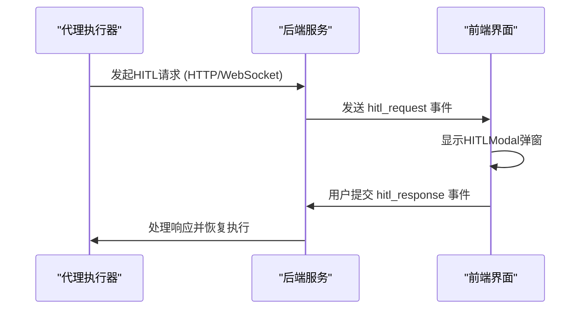
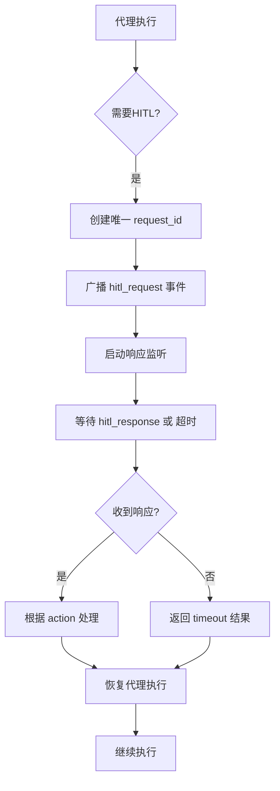
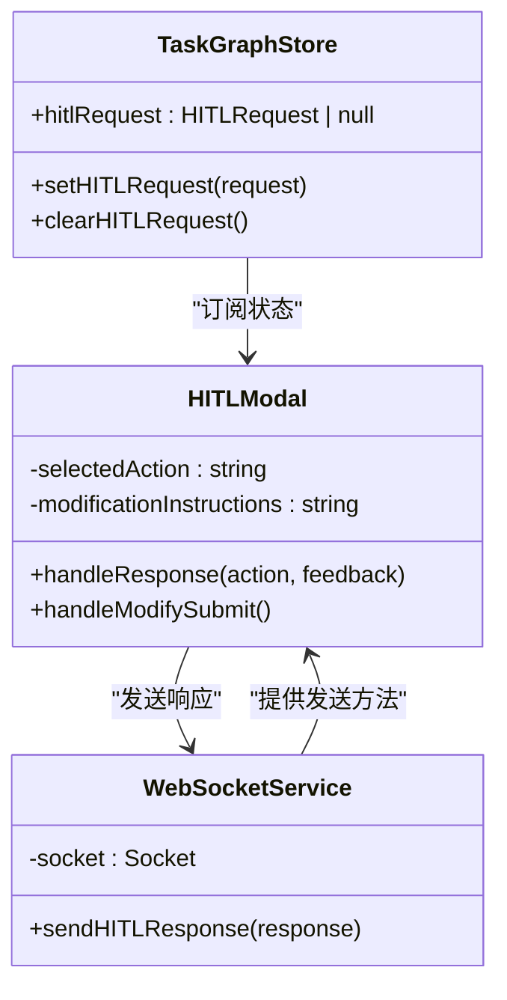
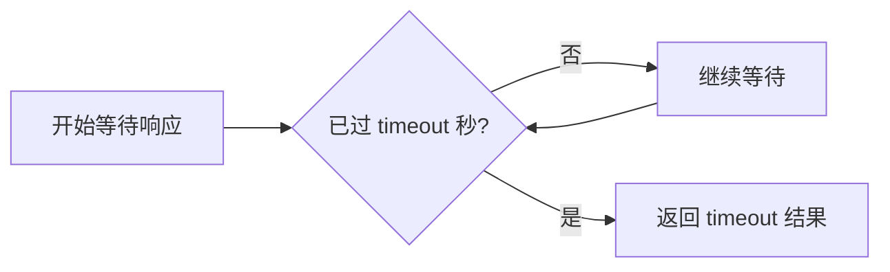

# 人机交互事件

<cite>
**本文档中引用的文件 **  
- [hitl.py](file://src/sentientresearchagent/server/websocket/hitl.py)
- [HITLModal.tsx](file://frontend/src/components/hitl/HITLModal.tsx)
- [websocketService.ts](file://frontend/src/services/websocketService.ts)
- [system.py](file://src/sentientresearchagent/server/api/system.py)
- [websocket_hitl_utils.py](file://src/sentientresearchagent/hierarchical_agent_framework/utils/websocket_hitl_utils.py)
- [config.py](file://src/sentientresearchagent/config/config.py)
</cite>

## 目录
1. [引言](#引言)
2. [核心通信协议](#核心通信协议)
3. [服务端协调逻辑](#服务端协调逻辑)
4. [前端交互实现](#前端交互实现)
5. [超时处理机制](#超时处理机制)
6. [安全验证与并发处理](#安全验证与并发处理)
7. [最佳实践](#最佳实践)

## 引言
本文档系统化地描述了人机协作（Human-in-the-Loop, HITL）相关的WebSocket事件，包括`hitl_request`、`hitl_response`和`hitl_timeout`等。重点阐述请求-响应消息的双向通信协议，涵盖用户输入格式要求、超时处理机制和服务端协调逻辑。基于后端Python实现和前端React组件，详细说明HITL协调器如何中断代理执行流并等待人工反馈，以及前端如何弹出交互窗口并发送响应。

**Section sources**
- [hitl.py](file://src/sentientresearchagent/server/websocket/hitl.py#L1-L56)
- [HITLModal.tsx](file://frontend/src/components/hitl/HITLModal.tsx#L1-L738)

## 核心通信协议
HITL系统通过WebSocket建立一个可靠的双向通信通道，用于在服务端和前端之间传递人工干预请求和响应。

**Diagram sources **
- [hitl.py](file://src/sentientresearchagent/server/websocket/hitl.py#L10-L55)
- [HITLModal.tsx](file://frontend/src/components/hitl/HITLModal.tsx#L372-L738)
- [websocketService.ts](file://frontend/src/services/websocketService.ts#L564-L571)

### 请求消息 (hitl_request)
当代理执行流程需要人工干预时，会向后端发起一个HITL请求。该请求通过WebSocket的`hitl_request`事件推送到前端。

**关键字段：**
- `request_id`: 唯一标识符，用于关联请求和响应。
- `checkpoint_name`: 检查点名称，如"Plan Generation"或"Execution Review"。
- `context_message`: 上下文信息，解释为何需要人工审查。
- `data_for_review`: 待审查的数据，例如待批准的计划。
- `node_id`: 触发检查点的节点ID。
- `current_attempt`: 当前尝试次数，用于处理修改后的重试。
- `timestamp`: 请求时间戳。

**Section sources**
- [hitl.py](file://src/sentientresearchagent/server/websocket/hitl.py#L18-L55)
- [system.py](file://src/sentientresearchagent/server/api/system.py#L189-L242)

### 响应消息 (hitl_response)
前端用户在`HITLModal`中做出选择后，会通过`hitl_response`事件将响应发送回后端。

**关键字段：**
- `request_id`: 必须与对应的`hitl_request`匹配。
- `action`: 用户操作，可选值为`approve`（批准）、`modify`（修改）或`abort`（中止）。
- `modification_instructions`: 当`action`为`modify`时，包含具体的修改指令。

后端接收到响应后，会将其转换为内部格式，并存储在共享状态中，同时触发相应的业务逻辑来恢复或修改代理的执行流程。

**Section sources**
- [hitl.py](file://src/sentientresearchagent/server/websocket/hitl.py#L18-L55)
- [websocketService.ts](file://frontend/src/services/websocketService.ts#L564-L571)

## 服务端协调逻辑
HITL协调器的核心职责是中断自动化代理的执行流，并安全地等待来自用户的异步响应。

**Diagram sources **
- [websocket_hitl_utils.py](file://src/sentientresearchagent/hierarchical_agent_framework/utils/websocket_hitl_utils.py#L222-L222)
- [hitl.py](file://src/sentientresearchagent/server/websocket/hitl.py#L18-L55)

服务端使用一个全局字典`_pending_requests`来跟踪所有未完成的HITL请求。每个请求都关联一个`asyncio.Future`对象。当`handle_hitl_response`函数被调用时，它会查找对应的`Future`并设置其结果，从而解除代理执行器的阻塞状态。

**Section sources**
- [websocket_hitl_utils.py](file://src/sentientresearchagent/hierarchical_agent_framework/utils/websocket_hitl_utils.py#L20-L352)

## 前端交互实现
前端通过`HITLModal`组件实现与用户的交互，该组件由`taskGraphStore`中的状态变化触发。

**Diagram sources **
- [HITLModal.tsx](file://frontend/src/components/hitl/HITLModal.tsx#L372-L738)
- [websocketService.ts](file://frontend/src/services/websocketService.ts#L564-L571)
- [websocketService.ts](file://frontend/src/services/websocketService.ts#L564-L571)

`HITLModal`组件是一个受控对话框，其打开状态由`useTaskGraphStore`中的`hitlRequest`决定。当收到新的`hitl_request`事件时，`WebSocketService`会调用`setHITLRequest`更新store，进而触发模态框的显示。用户的选择通过`webSocketService.sendHITLResponse()`方法发送回后端。

**Section sources**
- [HITLModal.tsx](file://frontend/src/components/hitl/HITLModal.tsx#L372-L738)
- [websocketService.ts](file://frontend/src/services/websocketService.ts#L564-L571)

## 超时处理机制
为了防止系统因长时间无人响应而挂起，HITL系统实现了严格的超时机制。

**超时配置：**
- 超时时间由`config.py`中的`execution.hitl_timeout_seconds`字段定义，默认为1200秒（20分钟）。
- 该配置在系统启动时通过`set_hitl_timeout()`函数传递给`websocket_hitl_utils`模块。

**Diagram sources **
- [config.py](file://src/sentientresearchagent/config/config.py#L106-L106)
- [websocket_hitl_utils.py](file://src/sentientresearchagent/hierarchical_agent_framework/utils/websocket_hitl_utils.py#L38-L42)

在`websocket_human_review`协程中，使用`asyncio.wait_for()`函数对`response_future`进行等待。如果在指定的超时时间内没有收到响应，协程将抛出`asyncio.TimeoutError`，此时会返回一个`user_choice`为`timeout`的结果，允许代理以预设策略继续执行。

**Section sources**
- [websocket_hitl_utils.py](file://src/sentientresearchagent/hierarchical_agent_framework/utils/websocket_hitl_utils.py#L20-L352)
- [config.py](file://src/sentientresearchagent/config/config.py#L106-L106)

## 安全验证与并发处理
HITL系统在设计上考虑了安全性和并发性。

**安全验证：**
- 所有`hitl_response`事件都会验证`request_id`的有效性，确保响应与正确的请求匹配。
- 后端在处理响应时会捕获所有异常，并通过`emit('hitl_error')`向前端报告错误，避免因无效输入导致服务崩溃。

**并发处理：**
- 系统支持多个并发的HITL请求，每个请求都有唯一的`request_id`。
- `HITLModal`组件通过`lastProcessedRequestId`状态来区分新旧请求，确保不会混淆不同检查点的响应。
- `_pending_requests`字典作为线程安全的存储，管理着所有待处理的请求。

**Section sources**
- [hitl.py](file://src/sentientresearchagent/server/websocket/hitl.py#L18-L55)
- [HITLModal.tsx](file://frontend/src/components/hitl/HITLModal.tsx#L372-L738)

## 最佳实践
1. **明确上下文**：`context_message`应清晰说明为什么需要人工干预，帮助用户快速决策。
2. **结构化数据**：`data_for_review`应提供易于理解的结构化数据，如`PlanViewer`组件所示。
3. **优雅降级**：当WebSocket连接不可用时，系统会自动切换到HTTP轮询的备用方案，确保功能可用性。
4. **合理超时**：根据任务复杂度调整`hitl_timeout_seconds`，平衡用户体验和系统效率。
5. **状态清理**：在响应处理完成后，必须从`_pending_requests`中移除对应的`Future`，防止内存泄漏。

**Section sources**
- [websocket_hitl_utils.py](file://src/sentientresearchagent/hierarchical_agent_framework/utils/websocket_hitl_utils.py#L20-L352)
- [hitl.py](file://src/sentientresearchagent/server/websocket/hitl.py#L18-L55)