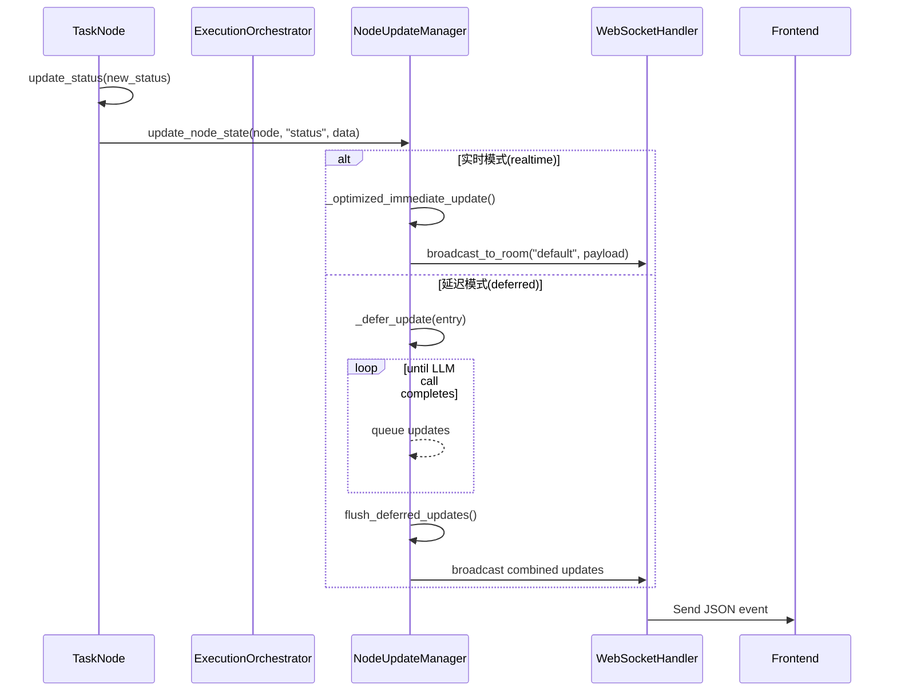
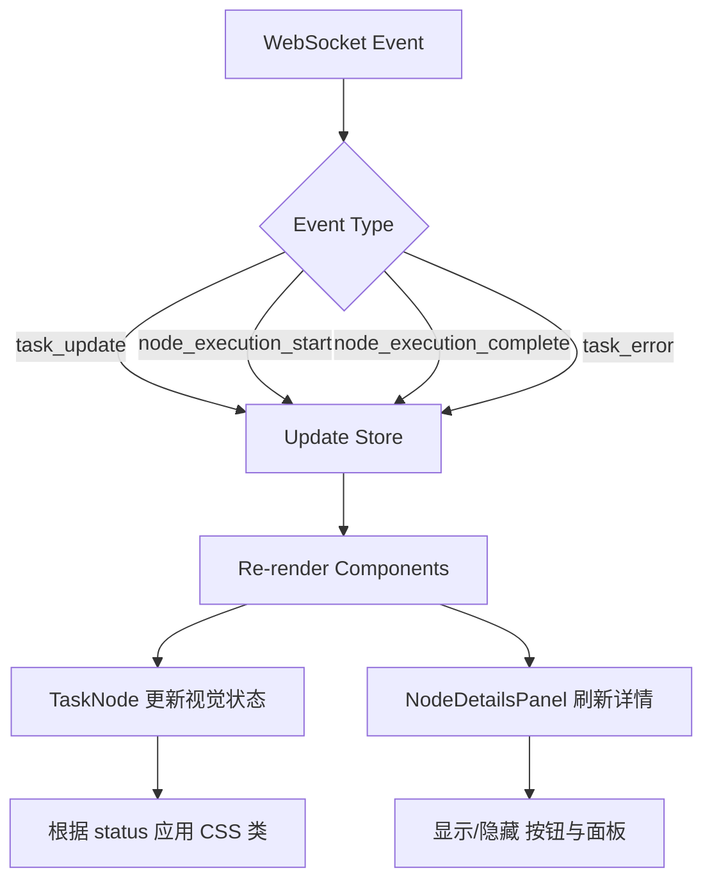

# 任务执行事件

<cite>
**本文档中引用的文件**  
- [execution_orchestrator.py](file://src\sentientresearchagent\hierarchical_agent_framework\orchestration\execution_orchestrator.py)
- [TaskNode.tsx](file://frontend\src\components\graph\nodes\TaskNode.tsx)
- [NodeDetailsPanel.tsx](file://frontend\src\components\panels\NodeDetailsPanel.tsx)
- [websocket.ts](file://frontend\src\types\websocket.ts)
- [task_node.py](file://src\sentientresearchagent\hierarchical_agent_framework\node\task_node.py)
- [node_update_manager.py](file://src\sentientresearchagent\hierarchical_agent_framework\services\node_update_manager.py)
</cite>

## 目录
1. [引言](#引言)
2. [WebSocket事件类型与消息结构](#websocket事件类型与消息结构)
3. [事件触发时机与上下文信息](#事件触发时机与上下文信息)
4. [服务端事件生成机制](#服务端事件生成机制)
5. [前端UI更新处理](#前端ui更新处理)
6. [错误传播与重试通知](#错误传播与重试通知)

## 引言
本文档详细说明了在任务图执行流程中涉及的关键WebSocket事件，包括`task_update`、`node_execution_start`、`node_execution_complete`、`task_error`等。这些事件构成了前后端实时通信的核心，用于同步任务状态变更并驱动用户界面更新。通过分析后端状态机逻辑和前端组件实现，本文将全面阐述事件的生命周期、数据结构及处理机制。

## WebSocket事件类型与消息结构
系统定义了多种WebSocket事件类型，每种事件携带特定的JSON消息结构，包含字段名、类型及其语义含义。

### task_update 事件
当任务节点状态发生变化时，服务器会广播`task_update`事件。

```json
{
  "type": "task_update",
  "node_id": "string",
  "data": {
    "old_status": "PENDING | READY | RUNNING | PLAN_DONE | AGGREGATING | DONE | FAILED | NEEDS_REPLAN | CANCELLED",
    "new_status": "同上",
    "timestamp": "string (ISO 8601)",
    "result": "any",
    "error": "string",
    "result_summary": "string"
  }
}
```

- **node_id**: 任务节点唯一标识符。
- **old_status / new_status**: 状态转换前后的值，枚举自`TaskStatus`。
- **timestamp**: 状态变更发生的时间戳。
- **result**: 可选的任务结果数据。
- **error**: 若失败则包含错误信息。
- **result_summary**: 结果摘要文本。

### node_execution_start 事件
表示某个节点开始执行。

```json
{
  "type": "node_execution_start",
  "node_id": "string",
  "data": {
    "start_time": "string (ISO 8601)"
  }
}
```

- **start_time**: 执行启动时间。

### node_execution_complete 事件
表示节点执行完成（无论成功或失败）。

```json
{
  "type": "node_execution_complete",
  "node_id": "string",
  "data": {
    "end_time": "string (ISO 8601)",
    "success": "boolean",
    "output": "any"
  }
}
```

- **end_time**: 执行结束时间。
- **success**: 是否成功完成。
- **output**: 输出结果。

### task_error 事件
专门用于报告任务执行中的错误情况。

```json
{
  "type": "task_error",
  "node_id": "string",
  "data": {
    "error_message": "string",
    "error_type": "string",
    "context": "object",
    "retryable": "boolean"
  }
}
```

- **error_message**: 错误描述。
- **error_type**: 错误类别。
- **context**: 上下文信息。
- **retryable**: 是否可重试。

**Section sources**
- [execution_orchestrator.py](file://src\sentientresearchagent\hierarchical_agent_framework\orchestration\execution_orchestrator.py#L226-L502)
- [node_update_manager.py](file://src\sentientresearchagent\hierarchical_agent_framework\services\node_update_manager.py#L92-L124)

## 事件触发时机与上下文信息
各事件在任务图执行的不同阶段被精确触发，反映系统的运行状态。

### task_update 触发时机
该事件在调用`TaskNode.update_status()`方法时触发，涵盖以下状态转换：
- `PENDING → READY`: 节点依赖满足，准备就绪。
- `READY → RUNNING`: 节点被调度器选中并开始处理。
- `RUNNING → DONE/FAILED/PLAN_DONE`: 节点执行完毕。
- `DONE → NEEDS_REPLAN`: 需要重新规划。
- `PLAN_DONE → AGGREGATING`: 子任务全部完成，进入聚合阶段。

每次状态变更均通过`NodeUpdateManager`进行优化管理，并附带详细的日志记录和上下文信息。

### node_execution_start 触发时机
此事件在节点实际开始处理前发出，通常发生在`_process_single_node()`函数入口处。它标志着资源分配和并发控制的起点，为性能监控提供基准时间点。

### node_execution_complete 触发时机
当节点处理逻辑完全结束（无论是正常返回还是异常退出），即刻触发此事件。它与`task_update`中的`DONE`或`FAILED`状态紧密关联，但更侧重于执行周期的终结而非状态本身。

### task_error 触发时机
当捕获到可恢复或不可恢复的异常时，系统会生成`task_error`事件。特别是在`_process_single_node()`中遇到速率限制、网络故障或其他运行时错误时，该事件用于通知前端进行相应处理。

**Section sources**
- [task_node.py](file://src\sentientresearchagent\hierarchical_agent_framework\node\task_node.py#L75-L184)
- [execution_orchestrator.py](file://src\sentientresearchagent\hierarchical_agent_framework\orchestration\execution_orchestrator.py#L450-L480)

## 服务端事件生成机制
事件的生成由`ExecutionOrchestrator`协调，通过`NodeUpdateManager`实现高效的异步广播。

### 核心组件协作流程


**Diagram sources**
- [execution_orchestrator.py](file://src\sentientresearchagent\hierarchical_agent_framework\orchestration\execution_orchestrator.py#L226-L502)
- [node_update_manager.py](file://src\sentientresearchagent\hierarchical_agent_framework\services\node_update_manager.py#L92-L124)

### 动态执行策略支持
`NodeUpdateManager`根据配置的`execution_strategy`采用不同更新策略：
- **realtime**: 即时更新，适用于高性能代理。
- **deferred**: 延迟批量更新，减少LLM调用期间的干扰。
- **standard**: 标准行为，无特殊优化。

这种设计允许系统在响应速度与资源消耗之间灵活权衡。

**Section sources**
- [node_update_manager.py](file://src\sentientresearchagent\hierarchical_agent_framework\services\node_update_manager.py#L31-L305)
- [execution_orchestrator.py](file://src\sentientresearchagent\hierarchical_agent_framework\orchestration\execution_orchestrator.py#L150-L170)

## 前端UI更新处理
前端通过监听WebSocket事件实时更新UI组件，确保用户感知最新状态。

### TaskNode.tsx 中的事件响应
`TaskNode`组件订阅全局状态变化，动态渲染节点外观：

```typescript
const shouldShowViewButton = useMemo(() => {
  const hasFullResult = !!(node.full_result || node.aux_data?.full_result)
  const hasExecutionDetails = !!(node.execution_details || node.aux_data?.execution_details)
  const hasOutputSummary = !!node.output_summary
  const isCompleted = node.status === 'DONE'
  
  return isCompleted && (hasFullResult || hasExecutionDetails || hasOutputSummary)
}, [node.full_result, node.aux_data?.full_result, node.execution_details, 
     node.aux_data?.execution_details, node.output_summary, node.status])
```

该逻辑判断何时显示“查看结果”按钮，结合`full_result`、`aux_data`等多个来源的数据。

### NodeDetailsPanel.tsx 中的状态展示
`NodeDetailsPanel`组件提供详尽的节点信息视图，其核心功能包括：
- 显示状态图标与颜色编码。
- 展示时间线（创建、更新、完成时间）。
- 呈现输入输出摘要。
- 在错误发生时显示错误详情区域。
- 提供操作按钮（复制ID、查看完整结果等）。



**Diagram sources**
- [TaskNode.tsx](file://frontend\src\components\graph\nodes\TaskNode.tsx#L0-L26)
- [NodeDetailsPanel.tsx](file://frontend\src\components\panels\NodeDetailsPanel.tsx#L245-L736)

**Section sources**
- [TaskNode.tsx](file://frontend\src\components\graph\nodes\TaskNode.tsx#L0-L26)
- [NodeDetailsPanel.tsx](file://frontend\src\components\panels\NodeDetailsPanel.tsx#L245-L736)

## 错误传播与重试通知
系统具备完善的错误处理机制，支持错误传播与自动/手动重试。

### 错误传播路径
当节点执行失败时：
1. `TaskNode.fail_with_error()`被调用。
2. 状态变更为`FAILED`并通过`update_status()`触发`task_update`事件。
3. 前端接收到事件后，在`NodeDetailsPanel`中渲染错误区块。
4. 若配置了恢复策略，`RecoveryManager`尝试自动恢复。
5. 成功恢复后发送新的`task_update`（如`NEEDS_REPLAN`）。

### 重试通知机制
对于可重试错误（如速率限制），系统通过以下方式通知：
- 设置`task_error`事件中的`retryable=true`。
- 前端据此启用“重试”按钮。
- 用户点击后触发HITL（Human-in-the-Loop）流程，可能修改指令后重新提交。

此外，`Immediate Aggregation Trigger`机制确保子节点失败后能快速通知父节点检查聚合条件，避免阻塞。

**Section sources**
- [task_node.py](file://src\sentientresearchagent\hierarchical_agent_framework\node\task_node.py#L75-L184)
- [execution_orchestrator.py](file://src\sentientresearchagent\hierarchical_agent_framework\orchestration\execution_orchestrator.py#L450-L480)
- [NodeDetailsPanel.tsx](file://frontend\src\components\panels\NodeDetailsPanel.tsx#L245-L736)