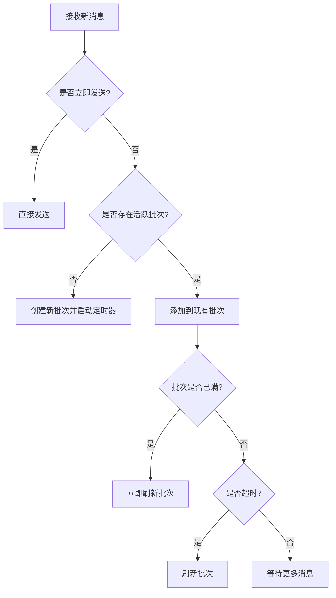
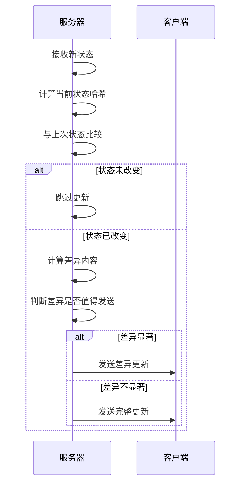
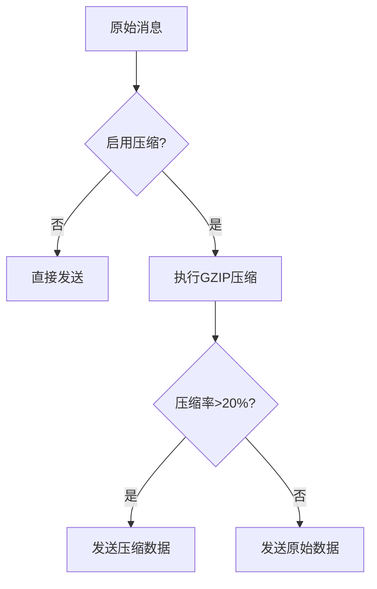
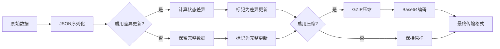
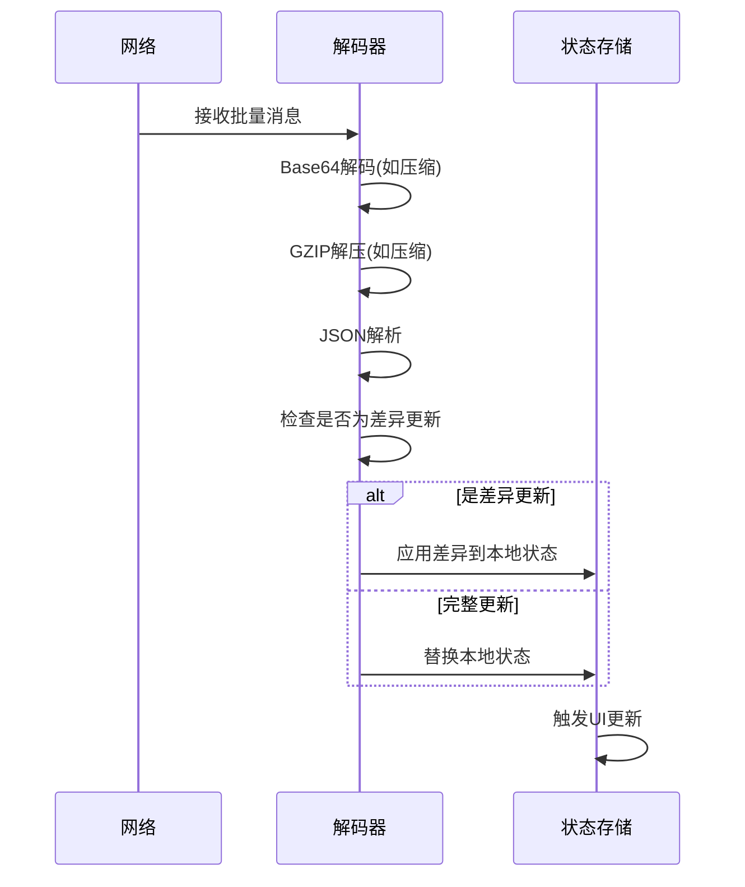
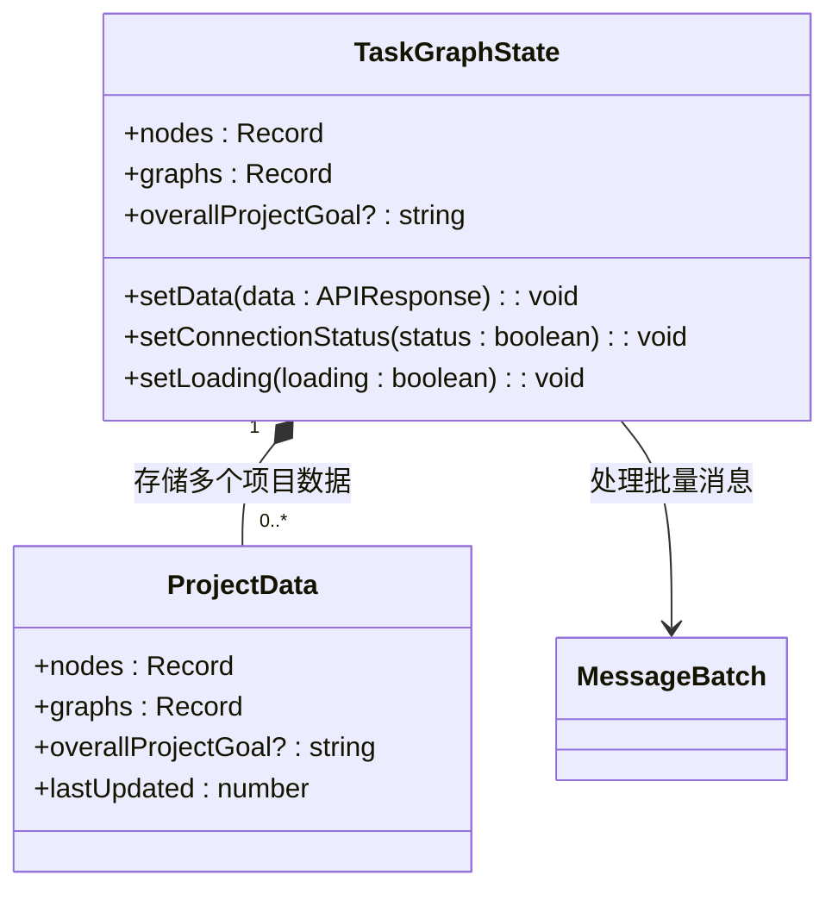
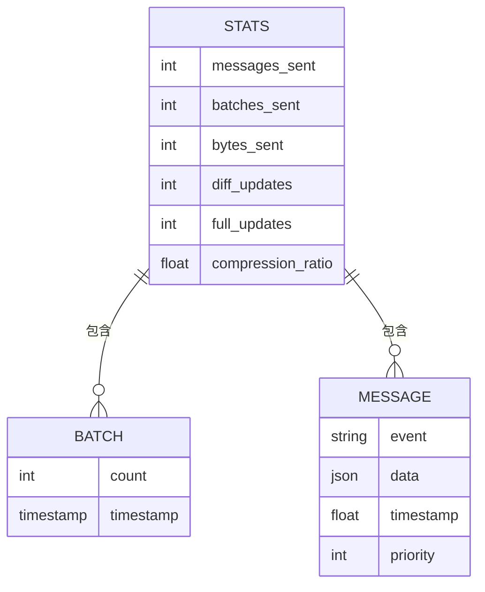

# 状态广播事件

<cite>
**本文档中引用的文件**  
- [optimized_broadcast_service.py](file://src/sentientresearchagent/server/services/optimized_broadcast_service.py)
- [taskGraphStore.ts](file://frontend/src/stores/taskGraphStore.ts)
</cite>

## 目录
1. [系统状态广播机制概述](#系统状态广播机制概述)
2. [批量广播服务优化原理](#批量广播服务优化原理)
3. [配置参数对性能的影响](#配置参数对性能的影响)
4. [消息序列化与反序列化过程](#消息序列化与反序列化过程)
5. [前端状态更新机制](#前端状态更新机制)
6. [监控与调优建议](#监控与调优建议)

## 系统状态广播机制概述

本系统通过WebSocket实现实时状态广播，主要涵盖`project_status`、`system_health`和`batched_node_updates`等关键事件。广播机制采用优化的异步通信架构，确保在高并发场景下仍能保持低延迟和高吞吐量。

核心广播事件包括：
- **项目状态更新**：反映项目整体执行进度和健康状况
- **系统健康检查**：实时报告系统资源使用情况和运行状态
- **节点批量更新**：高效传输任务节点的状态变更信息

这些事件通过优化的广播服务进行聚合和分发，避免了高频小数据包带来的网络开销，同时保证了客户端状态的及时同步。

**Section sources**
- [optimized_broadcast_service.py](file://src/sentientresearchagent/server/services/optimized_broadcast_service.py#L52-L359)
- [taskGraphStore.ts](file://frontend/src/stores/taskGraphStore.ts#L158-L869)

## 批量广播服务优化原理

`OptimizedBroadcastService`是系统状态广播的核心组件，通过多种技术手段实现高性能的消息传输。

### 消息批处理机制

该服务采用基于时间窗口和大小阈值的双重触发机制进行消息批处理：



**Diagram sources**
- [optimized_broadcast_service.py](file://src/sentientresearchagent/server/services/optimized_broadcast_service.py#L116-L217)

当接收到新消息时，服务首先判断是否需要立即发送（`force_immediate=True`）。若不需要，则将消息加入队列等待批处理。每个批次具有两个触发条件：达到最大消息数量（由`batch_size`控制）或超过最大等待时间（由`batch_timeout_ms`控制）。

### 差异化更新策略

为减少不必要的数据传输，服务实现了智能的差异化更新机制：



**Diagram sources**
- [optimized_broadcast_service.py](file://src/sentientresearchagent/server/services/optimized_broadcast_service.py#L215-L248)

服务通过MD5哈希值跟踪每个状态类型的历史版本。当新状态到达时，先计算其哈希值并与历史记录比较。如果相同则跳过更新；如果不同则计算具体差异，并仅当差异内容比完整状态小至少30%时才发送差异更新。

**Section sources**
- [optimized_broadcast_service.py](file://src/sentientresearchagent/server/services/optimized_broadcast_service.py#L215-L248)

## 配置参数对性能的影响

系统的广播性能受到多个配置参数的直接影响，其中`ws_batch_size`和`enable_ws_compression`是最关键的两个参数。

### ws_batch_size 参数分析

`ws_batch_size`参数定义了单个批次中包含的最大消息数量，其取值对系统性能有显著影响：

| 批次大小 | 网络开销 | 延迟 | 内存占用 | 适用场景 |
|---------|---------|------|--------|--------|
| 小 (10-20) | 高 | 低 | 低 | 实时性要求极高 |
| 中 (50-100) | 中 | 中 | 中 | 平衡型应用 |
| 大 (200+) | 低 | 高 | 高 | 吞吐量优先 |

默认值50是在延迟和吞吐量之间的最佳平衡点。较小的批次大小会增加网络往返次数，导致更高的总体开销；而过大的批次则会累积过多消息，增加端到端延迟。

### enable_ws_compression 参数分析

`enable_ws_compression`参数控制是否启用消息压缩，其性能影响如下：



**Diagram sources**
- [optimized_broadcast_service.py](file://src/sentientresearchagent/server/services/optimized_broadcast_service.py#L284-L305)

当启用压缩时，系统使用GZIP算法对消息负载进行压缩。只有当压缩后数据大小比原始数据小20%以上时才会实际发送压缩版本，否则发送原始数据以避免压缩带来的CPU开销。

**Section sources**
- [config.py](file://src/sentientresearchagent/config/config.py#L96-L98)

## 消息序列化与反序列化过程

系统的消息传输涉及复杂的序列化和反序列化流程，确保数据在不同组件间的正确传递。

### 服务端序列化流程

服务端的消息序列化遵循严格的处理顺序：



**Diagram sources**
- [optimized_broadcast_service.py](file://src/sentientresearchagent/server/services/optimized_broadcast_service.py#L284-L305)

整个过程首先将Python对象转换为JSON字符串，然后根据配置决定是否生成差异更新。最后，在可选的压缩步骤后生成最终的传输格式。

### 客户端反序列化流程

客户端的反序列化过程与服务端对应：



**Diagram sources**
- [taskGraphStore.ts](file://frontend/src/stores/taskGraphStore.ts#L158-L869)

客户端首先对接收到的数据进行解码和解压，然后解析JSON内容。对于差异更新，系统会将其应用到现有的本地状态上，而不是完全替换，这进一步减少了内存分配和垃圾回收的压力。

**Section sources**
- [optimized_broadcast_service.py](file://src/sentientresearchagent/server/services/optimized_broadcast_service.py#L284-L305)
- [taskGraphStore.ts](file://frontend/src/stores/taskGraphStore.ts#L158-L869)

## 前端状态更新机制

前端通过`taskGraphStore.ts`中的Zustand store管理本地状态，实现了高效的批量更新应用。

### 状态更新优化策略

前端store采用了多项优化技术来处理批量更新：



**Diagram sources**
- [taskGraphStore.ts](file://frontend/src/stores/taskGraphStore.ts#L158-L869)

`useTaskGraphStore`不仅维护当前显示的状态，还缓存了多个项目的历史数据。这种设计避免了在项目切换时重新获取数据，大大提升了用户体验。

### 数据对比与变更检测

在应用新状态前，store会进行详细的变更检测：

```typescript
// 伪代码表示变更检测逻辑
const prevNodeIds = Object.keys(prevNodes).sort();
const newNodeIds = Object.keys(newNodes).sort();
const actuallyDifferent = JSON.stringify(prevNodeIds) !== JSON.stringify(newNodeIds);
```

这种精确的对比机制确保只有在真正发生变化时才触发UI重渲染，避免了不必要的性能开销。

**Section sources**
- [taskGraphStore.ts](file://frontend/src/stores/taskGraphStore.ts#L158-L869)

## 监控与调优建议

为了确保广播系统的稳定运行，提供了完善的监控机制和调优建议。

### 性能监控指标

`OptimizedBroadcastService`内置了详细的统计信息收集功能：



**Diagram sources**
- [optimized_broadcast_service.py](file://src/sentientresearchagent/server/services/optimized_broadcast_service.py#L94-L107)

通过`get_stats()`方法可以获取包括发送消息数、批次数量、字节数、差异更新次数等关键指标，为性能分析提供数据支持。

### 高并发场景调优建议

针对高并发场景，推荐以下调优策略：

1. **动态调整批次大小**：根据实时负载动态调整`ws_batch_size`
2. **分级压缩策略**：对不同类型的消息采用不同的压缩级别
3. **优先级队列**：为关键消息设置更高优先级，确保及时送达
4. **连接池管理**：合理管理WebSocket连接生命周期

```python
# 示例：性能调优配置
config = {
    'ws_batch_size': 100,           # 增大批次大小以提高吞吐量
    'ws_batch_timeout_ms': 50,      # 缩短超时时间以降低延迟
    'enable_ws_compression': True,  # 启用压缩减少带宽使用
    'max_queue_size': 2000          # 增大队列容量防丢包
}
```

**Section sources**
- [optimized_broadcast_service.py](file://src/sentientresearchagent/server/services/optimized_broadcast_service.py#L94-L107)
- [config.py](file://src/sentientresearchagent/config/config.py#L96-L98)