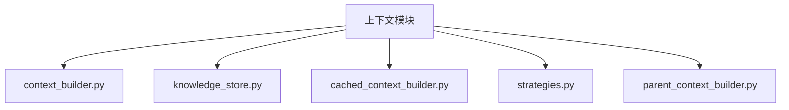
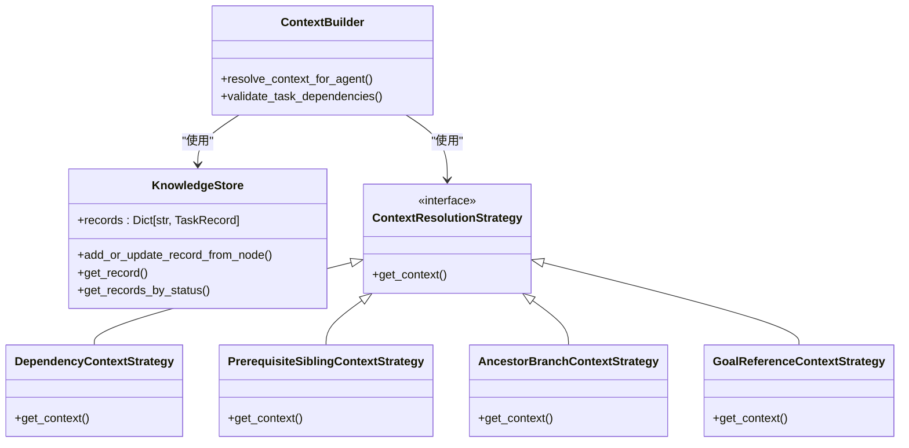
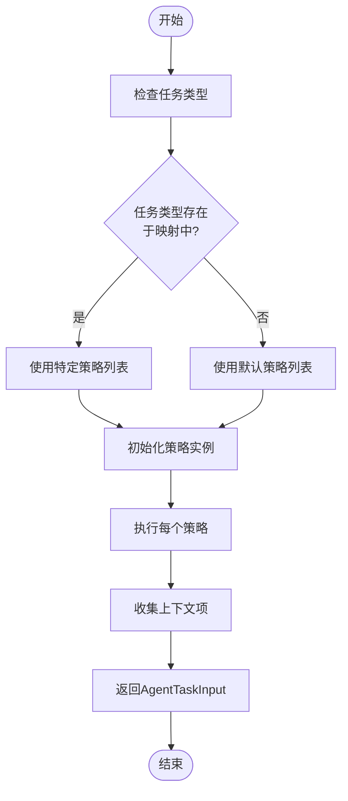
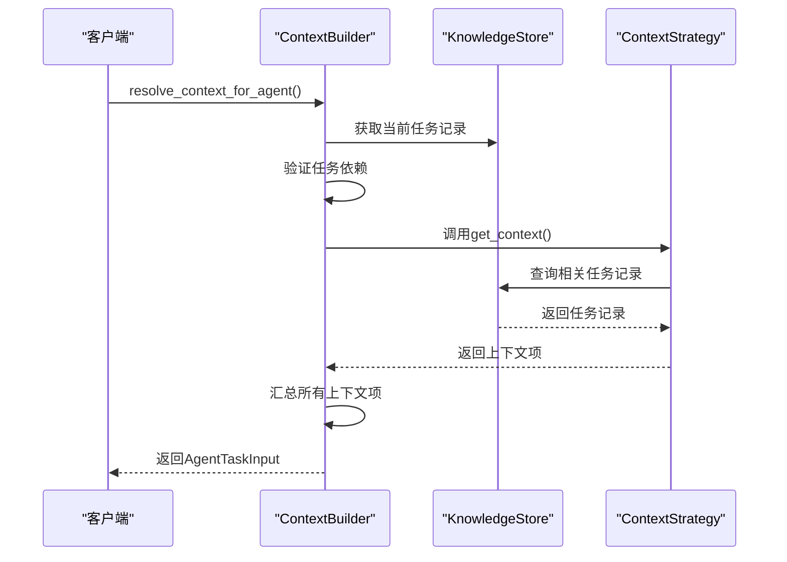
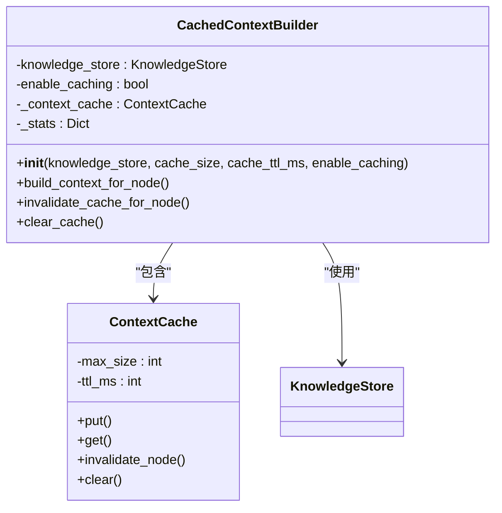
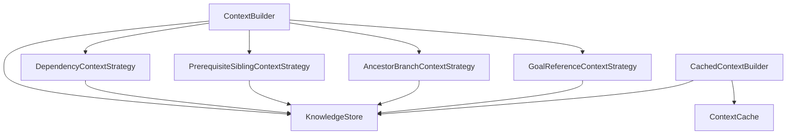

# 上下文构建器初始化流程

<cite>
**本文档中引用的文件**
- [context_builder.py](file://src\sentientresearchagent\hierarchical_agent_framework\context\context_builder.py)
- [knowledge_store.py](file://src\sentientresearchagent\hierarchical_agent_framework\context\knowledge_store.py)
- [cached_context_builder.py](file://src\sentientresearchagent\hierarchical_agent_framework\context\cached_context_builder.py)
- [strategies.py](file://src\sentientresearchagent\hierarchical_agent_framework\context\strategies.py)
- [config.py](file://src\sentientresearchagent\config\config.py)
</cite>

## 目录
1. [项目结构](#项目结构)
2. [核心组件](#核心组件)
3. [架构概述](#架构概述)
4. [详细组件分析](#详细组件分析)
5. [依赖关系分析](#依赖关系分析)
6. [性能考量](#性能考量)
7. [故障排除指南](#故障排除指南)
8. [结论](#结论)

## 项目结构

**图示来源**
- [context_builder.py](file://src\sentientresearchagent\hierarchical_agent_framework\context\context_builder.py)
- [knowledge_store.py](file://src\sentientresearchagent\hierarchical_agent_framework\context\knowledge_store.py)

**章节来源**
- [context_builder.py](file://src\sentientresearchagent\hierarchical_agent_framework\context\context_builder.py)
- [knowledge_store.py](file://src\sentientresearchagent\hierarchical_agent_framework\context\knowledge_store.py)

## 核心组件

上下文构建系统的核心由`ContextBuilder`、`KnowledgeStore`和多种策略类组成。`ContextBuilder`负责协调上下文生成过程，`KnowledgeStore`作为中央存储库管理所有任务记录，而各种策略类则实现了不同类型的上下文获取逻辑。

**章节来源**
- [context_builder.py](file://src\sentientresearchagent\hierarchical_agent_framework\context\context_builder.py#L1-L50)
- [knowledge_store.py](file://src\sentientresearchagent\hierarchical_agent_framework\context\knowledge_store.py#L1-L50)

## 架构概述

**图示来源**
- [context_builder.py](file://src\sentientresearchagent\hierarchical_agent_framework\context\context_builder.py#L1-L50)
- [knowledge_store.py](file://src\sentientresearchagent\hierarchical_agent_framework\context\knowledge_store.py#L1-L50)
- [strategies.py](file://src\sentientresearchagent\hierarchical_agent_framework\context\strategies.py#L1-L50)

## 详细组件分析

### ContextBuilder 初始化分析

`ContextBuilder`通过`resolve_context_for_agent`函数提供上下文构建服务。该函数在初始化时并不直接创建实例，而是作为一个无状态的工具函数被调用。它接收当前任务信息和知识库存储实例，然后根据任务类型选择合适的上下文策略来构建完整的上下文。

#### 策略工厂注册逻辑

**图示来源**
- [context_builder.py](file://src\sentientresearchagent\hierarchical_agent_framework\context\context_builder.py#L150-L295)
- [strategies.py](file://src\sentientresearchagent\hierarchical_agent_framework\context\strategies.py#L1-L100)

#### 依赖注入机制

上下文构建器通过构造函数参数的方式实现依赖注入，确保缓存层与存储层的一致性。`KnowledgeStore`实例被直接注入到各个策略类中，保证了数据访问的一致性和原子性。

**图示来源**
- [context_builder.py](file://src\sentientresearchagent\hierarchical_agent_framework\context\context_builder.py#L1-L100)
- [knowledge_store.py](file://src\sentientresearchagent\hierarchical_agent_framework\context\knowledge_store.py#L1-L100)
- [strategies.py](file://src\sentientresearchagent\hierarchical_agent_framework\context\strategies.py#L1-L100)

**章节来源**
- [context_builder.py](file://src\sentientresearchagent\hierarchical_agent_framework\context\context_builder.py#L1-L295)
- [strategies.py](file://src\sentientresearchagent\hierarchical_agent_framework\context\strategies.py#L1-L767)

### 缓存上下文构建器分析

`CachedContextBuilder`提供了性能优化的上下文构建功能，包含缓存能力而不改变接口。

#### 初始化参数配置

**图示来源**
- [cached_context_builder.py](file://src\sentientresearchagent\hierarchical_agent_framework\context\cached_context_builder.py#L88-L352)
- [knowledge_store.py](file://src\sentientresearchagent\hierarchical_agent_framework\context\knowledge_store.py)

**章节来源**
- [cached_context_builder.py](file://src\sentientresearchagent\hierarchical_agent_framework\context\cached_context_builder.py#L88-L352)

## 依赖关系分析

**图示来源**
- [context_builder.py](file://src\sentientresearchagent\hierarchical_agent_framework\context\context_builder.py)
- [cached_context_builder.py](file://src\sentientresearchagent\hierarchical_agent_framework\context\cached_context_builder.py)
- [strategies.py](file://src\sentientresearchagent\hierarchical_agent_framework\context\strategies.py)
- [knowledge_store.py](file://src\sentientresearchagent\hierarchical_agent_framework\context\knowledge_store.py)

**章节来源**
- [context_builder.py](file://src\sentientresearchagent\hierarchical_agent_framework\context\context_builder.py)
- [strategies.py](file://src\sentientresearchagent\hierarchical_agent_framework\context\strategies.py)

## 性能考量

`CachedContextBuilder`通过以下机制提升性能：
- 上下文结果缓存
- 知识库存储校验和用于缓存失效
- 懒加载上下文构建
- 特定操作的最小化上下文

这些优化显著减少了重复的上下文构建开销，特别是在处理大量相似任务时。

## 故障排除指南

当遇到知识库连接失败时，系统会采用降级策略：
1. 记录错误日志并继续执行
2. 返回空上下文或最小化上下文
3. 在调试模式下禁用缓存以定位问题

调试建议：
- 启用详细的日志记录级别
- 使用`disable_caching()`方法临时关闭缓存
- 检查`get_metrics()`返回的统计信息
- 验证知识库存储中的记录完整性

**章节来源**
- [cached_context_builder.py](file://src\sentientresearchagent\hierarchical_agent_framework\context\cached_context_builder.py#L88-L352)
- [knowledge_store.py](file://src\sentientresearchagent\hierarchical_agent_framework\context\knowledge_store.py#L48-L138)

## 结论

上下文构建系统的初始化过程体现了清晰的依赖注入设计和灵活的策略模式应用。通过将`KnowledgeStore`实例注入到上下文构建器中，系统建立了稳定的数据访问通道。策略工厂模式允许根据不同任务类型动态选择最合适的上下文获取方式，而缓存机制则确保了高性能的上下文构建。整个系统在保持高内聚低耦合的同时，提供了强大的扩展能力和良好的可维护性。