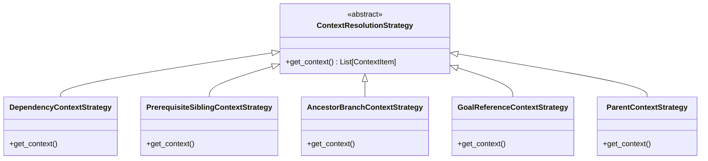
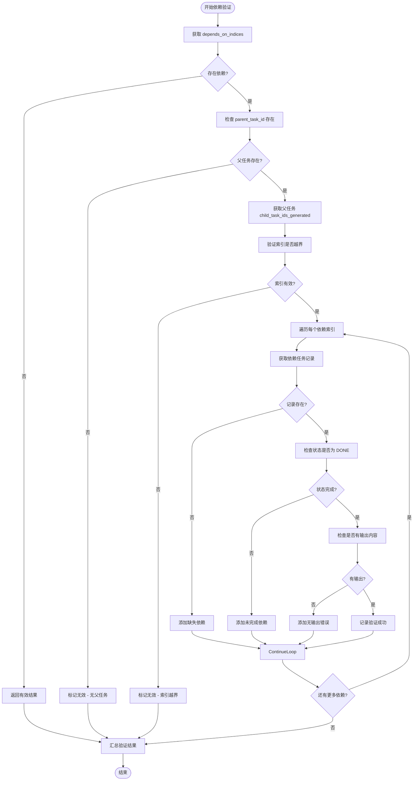
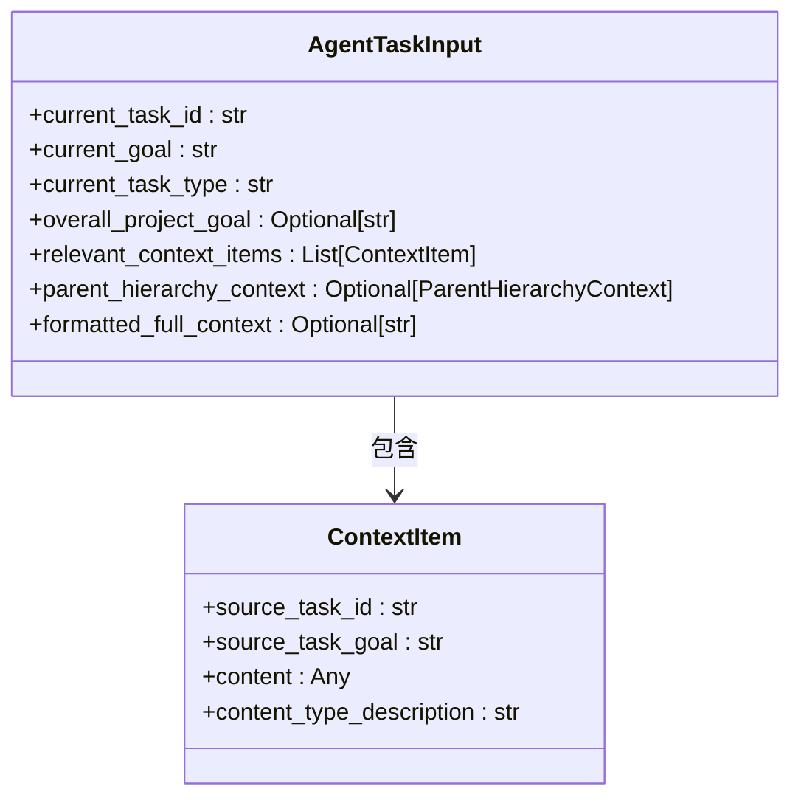

# 上下文构建器工作流程

<cite>
**本文档中引用的文件**  
- [context_builder.py](file://src\sentientresearchagent\hierarchical_agent_framework\context\context_builder.py)
- [agent_io_models.py](file://src\sentientresearchagent\hierarchical_agent_framework\context\agent_io_models.py)
- [strategies.py](file://src\sentientresearchagent\hierarchical_agent_framework\context\strategies.py)
- [knowledge_store.py](file://src\sentientresearchagent\hierarchical_agent_framework\context\knowledge_store.py)
</cite>

## 目录
1. [简介](#简介)  
2. [核心入口函数：resolve_context_for_agent](#核心入口函数resolve_context_for_agent)  
3. [上下文策略体系](#上下文策略体系)  
4. [依赖验证机制](#依赖验证机制)  
5. [AgentTaskInput 数据结构](#agenttaskinput-数据结构)  
6. [日志与调试信息输出](#日志与调试信息输出)  
7. [实际调用示例与异常处理](#实际调用示例与异常处理)  

## 简介
上下文构建器（ContextBuilder）是智能研究代理系统中的关键组件，负责为每个任务节点生成其执行所需的上下文环境。该模块通过协调多种上下文解析策略，从知识库中提取相关历史记录，并将其结构化地传递给代理，从而确保任务在充分信息支持下进行。本文档将系统性地介绍 `resolve_context_for_agent` 函数的工作流程，涵盖参数处理、策略调度、依赖验证及结果封装等核心环节。

## 核心入口函数：resolve_context_for_agent
`resolve_context_for_agent` 是上下文构建器的主要入口点，负责协调整个上下文解析过程。该函数接收多个关键参数：
- `current_task_id`: 当前任务的唯一标识符
- `current_goal`: 当前任务的目标描述
- `current_task_type`: 任务类型（如 WRITE, THINK, PLAN 等）
- `agent_name`: 执行代理的名称
- `knowledge_store`: 知识存储实例，用于访问任务历史记录
- `overall_project_goal`: 可选的整体项目目标

函数首先通过 `knowledge_store.get_record(current_task_id)` 获取当前任务的记录。若未找到对应记录，则返回一个空上下文的 `AgentTaskInput` 对象，并记录警告日志。

随后，函数根据任务类型从 `TASK_TYPE_STRATEGY_MAPPING` 映射表中获取对应的上下文解析策略列表；若无特定配置，则使用默认策略集 `DEFAULT_CONTEXT_STRATEGIES`。

最后，函数按顺序执行所有选定的策略，收集并合并各策略产生的上下文项，最终构造出完整的 `AgentTaskInput` 返回。

**Section sources**  
- [context_builder.py](file://src\sentientresearchagent\hierarchical_agent_framework\context\context_builder.py#L180-L292)

## 上下文策略体系
上下文构建器采用策略模式实现灵活的上下文来源管理。每种策略均继承自抽象基类 `ContextResolutionStrategy`，并实现 `get_context` 方法以提供特定类型的上下文。

### 主要策略类型
以下是系统中定义的核心上下文解析策略：

#### 依赖上下文策略 (DependencyContextStrategy)
优先级最高的策略，用于获取当前任务显式依赖的任务输出。它通过检查 `depends_on_indices` 字段确定依赖关系，并从知识库中提取已完成且具有有效输出的依赖任务内容。

#### 前置兄弟上下文策略 (PrerequisiteSiblingContextStrategy)
提供来自同一父节点下已完成的前置兄弟任务的上下文。适用于需要按顺序执行的任务链，确保后续任务能访问之前步骤的结果。

#### 祖先分支上下文策略 (AncestorBranchContextStrategy)
为写作者或思考者类型的任务（WRITE/THINK）提供来自祖先计划分支的广泛上下文。这有助于保持跨分支的一致性和连贯性。

#### 目标引用上下文策略 (GoalReferenceContextStrategy)
解析任务目标中显式引用的其他任务 ID（格式为 `` `task_id` ``），并将这些被引用任务的输出作为上下文包含进来，实现动态上下文链接。

#### 父级上下文策略 (ParentContextStrategy)
提供直接父任务的输出作为上下文，特别适用于子任务需要参考父级计划或指令的场景。



**Diagram sources**  
- [strategies.py](file://src\sentientresearchagent\hierarchical_agent_framework\context\strategies.py#L60-L87)

**Section sources**  
- [strategies.py](file://src\sentientresearchagent\hierarchical_agent_framework\context\strategies.py#L90-L765)

## 依赖验证机制
在执行上下文解析前，`resolve_context_for_agent` 会调用 `validate_task_dependencies` 函数对当前任务的依赖关系进行完整性校验。此步骤对于保证任务执行的正确性和可靠性至关重要。

### 验证流程
1. **获取依赖索引**：从 `aux_data.depends_on_indices` 或直接字段中读取依赖项索引。
2. **检查父任务存在性**：确认当前任务有父任务，否则无法解析基于索引的依赖。
3. **验证索引范围**：确保所有依赖索引在其父任务的子任务列表范围内。
4. **检查依赖状态**：逐一验证每个依赖任务是否存在于知识库中、状态为 "DONE" 并具备有效输出内容。

若任何一项验证失败，函数将返回包含详细错误信息的验证结果字典，并在日志中发出警告，但不会中断上下文解析流程，允许系统继续尝试执行。



**Diagram sources**  
- [context_builder.py](file://src\sentientresearchagent\hierarchical_agent_framework\context\context_builder.py#L80-L177)

**Section sources**  
- [context_builder.py](file://src\sentientresearchagent\hierarchical_agent_framework\context\context_builder.py#L80-L177)

## AgentTaskInput 数据结构
`AgentTaskInput` 是上下文构建器的输出结果，代表传递给代理的完整输入数据结构。该模型由 Pydantic 定义，确保类型安全和数据有效性。

### 核心字段说明
| 字段名 | 类型 | 描述 |
|-------|------|------|
| current_task_id | str | 当前任务的唯一标识符 |
| current_goal | str | 当前任务的具体目标 |
| current_task_type | str | 任务类型（如 WRITE, PLAN 等） |
| overall_project_goal | Optional[str] | 整体项目目标（可选） |
| relevant_context_items | List[ContextItem] | 相关上下文项列表 |
| parent_hierarchy_context | Optional[ParentHierarchyContext] | 父层级上下文（可选） |
| formatted_full_context | Optional[str] | 完整格式化的上下文文本（可选） |

其中，`relevant_context_items` 是一个 `ContextItem` 对象列表，每个对象包含以下信息：
- `source_task_id`: 上下文来源任务ID
- `source_task_goal`: 来源任务目标
- `content`: 上下文内容（任意类型）
- `content_type_description`: 内容类型描述（如 'plan_output'）



**Diagram sources**  
- [agent_io_models.py](file://src\sentientresearchagent\hierarchical_agent_framework\context\agent_io_models.py#L102-L118)

**Section sources**  
- [agent_io_models.py](file://src\sentientresearchagent\hierarchical_agent_framework\context\agent_io_models.py#L64-L69)

## 日志与调试信息输出
上下文构建器内置了详尽的日志记录机制，便于追踪解析过程和排查问题。主要日志输出包括：

- **INFO 级别**：记录上下文解析的总体进度，如“正在为任务 'root.1.2' 解析上下文”。
- **DEBUG 级别**：输出策略选择详情，例如“使用 WRITE 类型的上下文策略：[DependencyContextStrategy, ...]”。
- **SUCCESS 级别**：当成功找到上下文项时，汇总显示各策略贡献的数量及来源任务。
- **WARNING 级别**：报告依赖验证失败、上下文项为空或内容摘要无效等情况。
- **ERROR 级别**：记录策略执行过程中发生的异常。

此外，系统还维护了一个 `context_debug_info` 字典，跟踪所使用的策略、发现的上下文项及其来源，可用于后期分析和优化。

**Section sources**  
- [context_builder.py](file://src\sentientresearchagent\hierarchical_agent_framework\context\context_builder.py#L180-L292)

## 实际调用示例与异常处理
以下是一个典型的 `resolve_context_for_agent` 调用示例：

```python
input_data = resolve_context_for_agent(
    current_task_id="root.1.2",
    current_goal="撰写关于AI发展趋势的报告章节",
    current_task_type="WRITE",
    agent_name="WriterAgent",
    knowledge_store=ks_instance,
    overall_project_goal="完成AI行业全景研究报告"
)
```

### 异常处理机制
- **任务记录不存在**：返回空上下文，并记录警告日志。
- **依赖验证失败**：记录详细错误信息，但仍继续执行上下文解析。
- **策略执行异常**：捕获并记录异常堆栈，避免单个策略故障影响整体流程。
- **内容处理异常**：在摘要生成或内容提取阶段发生错误时，自动降级至截断方案作为后备。

系统设计遵循“尽力而为”的原则，在部分失败的情况下仍尽可能提供可用上下文，保障代理系统的鲁棒性。

**Section sources**  
- [context_builder.py](file://src\sentientresearchagent\hierarchical_agent_framework\context\context_builder.py#L180-L292)