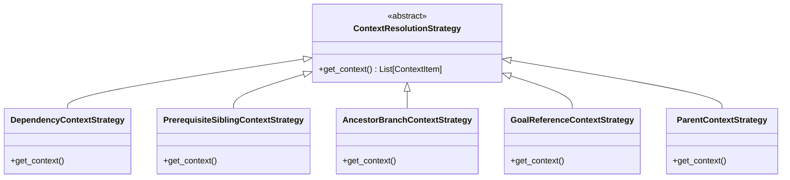
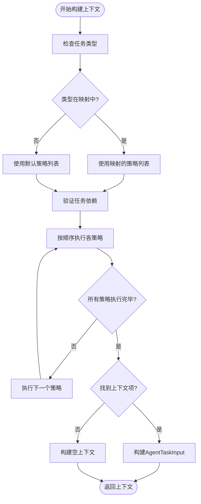
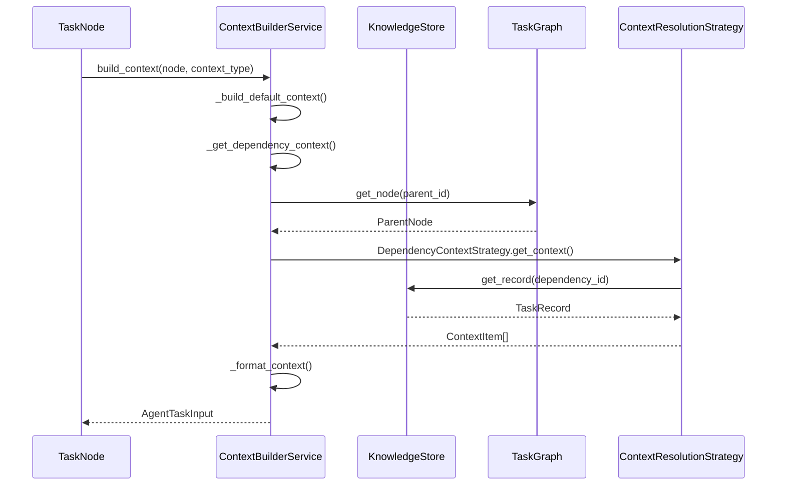

# 上下文策略调度机制

<cite>
**本文档中引用的文件**  
- [strategies.py](file://src\sentientresearchagent\hierarchical_agent_framework\context\strategies.py)
- [context_builder.py](file://src\sentientresearchagent\hierarchical_agent_framework\context\context_builder.py)
- [context_builder_service.py](file://src\sentientresearchagent\hierarchical_agent_framework\services\context_builder_service.py)
</cite>

## 目录
1. [引言](#引言)
2. [核心策略实现原理](#核心策略实现原理)
3. [策略选择与动态路由机制](#策略选择与动态路由机制)
4. [调用链路与执行顺序分析](#调用链路与执行顺序分析)
5. [数据传递与状态共享机制](#数据传递与状态共享机制)
6. [自定义策略扩展指南](#自定义策略扩展指南)
7. [常见集成场景](#常见集成场景)

## 引言
上下文构建系统是智能代理框架的核心组件，负责为任务执行提供必要的背景信息。该系统通过策略模式实现了灵活的上下文获取机制，能够根据任务类型和运行时条件动态选择最合适的上下文构建策略。本文档深入解析`strategies`模块中各类`ContextStrategy`的实现原理及其调度机制。

## 核心策略实现原理

### 依赖上下文策略 (DependencyContextStrategy)
`DependencyContextStrategy` 是所有策略中优先级最高的策略，体现了“显式依赖优先”的设计哲学。它专门处理由 `depends_on_indices` 明确声明的任务依赖关系。

该策略首先尝试从任务记录的直接属性或 `aux_data` 字段中提取依赖索引列表。随后，通过父任务的 `child_task_ids_generated` 列表将索引转换为具体的任务ID，并逐一验证这些依赖任务：
- 是否存在于知识库中；
- 状态是否为 `"DONE"`；
- 是否具有有效输出内容或摘要。

只有满足全部条件的依赖任务才会被纳入上下文。此外，系统会优先使用原始输出内容（当字数不超过阈值时），否则采用摘要或重新生成摘要，避免传递无意义的通用描述。

这种高优先级的设计确保关键前置任务的结果能第一时间被后续任务感知和利用，保障任务链的逻辑连贯性。

**节来源**  
- [strategies.py](file://src\sentientresearchagent\hierarchical_agent_framework\context\strategies.py#L614-L765)

### 前置兄弟上下文策略 (PrerequisiteSiblingContextStrategy)
`PrerequisiteSiblingContextStrategy` 用于获取同一父任务下，在当前任务之前已完成的兄弟节点的上下文。这在顺序执行的任务序列中尤为重要。

其实现逻辑如下：
1. 获取当前任务的父任务记录及其子任务ID生成列表。
2. 确定当前任务在其兄弟列表中的索引位置。
3. 遍历该索引之前的所有兄弟任务ID。
4. 对每个前置兄弟任务，检查其完成状态及输出有效性。
5. 若符合条件，则将其输出内容（或摘要）作为上下文加入结果集。

此策略使得后序任务能够自然地继承前序任务的成果，形成流畅的工作流。例如，在一个研究项目中，“数据收集”任务完成后，“数据分析”任务可自动获得其输出作为输入基础。

**节来源**  
- [strategies.py](file://src\sentientresearchagent\hierarchical_agent_framework\context\strategies.py#L225-L359)

### 祖先分支上下文策略 (AncestorBranchContextStrategy)
`AncestorBranchContextStrategy` 主要服务于 `"WRITE"` 和 `"THINK"` 类型的任务，旨在为其提供来自祖先计划分支的“广义上下文”。

其应用场景价值体现在：
- **跨分支参考**：允许当前写作或思考任务访问同一代祖先下的其他已完成分支成果，促进信息整合。
- **结构化回顾**：通过追溯至祖父级的 `PLAN` 节点，获取更高层次的项目规划背景。
- **避免重复劳动**：防止不同分支间对相同主题进行重复调研或论述。

具体实现上，该策略会构建从当前任务到根节点的路径，定位合适的祖先节点（通常是父节点或祖父级的 `PLAN` 节点），然后遍历其所有已完成且非直系的子任务分支，提取其输出作为上下文。这一机制极大地增强了复杂项目中知识的横向流动能力。

**节来源**  
- [strategies.py](file://src\sentientresearchagent\hierarchical_agent_framework\context\strategies.py#L362-L500)

### 目标引用上下文策略 (GoalReferenceContextStrategy)
`GoalReferenceContextStrategy` 解析任务目标中显式引用的其他任务 ID（格式为 `` `task_id` ``），并将这些被引用任务的输出作为上下文包含进来，实现动态上下文链接。

该策略使用正则表达式 `r"`(root(?:\.\d+)*)`"` 匹配目标文本中的任务ID引用。对于每个找到的引用ID，它会：
1. 检查引用任务是否存在且已完成；
2. 验证其输出内容的有效性；
3. 将其输出（优先使用原始内容）作为上下文项添加。

这种机制支持任务间的显式关联，使用户可以通过简单的语法在任务目标中引用历史成果，从而构建更复杂的任务依赖网络。

**节来源**  
- [strategies.py](file://src\sentientresearchagent\hierarchical_agent_framework\context\strategies.py#L502-L580)



**图来源**  
- [strategies.py](file://src\sentientresearchagent\hierarchical_agent_framework\context\strategies.py#L60-L87)

**节来源**  
- [strategies.py](file://src\sentientresearchagent\hierarchical_agent_framework\context\strategies.py#L90-L765)

## 策略选择与动态路由机制

### 任务类型映射配置
上下文构建器通过 `TASK_TYPE_STRATEGY_MAPPING` 字典实现基于任务类型的策略路由。该映射定义了不同任务类型所使用的策略组合：

```python
TASK_TYPE_STRATEGY_MAPPING: Dict[str, List[ContextResolutionStrategy]] = {
    "WRITE": [
        DependencyContextStrategy(),
        PrerequisiteSiblingContextStrategy(),
        AncestorBranchContextStrategy(),
        GoalReferenceContextStrategy(),
    ],
    "THINK": [
        DependencyContextStrategy(),
        PrerequisiteSiblingContextStrategy(),
        AncestorBranchContextStrategy(),
        GoalReferenceContextStrategy(),
    ],
    "PLAN": [
        DependencyContextStrategy(),
        PrerequisiteSiblingContextStrategy(),
        GoalReferenceContextStrategy(),
    ],
    "RESEARCH_WEB": [
        DependencyContextStrategy(),
        GoalReferenceContextStrategy(),
    ],
    "SEARCH": [
        DependencyContextStrategy(),
        PrerequisiteSiblingContextStrategy(),
        GoalReferenceContextStrategy(),
    ]
}
```

当特定任务类型未在映射中定义时，系统将回退到 `DEFAULT_CONTEXT_STRATEGIES`。

**节来源**  
- [context_builder.py](file://src\sentientresearchagent\hierarchical_agent_framework\context\context_builder.py#L40-L177)

### 策略优先级与回退机制
策略的执行顺序即为其优先级。在 `DEFAULT_CONTEXT_STRATEGIES` 中，`DependencyContextStrategy` 排在首位，表明显式依赖具有最高优先级。

系统的回退机制体现在：
1. **任务类型匹配失败**：若任务类型不在 `TASK_TYPE_STRATEGY_MAPPING` 中，则使用默认策略列表。
2. **策略执行异常**：单个策略执行失败不会中断整个流程，系统会记录错误并继续执行后续策略。
3. **上下文缺失**：即使所有策略均未返回上下文，系统仍会返回包含基本任务信息的 `AgentTaskInput`，确保代理可以继续执行。



**图来源**  
- [context_builder.py](file://src\sentientresearchagent\hierarchical_agent_framework\context\context_builder.py#L180-L292)

**节来源**  
- [context_builder.py](file://src\sentientresearchagent\hierarchical_agent_framework\context\context_builder.py#L180-L292)

## 调用链路与执行顺序分析

### 上下文构建主流程
`resolve_context_for_agent` 函数是上下文构建的核心入口，其调用链路清晰地展示了策略的执行顺序：

1. **初始化**：接收任务ID、目标、类型等参数。
2. **任务记录获取**：从知识库存储中检索当前任务的完整记录。
3. **依赖验证**：调用 `validate_task_dependencies` 确保所有显式依赖均已满足。
4. **策略选择**：根据任务类型从 `TASK_TYPE_STRATEGY_MAPPING` 或 `DEFAULT_CONTEXT_STRATEGIES` 中获取策略列表。
5. **策略执行**：按顺序迭代执行每个策略的 `get_context` 方法。
6. **结果聚合**：将所有策略返回的上下文项合并为最终结果。
7. **返回**：封装成 `AgentTaskInput` 对象返回。

**节来源**  
- [context_builder.py](file://src\sentientresearchagent\hierarchical_agent_framework\context\context_builder.py#L180-L292)

### 服务层调用链
在更高级别的 `ContextBuilderService` 中，上下文构建被进一步封装为异步服务：



**图来源**  
- [context_builder_service.py](file://src\sentientresearchagent\hierarchical_agent_framework\services\context_builder_service.py#L84-L134)

**节来源**  
- [context_builder_service.py](file://src\sentientresearchagent\hierarchical_agent_framework\services\context_builder_service.py#L84-L134)

## 数据传递与状态共享机制

### 处理已处理源集合
所有策略共享一个 `processed_context_source_ids` 集合，用于跟踪已被处理过的上下文源任务ID。这一机制确保了：

- **去重**：避免同一任务的输出被多次添加到上下文中。
- **循环防护**：防止因策略间相互引用而导致无限递归。
- **效率优化**：跳过已处理任务的重复查找和验证。

每个策略在成功添加上下文项后，必须立即将对应的源任务ID添加到该集合中。

**节来源**  
- [strategies.py](file://src\sentientresearchagent\hierarchical_agent_framework\context\strategies.py#L60-L87)

### 内容摘要与大小控制
为防止上下文过大影响性能，系统实施了严格的内容大小控制策略：

1. **阈值判断**：使用 `TARGET_WORD_COUNT_FOR_CTX_SUMMARIES` 作为字数阈值。
2. **优先使用原文**：若原始内容字数不超过阈值，则直接使用，保证信息完整性。
3. **智能摘要**：若原文过长，则调用 `get_context_summary` 进行摘要生成。
4. **摘要质量检测**：通过 `is_generic_summary` 函数识别并过滤掉“执行完成”、“计划已制定”等无意义的通用摘要。
5. **后备截断**：若无法生成有效摘要，则对现有摘要进行字符级截断。

这种分层处理机制在信息完整性与系统性能之间取得了良好平衡。

**节来源**  
- [strategies.py](file://src\sentientresearchagent\hierarchical_agent_framework\context\strategies.py#L90-L222)

## 自定义策略扩展指南

### 实现新策略
要创建自定义上下文策略，需遵循以下步骤：

1. **继承基类**：创建新类并继承 `ContextResolutionStrategy` 抽象基类。
2. **实现get_context方法**：重写 `get_context` 方法，定义具体的上下文获取逻辑。
3. **注册到映射**：将新策略实例添加到 `TASK_TYPE_STRATEGY_MAPPING` 的相应任务类型列表中。

示例代码结构：
```python
class CustomContextStrategy(ContextResolutionStrategy):
    def get_context(
        self,
        current_task_record: TaskRecord,
        knowledge_store: KnowledgeStore,
        processed_context_source_ids: set[str],
        overall_project_goal: Optional[str] = None,
        current_task_type: Optional[str] = None,
    ) -> List[ContextItem]:
        # 自定义逻辑
        pass
```

**节来源**  
- [strategies.py](file://src\sentientresearchagent\hierarchical_agent_framework\context\strategies.py#L60-L87)

### 配置与注入
自定义策略可通过两种方式注入系统：

1. **静态配置**：修改 `context_builder.py` 中的 `TASK_TYPE_STRATEGY_MAPPING` 字典。
2. **动态注入**：通过 `ContextBuilderService` 的配置更新接口，在运行时动态添加或替换策略。

推荐使用动态注入方式，以保持核心代码的稳定性和可维护性。

**节来源**  
- [context_builder_service.py](file://src\sentientresearchagent\hierarchical_agent_framework\services\context_builder_service.py#L590-L598)

## 常见集成场景

### 研究报告撰写
在撰写研究报告时，`WRITE` 类型任务会激活完整的策略链：
- **依赖**：获取明确指定的数据源任务输出。
- **前置兄弟**：继承前一章节的结论。
- **祖先分支**：参考其他平行研究分支的发现。
- **目标引用**：整合用户在目标中直接引用的关键文献。

### 动态计划调整
当需要修改现有计划时，`MODIFICATION` 上下文类型会触发特殊处理：
- **原计划**：通过 `additional_context` 注入待修改的原始计划。
- **修改指令**：包含用户的修改要求。
- **相关上下文**：保留原有的依赖和兄弟任务上下文。

### 聚合与汇总
`AGGREGATION` 上下文专注于父级层次和水平依赖，为汇总任务提供宏观视角，同时避免子任务结果的提前注入（由聚合处理器单独处理）。

**节来源**  
- [context_builder_service.py](file://src\sentientresearchagent\hierarchical_agent_framework\services\context_builder_service.py#L264-L297)