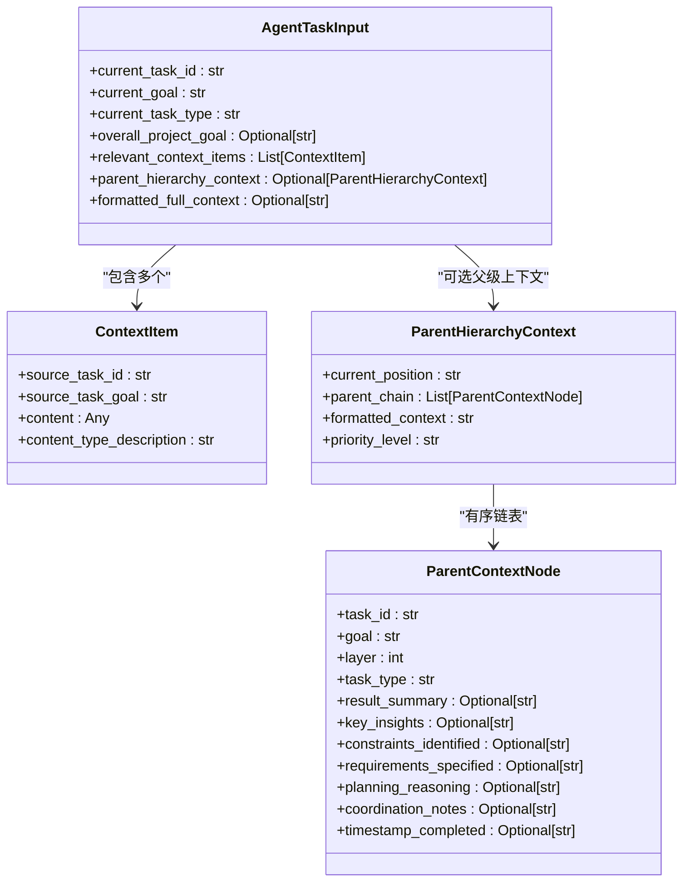
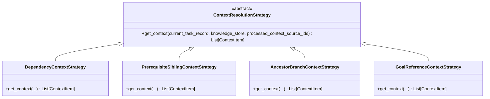

# 上下文结果组装与输出

<cite>
**本文档引用文件**   
- [context_builder.py](file://src\sentientresearchagent\hierarchical_agent_framework\context\context_builder.py)
- [agent_io_models.py](file://src\sentientresearchagent\hierarchical_agent_framework\context\agent_io_models.py)
- [strategies.py](file://src\sentientresearchagent\hierarchical_agent_framework\context\strategies.py)
- [knowledge_store.py](file://src\sentientresearchagent\hierarchical_agent_framework\context\knowledge_store.py)
- [context_utils.py](file://src\sentientresearchagent\hierarchical_agent_framework\context\context_utils.py)
- [utils.py](file://src\sentientresearchagent\hierarchical_agent_framework\agents\utils.py)
- [types.py](file://src\sentientresearchagent\hierarchical_agent_framework\types.py)
- [index.ts](file://frontend\src\types\index.ts)
</cite>

## 目录
1. [引言](#引言)
2. [上下文构建流程概览](#上下文构建流程概览)
3. [核心数据结构解析](#核心数据结构解析)
4. [策略驱动的上下文聚合机制](#策略驱动的上下文聚合机制)
5. [依赖验证与错误处理](#依赖验证与错误处理)
6. [性能优化与惰性加载](#性能优化与惰性加载)
7. [前端可视化与溯源信息](#前端可视化与溯源信息)
8. [典型输出样例与解析](#典型输出样例与解析)
9. [结论](#结论)

## 引言
本系统通过`resolve_context_for_agent`函数实现上下文最终阶段的结果组装，将多策略返回的上下文片段整合为标准化的`AgentTaskInput`对象。该过程是智能体任务执行的核心前置环节，确保了下游代理能够获得充分、准确且结构化的输入信息。

## 上下文构建流程概览

`resolve_context_for_agent`函数作为上下文组装的入口点，接收当前任务ID、目标、类型、代理名称及知识库等参数，并返回一个完整的`AgentTaskInput`实例。其主要流程包括：获取当前任务记录、验证依赖完整性、根据任务类型选择上下文策略、依次执行各策略以收集上下文项，并最终封装成标准输入对象。

```mermaid
flowchart TD
Start([开始]) --> GetTaskRecord["获取当前任务记录"]
GetTaskRecord --> ValidateDependency["验证任务依赖"]
ValidateDependency --> SelectStrategies["根据任务类型选择上下文策略"]
SelectStrategies --> ExecuteStrategy["执行每个上下文策略"]
ExecuteStrategy --> CollectItems["收集ContextItem列表"]
CollectItems --> AssembleInput["组装AgentTaskInput对象"]
AssembleInput --> End([返回结果])
subgraph "循环: 每个策略"
ExecuteStrategy --> StrategyLoop
StrategyLoop[策略.get_context()] --> ProcessOutput["处理输出内容"]
ProcessOutput --> CheckContent["检查内容有效性"]
CheckContent --> AddToItems{"有效? "}
AddToItems --> |是| UpdateList["添加至relevant_context_items"]
AddToItems --> |否| SkipItem["跳过"]
UpdateList --> MarkProcessed["标记已处理source_id"]
MarkProcessed --> NextStrategy
NextStrategy --> ExecuteStrategy
end
style Start fill:#4CAF50,stroke:#388E3C,color:white
style End fill:#F44336,stroke:#D32F2F,color:white
```

**Diagram sources**
- [context_builder.py](file://src\sentientresearchagent\hierarchical_agent_framework\context\context_builder.py#L180-L292)

**Section sources**
- [context_builder.py](file://src\sentientresearchagent\hierarchical_agent_framework\context\context_builder.py#L180-L292)

## 核心数据结构解析

### AgentTaskInput 结构说明
`AgentTaskInput`是传递给智能体的标准输入模型，包含当前任务的基本信息和相关上下文。



**Diagram sources**
- [agent_io_models.py](file://src\sentientresearchagent\hierarchical_agent_framework\context\agent_io_models.py#L102-L118)
- [agent_io_models.py](file://src\sentientresearchagent\hierarchical_agent_framework\context\agent_io_models.py#L64-L69)
- [agent_io_models.py](file://src\sentientresearchagent\hierarchical_agent_framework\context\agent_io_models.py#L94-L99)
- [agent_io_models.py](file://src\sentientresearchagent\hierarchical_agent_framework\context\agent_io_models.py#L75-L92)

**Section sources**
- [agent_io_models.py](file://src\sentientresearchagent\hierarchical_agent_framework\context\agent_io_models.py#L64-L118)

#### 字段含义与嵌套关系
- **current_task_id**: 当前任务唯一标识符。
- **current_goal**: 当前任务的目标描述。
- **current_task_type**: 任务类型（如WRITE, THINK, PLAN等）。
- **overall_project_goal**: 整体项目目标，用于提供宏观背景。
- **relevant_context_items**: 关键字段，存储从不同来源获取的上下文项列表。
- **parent_hierarchy_context**: 新增字段，提供来自父层级的结构化上下文，支持向下流动。
- **formatted_full_context**: 可选字段，供LLM直接消费的完整格式化上下文文本。

其中，`ContextItem`代表单个上下文单元，包含来源任务ID、目标、实际内容及其类型描述。`ParentHierarchyContext`则进一步封装了任务在层级中的位置、父链路径及优先级等元信息。

## 策略驱动的上下文聚合机制

系统采用基于任务类型的策略映射机制，动态决定应启用哪些上下文提取策略。

### 任务类型与策略映射表
| 任务类型 | 启用策略 |
|--------|--------|
| WRITE | DependencyContextStrategy, PrerequisiteSiblingContextStrategy, AncestorBranchContextStrategy, GoalReferenceContextStrategy |
| THINK | 同上 |
| PLAN | DependencyContextStrategy, PrerequisiteSiblingContextStrategy, GoalReferenceContextStrategy |
| RESEARCH_WEB | DependencyContextStrategy, GoalReferenceContextStrategy |
| SEARCH | DependencyContextStrategy, PrerequisiteSiblingContextStrategy, GoalReferenceContextStrategy |

```python
TASK_TYPE_STRATEGY_MAPPING: Dict[str, List[ContextResolutionStrategy]] = { ... }
DEFAULT_CONTEXT_STRATEGIES: List[ContextResolutionStrategy] = [ ... ]
```

每种策略均继承自抽象基类`ContextResolutionStrategy`，并实现`get_context`方法来定义具体的上下文提取逻辑。



**Diagram sources**
- [context_builder.py](file://src\sentientresearchagent\hierarchical_agent_framework\context\context_builder.py#L38-L77)
- [context_builder.py](file://src\sentientresearchagent\hierarchical_agent_framework\context\context_builder.py#L26-L32)
- [strategies.py](file://src\sentientresearchagent\hierarchical_agent_framework\context\strategies.py#L60-L87)

**Section sources**
- [context_builder.py](file://src\sentientresearchagent\hierarchical_agent_framework\context\context_builder.py#L26-L77)
- [strategies.py](file://src\sentientresearchagent\hierarchical_agent_framework\context\strategies.py#L60-L87)

## 依赖验证与错误处理

在上下文组装前，系统会调用`validate_task_dependencies`函数对当前任务的依赖进行校验，确保所有前置任务已完成且输出有效。

```mermaid
sequenceDiagram
participant T as TaskRecord
participant K as KnowledgeStore
participant V as Validator
V->>T : 获取depends_on_indices
alt 存在依赖
V->>T : 检查parent_task_id是否存在
V->>K : 获取parent_record
loop 遍历每个dependency_index
V->>V : 解析dependency_task_id
V->>K : 获取dependency_record
V->>V : 验证状态是否为DONE
V->>V : 验证output_content或output_summary非空
end
else 无依赖
return valid=true
end
V-->>Resolver : 返回validation_result字典
```

**Diagram sources**
- [context_builder.py](file://src\sentientresearchagent\hierarchical_agent_framework\context\context_builder.py#L80-L177)

**Section sources**
- [context_builder.py](file://src\sentientresearchagent\hierarchical_agent_framework\context\context_builder.py#L80-L177)

若验证失败，系统将记录警告日志但继续执行，体现了“尽力而为”的容错设计原则。返回的`validation_result`包含`valid`标志位以及缺失、未完成依赖列表和错误信息。

## 性能优化与惰性加载

为提升性能，系统在多个层面实施了优化措施：

1. **内容摘要生成**：通过`get_context_summary`函数对超长内容进行摘要，避免上下文爆炸。
2. **惰性处理机制**：
   - 优先使用原始内容（若字数 ≤ 20,000）
   - 若原始内容过大，则调用专用摘要代理进行压缩
   - 若摘要代理不可用，则回退至字符截断（最大140,000字符）
3. **去重控制**：使用`processed_context_source_ids`集合防止同一来源被重复处理。
4. **通用摘要过滤**：通过`is_generic_summary`函数识别并跳过无意义的默认摘要（如"task completed"），改用实际内容替代。

```python
TARGET_WORD_COUNT_FOR_CTX_SUMMARIES = 20000
MAX_SUMMARY_LENGTH_FALLBACK_CHARS = 140000
```

这些机制共同保障了上下文的质量与效率平衡。

**Section sources**
- [utils.py](file://src\sentientresearchagent\hierarchical_agent_framework\agents\utils.py#L18-L79)
- [strategies.py](file://src\sentientresearchagent\hierarchical_agent_framework\context\strategies.py#L22-L50)
- [utils.py](file://src\sentientresearchagent\hierarchical_agent_framework\agents\utils.py#L15-L16)

## 前端可视化与溯源信息

前端组件通过WebSocket接收后端推送的任务状态更新，并利用`TaskRecord`中的元数据构建可视化图谱。

- `task_id` 和 `parent_task_id` 构成父子关系链，用于绘制任务树。
- `status` 字段（如PENDING, DONE, FAILED）驱动节点颜色变化。
- `child_task_ids_generated` 支持展开子图功能。
- `aux_data` 中的 `depends_on_indices` 明确表示显式依赖关系，可在图中以虚线边标注。

```typescript
export type TaskStatus = 
  | 'PENDING'
  | 'READY' 
  | 'RUNNING'
  | 'PLAN_DONE'
  | 'AGGREGATING'
  | 'DONE'
  | 'FAILED'
  | 'NEEDS_REPLAN'
  | 'CANCELLED'
```

此设计使得用户可通过`ContextFlowPanel`等组件直观追踪上下文来源，理解任务间的因果与依赖关系。

**Section sources**
- [knowledge_store.py](file://src\sentientresearchagent\hierarchical_agent_framework\context\knowledge_store.py#L12-L46)
- [index.ts](file://frontend\src\types\index.ts#L99-L108)
- [types.py](file://src\sentientresearchagent\hierarchical_agent_framework\types.py#L12-L25)

## 典型输出样例与解析

以下是一个典型的`AgentTaskInput`序列化JSON示例：

```json
{
  "current_task_id": "root.1.2",
  "current_goal": "撰写关于加密货币市场趋势的分析报告",
  "current_task_type": "WRITE",
  "overall_project_goal": "完成区块链行业深度研究报告",
  "relevant_context_items": [
    {
      "source_task_id": "root.1.1",
      "source_task_goal": "收集2023年Q3加密货币市场数据",
      "content": "比特币价格在Q3上涨了25%...",
      "content_type_description": "search_result_summary"
    },
    {
      "source_task_id": "root.1.0",
      "source_task_goal": "制定研究计划大纲",
      "content": "I. 市场概况 II. 技术分析 III. 风险评估",
      "content_type_description": "plan_output"
    }
  ],
  "parent_hierarchy_context": {
    "current_position": "第二层写作任务",
    "parent_chain": [
      {
        "task_id": "root.1",
        "goal": "执行第一阶段研究",
        "layer": 1,
        "task_type": "PLAN",
        "result_summary": "已生成三个子任务",
        "timestamp_completed": "2023-10-01T12:00:00Z"
      }
    ],
    "formatted_context": "您正在执行一项写作任务...",
    "priority_level": "high"
  }
}
```

该对象可通过Pydantic模型自动序列化/反序列化，确保类型安全与数据一致性。

**Section sources**
- [agent_io_models.py](file://src\sentientresearchagent\hierarchical_agent_framework\context\agent_io_models.py#L102-L118)

## 结论
`resolve_context_for_agent`函数实现了高度模块化、可扩展的上下文组装机制。通过策略模式结合任务类型路由，系统能够灵活适应不同类型任务的上下文需求。同时，内置的验证、优化与溯源机制保障了系统的健壮性与可观测性，为前端提供了丰富的可视化基础。整体设计体现了清晰的分层架构与关注点分离原则。