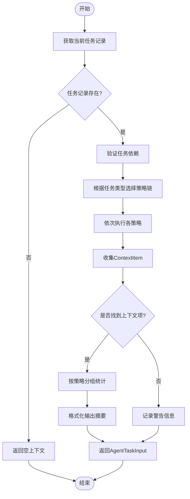

# 上下文管理

<cite>
**本文档中引用的文件**  
- [context_builder.py](file://src\sentientresearchagent\hierarchical_agent_framework\context\context_builder.py)
- [strategies.py](file://src\sentientresearchagent\hierarchical_agent_framework\context\strategies.py)
- [enhanced_context_builder.py](file://src\sentientresearchagent\hierarchical_agent_framework\context\enhanced_context_builder.py)
</cite>

## 目录
1. [上下文构建机制概述](#上下文构建机制概述)  
2. [策略选择与执行流程](#策略选择与执行流程)  
3. [核心上下文解析策略详解](#核心上下文解析策略详解)  
   - [DependencyContextStrategy：依赖优先原则](#dependencycontextstrategy依赖优先原则)  
   - [PrerequisiteSiblingContextStrategy：前置兄弟节点上下文获取](#prerequisitesiblingcontextstrategy前置兄弟节点上下文获取)  
   - [AncestorBranchContextStrategy：继承分支历史信息应用](#ancestorbranchcontextstrategy继承分支历史信息应用)  
4. [任务依赖验证机制](#任务依赖验证机制)  
5. [上下文解析问题调试指南](#上下文解析问题调试指南)

## 上下文构建机制概述

上下文构建器（ContextBuilder）是系统任务调度与智能代理协作的核心组件，负责为当前任务提供精准、相关的上下文信息。其主要功能是通过 `resolve_context_for_agent` 函数，结合任务类型、目标和知识库状态，动态组装适用于当前代理的输入上下文。

该机制基于策略模式设计，支持多种上下文来源的灵活组合，并通过 `TASK_TYPE_STRATEGY_MAPPING` 映射表实现按任务类型定制化策略链。整个过程在确保依赖完整性的前提下，最大化利用已有完成任务的知识产出。

**Section sources**  
- [context_builder.py](file://src\sentientresearchagent\hierarchical_agent_framework\context\context_builder.py#L180-L292)

## 策略选择与执行流程

`resolve_context_for_agent` 函数是上下文解析的入口点，其工作流程如下：

1. **初始化日志与检查**：记录当前任务的基本信息，并从知识库中获取对应的任务记录。
2. **依赖验证**：调用 `validate_task_dependencies` 对当前任务的所有显式依赖进行完整性校验。
3. **策略链确定**：根据 `current_task_type` 查询 `TASK_TYPE_STRATEGY_MAPPING` 映射表，若未找到匹配项则使用默认策略链 `DEFAULT_CONTEXT_STRATEGIES`。
4. **策略执行**：依次执行选定的上下文策略，每种策略返回一组 `ContextItem`，所有结果合并为最终上下文列表。
5. **结果封装与返回**：将收集到的相关上下文项封装成 `AgentTaskInput` 对象返回给调用方。

此流程保证了上下文构建既遵循预设规则，又能适应不同类型任务的需求差异。

**Diagram sources**  
- [context_builder.py](file://src\sentientresearchagent\hierarchical_agent_framework\context\context_builder.py#L180-L292)

**Section sources**  
- [context_builder.py](file://src\sentientresearchagent\hierarchical_agent_framework\context\context_builder.py#L180-L292)

## 核心上下文解析策略详解

### DependencyContextStrategy：依赖优先原则

`DependencyContextStrategy` 是所有策略中优先级最高的策略，体现了“显式依赖优先”的设计哲学。它专门处理由 `depends_on_indices` 明确声明的任务依赖关系。

该策略首先尝试从任务记录的直接属性或 `aux_data` 字段中提取依赖索引列表。随后，通过父任务的 `child_task_ids_generated` 列表将索引转换为具体的任务ID，并逐一验证这些依赖任务：
- 是否存在于知识库中；
- 状态是否为 `"DONE"`；
- 是否具有有效输出内容或摘要。

只有满足全部条件的依赖任务才会被纳入上下文。此外，系统会优先使用原始输出内容（当字数不超过阈值时），否则采用摘要或重新生成摘要，避免传递无意义的通用描述。

这种高优先级的设计确保关键前置任务的结果能第一时间被后续任务感知和利用，保障任务链的逻辑连贯性。

**Section sources**  
- [strategies.py](file://src\sentientresearchagent\hierarchical_agent_framework\context\strategies.py#L614-L765)

### PrerequisiteSiblingContextStrategy：前置兄弟节点上下文获取

`PrerequisiteSiblingContextStrategy` 用于获取同一父任务下，在当前任务之前已完成的兄弟节点的上下文。这在顺序执行的任务序列中尤为重要。

其实现逻辑如下：
1. 获取当前任务的父任务记录及其子任务ID生成列表。
2. 确定当前任务在其兄弟列表中的索引位置。
3. 遍历该索引之前的所有兄弟任务ID。
4. 对每个前置兄弟任务，检查其完成状态及输出有效性。
5. 若符合条件，则将其输出内容（或摘要）作为上下文加入结果集。

此策略使得后序任务能够自然地继承前序任务的成果，形成流畅的工作流。例如，在一个研究项目中，“数据收集”任务完成后，“数据分析”任务可自动获得其输出作为输入基础。

**Section sources**  
- [strategies.py](file://src\sentientresearchagent\hierarchical_agent_framework\context\strategies.py#L225-L359)

### AncestorBranchContextStrategy：继承分支历史信息应用

`AncestorBranchContextStrategy` 主要服务于 `"WRITE"` 和 `"THINK"` 类型的任务，旨在为其提供来自祖先计划分支的“广义上下文”。

其应用场景价值体现在：
- **跨分支参考**：允许当前写作或思考任务访问同一代祖先下的其他已完成分支成果，促进信息整合。
- **结构化回顾**：通过追溯至祖父级的 `PLAN` 节点，获取更高层次的项目规划背景。
- **避免重复劳动**：防止不同分支间对相同主题进行重复调研或论述。

具体实现上，该策略会构建从当前任务到根节点的路径，定位合适的祖先节点（通常是父节点或祖父级的 `PLAN` 节点），然后遍历其所有已完成且非直系的子任务分支，提取其输出作为上下文。这一机制极大地增强了复杂项目中知识的横向流动能力。

**Section sources**  
- [strategies.py](file://src\sentientresearchagent\hierarchical_agent_framework\context\strategies.py#L362-L500)

## 任务依赖验证机制

`validate_task_dependencies` 函数提供了完整的依赖检查清单，确保任务执行前其先决条件均已满足。其验证流程包含以下关键检查点：

| 检查项 | 异常情况 | 错误处理 |
|-------|--------|---------|
| 父任务存在性 | 当前任务有依赖但无父任务 | 标记为无效，添加错误信息 |
| 父任务子任务生成 | 父任务未生成子任务列表 | 标记为无效，添加错误信息 |
| 索引越界 | 依赖索引超出父任务子任务数量范围 | 标记为无效，添加越界提示 |
| 依赖任务存在性 | 依赖任务ID在知识库中找不到 | 记录缺失ID，标记为无效 |
| 依赖任务完成状态 | 依赖任务状态不为 `"DONE"` | 记录未完成ID，标记为无效 |
| 依赖任务输出内容 | 依赖任务无 `output_content` 或 `output_summary` | 标记为无效，提示无输出 |

该函数返回一个包含 `valid`、`missing_dependencies`、`incomplete_dependencies` 和 `validation_errors` 四个字段的字典，供调用者全面了解依赖状态。尽管验证失败不会中断上下文构建，但会在日志中发出警告，便于问题追踪。

**Section sources**  
- [context_builder.py](file://src\sentientresearchagent\hierarchical_agent_framework\context\context_builder.py#L80-L177)

## 上下文解析问题调试指南

当遇到上下文缺失或不完整的问题时，可通过以下日志分析步骤进行排查：

1. **查看上下文解析起始日志**  
   搜索 `ContextBuilder: Resolving context for task`，确认任务ID、代理名称和任务类型是否正确。

2. **检查依赖验证结果**  
   查找 `Dependency validation failed` 或 `All dependencies validated` 日志行，判断是否存在依赖未满足的情况。

3. **分析策略执行情况**  
   观察 `Using context strategies for task type` 输出，确认实际使用的策略链是否符合预期（依据 `TASK_TYPE_STRATEGY_MAPPING`）。

4. **逐策略审查上下文获取**  
   每个策略执行后会有详细日志，如：
   - `Strategy DependencyContextStrategy found X context items`
   - `Added context from EXPLICIT DEPENDENCY: task_id`
   - `No explicit dependencies found`（表示无依赖）

5. **关注特殊警告信息**  
   - `TaskRecord not found`：任务记录丢失
   - `Parent record not found`：父任务异常
   - `Summarization resulted in empty content`：内容处理失败
   - `Generic output_summary is generic`：摘要质量差

6. **最终汇总信息**  
   成功时会输出 `Found N relevant context items` 并按策略分类统计；失败时会提示 `No relevant context items found`，并可能关联之前的验证错误。

通过上述日志链条，可以系统性地定位上下文构建过程中的任何瓶颈或故障点。

**Section sources**  
- [context_builder.py](file://src\sentientresearchagent\hierarchical_agent_framework\context\context_builder.py#L180-L292)
- [strategies.py](file://src\sentientresearchagent\hierarchical_agent_framework\context\strategies.py#L614-L765)