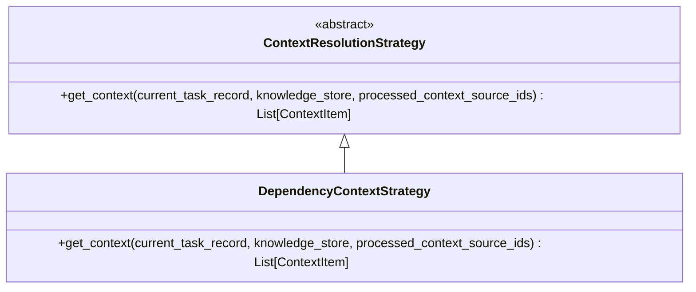
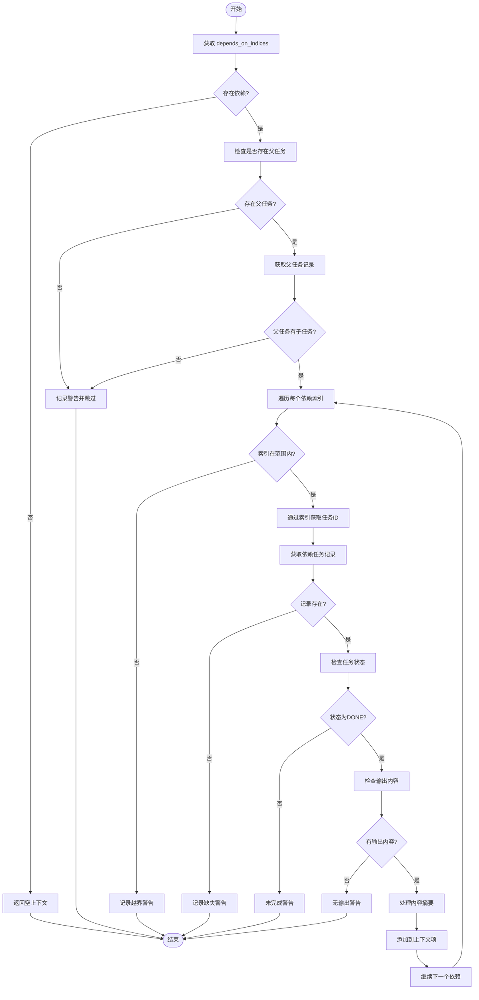
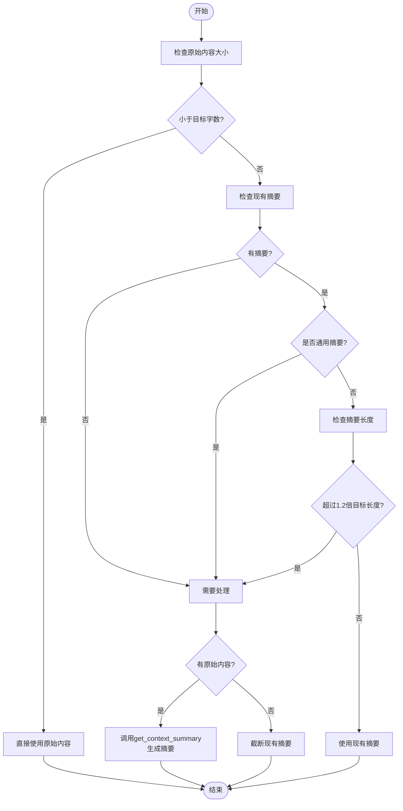
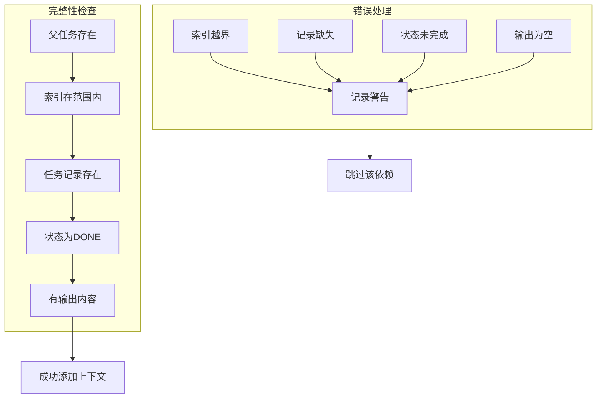
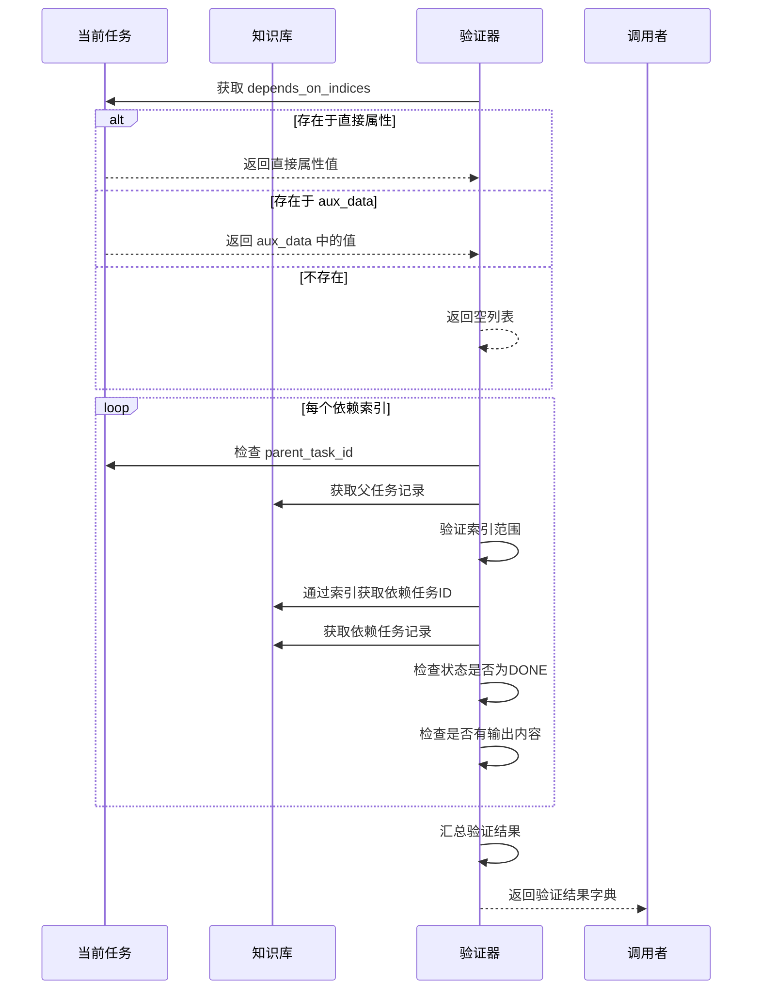

# 依赖上下文策略

<cite>
**本文档中引用的文件**  
- [strategies.py](file://src\sentientresearchagent\hierarchical_agent_framework\context\strategies.py)
- [context_builder.py](file://src\sentientresearchagent\hierarchical_agent_framework\context\context_builder.py)
- [knowledge_store.py](file://src\sentientresearchagent\hierarchical_agent_framework\context\knowledge_store.py)
- [agent_io_models.py](file://src\sentientresearchagent\hierarchical_agent_framework\context\agent_io_models.py)
- [types.py](file://src\sentientresearchagent\hierarchical_agent_framework\types.py)
</cite>

## 目录
1. [引言](#引言)
2. [核心机制分析](#核心机制分析)
3. [前置依赖解析流程](#前置依赖解析流程)
4. [关键输入保障设计](#关键输入保障设计)
5. [依赖验证机制](#依赖验证机制)
6. [日志调试与故障排除](#日志调试与故障排除)
7. [总结](#总结)

## 引言
`DependencyContextStrategy` 类是分层智能体框架中的核心上下文解析策略之一，负责为当前任务提供来自显式依赖任务的上下文信息。该策略通过任务图中定义的 `depends_on_indices` 字段定位前置依赖任务，并将其输出内容作为上下文注入到当前任务中。其设计优先级最高的是确保关键输入不被遗漏，这对于复杂任务编排和多步骤推理至关重要。

## 核心机制分析
`DependencyContextStrategy` 实现了 `ContextResolutionStrategy` 抽象基类，通过 `get_context` 方法获取依赖任务的上下文。该策略首先从当前任务记录中提取依赖索引信息，然后通过父任务的 `child_task_ids_generated` 列表将索引转换为具体的任务ID，最后验证依赖任务的状态和输出完整性。



**图表来源**  
- [strategies.py](file://src\sentientresearchagent\hierarchical_agent_framework\context\strategies.py#L614-L765)

**本节来源**  
- [strategies.py](file://src\sentientresearchagent\hierarchical_agent_framework\context\strategies.py#L614-L765)

## 前置依赖解析流程
### 索引到任务ID的转换逻辑
依赖上下文策略的核心功能是将 `depends_on_indices` 中的索引值转换为实际的任务ID。这一过程依赖于父任务的 `child_task_ids_generated` 列表，该列表存储了由父任务生成的所有子任务ID。



**图表来源**  
- [strategies.py](file://src\sentientresearchagent\hierarchical_agent_framework\context\strategies.py#L614-L765)

**本节来源**  
- [strategies.py](file://src\sentientresearchagent\hierarchical_agent_framework\context\strategies.py#L614-L765)

### 内容处理与摘要生成
当成功获取依赖任务的输出后，策略会根据内容大小和质量决定如何处理：

1. **直接使用原始内容**：如果原始内容字数不超过 `TARGET_WORD_COUNT_FOR_CTX_SUMMARIES`（默认20000字），则直接使用。
2. **使用现有摘要**：如果原始内容过大但现有摘要非通用且长度合适，则使用现有摘要。
3. **重新生成摘要**：如果现有摘要为空、过于通用或过长，则调用 `get_context_summary` 函数重新生成摘要。



**图表来源**  
- [strategies.py](file://src\sentientresearchagent\hierarchical_agent_framework\context\strategies.py#L614-L765)
- [utils.py](file://src\sentientresearchagent\hierarchical_agent_framework\agents\utils.py#L18-L79)

**本节来源**  
- [strategies.py](file://src\sentientresearchagent\hierarchical_agent_framework\context\strategies.py#L614-L765)

## 关键输入保障设计
`DependencyContextStrategy` 的设计首要考量是确保关键输入不被遗漏。这体现在以下几个方面：

1. **多层次依赖信息获取**：首先尝试从任务记录的直接属性获取 `depends_on_indices`，若不存在则从 `aux_data` 字典中获取，确保不会因数据存储位置不同而丢失依赖信息。
2. **严格的完整性检查**：对每个依赖任务进行四重验证：
   - 父任务存在性验证
   - 索引范围验证
   - 任务记录存在性验证
   - 任务完成状态和输出内容验证
3. **防重复处理机制**：通过 `processed_context_source_ids` 集合跟踪已处理的上下文源ID，避免循环依赖导致的重复处理。



**图表来源**  
- [strategies.py](file://src\sentientresearchagent\hierarchical_agent_framework\context\strategies.py#L614-L765)

**本节来源**  
- [strategies.py](file://src\sentientresearchagent\hierarchical_agent_framework\context\strategies.py#L614-L765)

## 依赖验证机制
系统提供了独立的 `validate_task_dependencies` 函数来全面验证任务依赖的完整性。该函数在上下文解析前执行，确保所有依赖条件都已满足。



**图表来源**  
- [context_builder.py](file://src\sentientresearchagent\hierarchical_agent_framework\context\context_builder.py#L80-L177)

**本节来源**  
- [context_builder.py](file://src\sentientresearchagent\hierarchical_agent_framework\context\context_builder.py#L80-L177)

### 验证异常类型
验证机制覆盖了多种可能的异常情况：

| 异常类型 | 触发条件 | 处理方式 |
|---------|--------|--------|
| 索引越界 | 依赖索引超出父任务子任务列表范围 | 添加验证错误，标记验证失败 |
| 记录缺失 | 依赖任务ID在知识库中找不到对应记录 | 添加到 missing_dependencies 列表，标记验证失败 |
| 状态未完成 | 依赖任务状态不是 "DONE" | 添加到 incomplete_dependencies 列表，标记验证失败 |
| 输出为空 | 依赖任务没有 output_content 或 output_summary | 添加验证错误，标记验证失败 |
| 父任务缺失 | 当前任务有依赖但没有父任务ID | 添加验证错误，立即返回失败结果 |

**本节来源**  
- [context_builder.py](file://src\sentientresearchagent\hierarchical_agent_framework\context\context_builder.py#L80-L177)

## 日志调试与故障排除
### 日志分析方法
`DependencyContextStrategy` 提供了详细的日志输出，便于调试依赖问题：

```python
logger.info(f"🔗 DependencyContextStrategy: Checking dependencies for task {current_task_record.task_id}")
logger.info(f"🔗 DependencyContextStrategy: current_task_record.depends_on_indices = {getattr(current_task_record, 'depends_on_indices', 'NOT_FOUND')}")
logger.info(f"🔗 DependencyContextStrategy: current_task_record.aux_data = {getattr(current_task_record, 'aux_data', 'NOT_FOUND')}")
logger.info(f"🔗 DependencyContextStrategy: resolved depends_on_indices = {depends_on_indices}")
```

这些日志可以帮助开发者快速定位以下问题：
- 依赖索引是否正确设置
- 数据存储位置（直接属性 vs aux_data）
- 解析后的依赖列表是否符合预期

### 常见故障排除指南
#### 问题1：依赖上下文为空
**可能原因**：
- `depends_on_indices` 未正确设置
- 父任务的 `child_task_ids_generated` 列表为空
- 依赖任务尚未完成（状态不是 DONE）

**排查步骤**：
1. 检查任务记录中的 `depends_on_indices` 字段
2. 验证父任务是否有生成的子任务ID列表
3. 确认依赖任务的状态是否为已完成

#### 问题2：索引越界错误
**可能原因**：
- 依赖索引值大于父任务子任务数量
- 子任务生成顺序与依赖关系不匹配

**解决方案**：
- 确保在生成子任务时保持稳定的顺序
- 在设置依赖索引前验证其有效性

#### 问题3：通用摘要被忽略
**现象**：
日志显示 "Existing output_summary is generic" 并选择使用原始内容

**原因**：
系统内置了通用摘要检测机制，会识别并跳过以下模式的摘要：
- 以 "planned with", "execution completed" 等开头
- 长度少于20个字符
- 包含 "data type:", "structured output:" 等模板化文本

**建议**：
为任务配置更具体的摘要生成提示，避免使用通用模板。

**本节来源**  
- [strategies.py](file://src\sentientresearchagent\hierarchical_agent_framework\context\strategies.py#L614-L765)
- [context_builder.py](file://src\sentientresearchagent\hierarchical_agent_framework\context\context_builder.py#L80-L177)

## 总结
`DependencyContextStrategy` 是一个精心设计的上下文解析策略，通过严谨的索引解析、内容处理和完整性验证机制，确保了任务间依赖关系的可靠传递。其核心价值在于：
1. **可靠性**：多重验证机制确保只有完整、可用的依赖内容才会被纳入上下文
2. **灵活性**：支持从不同位置获取依赖信息，适应各种数据存储模式
3. **可调试性**：详细的日志输出便于快速定位和解决依赖问题
4. **性能优化**：智能的内容处理策略平衡了信息完整性和计算开销

该策略的设计体现了对关键输入保障的高度重视，是整个分层智能体框架稳定运行的重要基石。