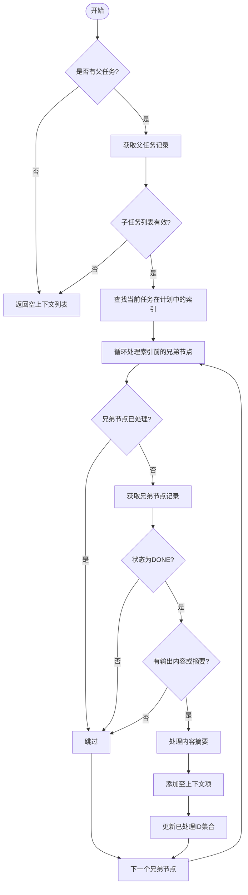
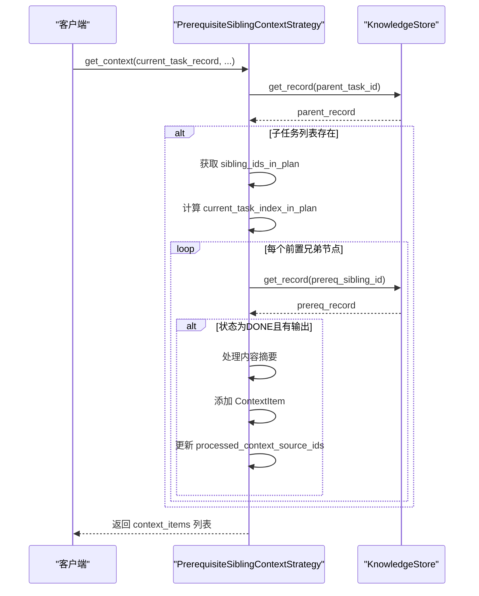
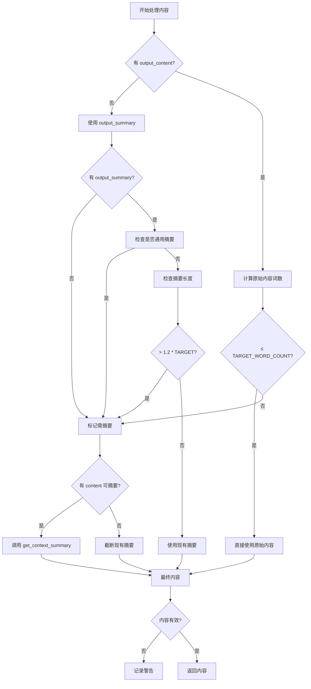

# 前置兄弟节点上下文策略

<cite>
**本文档中引用的文件**  
- [strategies.py](file://src/sentientresearchagent/hierarchical_agent_framework/context/strategies.py)
- [context_utils.py](file://src/sentientresearchagent/hierarchical_agent_framework/context/context_utils.py)
- [knowledge_store.py](file://src/sentientresearchagent/hierarchical_agent_framework/context/knowledge_store.py)
- [task_node.py](file://src/sentientresearchagent/hierarchical_agent_framework/node/task_node.py)
- [agent_io_models.py](file://src/sentientresearchagent/hierarchical_agent_framework/context/agent_io_models.py)
- [types.py](file://src/sentientresearchagent/hierarchical_agent_framework/types.py)
- [context_builder.py](file://src/sentientresearchagent/hierarchical_agent_framework/context/context_builder.py)
</cite>

## 目录
1. [引言](#引言)
2. [核心机制分析](#核心机制分析)
3. [兄弟关系链获取技术细节](#兄弟关系链获取技术细节)
4. [前置依赖范围确定逻辑](#前置依赖范围确定逻辑)
5. [内容摘要处理流程](#内容摘要处理流程)
6. [上下文连贯性价值](#上下文连贯性价值)
7. [调试方法说明](#调试方法说明)
8. [结论](#结论)

## 引言
`PrerequisiteSiblingContextStrategy` 是一个上下文解析策略，用于在分层智能体框架中为当前任务提供来自已完成的前置兄弟节点的上下文信息。该策略通过识别同一父节点下的子任务序列中位于当前任务之前的已完成兄弟节点，提取其输出内容作为上下文，从而支持线性执行流中的任务连续性和信息传递。

**Section sources**
- [strategies.py](file://src/sentientresearchagent/hierarchical_agent_framework/context/strategies.py#L231-L359)

## 核心机制分析
`PrerequisiteSiblingContextStrategy` 的核心功能是在 `get_context` 方法中实现的。该方法首先检查当前任务是否具有父任务，若无则直接返回空列表。随后从知识库（KnowledgeStore）中获取父任务记录，并验证其子任务 ID 列表是否存在且已生成。

一旦确认父任务及其子任务列表有效，策略会定位当前任务在其兄弟节点计划中的索引位置。然后遍历该索引之前的所有兄弟节点 ID，依次检查每个前置兄弟节点的状态和输出内容。只有当兄弟节点状态为“已完成”（DONE），并且存在输出内容或摘要时，才会将其纳入上下文项列表。

**Diagram sources**
- [strategies.py](file://src/sentientresearchagent/hierarchical_agent_framework/context/strategies.py#L231-L359)

**Section sources**
- [strategies.py](file://src/sentientresearchagent/hierarchical_agent_framework/context/strategies.py#L231-L359)

## 兄弟关系链获取技术细节
虽然 `PrerequisiteSiblingContextStrategy` 本身不直接调用 `get_task_record_path_to_root`，但该函数在其他上下文策略（如 `AncestorBranchContextStrategy`）中被使用，体现了系统级的兄弟关系链追踪能力。`get_task_record_path_to_root` 函数通过递归访问每个任务记录的 `parent_task_id` 字段，构建从指定任务到根节点的完整路径。

此过程采用迭代方式实现，避免了深度递归可能导致的栈溢出问题。函数设置了最大深度限制（默认为20层），以防止因循环引用或异常结构导致无限循环。每一步都从 `KnowledgeStore` 中查询对应的任务记录，并将其加入路径列表，最终返回从根到目标任务的逆序路径。

**Diagram sources**
- [strategies.py](file://src/sentientresearchagent/hierarchical_agent_framework/context/strategies.py#L231-L359)
- [context_utils.py](file://src/sentientresearchagent/hierarchical_agent_framework/context/context_utils.py#L10-L29)

**Section sources**
- [context_utils.py](file://src/sentientresearchagent/hierarchical_agent_framework/context/context_utils.py#L10-L29)

## 前置依赖范围确定逻辑
该策略通过以下步骤精确确定前置依赖范围：

1. **获取兄弟节点计划列表**：从父任务记录的 `child_task_ids_generated` 字段中读取所有子任务 ID 的有序列表。
2. **定位当前任务索引**：使用 Python 的 `list.index()` 方法查找当前任务 ID 在该列表中的位置。
3. **限定遍历范围**：仅对索引小于当前任务的所有兄弟节点进行处理，确保只包含“前置”任务。
4. **去重控制**：利用 `processed_context_source_ids` 集合防止重复处理同一来源。

这种基于索引位置的筛选机制保证了上下文获取的顺序一致性，符合线性执行模型的要求。同时，通过状态检查（`TaskStatus.DONE.value`）确保只有已完成的任务才被纳入上下文，避免了未完成任务带来的不确定性。

**Section sources**
- [strategies.py](file://src/sentientresearchagent/hierarchical_agent_framework/context/strategies.py#L231-L359)

## 内容摘要处理流程
对于每一个符合条件的前置兄弟节点，策略采用分级处理逻辑来生成最终的上下文内容：

1. **原始内容优先原则**：如果兄弟节点的 `output_content` 存在且字数不超过 `TARGET_WORD_COUNT_FOR_CTX_SUMMARIES`（默认约4000词），则直接使用原始内容。
2. **大内容自动摘要**：若原始内容过长，则调用 `get_context_summary` 函数生成摘要。
3. **摘要质量检测**：通过 `is_generic_summary` 函数判断现有摘要是否通用无意义（如“执行完成”、“计划已制定”等）。若是，则优先使用原始内容重新摘要。
4. **长度合规性检查**：即使已有摘要，也会检查其长度是否超出阈值1.2倍，若超限则重新摘要或截断。
5. **截断备用方案**：当无原始内容且摘要过长时，采取字符级截断（约7倍目标词数字符长度）作为最后手段。

整个流程旨在平衡信息完整性与上下文体积，确保传递给后续任务的信息既丰富又紧凑。

**Diagram sources**
- [strategies.py](file://src/sentientresearchagent/hierarchical_agent_framework/context/strategies.py#L231-L359)

**Section sources**
- [strategies.py](file://src/sentientresearchagent/hierarchical_agent_framework/context/strategies.py#L231-L359)

## 上下文连贯性价值
`PrerequisiteSiblingContextStrategy` 对于维持线性执行流的上下文连贯性具有关键作用：

- **信息延续性**：确保下游任务能够访问上游任务的成果，形成自然的知识流动。
- **减少重复工作**：避免后续任务重新获取已被前置任务处理过的数据。
- **增强决策依据**：为写作者、思考者类任务提供充分的历史背景支持。
- **支持模块化设计**：允许将复杂任务分解为多个有序子任务，各司其职又紧密关联。
- **提升整体效率**：通过精准的上下文供给，降低大模型的理解成本和推理开销。

该策略特别适用于需要逐步推进的场景，例如撰写报告、执行研究计划或多步推理任务，在这些场景中任务间的前后依赖关系尤为明显。

**Section sources**
- [strategies.py](file://src/sentientresearchagent/hierarchical_agent_framework/context/strategies.py#L231-L359)

## 调试方法说明
当出现兄弟节点上下文获取异常时，可通过以下日志信息进行排查：

- **ValueError 异常**：表示当前任务 ID 未在父任务的 `child_task_ids_generated` 列表中找到，可能原因包括任务生成逻辑错误或父子关系配置失误。
- **记录未找到警告**：提示特定任务 ID 在 `KnowledgeStore` 中不存在，应检查任务注册流程是否完整。
- **状态不匹配警告**：指出依赖任务未达到 `DONE` 状态，需确认执行调度是否正确。
- **空内容警告**：表明摘要处理后结果为空，需审查原始内容质量和摘要算法。
- **通用摘要绕过日志**：显示系统检测到低质量摘要并尝试替换，可用于优化摘要生成规则。

此外，启用详细日志级别可观察到每一步的处理决策，例如“used original output_content directly”或“summarized output_content”，帮助定位性能瓶颈或逻辑偏差。

**Section sources**
- [strategies.py](file://src/sentientresearchagent/hierarchical_agent_framework/context/strategies.py#L231-L359)

## 结论
`PrerequisiteSiblingContextStrategy` 是一个高效且鲁棒的上下文管理组件，它通过索引定位和状态过滤机制，精准提取同一父节点下已完成的前置兄弟节点上下文。结合智能的内容摘要处理逻辑，该策略在保障信息完整性的同时优化了上下文体积。其设计充分考虑了实际运行中的各种边界情况，并提供了详尽的日志支持，便于调试与维护。该策略是实现任务间有序协作和知识传承的核心机制之一。