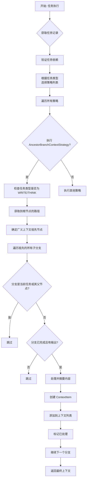
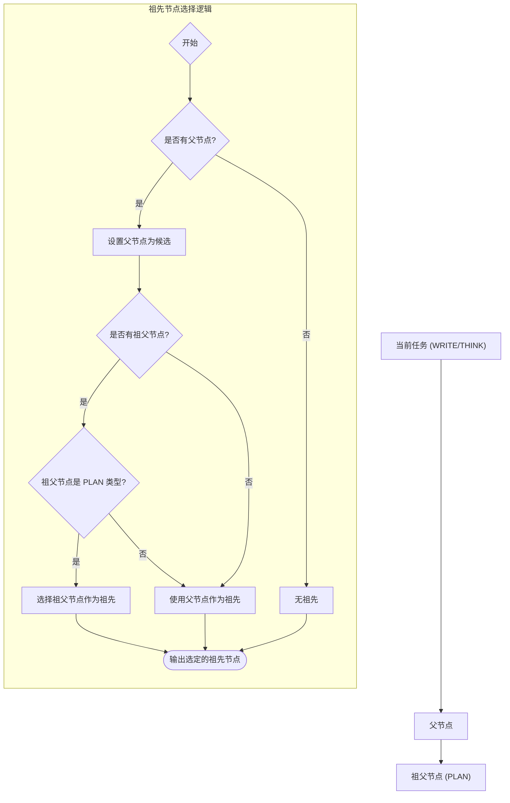
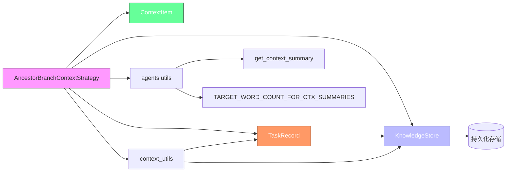

# 祖先分支上下文策略

<cite>
**Referenced Files in This Document **   
- [strategies.py](file://src\sentientresearchagent\hierarchical_agent_framework\context\strategies.py)
- [context_builder.py](file://src\sentientresearchagent\hierarchical_agent_framework\context\context_builder.py)
- [context_utils.py](file://src\sentientresearchagent\hierarchical_agent_framework\context\context_utils.py)
- [knowledge_store.py](file://src\sentientresearchagent\hierarchical_agent_framework\context\knowledge_store.py)
- [agent_io_models.py](file://src\sentientresearchagent\hierarchical_agent_framework\context\agent_io_models.py)
</cite>

## Table of Contents
1. [引言](#引言)
2. [核心组件分析](#核心组件分析)
3. [架构与工作流程](#架构与工作流程)
4. [详细技术实现](#详细技术实现)
5. [依赖关系分析](#依赖关系分析)
6. [最佳实践建议](#最佳实践建议)
7. [结论](#结论)

## 引言
`AncestorBranchContextStrategy` 是一个专为 `WRITE` 和 `THINK` 类型任务设计的上下文解析策略，旨在通过提供广义的祖先分支上下文来增强智能体的推理深度。该策略通过沿任务路径向上追溯至祖父级 `PLAN` 节点，并聚合其已完成的兄弟分支输出，为当前任务构建更全面的背景信息。本文档将深入解析其应用场景、技术实现机制以及优化建议。

## 核心组件分析

`AncestorBranchContextStrategy` 的核心功能是为特定类型的任务提供来自项目历史中更广泛分支的上下文信息。它作为 `ContextResolutionStrategy` 抽象基类的具体实现，专门服务于需要宏观视角和综合信息的写入（`WRITE`）和思考（`THINK`）任务。

**Section sources**
- [strategies.py](file://src\sentientresearchagent\hierarchical_agent_framework\context\strategies.py#L362-L500)

## 架构与工作流程

### 上下文解析系统架构
整个上下文解析系统由多个策略协同工作，`AncestorBranchContextStrategy` 是其中关键的一环。当一个新任务需要执行时，系统会调用 `resolve_context_for_agent` 函数，根据任务类型选择一组预定义的上下文解析策略进行顺序执行。



**Diagram sources **
- [context_builder.py](file://src\sentientresearchagent\hierarchical_agent_framework\context\context_builder.py#L180-L292)
- [strategies.py](file://src\sentientresearchagent\hierarchical_agent_framework\context\strategies.py#L362-L500)

### 策略优先级与任务类型映射
系统通过 `TASK_TYPE_STRATEGY_MAPPING` 配置字典来管理不同任务类型的上下文策略。对于 `WRITE` 和 `THINK` 任务，`AncestorBranchContextStrategy` 被明确包含在策略链中，确保了这些任务能够获得所需的广义上下文。

```mermaid
classDiagram
class TASK_TYPE_STRATEGY_MAPPING {
+Dict[str, List[ContextResolutionStrategy]]
"WRITE" : [
DependencyContextStrategy,
PrerequisiteSiblingContextStrategy,
AncestorBranchContextStrategy,
GoalReferenceContextStrategy
]
"THINK" : [
DependencyContextStrategy,
PrerequisiteSiblingContextStrategy,
AncestorBranchContextStrategy,
GoalReferenceContextStrategy
]
}
class ContextResolutionStrategy {
<<interface>>
+get_context(current_task_record, knowledge_store, processed_context_source_ids) List[ContextItem]
}
class AncestorBranchContextStrategy {
-current_task_type : str
-path_to_root : List[TaskRecord]
-ancestor_for_broad_context : TaskRecord
+get_context(...) List[ContextItem]
}
ContextResolutionStrategy <|-- AncestorBranchContextStrategy
TASK_TYPE_STRATEGY_MAPPING ..> AncestorBranchContextStrategy : 包含
```

**Diagram sources **
- [context_builder.py](file://src\sentientresearchagent\hierarchical_agent_framework\context\context_builder.py#L38-L77)
- [strategies.py](file://src\sentientresearchagent\hierarchical_agent_framework\context\strategies.py#L362-L500)

## 详细技术实现

### 设计目的与应用场景
`AncestorBranchContextStrategy` 的设计目的是为 `WRITE` 和 `THINK` 类型的任务提供超越直接父节点和兄弟节点的“广义上下文”（Broad Context）。这类任务通常需要整合项目中分散但相关的知识，例如撰写报告的某个章节时，了解其他已完成章节的内容可以避免重复并保持风格一致。

**Section sources**
- [strategies.py](file://src\sentientresearchagent\hierarchical_agent_framework\context\strategies.py#L363-L364)

### 祖先节点追溯机制
该策略的核心在于其追溯机制。它首先使用 `get_task_record_path_to_root` 工具函数，从当前任务ID出发，沿着 `parent_task_id` 链接逐级向上，构建一条通往根节点的任务记录路径。

*   **第一层追溯**: 如果存在父节点，则将其视为潜在的广义上下文来源。
*   **第二层追溯 (祖父级)**: 如果存在祖父节点，并且该节点是一个 `PLAN` 类型的任务，则优先选择祖父节点作为广义上下文的祖先。这使得策略能够跨越单个计划层级，获取更高层次的规划背景。



**Diagram sources **
- [strategies.py](file://src\sentientresearchagent\hierarchical_agent_framework\context\strategies.py#L374-L384)
- [context_utils.py](file://src\sentientresearchagent\hierarchical_agent_framework\context\context_utils.py#L10-L29)

### 分支遍历与去重机制
一旦确定了祖先节点，策略会遍历该祖先节点下的所有已完成的子分支（即 `child_task_ids_generated` 列表中的任务），但会排除两个特定情况以避免冗余：
1.  **排除自身**: 不包含当前正在请求上下文的任务本身。
2.  **排除直接父节点**: 不包含当前任务的直接父节点，因为其内容可能已在其他策略（如 `PrerequisiteSiblingContextStrategy`）中被处理。

此外，系统还维护了一个 `processed_context_source_ids` 集合，用于跟踪所有已被任何策略处理过的任务ID。如果某个祖先分支的ID已在此集合中，该分支将被跳过，从而实现了全局的上下文去重。

**Section sources**
- [strategies.py](file://src\sentientresearchagent\hierarchical_agent_framework\context\strategies.py#L387-L395)

### 特殊内容类型标记规则
在生成 `ContextItem` 时，该策略会根据源任务的属性动态设置 `content_type_description` 字段。默认情况下，它被标记为 `"ancestor_branch_output"`。然而，有一个特殊的标记规则：如果源任务是一个 `PLAN` 类型的任务，并且其 `output_type_description` 字段（或描述）中包含 "aggregate" 关键词，则 `content_type_description` 会被特别标记为 `"aggregated_ancestor_branch_output"`。这一规则有助于下游智能体识别出这是经过汇总的、更高层次的综合性信息。

**Section sources**
- [strategies.py](file://src\sentientresearchagent\hierarchical_agent_framework\context\strategies.py#L404-L410)

### 内容摘要与优化
为了平衡信息量和计算开销，该策略对获取到的上下文内容进行了智能处理。它会优先尝试使用原始的 `output_content`，但如果其长度超过预设阈值 `TARGET_WORD_COUNT_FOR_CTX_SUMMARIES`，则会调用 `get_context_summary` 工具对其进行摘要。如果原始内容为空，则使用 `output_summary`，并同样检查其长度和质量（避免使用通用的、无意义的摘要）。这种机制确保了上下文既丰富又精炼。

**Section sources**
- [strategies.py](file://src\sentientresearchagent\hierarchical_agent_framework\context\strategies.py#L412-L460)

## 依赖关系分析

`AncestorBranchContextStrategy` 的正常运行依赖于多个核心组件和数据结构。



**Diagram sources **
- [strategies.py](file://src\sentientresearchagent\hierarchical_agent_framework\context\strategies.py)
- [knowledge_store.py](file://src\sentientresearchagent\hierarchical_agent_framework\context\knowledge_store.py)
- [agent_io_models.py](file://src\sentientresearchagent\hierarchical_agent_framework\context\agent_io_models.py)

**Section sources**
- [strategies.py](file://src\sentientresearchagent\hierarchical_agent_framework\context\strategies.py#L1-L500)
- [context_utils.py](file://src\sentientresearchagent\hierarchical_agent_framework\context\context_utils.py#L10-L29)

## 最佳实践建议

为了最大化 `AncestorBranchContextStrategy` 的效用，建议遵循以下最佳实践：

1.  **合理规划任务层级**: 在设计任务图谱时，应有意地将相关的 `WRITE` 或 `THINK` 任务组织在同一个高层级 `PLAN` 节点之下。这样，它们就能共享同一个有效的祖先节点，从而获得彼此的上下文。
2.  **规范输出描述**: 对于那些产生综合性结果的 `PLAN` 节点，应在 `output_type_description` 中明确包含 "aggregate" 等关键词。这能帮助策略正确地标记其为 `"aggregated_ancestor_branch_output"`，使下游智能体能更好地利用此类信息。
3.  **监控上下文大小**: 虽然策略内置了摘要机制，但仍需关注 `output_content` 的原始大小。过于庞大的输出可能会增加摘要过程的开销。建议在任务执行过程中，对长篇内容进行合理的分块处理。
4.  **理解策略优先级**: 记住 `AncestorBranchContextStrategy` 并非孤立工作。它的输出会与其他策略（如 `DependencyContextStrategy`）的结果合并。因此，在编写任务目标时，对于最关键的依赖，应使用显式引用（如 `task_id`）来确保其通过高优先级的策略被引入。

## 结论
`AncestorBranchContextStrategy` 是一个强大的上下文增强工具，它通过智能地追溯和聚合祖先分支的信息，显著提升了 `WRITE` 和 `THINK` 任务的推理能力和信息整合水平。其精心设计的追溯逻辑、去重机制和内容优化策略，共同确保了在提供广义上下文的同时，维持了系统的高效与稳定。理解和善用此策略，是构建复杂、连贯的多智能体协作系统的关键。