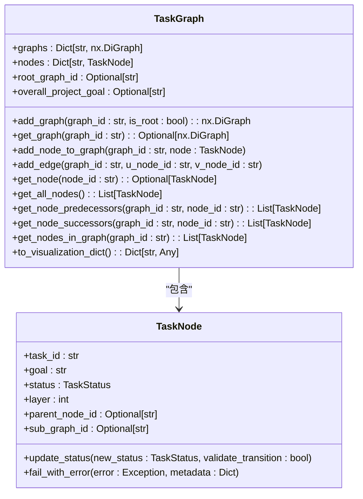
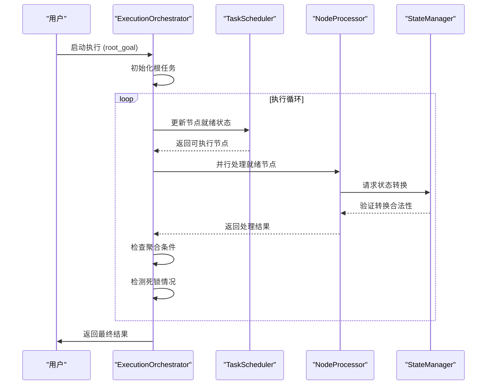
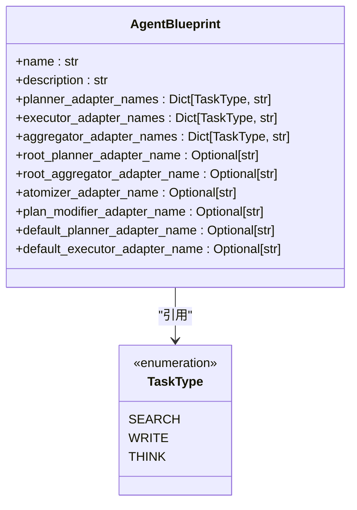
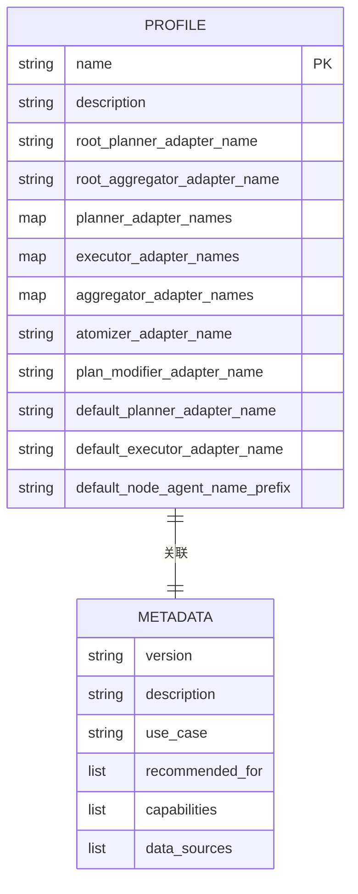
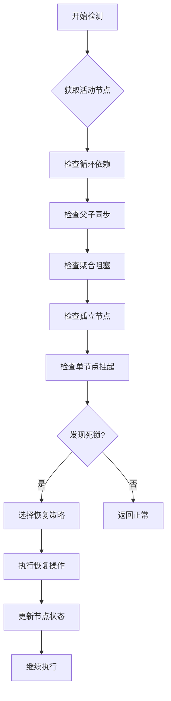

# 代理框架

<cite>
**本文档引用的文件**
- [task_graph.py](file://src\sentientresearchagent\hierarchical_agent_framework\graph\task_graph.py)
- [execution_orchestrator.py](file://src\sentientresearchagent\hierarchical_agent_framework\orchestration\execution_orchestrator.py)
- [agent_blueprints.py](file://src\sentientresearchagent\hierarchical_agent_framework\agent_blueprints.py)
- [crypto_analytics_agent.yaml](file://src\sentientresearchagent\hierarchical_agent_framework\agent_configs\profiles\crypto_analytics_agent.yaml)
- [deadlock_detector.py](file://src\sentientresearchagent\hierarchical_agent_framework\orchestration\deadlock_detector.py)
- [recovery_manager.py](file://src\sentientresearchagent\hierarchical_agent_framework\orchestration\recovery_manager.py)
</cite>

## 目录
1. [引言](#引言)
2. [任务图构建与执行](#任务图构建与执行)
3. [执行编排器工作原理](#执行编排器工作原理)
4. [代理蓝图设计](#代理蓝图设计)
5. [代理配置文件解析](#代理配置文件解析)
6. [自定义代理开发指南](#自定义代理开发指南)
7. [高级特性：死锁检测与恢复](#高级特性：死锁检测与恢复)
8. [结论](#结论)

## 引言
本专项文档深入讲解分层代理框架作为ROMA智能核心的工作原理。该框架通过任务图、执行编排器和代理蓝图三大核心组件，实现复杂任务的自动化分解与执行。系统采用层次化结构，将主目标分解为子任务，并通过状态机管理各节点的生命周期。整个架构支持动态规划、并行执行和智能恢复，确保在面对复杂问题时能够持续稳定运行。

## 任务图构建与执行
任务图是分层代理框架的核心数据结构，负责组织和管理所有任务节点及其依赖关系。`TaskGraph`类使用NetworkX库构建有向无环图（DAG），每个节点代表一个具体的任务单元。

**图表来源**
- [task_graph.py](file://src\sentientresearchagent\hierarchical_agent_framework\graph\task_graph.py#L0-L138)

**本节来源**
- [task_graph.py](file://src\sentientresearchagent\hierarchical_agent_framework\graph\task_graph.py#L0-L138)

## 执行编排器工作原理
执行编排器（ExecutionOrchestrator）是系统的控制中枢，协调计划、执行、聚合等处理器的工作流程。它采用事件驱动架构，在每个执行周期检查节点状态变化，并触发相应的处理逻辑。

**图表来源**
- [execution_orchestrator.py](file://src\sentientresearchagent\hierarchical_agent_framework\orchestration\execution_orchestrator.py#L0-L799)

**本节来源**
- [execution_orchestrator.py](file://src\sentientresearchagent\hierarchical_agent_framework\orchestration\execution_orchestrator.py#L0-L799)

## 代理蓝图设计
代理蓝图（AgentBlueprint）定义了不同类型代理的行为模式，包括规划者、执行者和聚合者的适配器映射。每种代理类型都有针对不同任务类型的专用处理器。

**图表来源**
- [agent_blueprints.py](file://src\sentientresearchagent\hierarchical_agent_framework\agent_blueprints.py#L0-L202)

**本节来源**
- [agent_blueprints.py](file://src\sentientresearchagent\hierarchical_agent_framework\agent_blueprints.py#L0-L202)

## 代理配置文件解析
代理配置文件采用YAML格式，结构清晰且易于扩展。以`crypto_analytics_agent.yaml`为例，配置文件分为profile和metadata两大部分，分别定义行为参数和元数据信息。

**图表来源**
- [crypto_analytics_agent.yaml](file://src\sentientresearchagent\hierarchical_agent_framework\agent_configs\profiles\crypto_analytics_agent.yaml#L0-L70)

**本节来源**
- [crypto_analytics_agent.yaml](file://src\sentientresearchagent\hierarchical_agent_framework\agent_configs\profiles\crypto_analytics_agent.yaml#L0-L70)

## 自定义代理开发指南
要创建新的代理类型，首先需要定义对应的代理蓝图，然后编写相应的配置文件。以下步骤展示了如何扩展系统功能：

1. **定义新蓝图**：在`agent_blueprints.py`中添加新的`AgentBlueprint`实例
2. **创建配置文件**：在`profiles/`目录下新建YAML文件
3. **实现适配器**：开发对应的规划者、执行者等处理器
4. **注册到系统**：确保新代理被正确加载和识别

对于修改现有代理的提示词，只需更新相应模块中的prompt定义即可。例如，要调整加密分析代理的搜索提示，可以修改`searcher_prompts.py`中相关的模板字符串。

**本节来源**
- [agent_blueprints.py](file://src\sentientresearchagent\hierarchical_agent_framework\agent_blueprints.py#L0-L202)
- [crypto_analytics_agent.yaml](file://src\sentientresearchagent\hierarchical_agent_framework\agent_configs\profiles\crypto_analytics_agent.yaml#L0-L70)

## 高级特性：死锁检测与恢复
系统内置了完善的死锁检测与恢复机制，确保长时间运行的稳定性。`DeadlockDetector`类实现了多种死锁模式的识别算法，而`RecoveryManager`则提供相应的恢复策略。

主要死锁模式包括：
- **循环依赖**：通过DFS检测环路并打破循环
- **父子同步失败**：修复父节点与子图的引用关系
- **聚合阻塞**：强制完成已满足条件的聚合节点
- **孤立节点**：重新激活因父节点异常而停滞的子节点
- **单节点挂起**：对长时间运行的节点强制重规划

**图表来源**
- [deadlock_detector.py](file://src\sentientresearchagent\hierarchical_agent_framework\orchestration\deadlock_detector.py#L0-L559)
- [recovery_manager.py](file://src\sentientresearchagent\hierarchical_agent_framework\orchestration\recovery_manager.py#L0-L487)

**本节来源**
- [deadlock_detector.py](file://src\sentientresearchagent\hierarchical_agent_framework\orchestration\deadlock_detector.py#L0-L559)
- [recovery_manager.py](file://src\sentientresearchagent\hierarchical_agent_framework\orchestration\recovery_manager.py#L0-L487)

## 结论
分层代理框架通过精心设计的任务图、执行编排器和代理蓝图三大组件，构建了一个强大而灵活的智能系统。其层次化任务分解能力使得复杂问题得以系统性解决，而先进的死锁检测与恢复机制则保证了系统的健壮性和可靠性。通过标准化的配置文件和模块化的架构，开发者可以轻松定制和扩展各种专业领域的代理类型，满足多样化的应用需求。