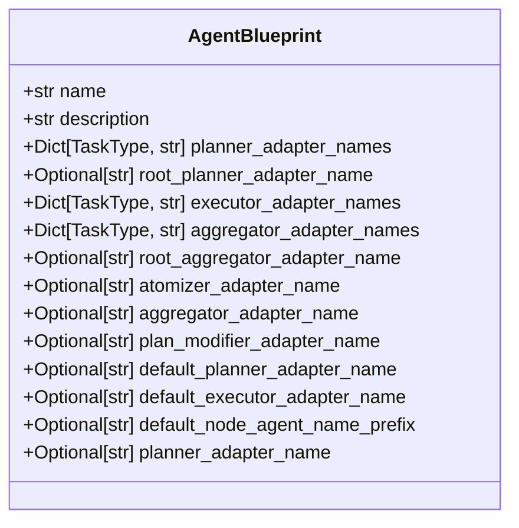

# 代理蓝图定义

<cite>
**本文档中引用的文件**  
- [agent_blueprints.py](file://src/sentientresearchagent/hierarchical_agent_framework/agent_blueprints.py)
- [types.py](file://src/sentientresearchagent/hierarchical_agent_framework/types.py)
- [profile_loader.py](file://src/sentientresearchagent/hierarchical_agent_framework/agent_configs/profile_loader.py)
- [crypto_analytics_agent.yaml](file://src/sentientresearchagent/hierarchical_agent_framework/agent_configs/profiles/crypto_analytics_agent.yaml)
- [deep_research_agent.yaml](file://src/sentientresearchagent/hierarchical_agent_framework/agent_configs/profiles/deep_research_agent.yaml)
</cite>

## 目录
1. [引言](#引言)  
2. [AgentBlueprint 类结构解析](#agentblueprint-类结构解析)  
3. [关键字段语义与使用场景](#关键字段语义与使用场景)  
4. [默认蓝图实例分析](#默认蓝图实例分析)  
5. [节点命名机制说明](#节点命名机制说明)  
6. [自定义蓝图编程接口](#自定义蓝图编程接口)  
7. [已弃用函数说明](#已弃用函数说明)

## 引言
`AgentBlueprint` 是代理行为配置的核心类，用于定义不同类型任务中各组件（如规划器、执行器、聚合器等）的行为映射。通过该蓝图机制，系统能够根据任务类型和节点层级动态选择合适的适配器实现，从而支持高度可定制化的智能代理架构。

## AgentBlueprint 类结构解析

`AgentBlueprint` 类继承自 Pydantic 的 `BaseModel`，提供强类型的配置验证能力。其设计目标是支持任务特定的规划器、执行器与聚合器，并引入根节点专用的规划与聚合逻辑，以增强对复杂任务分解与结果合成过程的控制力。



**图示来源**  
- [agent_blueprints.py](file://src/sentientresearchagent/hierarchical_agent_framework/agent_blueprints.py#L11-L42)

**本节来源**  
- [agent_blueprints.py](file://src/sentientresearchagent/hierarchical_agent_framework/agent_blueprints.py#L11-L42)

## 关键字段语义与使用场景

### root_planner_adapter_name
指定用于根节点（root node）的专用规划器名称。当任务首次被提交时，根节点负责整体任务的初始分解。此字段允许为顶层任务分配一个专门优化的规划器，而不受子任务规划策略的影响。

例如，在深度研究任务中，`DeepResearchPlanner` 被设为根规划器，专注于高层次的任务拆解与资源调度。

### planner_adapter_names
字典结构，将 `TaskType` 映射到对应的规划器适配器名称。不同类型的子任务可使用不同的规划策略：
- `SEARCH`: 使用 `CryptoSearchPlanner` 进行数据检索路径规划
- `WRITE`: 使用 `CryptoAnalyticsPlanner` 规划报告生成流程
- `THINK`: 同样由 `CryptoAnalyticsPlanner` 处理分析类任务

这种细粒度控制提升了系统在多模态任务中的灵活性。

### executor_adapter_names
定义每种任务类型所使用的执行器适配器。例如：
- `SEARCH` → `OpenAICustomSearcher`
- `THINK` → `CryptoMarketAnalyzer`
- `WRITE` → `CryptoResearchExecutor`

这些映射确保了具体操作由最合适的工具或模型完成。

### aggregator_adapter_names
针对不同类型的任务输出，采用相应的聚合策略：
- `SEARCH` 结果由 `CryptoAnalyticsAggregator` 整合
- `THINK` 分析结果也通过同一聚合器进行综合判断
- `WRITE` 报告内容则可能涉及格式统一与风格一致性处理

此外，`root_aggregator_adapter_name` 可指定最终结果合成所用的聚合器，如 `CryptoRootAggregator`，用于生成面向用户的高层摘要。

**本节来源**  
- [agent_blueprints.py](file://src/sentientresearchagent/hierarchical_agent_framework/agent_blueprints.py#L11-L42)
- [types.py](file://src/sentientresearchagent/hierarchical_agent_framework/types.py#L35-L45)

## 默认蓝图实例分析

### DEFAULT_CRYPTO_ANALYTICS_BLUEPRINT
专为加密货币与去中心化金融（DeFi）分析设计的蓝图，具备以下特征：
- **根规划器**：`CryptoAnalyticsPlanner`，擅长将宏观市场问题拆分为价格趋势、链上指标、协议经济等多个维度
- **任务级执行器**：集成 `CoinGecko`、`DefiLlama` 等数据源的专用执行器
- **聚合策略**：所有子任务均使用 `CryptoAnalyticsAggregator`，保证分析口径一致
- **命名前缀**：`default_node_agent_name_prefix = "CryptoAnalytics"`，便于追踪日志与调试

该蓝图适用于代币深度调研、DeFi 协议评估、市场情绪分析等场景。

### DEFAULT_DEEP_RESEARCH_BLUEPRINT
面向综合性研究任务的通用蓝图，特点包括：
- **根规划器**：`DeepResearchPlanner`，强调长期记忆与跨文档推理能力
- **搜索规划器**：`EnhancedSearchPlanner`，支持时间敏感性查询与信源可信度排序
- **执行链路**：结合 `OpenAICustomSearcher` 与 `BasicReasoningExecutor` 实现“查-思-写”闭环
- **聚合分工**：`SearchAggregator`、`ThinkAggregator`、`WriteAggregator` 各司其职，提升中间结果质量

适合学术研究、事实核查、技术调查等需要多轮迭代的任务。

**图示来源**  
- [crypto_analytics_agent.yaml](file://src/sentientresearchagent/hierarchical_agent_framework/agent_configs/profiles/crypto_analytics_agent.yaml)
- [deep_research_agent.yaml](file://src/sentientresearchagent/hierarchical_agent_framework/agent_configs/profiles/deep_research_agent.yaml)

**本节来源**  
- [agent_blueprints.py](file://src/sentientresearchagent/hierarchical_agent_framework/agent_blueprints.py#L45-L175)
- [crypto_analytics_agent.yaml](file://src/sentientresearchagent/hierarchical_agent_framework/agent_configs/profiles/crypto_analytics_agent.yaml)
- [deep_research_agent.yaml](file://src/sentientresearchagent/hierarchical_agent_framework/agent_configs/profiles/deep_research_agent.yaml)

## 节点命名机制说明

`default_node_agent_name_prefix` 字段定义了在未显式指定代理名称时，系统自动为节点生成代理名的默认前缀。例如，若前缀为 `"CryptoAnalytics"`，则：
- 规划器自动命名为 `CryptoAnalyticsPlanner`
- 执行器自动命名为 `CryptoAnalyticsExecutor`
- 聚合器自动命名为 `CryptoAnalyticsAggregator`

这一机制不仅减少了配置冗余，还增强了日志可读性和调试效率。系统在查找适配器时会优先尝试基于前缀构造的名称，作为回退策略的一部分。

**本节来源**  
- [agent_blueprints.py](file://src/sentientresearchagent/hierarchical_agent_framework/agent_blueprints.py#L38)
- [services/agent_selector.py](file://src/sentientresearchagent/hierarchical_agent_framework/services/agent_selector.py#L210-L234)

## 自定义蓝图编程接口

用户可通过直接实例化 `AgentBlueprint` 创建自定义蓝图：

```python
from sentientresearchagent.hierarchical_agent_framework.agent_blueprints import AgentBlueprint
from sentientresearchagent.hierarchical_agent_framework.types import TaskType

custom_blueprint = AgentBlueprint(
    name="MyCustomAgent",
    description="A custom agent for financial forecasting",
    root_planner_adapter_name="FinancialForecastPlanner",
    planner_adapter_names={
        TaskType.SEARCH: "DataCollectionPlanner",
        TaskType.THINK: "TrendAnalysisPlanner",
        TaskType.WRITE: "ReportGenerationPlanner"
    },
    executor_adapter_names={
        TaskType.SEARCH: "MarketDataFetcher",
        TaskType.THINK: "StatisticalModelRunner",
        TaskType.WRITE: "NarrativeWriter"
    },
    default_node_agent_name_prefix="FinancialAgent"
)
```

创建后，该蓝图可在项目初始化时传入 `NodeProcessor` 或通过配置文件加载。

**本节来源**  
- [agent_blueprints.py](file://src/sentientresearchagent/hierarchical_agent_framework/agent_blueprints.py#L11-L42)
- [node/node_processor.py](file://src/sentientresearchagent/hierarchical_agent_framework/node/node_processor.py#L76-L103)

## 已弃用函数说明

`get_blueprint_by_name(profile_name: str)` 函数已被标记为**弃用**。由于其存在于 `agent_blueprints.py` 中会导致与 `profile_loader.py` 的循环依赖问题，因此不再推荐使用。

### 推荐替代方式
应使用 `ProfileLoader` 类进行蓝图加载：

```python
from sentientresearchagent.hierarchical_agent_framework.agent_configs.profile_loader import ProfileLoader

loader = ProfileLoader()
blueprint = loader.load_profile("crypto_analytics_agent")
```

或批量加载所有可用蓝图：

```python
all_blueprints = loader.load_all_profiles()
```

此方法解耦了配置加载逻辑，提高了模块间的独立性与可测试性。

**本节来源**  
- [agent_blueprints.py](file://src/sentientresearchagent/hierarchical_agent_framework/agent_blueprints.py#L177-L201)
- [profile_loader.py](file://src/sentientresearchagent/hierarchical_agent_framework/agent_configs/profile_loader.py#L123-L144)