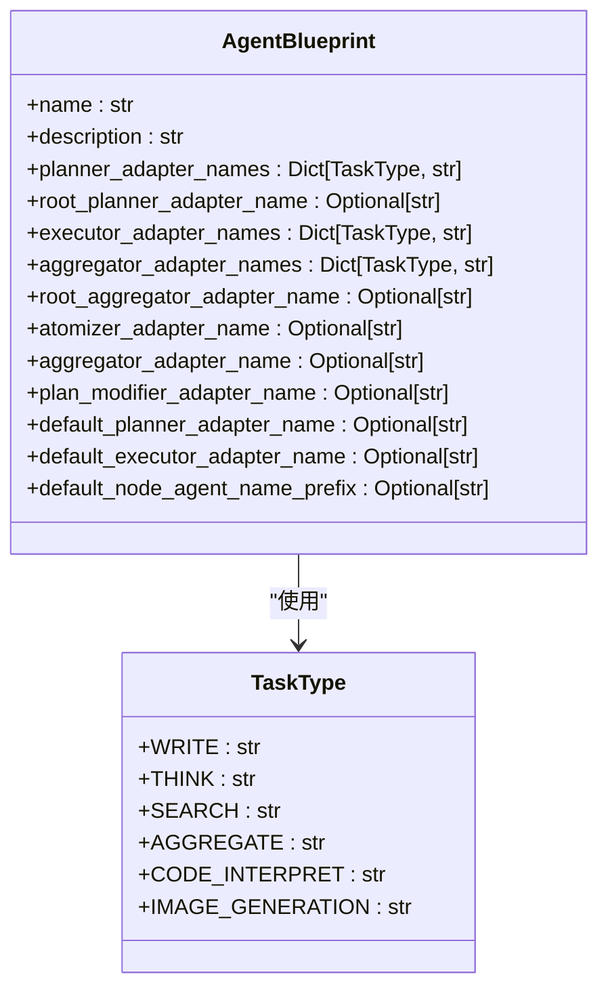
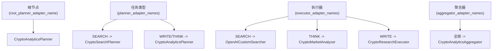

# 代理配置

<cite>
**本文档中引用的文件**
- [crypto_analytics_agent.yaml](file://src\sentientresearchagent\hierarchical_agent_framework\agent_configs\profiles\crypto_analytics_agent.yaml)
- [agent_blueprints.py](file://src\sentientresearchagent\hierarchical_agent_framework\agent_blueprints.py)
- [profile_loader.py](file://src\sentientresearchagent\hierarchical_agent_framework\agent_configs\profile_loader.py)
- [models.py](file://src\sentientresearchagent\hierarchical_agent_framework\agent_configs\models.py)
- [types.py](file://src\sentientresearchagent\hierarchical_agent_framework\types.py)
</cite>

## 目录
1. [引言](#引言)
2. [核心配置结构解析](#核心配置结构解析)
3. [DEFAULT_CRYPTO_ANALYTICS_BLUEPRINT 配置详解](#default_crypto_analytics_blueprint-配置详解)
4. [规划器适配器路由机制](#规划器适配器路由机制)
5. [执行与聚合阶段的调度策略](#执行与聚合阶段的调度策略)
6. [后备机制的设计考量](#后备机制的设计考量)
7. [自定义代理行为模式](#自定义代理行为模式)
8. [蓝图加载方式与弃用说明](#蓝图加载方式与弃用说明)
9. [创建金融分析代理配置示例](#创建金融分析代理配置示例)
10. [结论](#结论)

## 引言
本指南旨在全面解析代理蓝图（AgentBlueprint）的配置体系，重点以 `DEFAULT_CRYPTO_ANALYTICS_BLUEPRINT` 为例，深入探讨其在复杂任务处理中的角色分配与调度逻辑。通过理解根节点专用规划器、任务类型路由、执行与聚合调度以及后备机制等核心概念，用户将能够根据特定需求自定义和创建高效的代理配置。

**Section sources**
- [agent_blueprints.py](file://src\sentientresearchagent\hierarchical_agent_framework\agent_blueprints.py#L1-L50)

## 核心配置结构解析
代理蓝图（AgentBlueprint）是定义代理行为的核心数据模型，它通过一系列映射关系精确控制不同任务阶段所使用的具体适配器。其主要组成部分包括：
- **planner_adapter_names**: 字典，按 `TaskType` 映射到不同的规划适配器。
- **root_planner_adapter_name**: 字符串，为根节点指定专用的规划适配器。
- **executor_adapter_names**: 字典，按 `TaskType` 映射到不同的执行适配器。
- **aggregator_adapter_names**: 字典，按 `TaskType` 映射到不同的聚合适配器。
- **default_*_adapter_name**: 各类适配器的默认名称，在未找到精确匹配时作为后备方案。



**Diagram sources**
- [agent_blueprints.py](file://src\sentientresearchagent\hierarchical_agent_framework\agent_blueprints.py#L11-L42)
- [types.py](file://src\sentientresearchagent\hierarchical_agent_framework\types.py#L35-L45)

**Section sources**
- [agent_blueprints.py](file://src\sentientresearchagent\hierarchical_agent_framework\agent_blueprints.py#L11-L42)
- [types.py](file://src\sentientresearchagent\hierarchical_agent_framework\types.py#L35-L45)

## DEFAULT_CRYPTO_ANALYTICS_BLUEPRINT 配置详解
`DEFAULT_CRYPTO_ANALYTICS_BLUEPRINT` 是一个专为加密货币和DeFi分析设计的预设蓝图。它展示了如何通过精细化的配置来优化特定领域的任务处理流程。



**Diagram sources**
- [agent_blueprints.py](file://src\sentientresearchagent\hierarchical_agent_framework\agent_blueprints.py#L129-L169)

**Section sources**
- [agent_blueprints.py](file://src\sentientresearchagent\hierarchical_agent_framework\agent_blueprints.py#L129-L169)
- [crypto_analytics_agent.yaml](file://src\sentientresearchagent\hierarchical_agent_framework\agent_configs\profiles\crypto_analytics_agent.yaml#L1-L70)

## 规划器适配器路由机制
规划器的路由遵循严格的优先级顺序，确保了从宏观到微观的精准控制。

### 根节点专用规划器
`root_planner_adapter_name` 字段为整个任务树的根节点指定了一个专用的规划器。无论 `planner_adapter_names` 如何配置，根节点的初始任务分解都将由该字段指定的规划器（如 `CryptoAnalyticsPlanner`）负责。这保证了项目启动时采用最合适的、针对整体目标优化的分解策略。

### 按任务类型路由
`planner_adapter_names` 字典实现了细粒度的路由。当非根节点需要进行规划时，系统会查询此字典，根据当前节点的 `TaskType` 来选择具体的规划器。
例如，在 `DEFAULT_CRYPTO_ANALYTICS_BLUEPRINT` 中：
- 当 `TaskType.SEARCH` 时，使用 `CryptoSearchPlanner`，它可能更擅长生成针对实时市场数据的搜索查询。
- 当 `TaskType.WRITE` 或 `TaskType.THINK` 时，使用 `CryptoAnalyticsPlanner`，它可能专注于报告撰写或市场策略分析。

这种设计允许框架根据不同任务的特点调用最专业的规划专家。

**Section sources**
- [agent_blueprints.py](file://src\sentientresearchagent\hierarchical_agent_framework\agent_blueprints.py#L129-L169)
- [crypto_analytics_agent.yaml](file://src\sentientresearchagent\hierarchical_agent_framework\agent_configs\profiles\crypto_analytics_agent.yaml#L15-L21)

## 执行与聚合阶段的调度策略
执行和聚合阶段的调度逻辑与规划阶段类似，均通过字典映射实现。

### 执行器调度 (executor_adapter_names)
`executor_adapter_names` 字典决定了不同类型的任务由哪个执行器来完成。
- `TaskType.SEARCH` 调用 `OpenAICustomSearcher` 进行网络搜索。
- `TaskType.THINK` 调用 `CryptoMarketAnalyzer` 进行技术分析和链上数据分析。
- `TaskType.WRITE` 调用 `CryptoResearchExecutor` 生成综合研究报告。

这种分离使得每个执行器可以高度专业化，从而提高单个任务的执行质量和效率。

### 聚合器调度 (aggregator_adapter_names)
`aggregator_adapter_names` 字典控制着结果的汇总过程。当一个父节点需要将其子节点的结果聚合成最终输出时，系统会根据父节点的 `TaskType` 查找对应的聚合器。
在 `DEFAULT_CRYPTO_ANALYTICS_BLUEPRINT` 中，所有类型的聚合都使用 `CryptoAnalyticsAggregator`，这表明该场景下采用了统一的、强大的聚合逻辑来处理各种来源的数据。

此外，`root_aggregator_adapter_name` 为根节点的最终结果合成提供了专用的聚合器（`CryptoRootAggregator`），确保最终交付物符合最高标准。

**Section sources**
- [agent_blueprints.py](file://src\sentientresearchagent\hierarchical_agent_framework\agent_blueprints.py#L129-L169)
- [crypto_analytics_agent.yaml](file://src\sentientresearchagent\hierarchical_agent_framework\agent_configs\profiles\crypto_analytics_agent.yaml#L23-L32)

## 后备机制的设计考量
为了增强系统的鲁棒性和灵活性，配置体系设计了多层后备机制。

### default_node_agent_name_prefix
此字段（如 `CryptoAnalytics`）为动态创建的节点提供了一个命名前缀。这有助于在日志和调试信息中清晰地识别出属于同一代理实例的所有节点，便于追踪和问题排查。

### 默认适配器 (default_*_adapter_name)
`default_planner_adapter_name` 和 `default_executor_adapter_name` 等字段充当了“安全网”。如果系统在 `planner_adapter_names` 或 `executor_adapter_names` 字典中找不到与当前 `TaskType` 匹配的条目，就会回退到这些默认值。这防止了因配置遗漏而导致的任务中断，保证了代理的基本运行能力。

**Section sources**
- [agent_blueprints.py](file://src\sentientresearchagent\hierarchical_agent_framework\agent_blueprints.py#L129-L169)
- [crypto_analytics_agent.yaml](file://src\sentientresearchagent\hierarchical_agent_framework\agent_configs\profiles\crypto_analytics_agent.yaml#L34-L37)

## 自定义代理行为模式
用户可以通过修改YAML配置文件来自定义新的代理行为模式。

1.  **创建新配置文件**：在 `src/sentientresearchagent/hierarchical_agent_framework/agent_configs/profiles/` 目录下创建一个新的 `.yaml` 文件，例如 `my_finance_agent.yaml`。
2.  **定义配置**：参照 `crypto_analytics_agent.yaml` 的格式，填写 `profile` 下的各项配置。关键是要根据你的需求设置 `planner_adapter_names`, `executor_adapter_names` 等映射。
3.  **验证配置**：确保所有 `TaskType` 键值正确，并且引用的适配器名称在系统中已注册。

```yaml
profile:
  name: "my_finance_agent"
  description: "My custom financial analysis agent"

  root_planner_adapter_name: "GeneralTaskSolver"
  planner_adapter_names:
    SEARCH: "CoreResearchPlanner"
    WRITE: "BasicReportWriter"
    THINK: "SearchSynthesizer"

  executor_adapter_names:
    SEARCH: "OpenAICustomSearcher"
    THINK: "SearchSynthesizer"
    WRITE: "BasicReportWriter"

  # ... 其他配置
```

**Section sources**
- [crypto_analytics_agent.yaml](file://src\sentientresearchagent\hierarchical_agent_framework\agent_configs\profiles\crypto_analytics_agent.yaml#L1-L70)
- [models.py](file://src\sentientresearchagent\hierarchical_agent_framework\agent_configs\models.py#L350-L450)

## 蓝图加载方式与弃用说明
### get_blueprint_by_name 函数的弃用原因
`get_blueprint_by_name` 函数已被标记为**已弃用**。其根本原因是存在循环导入的风险。该函数位于 `agent_blueprints.py` 中，但它需要调用 `profile_loader.py` 来加载配置。而 `profile_loader.py` 在构建蓝图时又依赖于 `AgentBlueprint` 类。这种相互依赖会导致代码结构脆弱。

### 正确的加载方式
正确的做法是使用 `ProfileLoader` 类，它被设计为更高层次的模块，避免了循环依赖。
```python
from sentientresearchagent.hierarchical_agent_framework.agent_configs.profile_loader import ProfileLoader

# 创建加载器实例
loader = ProfileLoader()

# 加载指定蓝图
blueprint = loader.load_profile("crypto_analytics_agent")

# 或者加载所有可用蓝图
all_blueprints = loader.load_all_profiles()
```
这种方式解耦了配置加载逻辑，使代码更加健壮和可维护。

**Section sources**
- [agent_blueprints.py](file://src\sentientresearchagent\hierarchical_agent_framework\agent_blueprints.py#L177-L187)
- [profile_loader.py](file://src\sentientresearchagent\hierarchical_agent_framework\agent_configs\profile_loader.py#L25-L191)

## 创建金融分析代理配置示例
以下是一个从零开始创建金融分析代理配置的完整示例。

```yaml
# File: src/sentientresearchagent/hierarchical_agent_framework/agent_configs/profiles/financial_analysis_agent.yaml
profile:
  name: "financial_analysis_agent"
  description: "An agent specialized in traditional financial market analysis and reporting."

  # 使用通用规划器进行初始分解
  root_planner_adapter_name: "GeneralTaskSolver"
  
  # 使用通用聚合器进行最终合成
  root_aggregator_adapter_name: "RootGeneralAggregator"

  # 为金融分析定制的规划器
  planner_adapter_names:
    SEARCH: "FinancialDataSearchPlanner"   # 专注于财经新闻和财报
    WRITE: "FinancialReportPlanner"        # 用于撰写投资报告
    THINK: "MarketStrategyPlanner"         # 用于制定交易策略

  # 任务特定的执行器
  executor_adapter_names:
    SEARCH: "OpenAICustomSearcher"         # 利用OpenAI搜索财经数据
    THINK: "SearchSynthesizer"             # 综合分析市场趋势
    WRITE: "FinancialReportWriter"         # 生成标准化财务报告

  # 任务特定的聚合器
  aggregator_adapter_names:
    SEARCH: "FinancialDataAggregator"      # 聚合来自不同来源的金融数据
    THINK: "ThinkAggregator"               # 汇总分析结果
    WRITE: "WriteAggregator"               # 整合报告章节

  # 其他组件
  atomizer_adapter_name: "DefaultAtomizer"
  plan_modifier_adapter_name: "PlanModifier"

  # 后备机制
  default_planner_adapter_name: "GeneralTaskSolver"
  default_executor_adapter_name: "SearchSynthesizer"
  default_node_agent_name_prefix: "FinAnalyst"
```

**Section sources**
- [crypto_analytics_agent.yaml](file://src\sentientresearchagent\hierarchical_agent_framework\agent_configs\profiles\crypto_analytics_agent.yaml#L1-L70)

## 结论
通过对 `AgentBlueprint` 配置体系的深入解析，我们了解到其核心在于通过分层的映射关系（根节点专用、任务类型路由、默认后备）来实现灵活而强大的任务调度。`DEFAULT_CRYPTO_ANALYTICS_BLUEPRINT` 展示了一个高度专业化的配置范例。用户应避免使用已弃用的 `get_blueprint_by_name` 函数，转而使用 `ProfileLoader` 来安全地加载自定义配置。通过遵循上述指导原则，可以轻松创建出满足各种复杂业务需求的智能代理。