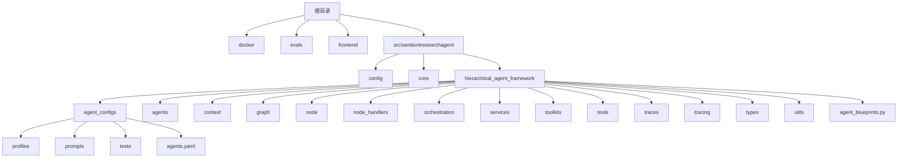
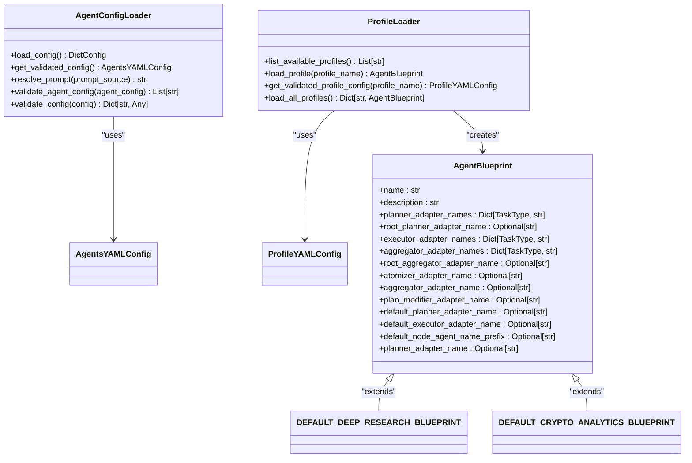
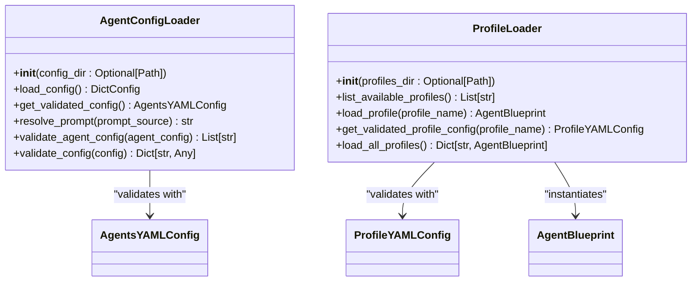
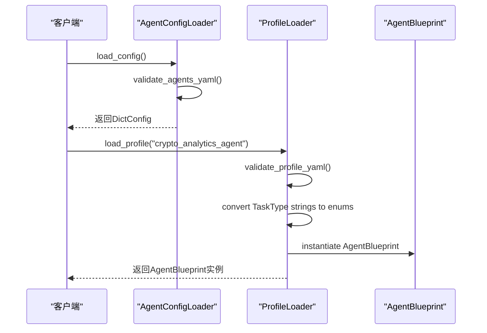
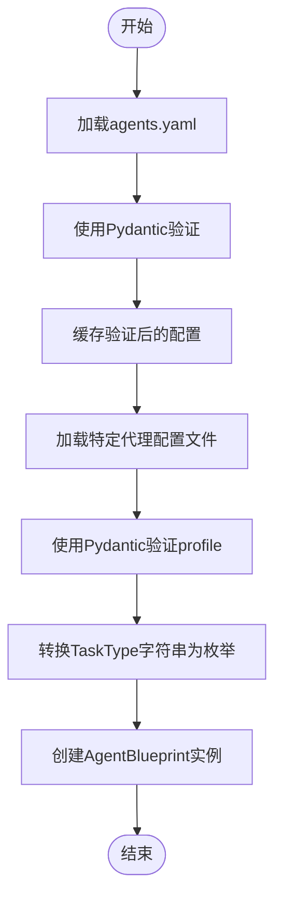
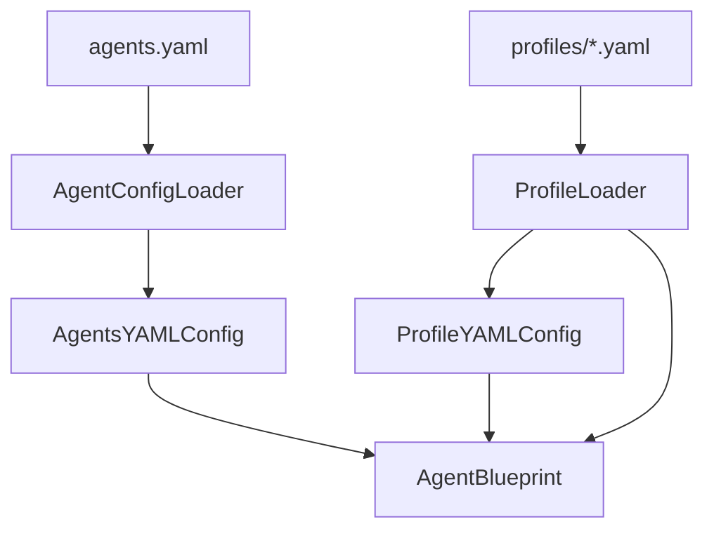

# 代理配置文件

<cite>
**本文档中引用的文件**  
- [crypto_analytics_agent.yaml](file://src\sentientresearchagent\hierarchical_agent_framework\agent_configs\profiles\crypto_analytics_agent.yaml)
- [deep_research_agent.yaml](file://src\sentientresearchagent\hierarchical_agent_framework\agent_configs\profiles\deep_research_agent.yaml)
- [agents.yaml](file://src\sentientresearchagent\hierarchical_agent_framework\agent_configs\agents.yaml)
- [config_loader.py](file://src\sentientresearchagent\hierarchical_agent_framework\agent_configs\config_loader.py)
- [profile_loader.py](file://src\sentientresearchagent\hierarchical_agent_framework\agent_configs\profile_loader.py)
- [agent_blueprints.py](file://src\sentientresearchagent\hierarchical_agent_framework\agent_blueprints.py)
- [models.py](file://src\sentientresearchagent\hierarchical_agent_framework\agent_configs\models.py)
</cite>

## 目录
1. [介绍](#介绍)
2. [项目结构](#项目结构)
3. [核心组件](#核心组件)
4. [架构概述](#架构概述)
5. [详细组件分析](#详细组件分析)
6. [依赖分析](#依赖分析)
7. [性能考虑](#性能考虑)
8. [故障排除指南](#故障排除指南)
9. [结论](#结论)

## 介绍
本文件全面介绍了YAML格式代理配置文件的结构规范与加载流程。以`crypto_analytics_agent.yaml`和`deep_research_agent.yaml`为例，解析了profile元数据、agent_type映射关系以及各阶段（规划、执行、聚合）适配器的选择逻辑。说明了`agents.yaml`中全局代理类型注册机制及其与蓝图的关联方式。指导开发者如何创建新的YAML配置文件来自定义研究代理的行为模式，包括字段填写规则、命名约定和验证方法。提供从配置文件加载到实例化AgentBlueprint的完整生命周期说明，并指出配置错误的常见表现及调试手段。

## 项目结构
该项目采用模块化设计，主要分为前端、后端服务和智能研究代理框架三大部分。智能研究代理的核心配置位于`src\sentientresearchagent\hierarchical_agent_framework\agent_configs`目录下，包含`agents.yaml`主配置文件和`profiles`子目录中的具体代理配置文件。这种分层结构使得全局代理定义与特定场景的代理配置分离，便于维护和扩展。

**图源**
- [crypto_analytics_agent.yaml](file://src\sentientresearchagent\hierarchical_agent_framework\agent_configs\profiles\crypto_analytics_agent.yaml)
- [deep_research_agent.yaml](file://src\sentientresearchagent\hierarchical_agent_framework\agent_configs\profiles\deep_research_agent.yaml)
- [agents.yaml](file://src\sentientresearchagent\hierarchical_agent_framework\agent_configs\agents.yaml)

**节源**
- [crypto_analytics_agent.yaml](file://src\sentientresearchagent\hierarchical_agent_framework\agent_configs\profiles\crypto_analytics_agent.yaml)
- [deep_research_agent.yaml](file://src\sentientresearchagent\hierarchical_agent_framework\agent_configs\profiles\deep_research_agent.yaml)
- [agents.yaml](file://src\sentientresearchagent\hierarchical_agent_framework\agent_configs\agents.yaml)

## 核心组件
核心组件包括`AgentConfigLoader`、`ProfileLoader`和`AgentBlueprint`。`AgentConfigLoader`负责加载和验证`agents.yaml`中的全局代理配置，而`ProfileLoader`则用于加载`profiles`目录下的具体代理配置文件并生成`AgentBlueprint`实例。`AgentBlueprint`类作为最终的配置蓝图，包含了所有必要的代理行为定义，如不同任务类型的规划器、执行器和聚合器的映射关系。

**节源**
- [config_loader.py](file://src\sentientresearchagent\hierarchical_agent_framework\agent_configs\config_loader.py)
- [profile_loader.py](file://src\sentientresearchagent\hierarchical_agent_framework\agent_configs\profile_loader.py)
- [agent_blueprints.py](file://src\sentientresearchagent\hierarchical_agent_framework\agent_blueprints.py)

## 架构概述
系统架构围绕着层次化的代理框架构建，通过`AgentBlueprint`将高层次的研究目标分解为一系列可执行的任务。每个任务根据其类型（WRITE, THINK, SEARCH等）被分配给相应的适配器进行处理。整个过程由`AgentConfigLoader`和`ProfileLoader`协同工作，确保配置的一致性和有效性。

**图源**
- [config_loader.py](file://src\sentientresearchagent\hierarchical_agent_framework\agent_configs\config_loader.py)
- [profile_loader.py](file://src\sentientresearchagent\hierarchical_agent_framework\agent_configs\profile_loader.py)
- [agent_blueprints.py](file://src\sentientresearchagent\hierarchical_agent_framework\agent_blueprints.py)

## 详细组件分析
### 配置加载器分析
`AgentConfigLoader`和`ProfileLoader`是两个关键的配置加载器，它们分别负责加载全局代理配置和特定代理配置。这两个类都利用了Pydantic模型来进行配置的验证，确保了配置文件的正确性。

#### 对于对象导向组件：

**图源**
- [config_loader.py](file://src\sentientresearchagent\hierarchical_agent_framework\agent_configs\config_loader.py)
- [profile_loader.py](file://src\sentientresearchagent\hierarchical_agent_framework\agent_configs\profile_loader.py)

#### 对于API/服务组件：

**图源**
- [config_loader.py](file://src\sentientresearchagent\hierarchical_agent_framework\agent_configs\config_loader.py)
- [profile_loader.py](file://src\sentientresearchagent\hierarchical_agent_framework\agent_configs\profile_loader.py)
- [agent_blueprints.py](file://src\sentientresearchagent\hierarchical_agent_framework\agent_blueprints.py)

**节源**
- [config_loader.py](file://src\sentientresearchagent\hierarchical_agent_framework\agent_configs\config_loader.py)
- [profile_loader.py](file://src\sentientresearchagent\hierarchical_agent_framework\agent_configs\profile_loader.py)
- [agent_blueprints.py](file://src\sentientresearchagent\hierarchical_agent_framework\agent_blueprints.py)

### 复杂逻辑组件分析
#### 对于复杂逻辑组件：

**图源**
- [config_loader.py](file://src\sentientresearchagent\hierarchical_agent_framework\agent_configs\config_loader.py)
- [profile_loader.py](file://src\sentientresearchagent\hierarchical_agent_framework\agent_configs\profile_loader.py)
- [agent_blueprints.py](file://src\sentientresearchagent\hierarchical_agent_framework\agent_blueprints.py)

**节源**
- [config_loader.py](file://src\sentientresearchagent\hierarchical_agent_framework\agent_configs\config_loader.py)
- [profile_loader.py](file://src\sentientresearchagent\hierarchical_agent_framework\agent_configs\profile_loader.py)
- [agent_blueprints.py](file://src\sentientresearchagent\hierarchical_agent_framework\agent_blueprints.py)

## 依赖分析
该系统的依赖关系清晰地展示了各个组件之间的交互。`AgentConfigLoader`和`ProfileLoader`都依赖于Pydantic模型来验证配置，而`AgentBlueprint`则是这些配置加载器输出的结果。此外，`agents.yaml`和`profiles`目录下的配置文件共同构成了系统的配置基础。

**图源**
- [agents.yaml](file://src\sentientresearchagent\hierarchical_agent_framework\agent_configs\agents.yaml)
- [crypto_analytics_agent.yaml](file://src\sentientresearchagent\hierarchical_agent_framework\agent_configs\profiles\crypto_analytics_agent.yaml)
- [deep_research_agent.yaml](file://src\sentientresearchagent\hierarchical_agent_framework\agent_configs\profiles\deep_research_agent.yaml)
- [config_loader.py](file://src\sentientresearchagent\hierarchical_agent_framework\agent_configs\config_loader.py)
- [profile_loader.py](file://src\sentientresearchagent\hierarchical_agent_framework\agent_configs\profile_loader.py)
- [agent_blueprints.py](file://src\sentientresearchagent\hierarchical_agent_framework\agent_blueprints.py)

**节源**
- [agents.yaml](file://src\sentientresearchagent\hierarchical_agent_framework\agent_configs\agents.yaml)
- [crypto_analytics_agent.yaml](file://src\sentientresearchagent\hierarchical_agent_framework\agent_configs\profiles\crypto_analytics_agent.yaml)
- [deep_research_agent.yaml](file://src\sentientresearchagent\hierarchical_agent_framework\agent_configs\profiles\deep_research_agent.yaml)
- [config_loader.py](file://src\sentientresearchagent\hierarchical_agent_framework\agent_configs\config_loader.py)
- [profile_loader.py](file://src\sentientresearchagent\hierarchical_agent_framework\agent_configs\profile_loader.py)
- [agent_blueprints.py](file://src\sentientresearchagent\hierarchical_agent_framework\agent_blueprints.py)

## 性能考虑
在性能方面，系统通过缓存已验证的配置来减少重复的I/O操作和计算开销。同时，使用高效的序列化库（如OmegaConf）可以加快配置文件的读取速度。此外，合理的代理选择和任务调度策略也能显著提升整体性能。

## 故障排除指南
当遇到配置错误时，首先检查`agents.yaml`和相关`profiles`文件是否符合预期的结构和语法。常见的问题包括拼写错误、缺少必需字段或不正确的数据类型。利用`AgentConfigLoader`和`ProfileLoader`提供的验证功能可以帮助快速定位问题所在。

**节源**
- [config_loader.py](file://src\sentientresearchagent\hierarchical_agent_framework\agent_configs\config_loader.py)
- [profile_loader.py](file://src\sentientresearchagent\hierarchical_agent_framework\agent_configs\profile_loader.py)

## 结论
通过对YAML格式代理配置文件的深入分析，我们了解了其结构规范与加载流程。通过`AgentConfigLoader`和`ProfileLoader`的有效协作，系统能够灵活且可靠地管理各种代理配置，从而支持多样化的研究需求。未来的工作可以进一步优化配置加载性能，并增强错误报告机制以提高用户体验。