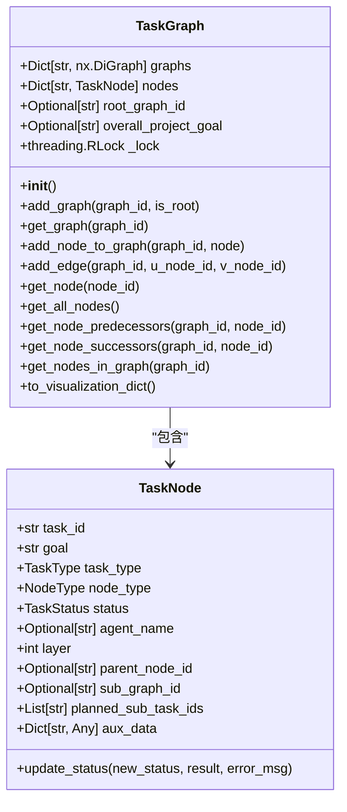
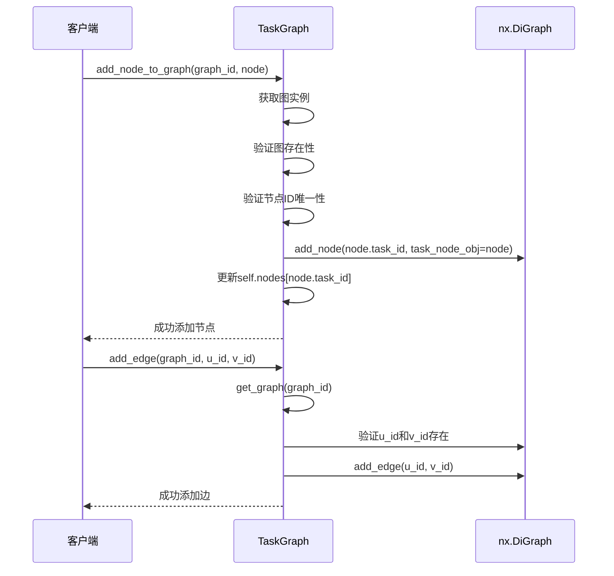
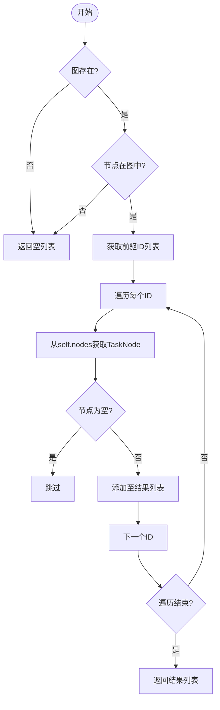
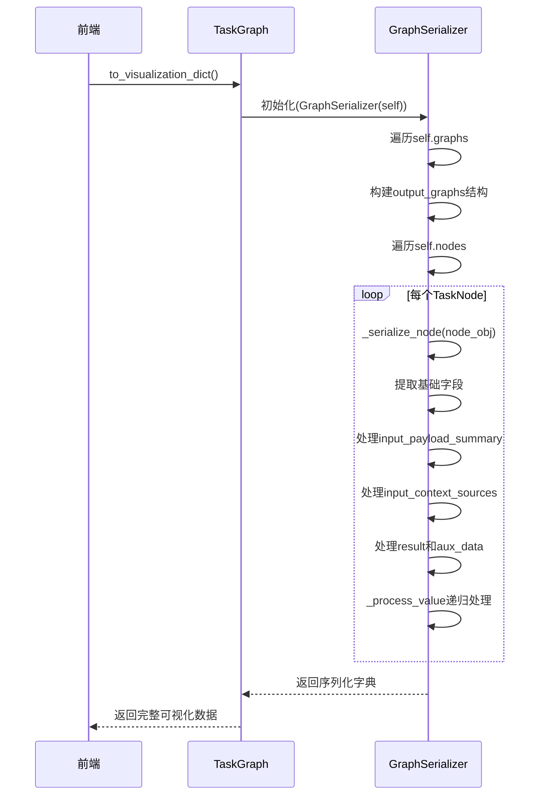

# 任务图管理

<cite>
**本文档中引用的文件**  
- [task_graph.py](file://src\sentientresearchagent\hierarchical_agent_framework\graph\task_graph.py)
- [graph_serializer.py](file://src\sentientresearchagent\hierarchical_agent_framework\graph\graph_serializer.py)
- [task_node.py](file://src\sentientresearchagent\hierarchical_agent_framework\node\task_node.py)
- [index.ts](file://frontend\src\types\index.ts)
</cite>

## 目录
1. [简介](#简介)
2. [核心数据结构设计](#核心数据结构设计)
3. [任务依赖关系建模](#任务依赖关系建模)
4. [节点与边的操作方法](#节点与边的操作方法)
5. [全局节点查找表与多图管理](#全局节点查找表与多图管理)
6. [任务依赖解析流程](#任务依赖解析流程)
7. [前端可视化数据转换](#前端可视化数据转换)
8. [线程安全机制](#线程安全机制)

## 简介
任务图（TaskGraph）是ROMA系统中的核心数据结构，用于表示和管理任务之间的层级依赖关系。该结构基于`networkx.DiGraph`构建有向无环图（DAG），支持复杂的任务调度、状态追踪和可视化展示。通过任务图，系统能够实现任务的分层规划、执行顺序控制以及前后置依赖管理。

**Section sources**
- [task_graph.py](file://src\sentientresearchagent\hierarchical_agent_framework\graph\task_graph.py#L1-L10)

## 核心数据结构设计
任务图类（TaskGraph）采用模块化设计，包含多个关键字段以支持高效的任务管理：

- `graphs`: 字典类型，存储所有子图实例，键为`graph_id`，值为`nx.DiGraph`对象。
- `nodes`: 全局节点映射表，提供跨图的快速节点查找能力。
- `root_graph_id`: 标识根图的唯一ID，确保整个项目只有一个顶层任务图。
- `overall_project_goal`: 存储项目的总体目标描述。

这种设计使得任务图既能支持单一平面任务流，也能表达复杂的嵌套任务结构。

**Diagram sources**
- [task_graph.py](file://src\sentientresearchagent\hierarchical_agent_framework\graph\task_graph.py#L14-L23)
- [task_node.py](file://src\sentientresearchagent\hierarchical_agent_framework\node\task_node.py#L18-L285)

## 任务依赖关系建模
任务图使用有向无环图（DAG）来建模任务间的依赖关系。每个任务节点代表一个可执行单元，而边则表示前置依赖。例如，若任务B依赖于任务A，则存在一条从A指向B的有向边（A → B）。这种结构天然防止了循环依赖，并保证了拓扑排序的可能性。

系统通过`add_graph`方法初始化新的任务图，并可通过`is_root=True`参数指定其为根图。每个图由唯一的`graph_id`标识，通常对应某个父任务的`sub_graph_id`或项目的`root_graph_id`。

**Section sources**
- [task_graph.py](file://src\sentientresearchagent\hierarchical_agent_framework\graph\task_graph.py#L25-L38)

## 节点与边的操作方法
### 添加任务节点
`add_node_to_graph`方法负责将任务节点添加到指定图中，并同步更新全局节点查找表。操作过程包括：
1. 检查目标图是否存在；
2. 验证节点ID在全局范围内唯一；
3. 将节点加入图结构并附加`task_node_obj`属性；
4. 记录日志信息。

此方法确保了节点在整个系统中的唯一性和可追溯性。

### 建立任务依赖
`add_edge`方法用于在两个已存在的任务节点之间建立有向依赖关系。调用前必须确保：
- 指定的`graph_id`有效；
- 起始节点（u_node_id）和终止节点（v_node_id）均已存在于该图中。

该操作直接调用`networkx.DiGraph.add_edge`实现底层连接。

**Diagram sources**
- [task_graph.py](file://src\sentientresearchagent\hierarchical_agent_framework\graph\task_graph.py#L43-L64)
- [task_graph.py](file://src\sentientresearchagent\hierarchical_agent_framework\graph\task_graph.py#L67-L76)

## 全局节点查找表与多图管理
### 全局节点查找表（self.nodes）
`self.nodes`是一个扁平化的字典结构，键为`task_id`，值为`TaskNode`对象引用。它的主要优势包括：
- **跨图快速访问**：无需遍历多个图即可直接获取任意任务节点；
- **统一状态管理**：所有任务的状态变更都可通过此表集中处理；
- **避免重复实例**：强制节点ID全局唯一，防止同一任务被多次加载。

### 多图管理机制
系统支持多个独立的任务图共存，适用于以下场景：
- 不同项目并行运行；
- 同一项目的不同阶段使用独立图结构；
- 子任务拥有自己的子图（通过`sub_graph_id`关联）。

通过`graphs`字典进行管理，结合`get_graph`和`get_nodes_in_graph`等方法实现图级操作隔离。

**Section sources**
- [task_graph.py](file://src\sentientresearchagent\hierarchical_agent_framework\graph\task_graph.py#L14-L23)
- [task_graph.py](file://src\sentientresearchagent\hierarchical_agent_framework\graph\task_graph.py#L115-L128)

## 任务依赖解析流程
系统提供了`get_node_predecessors`和`get_node_successors`两个核心方法用于解析任务依赖。

### 获取前置任务
`get_node_predecessors(graph_id, node_id)`方法执行以下步骤：
1. 获取指定图的`DiGraph`对象；
2. 使用`graph.predecessors(node_id)`获取所有前驱节点ID列表；
3. 通过全局`nodes`表将ID转换为实际的`TaskNode`对象；
4. 返回结果列表。

### 获取后继任务
`get_node_successors(graph_id, node_id)`逻辑类似，仅将`predecessors`替换为`successors`。

这些方法广泛应用于任务调度器判断是否满足执行条件，以及在任务完成时触发后续任务。

**Diagram sources**
- [task_graph.py](file://src\sentientresearchagent\hierarchical_agent_framework\graph\task_graph.py#L87-L99)
- [task_graph.py](file://src\sentientresearchagent\hierarchical_agent_framework\graph\task_graph.py#L101-L113)

## 前端可视化数据转换
`to_visualization_dict`方法通过`GraphSerializer`将内部图结构转换为前端所需的数据格式。其工作流程如下：

1. 创建`GraphSerializer`实例，传入当前`TaskGraph`；
2. 序列化所有图的节点和边信息；
3. 遍历`self.nodes`并对每个`TaskNode`调用`_serialize_node`；
4. 提取关键字段如任务目标、状态、时间戳、输入输出摘要等；
5. 特殊处理`aux_data`中的Pydantic模型，递归转换为JSON兼容结构；
6. 返回包含`graphs`、`all_nodes`、`root_graph_id`和`overall_project_goal`的完整字典。

前端通过该结构渲染交互式任务图谱，支持节点详情查看、路径追踪等功能。

**Diagram sources**
- [task_graph.py](file://src\sentientresearchagent\hierarchical_agent_framework\graph\task_graph.py#L130-L137)
- [graph_serializer.py](file://src\sentientresearchagent\hierarchical_agent_framework\graph\graph_serializer.py#L128-L155)

## 线程安全机制
为保障多线程环境下的数据一致性，任务图采用了`threading.RLock`（可重入锁）进行保护：

- `self._lock = threading.RLock()` 在构造函数中初始化；
- 所有修改状态的方法（如`add_node_to_graph`、`add_edge`、`get_all_nodes`）均使用`with self._lock:`上下文管理器；
- RLock允许同一线程多次获取锁，避免死锁风险，特别适合递归调用或嵌套操作。

此外，`TaskNode`类也在其`__init__`方法中初始化`_status_lock`，确保状态更新（`update_status`）的原子性。

该设计有效防止了并发访问导致的数据竞争问题，提升了系统的稳定性和可靠性。

**Section sources**
- [task_graph.py](file://src\sentientresearchagent\hierarchical_agent_framework\graph\task_graph.py#L23)
- [task_node.py](file://src\sentientresearchagent\hierarchical_agent_framework\node\task_node.py#L73)