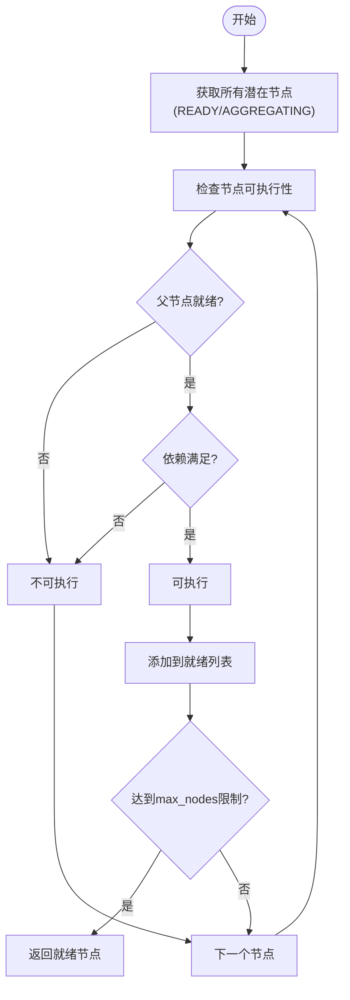
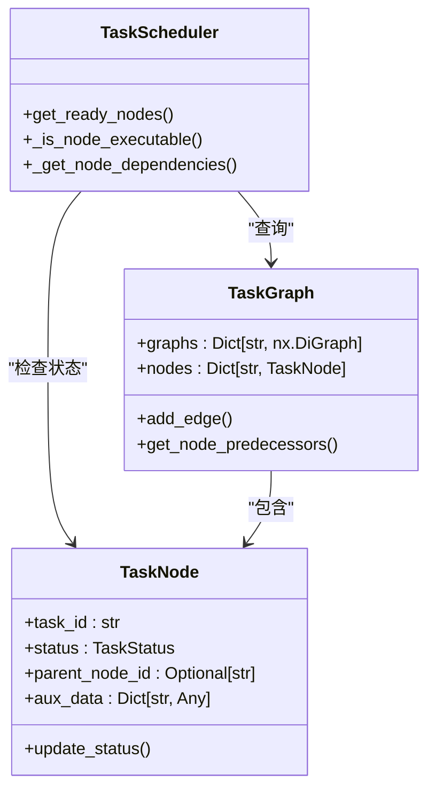
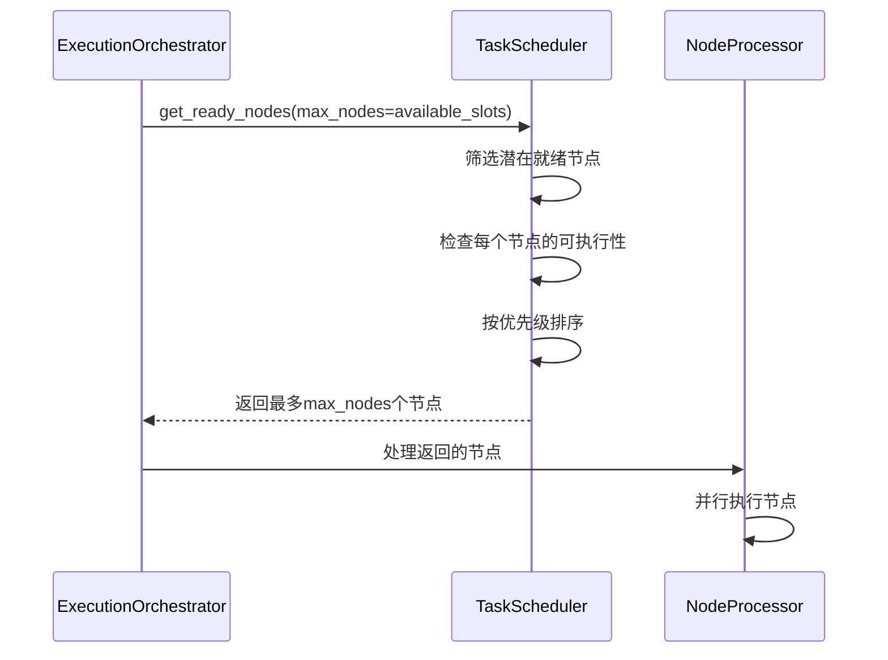
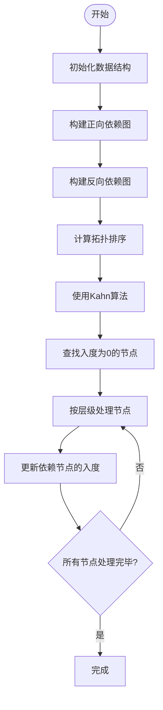
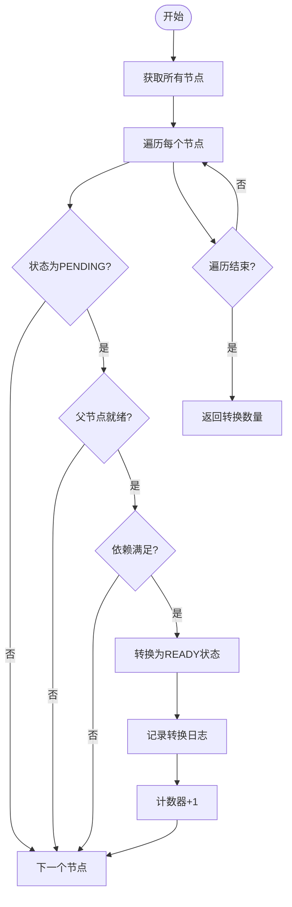
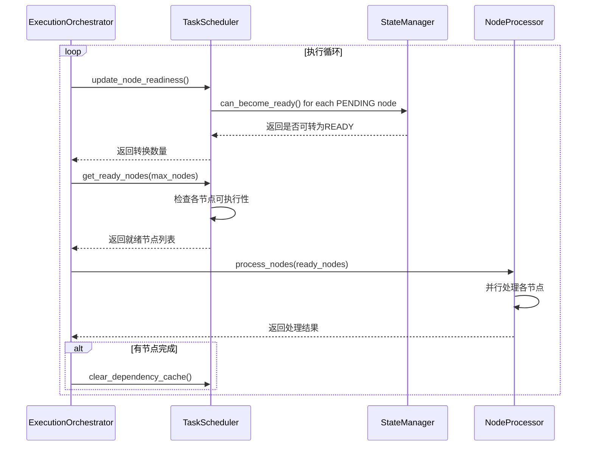

# 任务调度管理

<cite>
**本文档引用的文件**
- [task_scheduler.py](file://src\sentientresearchagent\hierarchical_agent_framework\orchestration\task_scheduler.py)
- [execution_orchestrator.py](file://src\sentientresearchagent\hierarchical_agent_framework\orchestration\execution_orchestrator.py)
- [task_graph.py](file://src\sentientresearchagent\hierarchical_agent_framework\graph\task_graph.py)
- [state_manager.py](file://src\sentientresearchagent\hierarchical_agent_framework\graph\state_manager.py)
- [task_node.py](file://src\sentientresearchagent\hierarchical_agent_framework\node\task_node.py)
</cite>

## 目录
1. [引言](#引言)
2. [核心组件分析](#核心组件分析)
3. [依赖关系与状态筛选机制](#依赖关系与状态筛选机制)
4. [并发控制与批量调度](#并发控制与批量调度)
5. [依赖图构建与拓扑排序](#依赖图构建与拓扑排序)
6. [节点就绪状态更新机制](#节点就绪状态更新机制)
7. [执行循环与协调流程](#执行循环与协调流程)
8. [调度策略调优建议](#调度策略调优建议)
9. [结论](#结论)

## 引言
任务调度器（TaskScheduler）是整个系统执行编排的核心组件，负责确定哪些任务节点可以被执行。它通过复杂的依赖关系检查、状态验证和优先级排序，确保任务按照正确的顺序和条件执行。本文档将深入分析其核心方法和工作机制。

## 核心组件分析

任务调度器的主要职责包括跟踪节点依赖关系、确定执行准备情况、管理执行顺序以及处理并行执行约束。它与其他关键组件如ExecutionOrchestrator、TaskGraph和StateManager紧密协作，形成一个完整的执行管理体系。

**Section sources**
- [task_scheduler.py](file://src\sentientresearchagent\hierarchical_agent_framework\orchestration\task_scheduler.py#L1-L50)

## 依赖关系与状态筛选机制

### 节点可执行性判断
`get_ready_nodes`方法是任务调度器的核心功能之一，用于获取所有准备好执行的节点。该方法首先筛选出处于READY或AGGREGATING状态的所有潜在节点，然后逐一检查每个节点是否满足执行条件。



**Diagram sources**
- [task_scheduler.py](file://src\sentientresearchagent\hierarchical_agent_framework\orchestration\task_scheduler.py#L53-L102)

一个节点被认为是可执行的，必须同时满足以下三个条件：
1. 节点状态为READY或AGGREGATING
2. 所有依赖项都已成功完成（DONE状态）
3. 父节点处于适当的运行状态

**Section sources**
- [task_scheduler.py](file://src\sentientresearchagent\hierarchical_agent_framework\orchestration\task_scheduler.py#L53-L102)
- [task_node.py](file://src\sentientresearchagent\hierarchical_agent_framework\node\task_node.py#L29-L29)

### 依赖关系解析
依赖关系的解析通过`_get_node_dependencies`方法实现，该方法结合了两种机制来确定节点的依赖：

1. **基于索引的依赖**：从aux_data中的depends_on_indices字段解析，适用于新创建的节点
2. **基于图结构的依赖**：通过查询任务图中的前驱节点来确定

这种双重机制确保了即使在图结构尚未完全建立的情况下也能正确识别依赖关系。



**Diagram sources**
- [task_scheduler.py](file://src\sentientresearchagent\hierarchical_agent_framework\orchestration\task_scheduler.py#L200-L250)
- [task_graph.py](file://src\sentientresearchagent\hierarchical_agent_framework\graph\task_graph.py#L67-L76)

## 并发控制与批量调度

### max_nodes参数的作用
`get_ready_nodes`方法接受一个可选的max_nodes参数，用于控制并发执行的节点数量。这个参数在批量处理模式下尤为重要，它允许系统根据当前可用的执行槽位动态调整返回的节点数量。

当指定了max_nodes时，一旦找到足够数量的可执行节点就会立即停止搜索，这有助于：
- 防止资源过载
- 实现公平的任务分配
- 支持动态并发控制



**Diagram sources**
- [task_scheduler.py](file://src\sentientresearchagent\hierarchical_agent_framework\orchestration\task_scheduler.py#L53-L102)
- [execution_orchestrator.py](file://src\sentientresearchagent\hierarchical_agent_framework\orchestration\execution_orchestrator.py#L31-L927)

## 依赖图构建与拓扑排序

### 依赖图的构建
`_get_dependency_graph`方法（实际名为build_dependency_graph）负责构建完整的依赖图。该过程包括：

1. 清空现有的依赖缓存
2. 遍历所有节点，收集它们的依赖关系
3. 构建正向和反向依赖映射
4. 计算拓扑排序



**Diagram sources**
- [task_scheduler.py](file://src\sentientresearchagent\hierarchical_agent_framework\orchestration\task_scheduler.py#L400-L450)

### 拓扑排序优化
采用Kahn算法进行拓扑排序，具有以下优势：
- 时间复杂度为O(V+E)，其中V是节点数，E是边数
- 能够检测环路的存在
- 按层级对节点进行排序，有利于并行执行

排序结果存储在_topological_order字段中，后续的优化版本`get_ready_nodes_optimized`可以直接利用这个预计算的结果，避免重复的依赖检查。

**Section sources**
- [task_scheduler.py](file://src\sentientresearchagent\hierarchical_agent_framework\orchestration\task_scheduler.py#L400-L500)

## 节点就绪状态更新机制

### PENDING到READY的转换
`_update_node_readiness`方法（实际名为update_node_readiness）负责将PENDING状态的节点根据依赖满足情况转换为READY状态。这个过程是执行循环中的关键步骤。

转换条件包括：
1. 节点当前状态为PENDING
2. 父节点处于适当的状态（RUNNING、PLAN_DONE、DONE或AGGREGATING）
3. 所有依赖项都已经完成



**Diagram sources**
- [task_scheduler.py](file://src\sentientresearchagent\hierarchical_agent_framework\orchestration\task_scheduler.py#L150-L180)

### 状态转换的原子性
状态转换通过TaskNode的update_status方法实现，该方法使用线程锁保证操作的原子性。每次状态变更都会触发相应的日志记录和知识库更新，确保系统的状态一致性。

**Section sources**
- [task_scheduler.py](file://src\sentientresearchagent\hierarchical_agent_framework\orchestration\task_scheduler.py#L150-L180)
- [task_node.py](file://src\sentientresearchagent\hierarchical_agent_framework\node\task_node.py#L75-L184)

## 执行循环与协调流程

### 调度器与执行协调器的协作
ExecutionOrchestrator作为高层协调器，与TaskScheduler紧密协作完成任务执行。主要交互流程如下：

1. 执行循环定期调用`update_node_readiness`更新节点状态
2. 调用`get_ready_nodes`获取可执行节点
3. 将节点交给NodeProcessor进行处理
4. 处理完成后，新的节点可能进入PENDING状态，等待下一轮调度



**Diagram sources**
- [execution_orchestrator.py](file://src\sentientresearchagent\hierarchical_agent_framework\orchestration\execution_orchestrator.py#L31-L927)
- [task_scheduler.py](file://src\sentientresearchagent\hierarchical_agent_framework\orchestration\task_scheduler.py#L53-L102)

### 动态并发管理
系统实现了动态并发管理机制，能够根据运行时情况自动调整并发级别：
- 当遇到速率限制错误时，降低并发数
- 在一段时间内无错误后，逐步增加并发数
- 根据平均处理时间调整并发策略

**Section sources**
- [execution_orchestrator.py](file://src\sentientresearchagent\hierarchical_agent_framework\orchestration\execution_orchestrator.py#L31-L927)

## 调度策略调优建议

### 依赖缓存更新频率
依赖缓存通过`clear_dependency_cache`方法清除，建议在以下情况下触发：
- 图结构发生变更时
- 批量节点状态更新后
- 检测到死锁并恢复后

合理的缓存策略可以在性能和准确性之间取得平衡。

### 批量调度大小配置
批量调度大小应根据系统资源和任务特性进行配置：
- CPU密集型任务：较小的批量大小
- I/O密集型任务：较大的批量大小
- 混合型任务：根据监控数据动态调整

### 高优先级任务插队机制
虽然当前实现没有显式的插队机制，但可以通过以下方式实现：
1. 修改排序键函数，使高优先级任务排在前面
2. 在get_ready_nodes中优先检查高优先级任务
3. 使用独立的高优先级队列

```python
# 示例：修改排序键以支持优先级
ready_nodes.sort(key=lambda n: (n.priority_level, n.layer, n.timestamp_created))
```

**Section sources**
- [task_scheduler.py](file://src\sentientresearchagent\hierarchical_agent_framework\orchestration\task_scheduler.py#L90-L95)
- [execution_orchestrator.py](file://src\sentientresearchagent\hierarchical_agent_framework\orchestration\execution_orchestrator.py#L31-L927)

## 结论
任务调度器通过精细的状态管理和依赖检查，确保了复杂任务图的有序执行。其与执行协调器的紧密协作，形成了一个高效、可靠的执行引擎。通过合理配置和优化，可以显著提升系统的整体性能和稳定性。