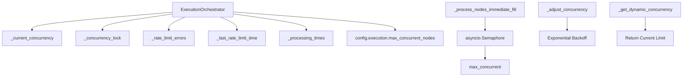
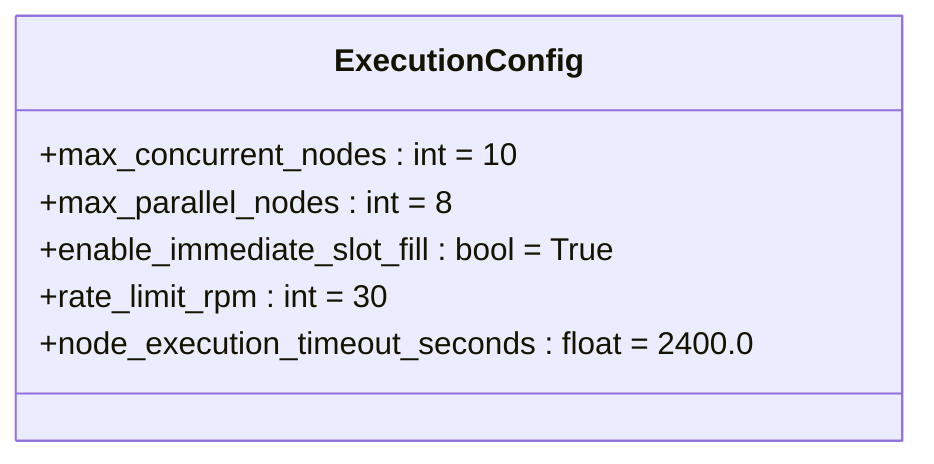
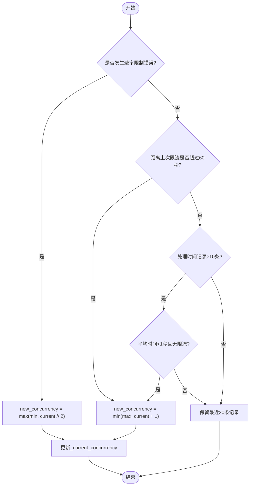
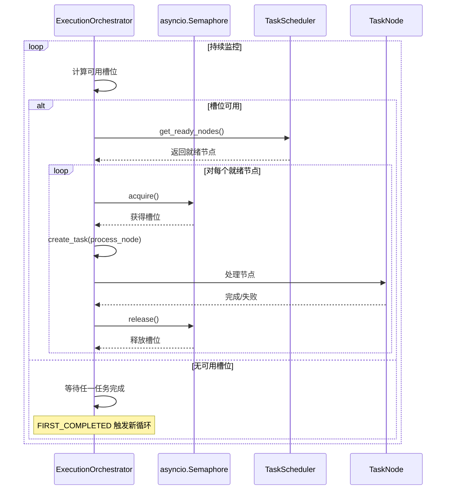

# 并发控制与动态调节

<cite>
**本文档中引用的文件**
- [execution_orchestrator.py](file://src/sentientresearchagent/hierarchical_agent_framework/orchestration/execution_orchestrator.py)
- [config.py](file://src/sentientresearchagent/config/config.py)
</cite>

## 目录
1. [引言](#引言)
2. [并发控制系统架构](#并发控制系统架构)
3. [核心组件分析](#核心组件分析)
4. [动态并发调节机制](#动态并发调节机制)
5. [即时填充模式下的并发行为](#即时填充模式下的并发行为)
6. [配置参数调优指南](#配置参数调优指南)
7. [结论](#结论)

## 引言
本文档深入剖析执行编排器中的动态并发控制系统，重点讲解系统如何通过 `_semaphore` 与 `max_concurrent_nodes` 参数协同工作来限制并行任务数量。详细分析 `_adjust_concurrency` 方法如何基于速率限制错误和历史处理时间实现指数退避与渐进恢复，并阐述 `_processing_times` 列表在统计近期执行耗时和指导并发决策中的作用。同时说明 `_current_concurrency` 变量在运行时的实际控制效果，并结合 `_immediate_fill` 模式下的实时槽位填充行为进行对比说明。

## 并发控制系统架构

**图示来源**
- [execution_orchestrator.py](file://src/sentientresearchagent/hierarchical_agent_framework/orchestration/execution_orchestrator.py#L800-L927)

## 核心组件分析

### _current_concurrency 运行时控制机制
`_current_concurrency` 是一个动态变量，用于存储当前允许的最大并发节点数。它在初始化时从配置中读取 `max_concurrent_nodes` 值，并在整个执行过程中被 `_adjust_concurrency` 方法动态调整。该变量直接影响 `asyncio.Semaphore` 的信号量大小，从而精确控制可同时运行的任务数量。

**节段来源**
- [execution_orchestrator.py](file://src/sentientresearchagent/hierarchical_agent_framework/orchestration/execution_orchestrator.py#L80-L85)

### max_concurrent_nodes 配置参数
`max_concurrent_nodes` 是 `ExecutionConfig` 类中的核心配置项，默认值为10。它定义了系统允许的最大并发节点数上限，作为动态并发调节的基准值。此参数可通过环境变量或 YAML 配置文件进行覆盖，支持灵活的部署调整。

**图示来源**
- [config.py](file://src/sentientresearchagent/config/config.py#L100-L130)

**节段来源**
- [config.py](file://src/sentientresearchagent/config/config.py#L100-L130)

## 动态并发调节机制

### _adjust_concurrency 方法工作原理
`_adjust_concurrency` 方法是动态并发调节的核心，采用异步锁保护共享状态，确保线程安全。其工作流程如下：

**图示来源**
- [execution_orchestrator.py](file://src/sentientresearchagent/hierarchical_agent_framework/orchestration/execution_orchestrator.py#L879-L923)

**节段来源**
- [execution_orchestrator.py](file://src/sentientresearchagent/hierarchical_agent_framework/orchestration/execution_orchestrator.py#L879-L923)

### 指数退避与渐进恢复策略
当检测到速率限制错误时，系统采用指数退避策略将并发数减半（但不低于最小值），以快速缓解压力。随后，在持续60秒未出现新限流后，系统进入渐进恢复阶段，每次仅增加1个并发槽位，避免激进恢复导致再次触发限流。这种"快降慢升"策略有效平衡了效率与稳定性。

**节段来源**
- [execution_orchestrator.py](file://src/sentientresearchagent/hierarchical_agent_framework/orchestration/execution_orchestrator.py#L890-L910)

### _processing_times 统计机制
`_processing_times` 列表用于记录最近完成节点的处理耗时。当记录数达到10条时，系统计算平均处理时间。若平均时间小于1秒且无速率限制错误，系统会逐步增加并发数，利用空余算力提升吞吐量。列表始终保持最多20条最新记录，确保统计数据反映近期性能趋势。

**节段来源**
- [execution_orchestrator.py](file://src/sentientresearchagent/hierarchical_agent_framework/orchestration/execution_orchestrator.py#L915-L923)

## 即时填充模式下的并发行为

### _process_nodes_immediate_fill 实时槽位管理
在启用 `enable_immediate_slot_fill` 模式的条件下，系统采用 `_process_nodes_immediate_fill` 方法实现即时填充。该方法维护一个 `asyncio.Semaphore` 信号量和活跃任务集合，一旦有任务完成释放槽位，立即从就绪队列中获取新任务填充，最大化资源利用率。

**图示来源**
- [execution_orchestrator.py](file://src/sentientresearchagent/hierarchical_agent_framework/orchestration/execution_orchestrator.py#L504-L572)

**节段来源**
- [execution_orchestrator.py](file://src/sentientresearchagent/hierarchical_agent_framework/orchestration/execution_orchestrator.py#L504-L572)

### _get_dynamic_concurrency 获取当前限制
`_get_dynamic_concurrency` 方法是一个简单的访问器，返回当前动态调整后的并发限制值。该值由 `_adjust_concurrency` 方法修改，被 `_process_nodes_immediate_fill` 和其他需要并发控制的组件调用，确保整个系统使用一致的并发上限。

**节段来源**
- [execution_orchestrator.py](file://src/sentientresearchagent/hierarchical_agent_framework/orchestration/execution_orchestrator.py#L925-L927)

## 配置参数调优指南

### 关键配置参数对照表
| **配置项** | **默认值** | **取值范围** | **调优建议** |
|-----------|----------|------------|------------|
| `max_concurrent_nodes` | 10 | ≥1 | 生产环境可根据API配额设置，建议初始值为速率限制RPM的1/60 |
| `rate_limit_rpm` | 30 | ≥1 | 应准确设置为目标LLM提供商的每分钟请求限制 |
| `enable_immediate_slot_fill` | true | true/false | 高延迟操作建议开启，低延迟批处理可关闭 |
| `rate_limit_backoff_factor` | 2.0 | >0 | 控制退避陡峭度，网络不稳定时可设为1.5-2.5 |

**节段来源**
- [config.py](file://src/sentientresearchagent/config/config.py#L100-L130)

### 调优策略
1. **保守策略**：设置较低的 `max_concurrent_nodes`（如3-5），适用于对稳定性要求极高的场景。
2. **激进策略**：设置较高的初始并发数并依赖动态调节，适用于短时爆发性任务。
3. **混合策略**：根据任务类型（搜索、思考、写入）设置不同并发池，实现精细化控制。

## 结论
本系统的动态并发控制系统通过 `_current_concurrency` 变量与 `asyncio.Semaphore` 协同工作，实现了精细的并行任务数量控制。`_adjust_concurrency` 方法结合速率限制错误和历史处理时间，采用指数退避与渐进恢复策略，有效应对API限流。`_processing_times` 列表提供性能反馈闭环，指导智能扩容。在 `_immediate_fill` 模式下，系统能实时响应槽位变化，最大化资源利用率。合理的配置参数调优可显著提升系统吞吐量与稳定性。