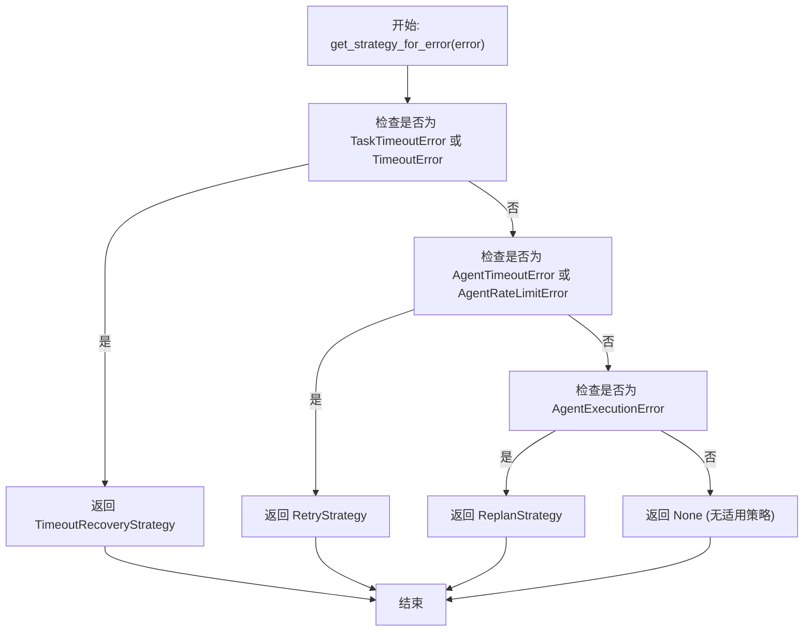
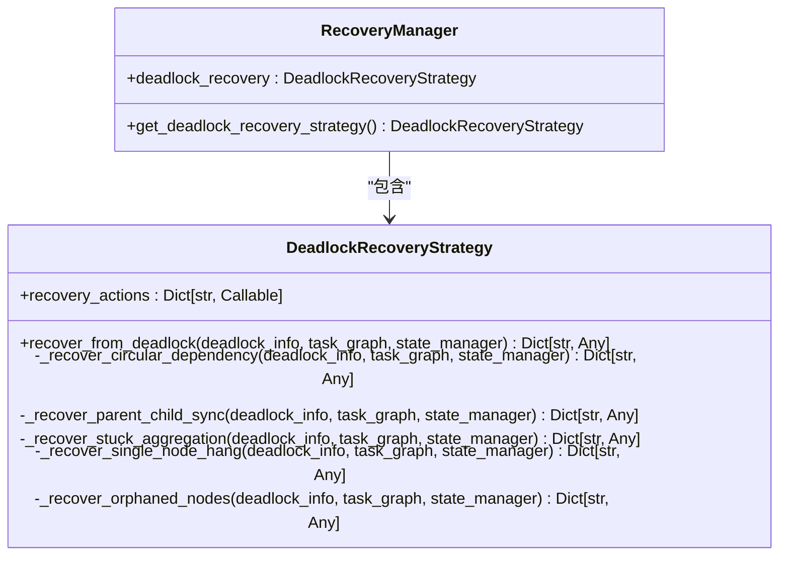
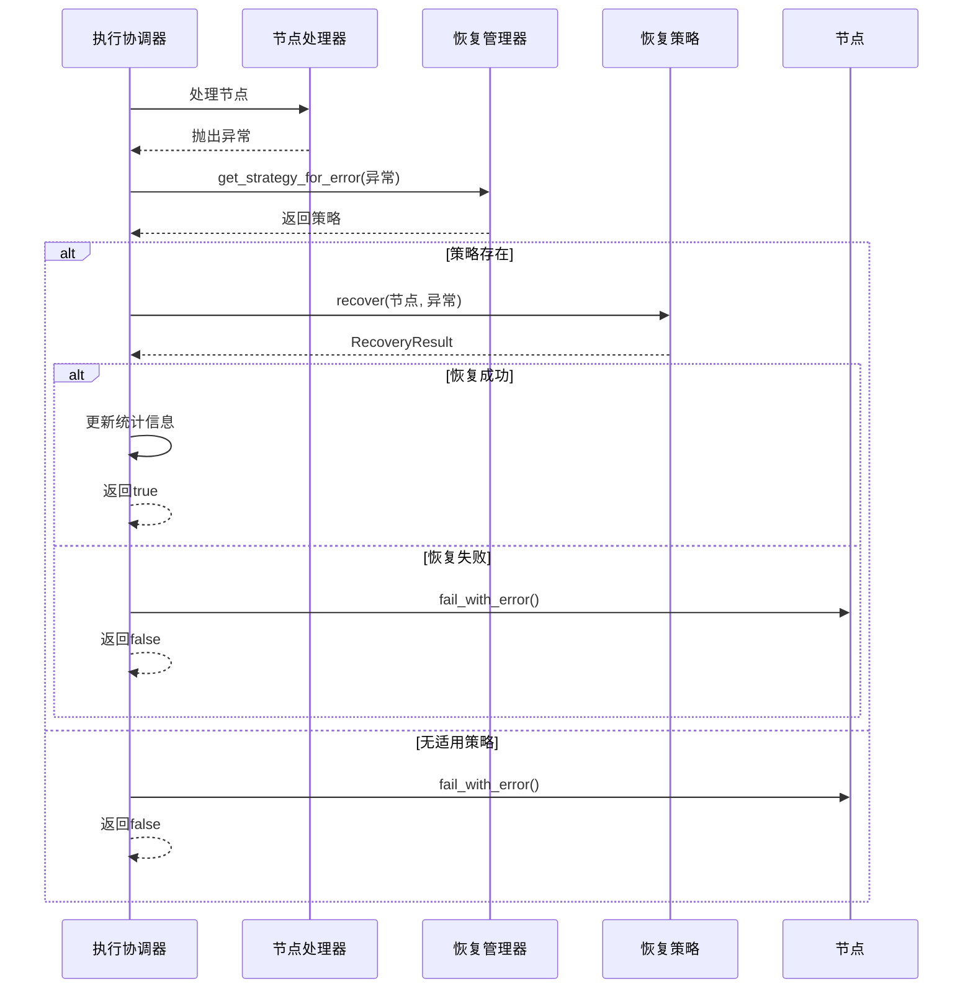

# 执行恢复机制

<cite>
**本文档引用的文件**
- [recovery_manager.py](file://src\sentientresearchagent\hierarchical_agent_framework\orchestration\recovery_manager.py)
- [execution_orchestrator.py](file://src\sentientresearchagent\hierarchical_agent_framework\orchestration\execution_orchestrator.py)
- [task_graph.py](file://src\sentientresearchagent\hierarchical_agent_framework\graph\task_graph.py)
</cite>

## 目录
1. [引言](#引言)
2. [核心组件](#核心组件)
3. [异常类型与恢复策略匹配](#异常类型与恢复策略匹配)
4. [死锁恢复流程分析](#死锁恢复流程分析)
5. [恢复策略注册机制](#恢复策略注册机制)
6. [主执行循环中的错误处理](#主执行循环中的错误处理)
7. 健壮恢复策略设计最佳实践
8. 结论

## 引言
恢复管理器（RecoveryManager）在系统异常处理中扮演着关键角色，负责协调和执行各种恢复策略以应对执行过程中的错误和死锁情况。该组件通过策略模式实现了灵活的错误恢复机制，能够根据不同的异常类型选择合适的恢复动作，如重试、重新规划或强制状态迁移。本文档将深入分析恢复管理器的核心功能，包括异常到策略的映射逻辑、死锁场景的干预措施、自定义策略的扩展机制以及其在主执行循环中的集成方式。

## 核心组件

恢复管理器系统由多个核心组件构成，共同实现完整的错误恢复能力。`RecoveryManager`作为门面类，统一管理所有恢复策略；`RecoveryStrategy`抽象基类定义了策略接口；具体的策略实现包括`RetryStrategy`、`ReplanStrategy`和`TimeoutRecoveryStrategy`等；`DeadlockRecoveryStrategy`专门处理各类死锁场景。这些组件协同工作，形成了分层的恢复体系结构。

**Section sources**
- [recovery_manager.py](file://src\sentientresearchagent\hierarchical_agent_framework\orchestration\recovery_manager.py#L0-L487)

## 异常类型与恢复策略匹配

### get_strategy_for_error方法工作机制

`get_strategy_for_error`方法是异常处理的核心入口，负责根据异常类型匹配相应的恢复策略。该方法按照预定义的优先级顺序检查每个策略，首先尝试超时恢复，然后是重试策略，最后是重新规划策略。匹配过程基于异常类型的精确判断：`TaskTimeoutError`或`TimeoutError`触发`TimeoutRecoveryStrategy`；`AgentTimeoutError`或`AgentRateLimitError`激活`RetryStrategy`；而`AgentExecutionError`则调用`ReplanStrategy`。

**Diagram sources**
- [recovery_manager.py](file://src\sentientresearchagent\hierarchical_agent_framework\orchestration\recovery_manager.py#L450-L473)

**Section sources**
- [recovery_manager.py](file://src\sentientresearchagent\hierarchical_agent_framework\orchestration\recovery_manager.py#L450-L473)

## 死锁恢复流程分析

### recover_from_deadlock流程详解

`recover_from_deadlock`方法针对不同死锁场景采取特定的干预措施，通过模式匹配选择对应的恢复函数。系统识别五种主要死锁模式：循环依赖、父子同步问题、聚合阻塞、单节点挂起和孤立节点，并分别实施针对性的解决方案。

**Diagram sources**
- [recovery_manager.py](file://src\sentientresearchagent\hierarchical_agent_framework\orchestration\recovery_manager.py#L215-L253)

#### 循环依赖死锁恢复
当检测到循环依赖时，系统会选择层级最高的节点进行失败处理，从而打破循环。算法通过比较受影响节点的层级属性，选择最顶层的节点并将其状态更新为`FAILED`，同时记录"Failed to break circular dependency deadlock"的错误信息。

#### 父子同步问题恢复
对于父子同步问题，系统会修复父节点的状态和子图引用。具体操作是找到卡住子节点所在的子图ID，并将父节点的`sub_graph_id`指向该子图，同时将父节点状态更新为`PLAN_DONE`，使其能够继续执行后续流程。

#### 聚合阻塞恢复
当聚合节点卡在`PLAN_DONE`状态时，系统会强制将其状态迁移至`AGGREGATING`。这种干预措施确保了即使在某些条件未完全满足的情况下，关键的聚合操作也能被触发执行。

#### 单节点挂起恢复
对于长时间处于`RUNNING`状态的挂起节点，系统会强制其进入`NEEDS_REPLAN`状态。这相当于重启该节点的执行计划，通常能解决因外部资源不可用或内部逻辑卡死导致的问题。

#### 孤立节点恢复
当节点因父节点处于无效状态而成为孤立节点时，如果父节点已处于终止状态（`DONE`或`FAILED`），系统会强制将孤立节点的状态迁移至`READY`，使其能够被重新调度执行。

**Section sources**
- [recovery_manager.py](file://src\sentientresearchagent\hierarchical_agent_framework\orchestration\recovery_manager.py#L253-L400)

## 恢复策略注册机制

### _recovery_strategies扩展支持

恢复管理器通过组合而非继承的方式支持扩展自定义恢复逻辑。在初始化过程中，`RecoveryManager`创建了多个具体策略实例（重试、重新规划、超时恢复等），并将它们按优先级顺序存储在`error_strategies`列表中。这种设计允许开发者通过修改配置参数来调整现有策略的行为，或者通过继承`RecoveryStrategy`抽象基类来实现全新的恢复策略。

要添加自定义策略，开发者需要：
1. 创建新类继承`RecoveryStrategy`
2. 实现`can_recover`和`recover`抽象方法
3. 在系统初始化时将新策略实例注入`RecoveryManager`

这种松耦合的设计使得系统能够灵活适应不同的故障恢复需求，同时保持核心逻辑的稳定性。

**Section sources**
- [recovery_manager.py](file://src\sentientresearchagent\hierarchical_agent_framework\orchestration\recovery_manager.py#L400-L438)

## 主执行循环中的错误处理

### _process_single_node错误捕获流程

恢复操作通过`_process_single_node`方法深度嵌入主执行循环。当节点处理过程中抛出异常时，系统首先尝试通过`get_strategy_for_error`获取适当的恢复策略。如果找到可用策略，则调用其`recover`方法执行恢复操作。恢复成功后，该节点被视为成功处理，执行将继续；若恢复失败，则节点被标记为失败状态。

**Diagram sources**
- [execution_orchestrator.py](file://src\sentientresearchagent\hierarchical_agent_framework\orchestration\execution_orchestrator.py#L669-L779)

**Section sources**
- [execution_orchestrator.py](file://src\sentientresearchagent\hierarchical_agent_framework\orchestration\execution_orchestrator.py#L669-L779)

## 健壮恢复策略设计最佳实践

### 幂等性保障
所有恢复操作必须设计为幂等的，即多次执行相同恢复操作不会产生副作用。例如，重试策略在更新节点状态前应检查当前状态，避免重复计数。

### 失败次数限制
每个恢复策略都应设置合理的尝试次数上限。重试策略有`max_retries`参数，重新规划策略有`max_replan_attempts`参数，防止无限循环。

### 日志追踪
详细的日志记录对于调试和监控至关重要。系统在每次恢复尝试时都会记录相关信息，包括时间戳、错误详情和尝试次数，便于事后分析。

### 分层恢复策略
采用分层的策略选择机制，按照从简单到复杂的顺序尝试不同策略。这种设计确保了系统优先使用成本较低的恢复方式（如重试），只有在必要时才采用更激进的方法（如重新规划）。

### 状态一致性维护
恢复操作必须维护系统的整体状态一致性。例如，在强制状态迁移时，需要同时更新相关联的数据结构和元数据，确保系统视图的一致性。

## 结论
恢复管理器通过精心设计的策略模式和分层架构，为系统提供了强大而灵活的异常处理能力。其核心价值在于将复杂的故障恢复逻辑封装成可插拔的组件，既保证了系统的健壮性，又保持了良好的可扩展性。通过对各种异常场景的精细化处理，该组件显著提升了系统的自我修复能力和整体可靠性。