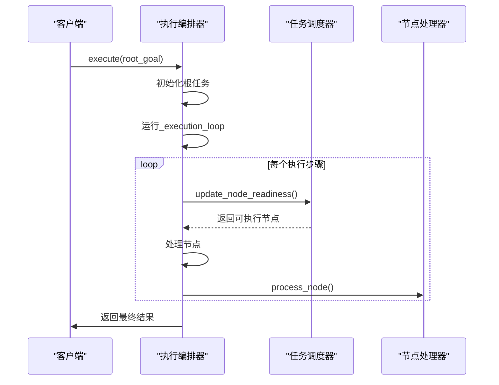
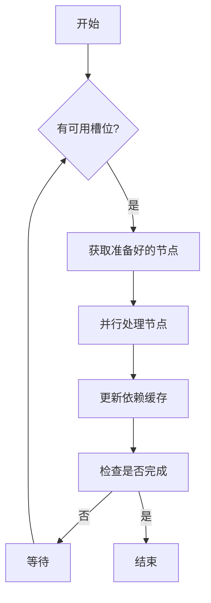
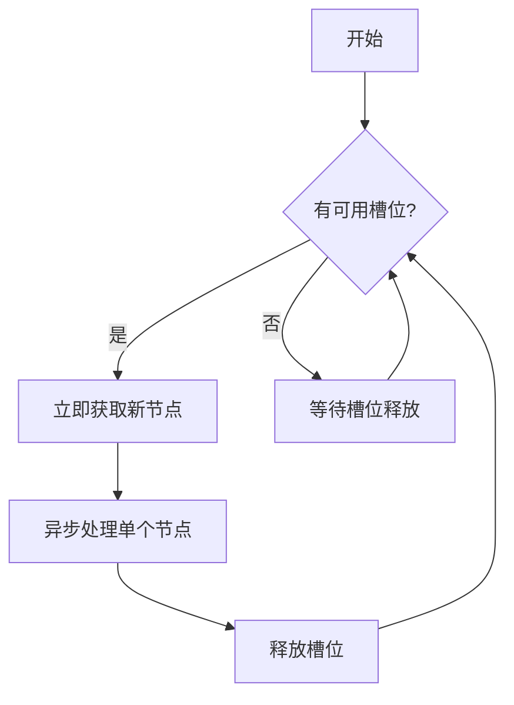
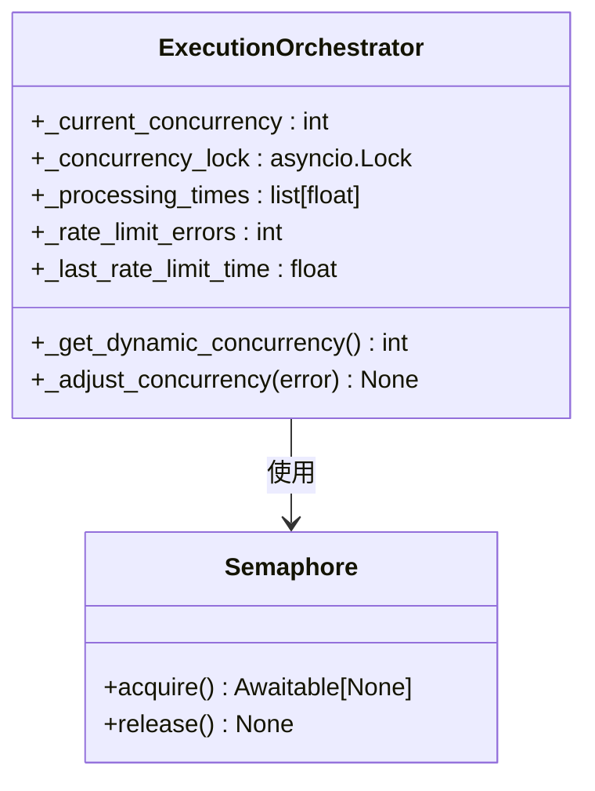
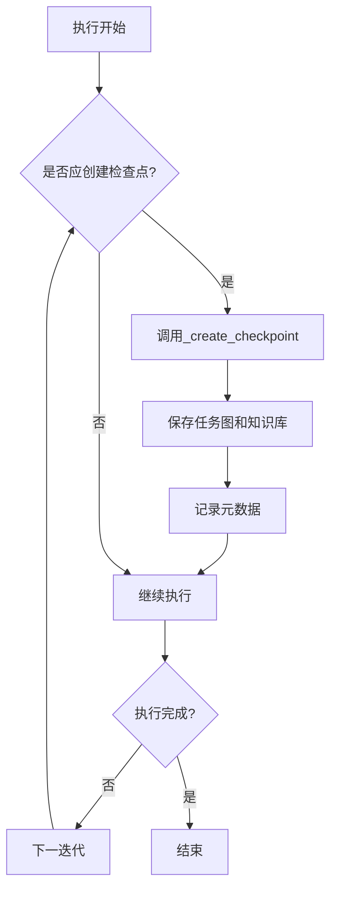
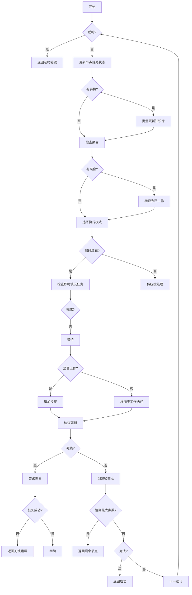

# 执行编排

<cite>
**本文档引用的文件**
- [execution_orchestrator.py](file://src\sentientresearchagent\hierarchical_agent_framework\orchestration\execution_orchestrator.py)
- [task_scheduler.py](file://src\sentientresearchagent\hierarchical_agent_framework\orchestration\task_scheduler.py)
- [deadlock_detector.py](file://src\sentientresearchagent\hierarchical_agent_framework\orchestration\deadlock_detector.py)
- [recovery_manager.py](file://src\sentientresearchagent\hierarchical_agent_framework\orchestration\recovery_manager.py)
- [batched_state_manager.py](file://src\sentientresearchagent\hierarchical_agent_framework\orchestration\batched_state_manager.py)
- [node_update_manager.py](file://src\sentientresearchagent\hierarchical_agent_framework\services\node_update_manager.py)
</cite>

## 目录
1. [引言](#引言)
2. [执行协调器的核心作用](#执行协调器的核心作用)
3. [_execute方法与服务组件整合](#_execute方法与服务组件整合)
4. [传统批处理与即时填充模式对比](#传统批处理与即时填充模式对比)
5. [_semaphore并发控制机制](#_semaphore并发控制机制)
6. [死锁检测与恢复机制](#死锁检测与恢复机制)
7. [检查点管理器的容错价值](#检查点管理器的容错价值)
8. [执行循环控制逻辑分析](#执行循环控制逻辑分析)
9. [配置参数调优建议](#配置参数调优建议)

## 引言
执行编排器（ExecutionOrchestrator）是系统任务执行流程的核心协调组件，负责调度、状态管理和知识存储等关键服务的协同工作。该文档深入解析其内部工作机制，包括执行策略差异、并发控制、死锁检测与恢复、容错机制以及性能调优等方面。

## 执行协调器的核心作用
执行编排器作为高层协调者，通过初始化和管理多个核心服务组件来确保任务图的有效执行。它在`__init__`方法中创建或接收任务调度器（TaskScheduler）、死锁检测器（DeadlockDetector）、恢复管理器（RecoveryManager）和检查点管理器（CheckpointManager），并根据系统配置动态调整并发级别和更新策略。此外，它还初始化批量状态管理器（BatchedStateManager）以优化状态更新性能，并基于执行策略配置节点更新管理器（NodeUpdateManager）。

**Section sources**
- [execution_orchestrator.py](file://src\sentientresearchagent\hierarchical_agent_framework\orchestration\execution_orchestrator.py#L39-L126)

## _execute方法与服务组件整合
`execute`方法是执行编排器的入口点，负责启动整个执行流程。它首先检查是否已有执行正在进行，然后初始化根任务节点并调用执行循环 `_execution_loop`。在整个执行过程中，它会确保所有状态更新被刷新到知识库，并在轻量级代理模式下刷新延迟更新。最后，无论成功与否，都会清理资源并重置运行状态。



**Diagram sources**
- [execution_orchestrator.py](file://src\sentientresearchagent\hierarchical_agent_framework\orchestration\execution_orchestrator.py#L128-L192)

## 传统批处理与即时填充模式对比
执行编排器支持两种主要的执行策略：传统批处理模式和即时填充模式（immediate_fill）。这两种模式的主要区别在于如何处理可用的执行槽位。

### 传统批处理模式
在这种模式下，系统定期检查是否有足够的空闲槽位来处理一批节点。如果有，则获取一组准备好的节点进行并行处理。这种模式适合于需要批量处理且对实时性要求不高的场景。



### 即时填充模式
即时填充模式则更加动态和高效。一旦有槽位释放，立即尝试填充新的节点。这种方式能够更快地响应变化，减少等待时间，提高整体吞吐量。当启用此模式时，`_process_nodes_immediate_fill` 方法会在后台持续运行，监控并填充空闲槽位。



**Diagram sources**
- [execution_orchestrator.py](file://src\sentientresearchagent\hierarchical_agent_framework\orchestration\execution_orchestrator.py#L226-L502)

## _semaphore并发控制机制
为了控制并发执行的节点数量，执行编排器使用了 `asyncio.Semaphore` 来实现信号量机制。在 `_process_nodes_immediate_fill` 和 `_process_nodes` 方法中，分别创建了一个信号量实例，其初始值为当前动态并发限制 `_current_concurrency`。每当一个节点开始处理时，必须先获取信号量；处理完成后，自动释放信号量，从而允许其他节点继续执行。这种方法有效地防止了过度并发导致的资源耗尽问题。



**Diagram sources**
- [execution_orchestrator.py](file://src\sentientresearchagent\hierarchical_agent_framework\orchestration\execution_orchestrator.py#L504-L572)

## 死锁检测与恢复机制
死锁检测器（DeadlockDetector）周期性地分析系统的执行状态，识别潜在的死锁情况。它通过多种模式探测器（如循环依赖、父子同步问题、聚合卡住等）来检测不同类型的死锁。一旦发现死锁，将触发恢复管理器（RecoveryManager）进行相应的恢复操作。

### 死锁检测流程
```mermaid
sequenceDiagram
participant Loop as "_execution_loop"
participant Detector as "DeadlockDetector"
participant Manager as "RecoveryManager"
loop 每50步
Loop->>Detector : detect_deadlock()
Detector->>Detector : 分析活动节点
alt 发现死锁
Detector-->>Loop : 返回死锁信息
Loop->>Manager : _attempt_deadlock_recovery()
Manager->>Manager : 执行恢复策略
Manager-->>Loop : 返回恢复结果
Loop->>Loop : 继续执行或终止
else 未发现死锁
Detector-->>Loop : 返回无死锁
end
end
```

**Diagram sources**
- [execution_orchestrator.py](file://src\sentientresearchagent\hierarchical_agent_framework\orchestration\execution_orchestrator.py#L738-L759)
- [deadlock_detector.py](file://src\sentientresearchagent\hierarchical_agent_framework\orchestration\deadlock_detector.py#L76-L114)

## 检查点管理器的容错价值
检查点管理器（CheckpointManager）在长时间运行的任务中提供了重要的容错能力。通过定期创建执行快照，可以在发生故障后从最近的检查点恢复，避免从头开始重新执行。这不仅提高了系统的可靠性，也显著减少了因错误而导致的时间损失。



**Diagram sources**
- [execution_orchestrator.py](file://src\sentientresearchagent\hierarchical_agent_framework\orchestration\execution_orchestrator.py#L761-L783)

## 执行循环控制逻辑分析
`_execution_loop` 方法是执行编排器的核心，包含了步骤计数、超时控制和活动监测等关键控制逻辑。它通过一个主循环不断检查超时条件、更新节点就绪状态、处理聚合请求、检测死锁以及创建检查点。每次迭代只有在完成有意义的工作时才会增加步骤计数，同时跟踪最后一次活动时间以判断系统是否停滞。



**Diagram sources**
- [execution_orchestrator.py](file://src\sentientresearchagent\hierarchical_agent_framework\orchestration\execution_orchestrator.py#L226-L502)

## 配置参数调优建议
合理配置相关参数可以显著影响执行性能。以下是一些关键参数及其调优建议：

| 参数 | 描述 | 调优建议 |
| --- | --- | --- |
| max_concurrent_nodes | 最大并发节点数 | 根据系统资源和API速率限制调整，过高可能导致限流，过低则利用率不足 |
| enable_immediate_slot_fill | 是否启用即时填充模式 | 对实时性要求高的场景开启，否则可关闭以简化调试 |
| state_batch_size | 状态批量大小 | 增大批量大小可减少I/O次数，但会增加内存占用 |
| state_batch_timeout_ms | 状态批量超时毫秒数 | 较短的超时可提高响应速度，较长的超时有助于合并更多更新 |
| execution_strategy | 执行策略 | "realtime" 提供最佳用户体验，"deferred" 可提升LLM调用效率 |

**Section sources**
- [execution_orchestrator.py](file://src\sentientresearchagent\hierarchical_agent_framework\orchestration\execution_orchestrator.py#L39-L126)
- [node_update_manager.py](file://src\sentientresearchagent\hierarchical_agent_framework\services\node_update_manager.py#L31-L305)