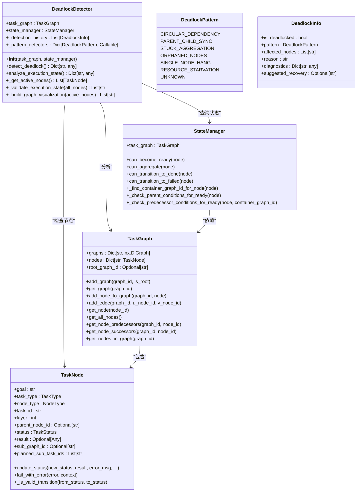
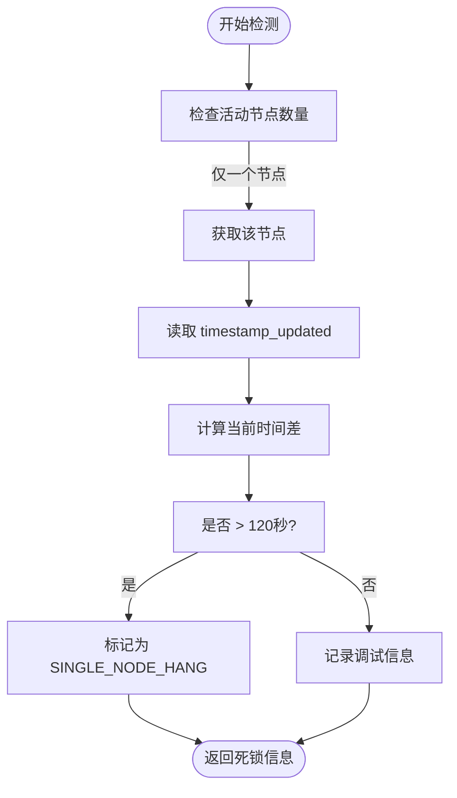
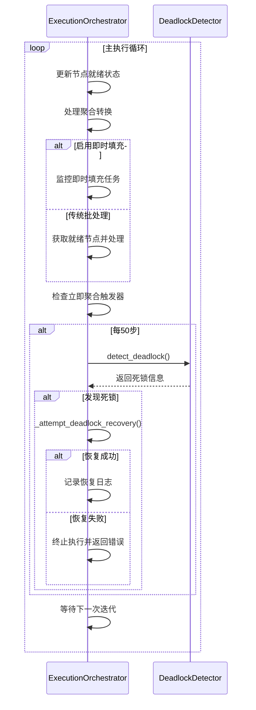

# 死锁检测与处理

<cite>
**本文档引用的文件**
- [deadlock_detector.py](file://src\sentientresearchagent\hierarchical_agent_framework\orchestration\deadlock_detector.py)
- [execution_orchestrator.py](file://src\sentientresearchagent\hierarchical_agent_framework\orchestration\execution_orchestrator.py)
- [task_node.py](file://src\sentientresearchagent\hierarchical_agent_framework\node\task_node.py)
- [task_graph.py](file://src\sentientresearchagent\hierarchical_agent_framework\graph\task_graph.py)
- [state_manager.py](file://src\sentientresearchagent\hierarchical_agent_framework\graph\state_manager.py)
</cite>

## 目录
1. [引言](#引言)
2. [死锁检测器架构](#死锁检测器架构)
3. [核心检测机制](#核心检测机制)
4. [执行循环中的周期性检查](#执行循环中的周期性检查)
5. [死锁恢复策略](#死锁恢复策略)
6. [结论](#结论)

## 引言
死锁检测器（DeadlockDetector）是系统中确保任务执行流程持续前进的关键组件。它通过多种模式识别潜在的执行停滞情况，包括循环依赖、父子节点同步问题、聚合阻塞等。本文档深入解析其工作机制，阐明如何在复杂任务图中准确识别各类死锁，并提供相应的恢复建议。

## 死锁检测器架构

**图表来源**
- [deadlock_detector.py](file://src\sentientresearchagent\hierarchical_agent_framework\orchestration\deadlock_detector.py#L76-L114)
- [task_graph.py](file://src\sentientresearchagent\hierarchical_agent_framework\graph\task_graph.py#L10-L138)
- [state_manager.py](file://src\sentientresearchagent\hierarchical_agent_framework\graph\state_manager.py#L10-L160)
- [task_node.py](file://src\sentientresearchagent\hierarchical_agent_framework\node\task_node.py#L10-L286)

**节来源**
- [deadlock_detector.py](file://src\sentientresearchagent\hierarchical_agent_framework\orchestration\deadlock_detector.py#L1-L559)
- [task_graph.py](file://src\sentientresearchagent\hierarchical_agent_framework\graph\task_graph.py#L1-L138)
- [state_manager.py](file://src\sentientresearchagent\hierarchical_agent_framework\graph\state_manager.py#L1-L160)
- [task_node.py](file://src\sentientresearchagent\hierarchical_agent_framework\node\task_node.py#L1-L286)

## 核心检测机制

### 循环依赖检测
`_detect_circular_dependencies` 方法使用深度优先搜索（DFS）遍历任务图，检测是否存在循环依赖。当发现从某个节点出发能回到自身的路径时，即判定为循环依赖死锁。

**节来源**
- [deadlock_detector.py](file://src\sentientresearchagent\hierarchical_agent_framework\orchestration\deadlock_detector.py#L116-L175)

### 父子节点同步问题检测
`_detect_parent_child_sync_issues` 方法检查运行中的父节点是否拥有无法找到容器图的挂起子节点，或 `PLAN_DONE` 状态的节点是否关联了空的子图。这类问题通常源于图结构管理不一致。

**节来源**
- [deadlock_detector.py](file://src\sentientresearchagent\hierarchical_agent_framework\orchestration\deadlock_detector.py#L177-L238)

### 聚合阻塞检测
`_detect_stuck_aggregation` 方法识别那些所有子任务已完成但自身未进入聚合阶段的 `PLAN_DONE` 节点。这表明父节点未能正确触发聚合逻辑，导致执行流停滞。

**节来源**
- [deadlock_detector.py](file://src\sentientresearchagent\hierarchical_agent_framework\orchestration\deadlock_detector.py#L240-L298)

### 孤立节点检测
`_detect_orphaned_nodes` 方法查找状态为 `PENDING` 但其父节点不存在或处于无效状态的节点。这些孤立节点因缺乏有效的父级协调而无法继续执行。

**节来源**
- [deadlock_detector.py](file://src\sentientresearchagent\hierarchical_agent_framework\orchestration\deadlock_detector.py#L300-L338)

### 单节点挂起检测
`_detect_single_node_hang` 方法监控唯一处于 `RUNNING` 状态的节点。若其运行时间超过120秒，则视为挂起。该判断基于 `timestamp_updated` 字段计算持续时间。

**图表来源**
- [deadlock_detector.py](file://src\sentientresearchagent\hierarchical_agent_framework\orchestration\deadlock_detector.py#L340-L388)

**节来源**
- [deadlock_detector.py](file://src\sentientresearchagent\hierarchical_agent_framework\orchestration\deadlock_detector.py#L340-L388)
- [task_node.py](file://src\sentientresearchagent\hierarchical_agent_framework\node\task_node.py#L10-L286)

### 检测结果解析
`detect_deadlock` 方法整合所有模式检测器的结果。一旦任一检测器返回 `is_deadlocked=True`，则立即终止后续检测并返回详细信息：
- **is_deadlocked**: 布尔标志，指示是否发生死锁
- **pattern**: 死锁类型枚举值
- **affected_nodes**: 受影响节点ID列表
- **reason**: 人类可读的原因描述
- **diagnostics**: 诊断数据字典
- **suggested_recovery**: 推荐的恢复操作

**节来源**
- [deadlock_detector.py](file://src\sentientresearchagent\hierarchical_agent_framework\orchestration\deadlock_detector.py#L76-L114)

## 执行循环中的周期性检查

**图表来源**
- [execution_orchestrator.py](file://src\sentientresearchagent\hierarchical_agent_framework\orchestration\execution_orchestrator.py#L226-L502)

**节来源**
- [execution_orchestrator.py](file://src\sentientresearchagent\hierarchical_agent_framework\orchestration\execution_orchestrator.py#L226-L502)

每50步进行一次死锁检测的设计考量在于平衡性能开销与响应速度。过于频繁的检测会增加不必要的计算负担，而间隔过长则可能导致问题长时间未被发现。50步的间隔提供了合理的折衷，确保系统能在合理时间内响应潜在的停滞状况。

## 死锁恢复策略

针对不同类型的死锁，应采取相应的恢复措施：

| 死锁类型 | 恢复策略 |
|---------|--------|
| 循环依赖 | 手动干预，强制其中一个节点失败以打破循环 |
| 父子同步问题 | 强制父节点进入 `PLAN_DONE` 或修复子图引用 |
| 聚合阻塞 | 强制执行聚合操作或使未完成的子节点失败 |
| 孤立节点 | 修正父节点状态或将孤立节点转为 `READY` |
| 单节点挂起 | 强制该节点转为 `NEEDS_REPLAN` 或 `FAILED` |

此外，建议配置预防性超时中断，对长时间处于 `RUNNING` 状态的任务自动触发恢复流程。关键路径上的节点应设置专门的监控告警，以便及时发现潜在风险。

**节来源**
- [deadlock_detector.py](file://src\sentientresearchagent\hierarchical_agent_framework\orchestration\deadlock_detector.py#L1-L559)
- [execution_orchestrator.py](file://src\sentientresearchagent\hierarchical_agent_framework\orchestration\execution_orchestrator.py#L226-L502)

## 结论
死锁检测器通过多维度的模式识别，有效保障了复杂任务系统的稳定运行。其与执行编排器的协同工作，实现了对执行停滞的及时发现和自动化恢复。理解其内部机制有助于开发者更好地设计健壮的任务流程，并在出现问题时快速定位和解决。