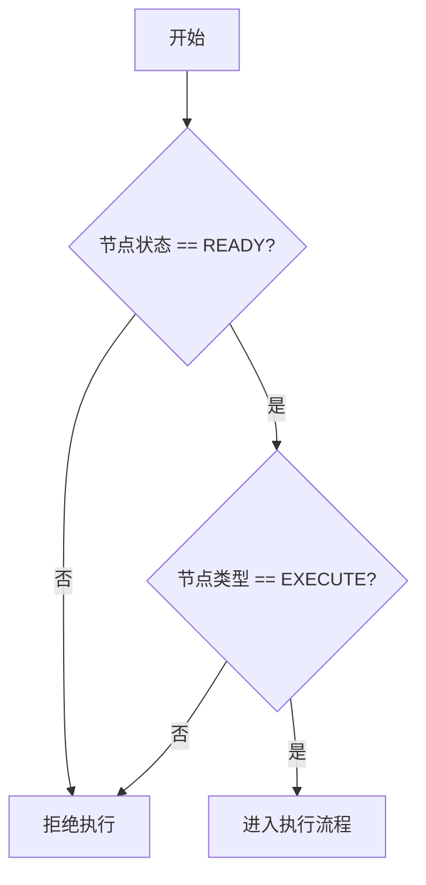
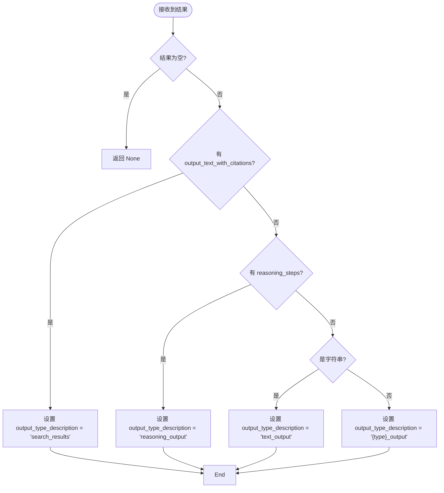
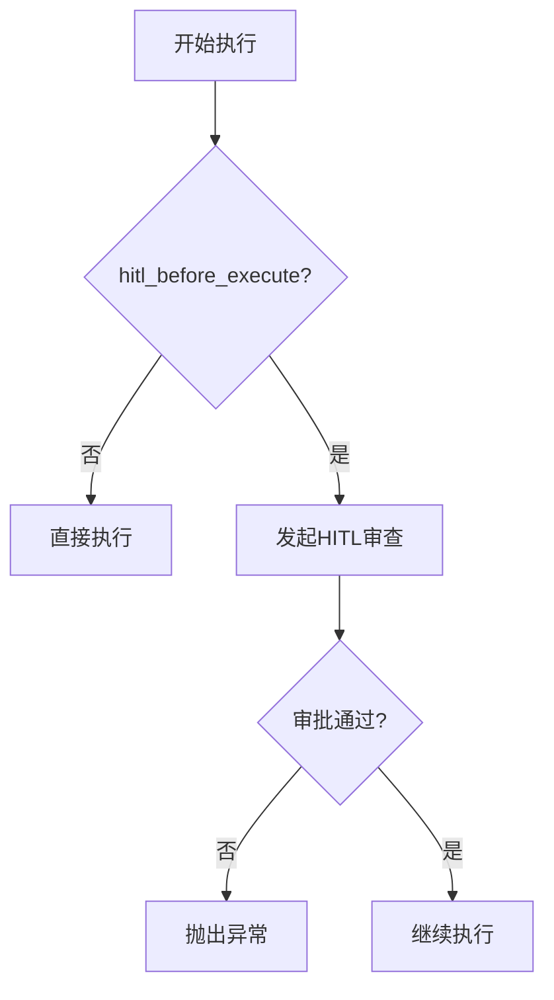
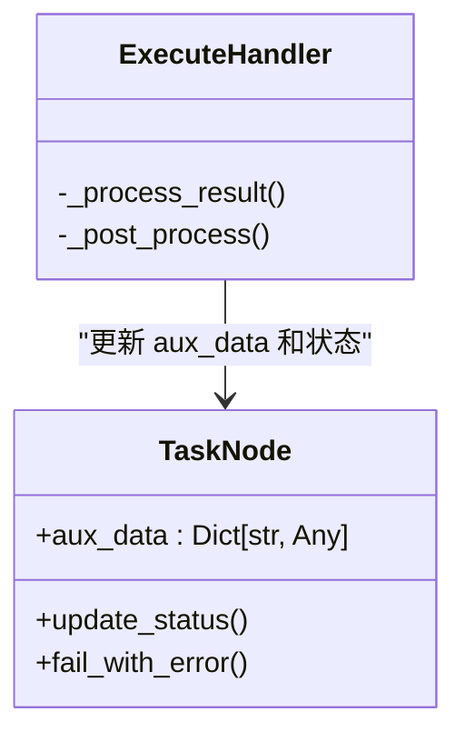
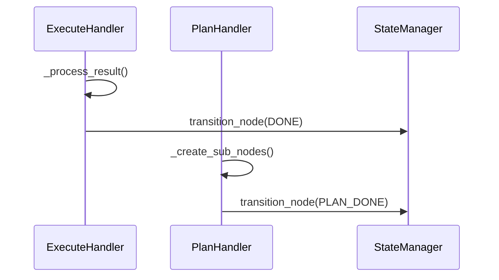

# 执行处理器

<cite>
**本文档中引用的文件**
- [execute_handler.py](file://src/sentientresearchagent/hierarchical_agent_framework/node_handlers/execute_handler.py)
- [plan_handler.py](file://src/sentientresearchagent/hierarchical_agent_framework/node_handlers/plan_handler.py)
- [base_handler.py](file://src/sentientresearchagent/hierarchical_agent_framework/node_handlers/base_handler.py)
- [task_node.py](file://src/sentientresearchagent/hierarchical_agent_framework/node/task_node.py)
- [agent_io_models.py](file://src/sentientresearchagent/hierarchical_agent_framework/context/agent_io_models.py)
</cite>

## 目录
1. [执行流程概述](#执行流程概述)
2. [执行代理获取与上下文构建](#执行代理获取与上下文构建)
3. [任务执行与结果处理](#任务执行与结果处理)
4. [人工审批前置流程](#人工审批前置流程)
5. [元数据记录机制](#元数据记录机制)
6. [与PlanHandler的对比分析](#与planhandler的对比分析)

## 执行流程概述

`ExecuteHandler` 是负责处理需要执行的任务节点的核心组件。其主要职责包括：获取执行代理、构建执行上下文、触发具体任务执行、处理返回结果以及管理人工审批（HITL）流程。

该处理器继承自 `BaseNodeHandler`，遵循统一的处理模式：状态验证 → 上下文构建 → 主逻辑处理 → 结果后处理。整个执行流程通过 `_process` 方法协调完成，并在过程中集成日志记录、追踪和错误处理机制。

**节来源**
- [execute_handler.py](file://src/sentientresearchagent/hierarchical_agent_framework/node_handlers/execute_handler.py#L41-L82)
- [base_handler.py](file://src/sentientresearchagent/hierarchical_agent_framework/node_handlers/base_handler.py#L66-L148)

## 执行代理获取与上下文构建

### 状态验证

在开始执行前，`_validate_node_state` 方法会检查节点是否处于可执行状态：

- 节点状态必须为 `READY`
- 节点类型必须为 `EXECUTE`

只有同时满足这两个条件的节点才会被允许进入执行阶段。



**图来源**
- [execute_handler.py](file://src/sentientresearchagent/hierarchical_agent_framework/node_handlers/execute_handler.py#L29-L35)

### 上下文构建

使用基类提供的 `_build_context_for_node` 方法构建执行所需的上下文环境。此方法调用 `ContextBuilderService` 服务，结合当前节点信息、知识库和任务图结构生成完整的输入上下文。

构建完成后，上下文内容会被序列化并存储到 `node.input_payload_dict` 中，用于后续追踪和调试。

**节来源**
- [base_handler.py](file://src/sentientresearchagent/hierarchical_agent_framework/node_handlers/base_handler.py#L297-L319)
- [execute_handler.py](file://src/sentientresearchagent/hierarchical_agent_framework/node_handlers/execute_handler.py#L41-L82)

## 任务执行与结果处理

### 任务执行

通过 `_get_agent_for_node` 方法从代理注册表中获取合适的执行器代理。该过程由 `AgentSelector` 服务根据节点的任务类型和动作动词（"execute"）进行决策。

一旦获得执行器，即调用其 `process` 方法执行实际任务，并传入节点、上下文和追踪管理器作为参数。

### 结果分类处理

`_process_result` 方法负责对执行结果进行语义分类，并设置 `output_type_description` 字段以标注结果类型：

- 若结果包含 `output_text_with_citations` 属性，则标记为 `"search_results"`
- 若结果包含 `reasoning_steps` 属性，则标记为 `"reasoning_output"`
- 若结果为字符串类型，则标记为 `"text_output"`
- 其他情况则标记为 `{type}_output` 格式

这种分类机制使得系统能够根据不同类型的结果采取相应的后续处理策略。



**图来源**
- [execute_handler.py](file://src/sentientresearchagent/hierarchical_agent_framework/node_handlers/execute_handler.py#L100-L142)

**节来源**
- [execute_handler.py](file://src/sentientresearchagent/hierarchical_agent_framework/node_handlers/execute_handler.py#L100-L142)

## 人工审批前置流程

当配置项 `hitl_before_execute` 启用时，系统会在执行任务前触发人工审批流程：

```python
hitl_before_execute = context.config.get("execution", {}).get("hitl_before_execute", False)
```

若启用，将调用 `_review_execution` 方法通过 `HITLService` 发起审查请求。只有当返回状态为 `"approved"` 时，任务才会继续执行；否则抛出异常终止流程。

若未配置 HITL 服务，则自动批准执行。



**图来源**
- [execute_handler.py](file://src/sentientresearchagent/hierarchical_agent_framework/node_handlers/execute_handler.py#L84-L98)

**节来源**
- [execute_handler.py](file://src/sentientresearchagent/hierarchical_agent_framework/node_handlers/execute_handler.py#L41-L82)

## 元数据记录机制

在 `_post_process` 阶段，系统会收集并存储关键执行元数据至 `node.aux_data['execution_details']`：

- **模型信息**：通过 `executor.get_model_info()` 获取执行所使用的模型详情
- **执行时间**：记录节点最后更新时间戳 `node.timestamp_updated`

这些信息可用于性能监控、成本核算和审计追踪。

此外，还会调用基类的 `_handle_agent_result` 方法生成结果摘要并更新节点状态为 `DONE`。



**图来源**
- [execute_handler.py](file://src/sentientresearchagent/hierarchical_agent_framework/node_handlers/execute_handler.py#L144-L167)
- [task_node.py](file://src/sentientresearchagent/hierarchical_agent_framework/node/task_node.py#L18-L285)

**节来源**
- [execute_handler.py](file://src/sentientresearchagent/hierarchical_agent_framework/node_handlers/execute_handler.py#L144-L167)

## 与PlanHandler的对比分析

### 状态验证差异

| 处理器 | 验证状态 | 验证节点类型 |
|-------|---------|------------|
| ExecuteHandler | READY | EXECUTE |
| PlanHandler | READY | PLAN |

两者均要求节点状态为 `READY`，但分别对应不同的节点类型。

**节来源**
- [execute_handler.py](file://src/sentientresearchagent/hierarchical_agent_framework/node_handlers/execute_handler.py#L29-L35)
- [plan_handler.py](file://src/sentientresearchagent/hierarchical_agent_framework/node_handlers/plan_handler.py#L30-L36)

### 结果处理差异

| 特性 | ExecuteHandler | PlanHandler |
|------|----------------|-------------|
| 主要输出 | 原始执行结果（文本、搜索等） | 计划输出（PlanOutput） |
| 结果分类 | 按属性动态分类 | 固定为计划类型 |
| 后续操作 | 直接完成 | 创建子节点或修改计划 |
| 成功状态 | DONE | PLAN_DONE |

`PlanHandler` 在成功规划后会创建子节点并通过 `_create_sub_nodes` 方法组织新的任务图结构，而 `ExecuteHandler` 则直接完成任务。



**图来源**
- [execute_handler.py](file://src/sentientresearchagent/hierarchical_agent_framework/node_handlers/execute_handler.py#L144-L167)
- [plan_handler.py](file://src/sentientresearchagent/hierarchical_agent_framework/node_handlers/plan_handler.py#L186-L217)

**节来源**
- [execute_handler.py](file://src/sentientresearchagent/hierarchical_agent_framework/node_handlers/execute_handler.py#L144-L167)
- [plan_handler.py](file://src/sentientresearchagent/hierarchical_agent_framework/node_handlers/plan_handler.py#L186-L217)