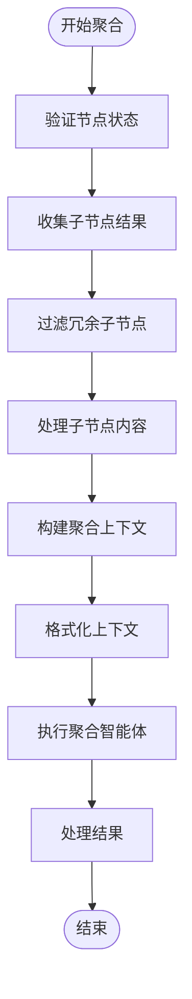
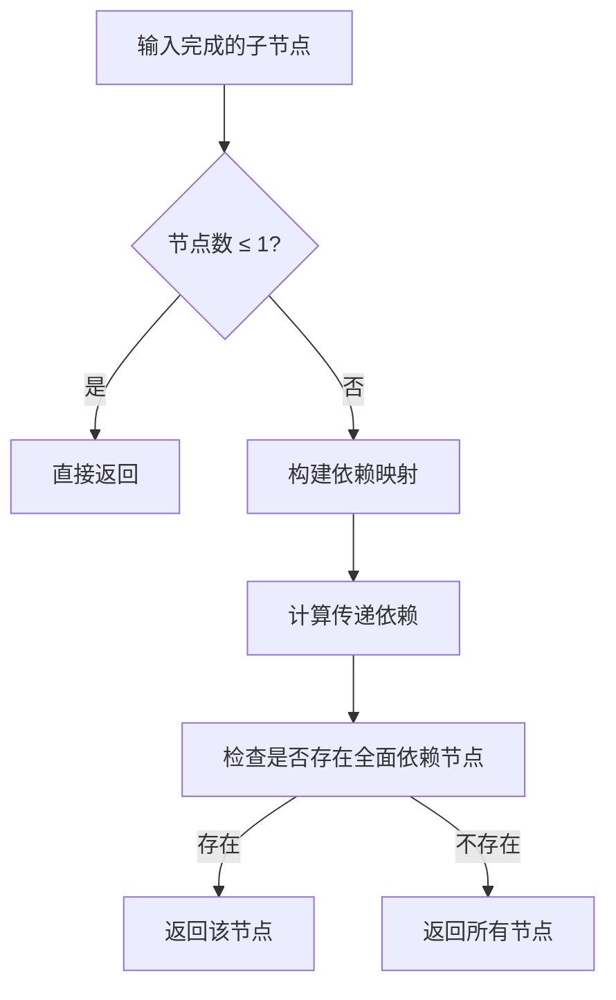

# 聚合处理器

<cite>
**本文档中引用的文件**
- [aggregate_handler.py](file://src\sentientresearchagent\hierarchical_agent_framework\node_handlers\aggregate_handler.py)
- [context_formatter.py](file://src\sentientresearchagent\hierarchical_agent_framework\services\context_formatter.py)
- [task_node.py](file://src\sentientresearchagent\hierarchical_agent_framework\node\task_node.py)
- [base_handler.py](file://src\sentientresearchagent\hierarchical_agent_framework\node_handlers\base_handler.py)
- [agent_io_models.py](file://src\sentientresearchagent\hierarchical_agent_framework\context\agent_io_models.py)
- [task_graph.py](file://src\sentientresearchagent\hierarchical_agent_framework\graph\task_graph.py)
</cite>

## 目录
1. [引言](#引言)
2. [聚合机制总览](#聚合机制总览)
3. [_collect_child_results：子节点结果收集](#_collect_child_results：子节点结果收集)
4. [_filter_redundant_children：冗余信息剔除](#_filter_redundant_children：冗余信息剔除)
5. [_process_child_content：内容提取规则](#_process_child_content：内容提取规则)
6. [_build_aggregation_context：上下文整合](#_build_aggregation_context：上下文整合)
7. [ContextFormatter.format_context：结构化输入生成](#contextformatterformat_context：结构化输入生成)
8. [非冗余子节点优化策略](#非冗余子节点优化策略)
9. [设计考量与效率提升](#设计考量与效率提升)
10. [结论](#结论)

## 引言
`AggregateHandler` 是分层智能体框架中的核心组件，负责对任务图中已完成的子节点结果进行聚合处理。该处理器通过一系列算法逻辑实现高效、精准的信息整合，包括从任务图中收集子节点结果、基于依赖关系分析剔除冗余信息、整合横向依赖上下文，并最终生成结构化的聚合输入供上层智能体使用。本文将深入解析其内部工作机制，重点阐述关键方法的设计原理与实现细节。

## 聚合机制总览
`AggregateHandler` 的主要职责是协调和执行聚合操作，确保父节点能够基于所有相关子任务的结果做出综合判断或生成最终输出。整个聚合流程遵循以下步骤：
1. 验证节点状态是否处于 `AGGREGATING` 状态。
2. 收集所有已完成（`DONE` 或 `FAILED`）的子节点结果。
3. 利用依赖关系分析过滤掉冗余的子节点输出。
4. 将筛选后的结果与横向依赖上下文合并，构建完整的聚合上下文。
5. 使用统一格式化服务生成标准化的输入文本。
6. 执行聚合智能体并处理返回结果。

该机制不仅提升了系统整体的信息利用率，还显著减少了不必要的计算开销。



**Diagram sources**
- [aggregate_handler.py](file://src\sentientresearchagent\hierarchical_agent_framework\node_handlers\aggregate_handler.py#L0-L313)

**Section sources**
- [aggregate_handler.py](file://src\sentientresearchagent\hierarchical_agent_framework\node_handlers\aggregate_handler.py#L0-L313)

## _collect_child_results：子节点结果收集
`_collect_child_results` 方法负责从任务图中获取指定父节点的所有已完成子节点结果，并将其转换为可用于后续处理的 `ContextItem` 对象列表。

该方法首先检查当前节点是否存在子图标识符（`sub_graph_id`），若不存在则记录警告并返回空列表。随后，通过 `TaskGraph.get_nodes_in_graph` 获取属于该子图的所有节点，并筛选出状态为 `DONE` 或 `FAILED` 的完成节点。接着调用 `_filter_redundant_children` 进一步去除冗余项，最后遍历非冗余子节点，提取其结果或错误信息，并通过 `_process_child_content` 处理内容后封装成 `ContextItem`。

此过程确保了只有有效且必要的子节点输出才会被纳入聚合范围。

**Section sources**
- [aggregate_handler.py](file://src\sentientresearchagent\hierarchical_agent_framework\node_handlers\aggregate_handler.py#L74-L138)
- [task_graph.py](file://src\sentientresearchagent\hierarchical_agent_framework\graph\task_graph.py#L115-L128)
- [task_node.py](file://src\sentientresearchagent\hierarchical_agent_framework\node\task_node.py#L18-L285)

## _filter_redundant_children：冗余信息剔除
`_filter_redundant_children` 方法实现了基于依赖关系分析的智能去重算法。其核心思想是：如果某个子节点在逻辑上依赖于其他所有兄弟节点（直接或传递依赖），那么仅保留该节点即可，因为它已经包含了所有前置任务的信息。

具体实现如下：
1. 构建每个子节点的直接依赖映射表，依赖信息来源于 `aux_data.depends_on_indices` 并结合父节点的 `planned_sub_task_ids` 映射为实际任务ID。
2. 使用递归函数 `get_transitive_deps` 计算每个节点的传递依赖集合。
3. 遍历所有子节点，检查是否存在某节点的传递依赖包含其余所有兄弟节点；若存在，则立即返回该单一节点作为代表。
4. 若无此类“综合性”节点，则保留全部子节点。

这种策略有效避免了重复信息的叠加，提高了聚合效率与质量。



**Diagram sources**
- [aggregate_handler.py](file://src\sentientresearchagent\hierarchical_agent_framework\node_handlers\aggregate_handler.py#L140-L217)

**Section sources**
- [aggregate_handler.py](file://src\sentientresearchagent\hierarchical_agent_framework\node_handlers\aggregate_handler.py#L140-L217)
- [task_node.py](file://src\sentientresearchagent\hierarchical_agent_framework\node\task_node.py#L18-L285)

## _process_child_content：内容提取规则
`_process_child_content` 方法定义了如何从不同类型的子节点输出中提取有意义的内容字符串。无论原始数据是字符串、对象还是字典，该方法都能通过反射机制识别关键字段并提取完整内容，且不进行任何截断。

处理逻辑优先级如下：
1. 若内容为空，返回 `"No output for: {goal}"`。
2. 若为字符串，直接返回。
3. 若对象具有 `output_text_with_citations` 或 `output_text` 属性，优先提取。
4. 若为搜索结果类对象，格式化查询与结果摘要。
5. 若为字典，查找上述字段或返回计划任务数量描述。
6. 默认情况下调用 `str()` 转换。

该方法依赖 `ContextFormatter._extract_output` 实现通用提取逻辑，保证了内容提取的一致性与完整性。

**Section sources**
- [aggregate_handler.py](file://src\sentientresearchagent\hierarchical_agent_framework\node_handlers\aggregate_handler.py#L219-L240)
- [context_formatter.py](file://src\sentientresearchagent\hierarchical_agent_framework\services\context_formatter.py#L211-L257)

## _build_aggregation_context：上下文整合
`_build_aggregation_context` 方法负责将子节点结果与横向依赖上下文融合，形成完整的聚合输入环境。

其实现分为两步：
1. 调用基类的 `_build_context_for_node` 方法获取包含横向依赖的基础上下文（如 `AgentTaskInput`）。
2. 将 `_collect_child_results` 返回的 `child_results` 添加至 `relevant_context_items` 字段中。若已有上下文项则追加，否则新建列表。
3. 更新 `formatted_full_context` 字段，调用 `ContextFormatter.format_context` 以 `AGGREGATION` 模式格式化所有上下文项，并附带状态信息（`statuses`）。

最终返回的上下文对象既包含了子任务成果，也继承了原有的依赖背景，为聚合智能体提供了全面的信息支持。

**Section sources**
- [aggregate_handler.py](file://src\sentientresearchagent\hierarchical_agent_framework\node_handlers\aggregate_handler.py#L242-L292)
- [base_handler.py](file://src\sentientresearchagent\hierarchical_agent_framework\node_handlers\base_handler.py#L297-L319)
- [agent_io_models.py](file://src\sentientresearchagent\hierarchical_agent_framework\context\agent_io_models.py#L102-L118)

## ContextFormatter.format_context：结构化输入生成
`ContextFormatter.format_context` 是一个统一的上下文格式化服务，根据不同的 `ContextFormat` 类型生成标准化的文本表示。在聚合场景下，使用 `ContextFormat.AGGREGATION` 模式生成如下结构：

```
=== Child Task Results ===

Task ID: root.1.1
Goal: [具体目标]
Status: DONE
Output:
[完整输出内容]

Task ID: root.1.2
Goal: [具体目标]
Status: DONE
Output:
[完整输出内容]
```

该方法接收 `context_items` 列表及附加信息（如状态字典），逐项渲染任务ID、目标、状态和输出内容，确保信息清晰可读。通过统一格式，降低了下游智能体解析上下文的复杂度，增强了系统的可维护性。

**Section sources**
- [context_formatter.py](file://src\sentientresearchagent\hierarchical_agent_framework\services\context_formatter.py#L84-L110)
- [context_formatter.py](file://src\sentientresearchagent\hierarchical_agent_framework\services\context_formatter.py#L16-L21)

## 非冗余子节点优化策略
`_non_redundant_children` 优化策略的核心在于利用任务间的依赖关系图谱，识别并排除信息冗余的子节点。当一个子节点在其依赖链中涵盖了所有其他兄弟节点时，说明它已隐式整合了这些节点的输出，因此无需再单独引入它们。

这一策略的优势体现在：
- **减少输入长度**：避免将大量重复信息传递给聚合智能体，降低LLM上下文压力。
- **提高决策效率**：简化输入结构，使智能体能更快聚焦于关键差异点。
- **增强逻辑一致性**：防止因多源信息冲突导致的误判。

此外，该策略具备良好的扩展性，适用于任意层级的任务分解结构。

**Section sources**
- [aggregate_handler.py](file://src\sentientresearchagent\hierarchical_agent_framework\node_handlers\aggregate_handler.py#L140-L217)

## 设计考量与效率提升
`AggregateHandler` 在设计上充分考虑了性能、健壮性与可维护性之间的平衡：
- **模块化分工**：继承自 `BaseNodeHandler`，复用通用功能（如上下文构建、代理选择、结果处理），专注实现聚合逻辑。
- **异步处理**：所有关键方法均为异步函数，适应高并发任务调度需求。
- **日志透明化**：关键步骤均配有详细日志输出，便于调试与监控。
- **容错机制**：对缺失任务图、空结果等情况进行优雅降级处理。
- **统一格式服务**：通过 `ContextFormatter` 集中管理上下文呈现方式，避免各组件格式混乱。

这些设计共同保障了聚合机制的高效运行，使其成为整个分层智能体系统中不可或缺的关键环节。

**Section sources**
- [aggregate_handler.py](file://src\sentientresearchagent\hierarchical_agent_framework\node_handlers\aggregate_handler.py#L0-L313)
- [base_handler.py](file://src\sentientresearchagent\hierarchical_agent_framework\node_handlers\base_handler.py#L151-L161)
- [base_handler.py](file://src\sentientresearchagent\hierarchical_agent_framework\node_handlers\base_handler.py#L256-L295)

## 结论
`AggregateHandler` 通过一套完整的聚合机制，实现了对子节点结果的高效收集、去重、整合与格式化。其核心方法 `_collect_child_results`、`_filter_redundant_children`、`_process_child_content` 和 `_build_aggregation_context` 各司其职，协同工作，配合 `ContextFormatter` 提供的标准化输出能力，构建了一个强大而灵活的聚合引擎。该设计不仅提升了信息处理效率，也为上层智能体提供了高质量的决策依据，体现了系统在架构设计上的深思熟虑与工程实践的成熟度。