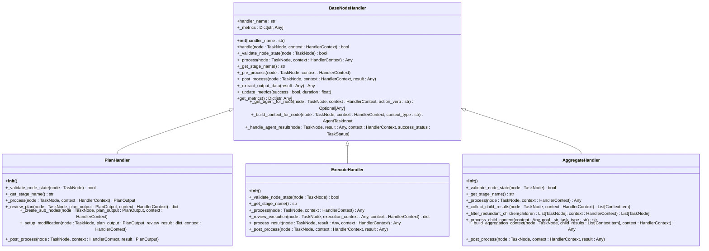

# 节点处理

<cite>
**本文档中引用的文件 **  
- [plan_handler.py](file://src\sentientresearchagent\hierarchical_agent_framework\node_handlers\plan_handler.py)
- [base_handler.py](file://src\sentientresearchagent\hierarchical_agent_framework\node_handlers\base_handler.py)
- [execute_handler.py](file://src\sentientresearchagent\hierarchical_agent_framework\node_handlers\execute_handler.py)
- [aggregate_handler.py](file://src\sentientresearchagent\hierarchical_agent_framework\node_handlers\aggregate_handler.py)
- [task_node.py](file://src\sentientresearchagent\hierarchical_agent_framework\node\task_node.py)
- [context_builder_service.py](file://src\sentientresearchagent\hierarchical_agent_framework\services\context_builder_service.py)
- [agent_selector.py](file://src\sentientresearchagent\hierarchical_agent_framework\services\agent_selector.py)
- [hitl_service.py](file://src\sentientresearchagent\hierarchical_agent_framework\services\hitl_service.py)
- [state_transition_manager.py](file://src\sentientresearchagent\hierarchical_agent_framework\orchestration\state_transition_manager.py)
- [trace_manager.py](file://src\sentientresearchagent\hierarchical_agent_framework\tracing\manager.py)
- [task_graph.py](file://src\sentientresearchagent\hierarchical_agent_framework\graph\task_graph.py)
- [knowledge_store.py](file://src\sentientresearchagent\hierarchical_agent_framework\context\knowledge_store.py)
- [context_formatter.py](file://src\sentientresearchagent\hierarchical_agent_framework\services\context_formatter.py)
- [node_creation_utils.py](file://src\sentientresearchagent\hierarchical_agent_framework\node\node_creation_utils.py)
</cite>

## 目录
1. [引言](#引言)
2. [节点处理器家族职责分工](#节点处理器家族职责分工)
3. [PlanHandler继承实现分析](#planhandler继承实现分析)
4. [代理适配器动态获取机制](#代理适配器动态获取机制)
5. [规划上下文准备过程](#规划上下文准备过程)
6. [子任务网络构建原理](#子任务网络构建原理)
7. [HITL评审流程介入机制](#hitl评审流程介入机制)
8. [执行与聚合处理器对比](#执行与聚合处理器对比)
9. [单一职责设计哲学](#单一职责设计哲学)

## 引言
本项目采用分层智能体框架，通过节点处理器（Node Handler）家族实现复杂任务的分解与执行。系统核心由多种处理器构成，每个处理器负责特定阶段的处理逻辑，包括规划、执行和聚合等关键环节。这些处理器共同协作，形成一个完整的任务处理流水线。

在该架构中，`BaseNodeHandler`作为所有处理器的基类，提供了统一的接口和通用功能。具体处理器如`PlanHandler`、`ExecuteHandler`和`AggregateHandler`分别继承自基类，并实现各自特有的业务逻辑。这种设计模式确保了代码的一致性和可维护性。

整个系统的工作流程始于根节点的任务分解，经过多层递归规划，最终生成可执行的原子任务。每个节点的状态转换由状态管理器控制，而人类干预（HITL）机制则为关键决策点提供人工审核能力。上下文构建服务负责为各个处理阶段准备必要的信息支持。

**Section sources**
- [plan_handler.py](file://src\sentientresearchagent\hierarchical_agent_framework\node_handlers\plan_handler.py#L1-L20)
- [base_handler.py](file://src\sentientresearchagent\hierarchical_agent_framework\node_handlers\base_handler.py#L1-L50)

## 节点处理器家族职责分工
节点处理器家族是系统的核心组件，负责协调和执行不同类型的节点处理任务。这个家族包含多个专门化的处理器，每个处理器都有明确的职责范围和处理范式。

`PlanHandler`主要负责处理需要进行任务分解的节点。它通过调用规划代理生成子任务列表，并根据配置决定是否需要人工审核。一旦规划完成，它会触发子节点创建流程，将高层次目标转化为具体的执行单元。

`ExecuteHandler`专注于实际任务的执行工作。当节点被标记为可执行状态时，此处理器会选择合适的执行代理来完成具体操作。它可以处理各种类型的任务，包括搜索、推理和内容生成等，并能根据结果类型进行适当的后处理。

`AggregateHandler`的作用是在子任务完成后汇总结果。它收集所有已完成子节点的输出，过滤冗余信息，并利用聚合代理生成最终的综合结论。该处理器还实现了智能依赖分析，能够识别出包含其他所有结果的综合性子节点。

此外，系统还包括`ReadyNodeHandler`用于初始化新节点，以及`ReplanHandler`用于处理需要重新规划的情况。这些处理器共同构成了一个完整的闭环处理体系。



**Diagram sources **
- [base_handler.py](file://src\sentientresearchagent\hierarchical_agent_framework\node_handlers\base_handler.py#L43-L372)
- [plan_handler.py](file://src\sentientresearchagent\hierarchical_agent_framework\node_handlers\plan_handler.py#L15-L217)
- [execute_handler.py](file://src\sentientresearchagent\hierarchical_agent_framework\node_handlers\execute_handler.py#L14-L167)
- [aggregate_handler.py](file://src\sentientresearchagent\hierarchical_agent_framework\node_handlers\aggregate_handler.py#L16-L313)

**Section sources**
- [base_handler.py](file://src\sentientresearchagent\hierarchical_agent_framework\node_handlers\base_handler.py#L43-L372)
- [plan_handler.py](file://src\sentientresearchagent\hierarchical_agent_framework\node_handlers\plan_handler.py#L15-L217)
- [execute_handler.py](file://src\sentientresearchagent\hierarchical_agent_framework\node_handlers\execute_handler.py#L14-L167)
- [aggregate_handler.py](file://src\sentientresearchagent\hierarchical_agent_framework\node_handlers\aggregate_handler.py#L16-L313)

## PlanHandler继承实现分析
`PlanHandler`作为`BaseNodeHandler`的具体实现，完整地展示了如何通过继承机制扩展基础功能以满足特定需求。该处理器专门处理需要进行任务分解的节点，其核心逻辑集中在_planning阶段的实现上。

从继承关系来看，`PlanHandler`首先重写了基类中的抽象方法，包括`_validate_node_state`、`_process`和`_get_stage_name`。这些方法共同定义了处理器的行为特征。例如，`_validate_node_state`方法确保只有状态为READY且类型为PLAN的节点才能被处理。

在`_process`方法中，`PlanHandler`实现了完整的规划流程。它首先检查递归深度限制，防止无限嵌套。然后通过`_get_agent_for_node`获取规划代理，使用`_build_context_for_node`准备上下文数据。最后执行规划并处理输出结果。

值得注意的是，`PlanHandler`还实现了几个特有方法，如`_review_plan`用于人工审核，`_create_sub_nodes`用于生成子节点网络。这些方法虽然不是基类强制要求的，但它们构成了处理器的核心功能。


**Diagram sources **
- [plan_handler.py](file://src\sentientresearchagent\hierarchical_agent_framework\node_handlers\plan_handler.py#L15-L217)
- [base_handler.py](file://src\sentientresearchagent\hierarchical_agent_framework\node_handlers\base_handler.py#L43-L372)

**Section sources**
- [plan_handler.py](file://src\sentientresearchagent\hierarchical_agent_framework\node_handlers\plan_handler.py#L15-L217)
- [base_handler.py](file://src\sentientresearchagent\hierarchical_agent_framework\node_handlers\base_handler.py#L43-L372)

## 代理适配器动态获取机制
`_get_agent_for_node`方法是系统中实现动态代理选择的关键机制。该方法位于`BaseNodeHandler`基类中，为所有继承者提供了统一的代理获取接口。其设计体现了高度的灵活性和可扩展性。

该方法接收三个参数：待处理的节点、上下文对象和动作动词。通过动作动词（如"plan"、"execute"、"aggregate"），系统可以确定所需代理的角色类型。结合节点的任务类型，代理选择服务能够精确匹配最合适的代理实例。

具体实现中，首先调用`agent_selector.select_agent`方法进行代理选择。这个选择过程考虑了多种因素，包括任务类型、节点层级和配置策略。一旦确定代理名称，就会更新到节点的`agent_name`属性中，便于后续追踪。

随后，通过`agent_registry.get_agent_adapter`从注册表中获取对应的适配器实例。注册表维护着所有可用代理的映射关系，确保每次都能快速定位到正确的适配器。如果找不到匹配项，则返回None并记录错误日志。


**Diagram sources **
- [base_handler.py](file://src\sentientresearchagent\hierarchical_agent_framework\node_handlers\base_handler.py#L256-L295)
- [agent_selector.py](file://src\sentientresearchagent\hierarchical_agent_framework\services\agent_selector.py#L56-L348)
- [agent_registry.py](file://src\sentientresearchagent\hierarchical_agent_framework\agents\registry.py#L7-L145)

**Section sources**
- [base_handler.py](file://src\sentientresearchagent\hierarchical_agent_framework\node_handlers\base_handler.py#L256-L295)
- [agent_selector.py](file://src\sentientresearchagent\hierarchical_agent_framework\services\agent_selector.py#L56-L348)
- [agent_registry.py](file://src\sentientresearchagent\hierarchical_agent_framework\agents\registry.py#L7-L145)

## 规划上下文准备过程
`_build_context_for_node`方法在规划阶段扮演着至关重要的角色，负责为规划代理准备必要的上下文信息。该方法由`BaseNodeHandler`提供，确保所有处理器都能以一致的方式构建上下文。

当`PlanHandler`调用此方法时，会指定"context_type"为"planning"。这使得上下文构建服务能够针对性地组织相关信息。构建过程主要包括以下几个方面：

首先是父级层次结构上下文，它包含了从根节点到当前节点的完整路径信息。这对于理解任务在整个项目中的位置至关重要。其次是水平依赖关系，即同级节点之间的关联性分析。

相似任务的历史记录也会被纳入考虑范围，特别是那些成功完成的类似规划案例。此外，任何附加的上下文信息都会被整合进来，形成一个全面的信息包。

最终生成的上下文对象不仅包含原始数据，还经过格式化处理，使其更适合代理理解和使用。这个过程保证了规划代理能够在充分了解背景的情况下做出最优决策。


**Diagram sources **
- [base_handler.py](file://src\sentientresearchagent\hierarchical_agent_framework\node_handlers\base_handler.py#L297-L319)
- [context_builder_service.py](file://src\sentientresearchagent\hierarchical_agent_framework\services\context_builder_service.py#L45-L598)

**Section sources**
- [base_handler.py](file://src\sentientresearchagent\hierarchical_agent_framework\node_handlers\base_handler.py#L297-L319)
- [context_builder_service.py](file://src\sentientresearchagent\hierarchical_agent_framework\services\context_builder_service.py#L45-L598)

## 子任务网络构建原理
`_create_sub_nodes`方法负责将规划输出转化为可执行的子任务网络，这是任务分解过程的关键步骤。该方法在`PlanHandler`中实现，直接决定了子节点的创建方式和组织结构。

当接收到有效的规划输出时，方法首先导入`SubNodeCreator`工具类。这个设计避免了循环依赖问题，同时保持了代码的模块化特性。然后，它将规划结果存储在节点的result和aux_data字段中。

接下来，方法会生成一个简洁的结果摘要，帮助用户快速了解规划内容。对于包含多个子任务的情况，只显示前三个任务的概要，其余用省略号表示。这既提供了足够信息，又不会造成信息过载。

最后，节点状态被更新为PLAN_DONE，标志着规划阶段的完成。需要注意的是，实际的子节点创建是由系统其他组件完成的，因为处理器本身没有直接访问任务图的权限。


**Diagram sources **
- [plan_handler.py](file://src\sentientresearchagent\hierarchical_agent_framework\node_handlers\plan_handler.py#L128-L162)
- [node_creation_utils.py](file://src\sentientresearchagent\hierarchical_agent_framework\node\node_creation_utils.py#L9-L97)

**Section sources**
- [plan_handler.py](file://src\sentientresearchagent\hierarchical_agent_framework\node_handlers\plan_handler.py#L128-L162)
- [node_creation_utils.py](file://src\sentientresearchagent\hierarchical_agent_framework\node\node_creation_utils.py#L9-L97)

## HITL评审流程介入机制
`_review_plan`方法实现了人类干预（HITL）评审流程，允许在关键决策点引入人工审核。该方法在`PlanHandler`中定义，为规划结果的质量控制提供了重要保障。

当系统检测到HITL服务可用时，会自动调用此方法进行评审。评审过程通过`hitl_service.review_plan`接口发起，传递节点信息、规划输出和规划上下文作为评审依据。

评审结果通常包含三种状态：批准、请求修改或拒绝。如果是批准状态，系统将继续执行后续的子节点创建流程。若为请求修改，则会设置相应的修改指令并转入重规划状态。

这种方法的设计充分考虑了用户体验，既保留了自动化处理的效率优势，又不失灵活性。通过配置选项，可以控制哪些级别的节点需要人工审核，从而平衡自动化程度和控制精度。


**Diagram sources **
- [plan_handler.py](file://src\sentientresearchagent\hierarchical_agent_framework\node_handlers\plan_handler.py#L115-L126)
- [hitl_service.py](file://src\sentientresearchagent\hierarchical_agent_framework\services\hitl_service.py#L75-L472)

**Section sources**
- [plan_handler.py](file://src\sentientresearchagent\hierarchical_agent_framework\node_handlers\plan_handler.py#L115-L126)
- [hitl_service.py](file://src\sentientresearchagent\hierarchical_agent_framework\services\hitl_service.py#L75-L472)

## 执行与聚合处理器对比
`ExecuteHandler`和`AggregateHandler`代表了两种不同的处理范式，它们在职责划分和处理逻辑上有着显著差异。通过对比分析，可以更好地理解系统的整体架构设计。

`ExecuteHandler`主要关注单个任务的执行过程。它的验证条件是节点必须处于READY状态且类型为EXECUTE。处理流程相对简单：构建执行上下文、获取执行代理、执行任务并处理结果。特别地，它支持在执行前进行人工审核。

相比之下，`AggregateHandler`处理的是更复杂的聚合场景。它要求节点状态为AGGREGATING，这意味着前置的规划和执行阶段已经完成。其核心工作是从子节点收集结果，过滤冗余信息，并构建聚合上下文。

两者都遵循相同的基类接口规范，但在具体实现上有明显区别。`ExecuteHandler`侧重于纵向的任务执行链，而`AggregateHandler`则关注横向的结果整合。这种分工体现了系统对不同类型处理需求的精准把握。

```mermaid
classDiagram
class ExecuteHandler {
+_validate_node_state(node : TaskNode) bool
+_get_stage_name() str
+_process(node : TaskNode, context : HandlerContext) Any
+_review_execution(node : TaskNode, execution_context : Any, context : HandlerContext) dict
+_process_result(node : TaskNode, result : Any, context : HandlerContext) Any
+_post_process(node : TaskNode, context : HandlerContext, result : Any)
}
class AggregateHandler {
+_validate_node_state(node : TaskNode) bool
+_get_stage_name() str
+_process(node : TaskNode, context : HandlerContext) Any
+_collect_child_results(node : TaskNode, context : HandlerContext) List[ContextItem]
+_filter_redundant_children(children : List[TaskNode], context : HandlerContext) List[TaskNode]
+_process_child_content(content : Any, goal : str, task_type : str) str
+_build_aggregation_context(node : TaskNode, child_results : List[ContextItem], context : HandlerContext) Any
+_post_process(node : TaskNode, context : HandlerContext, result : Any)
}
ExecuteHandler --|> BaseNodeHandler : 继承
AggregateHandler --|> BaseNodeHandler : 继承
note right of ExecuteHandler
处理单个任务执行
关注纵向执行链
支持执行前审核
end
note left of AggregateHandler
处理子节点结果聚合
关注横向结果整合
实现智能去重
end
```

**Diagram sources **
- [execute_handler.py](file://src\sentientresearchagent\hierarchical_agent_framework\node_handlers\execute_handler.py#L14-L167)
- [aggregate_handler.py](file://src\sentientresearchagent\hierarchical_agent_framework\node_handlers\aggregate_handler.py#L16-L313)

**Section sources**
- [execute_handler.py](file://src\sentientresearchagent\hierarchical_agent_framework\node_handlers\execute_handler.py#L14-L167)
- [aggregate_handler.py](file://src\sentientresearchagent\hierarchical_agent_framework\node_handlers\aggregate_handler.py#L16-L313)

## 单一职责设计哲学
各处理器保持单一职责的设计哲学贯穿整个系统架构，这是保证代码质量和可维护性的关键原则。每个处理器都专注于解决特定领域的问题，避免功能耦合带来的复杂性。

以`PlanHandler`为例，它只关心如何生成有效的任务计划，而不涉及具体的执行细节。同样，`ExecuteHandler`专注于任务执行本身，不需要了解上游的规划过程。这种清晰的边界划分使得每个组件都可以独立开发和测试。

这种设计带来了诸多好处：首先，降低了模块间的耦合度，提高了系统的灵活性；其次，增强了代码的可读性和可维护性；最后，便于针对特定环节进行优化和替换。

通过继承`BaseNodeHandler`，所有处理器共享通用的功能实现，如状态验证、上下文构建和错误处理。这既保证了行为一致性，又避免了重复代码，完美诠释了面向对象设计的优势。

**Section sources**
- [base_handler.py](file://src\sentientresearchagent\hierarchical_agent_framework\node_handlers\base_handler.py#L43-L372)
- [plan_handler.py](file://src\sentientresearchagent\hierarchical_agent_framework\node_handlers\plan_handler.py#L15-L217)
- [execute_handler.py](file://src\sentientresearchagent\hierarchical_agent_framework\node_handlers\execute_handler.py#L14-L167)
- [aggregate_handler.py](file://src\sentientresearchagent\hierarchical_agent_framework\node_handlers\aggregate_handler.py#L16-L313)