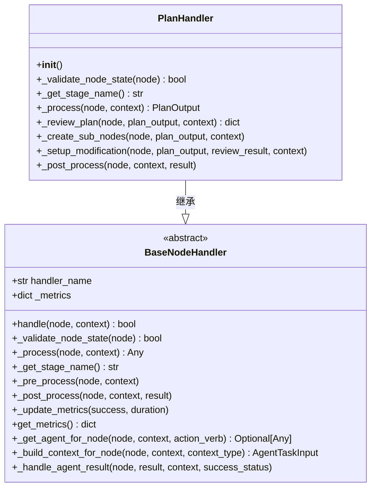
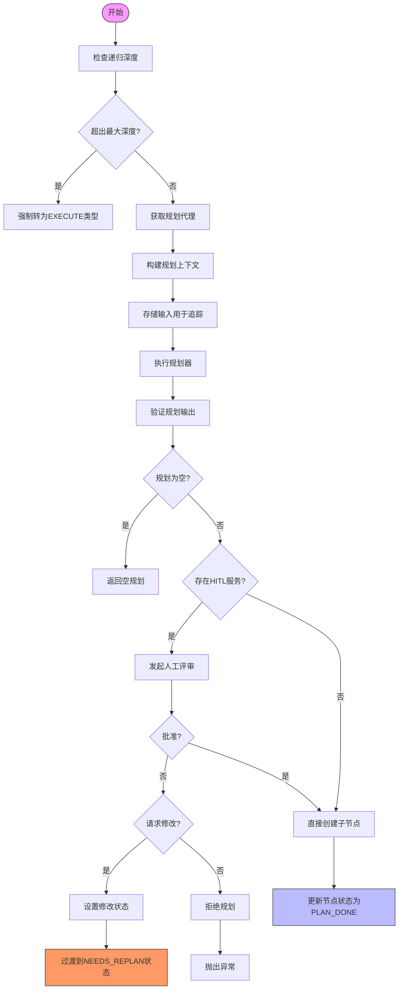
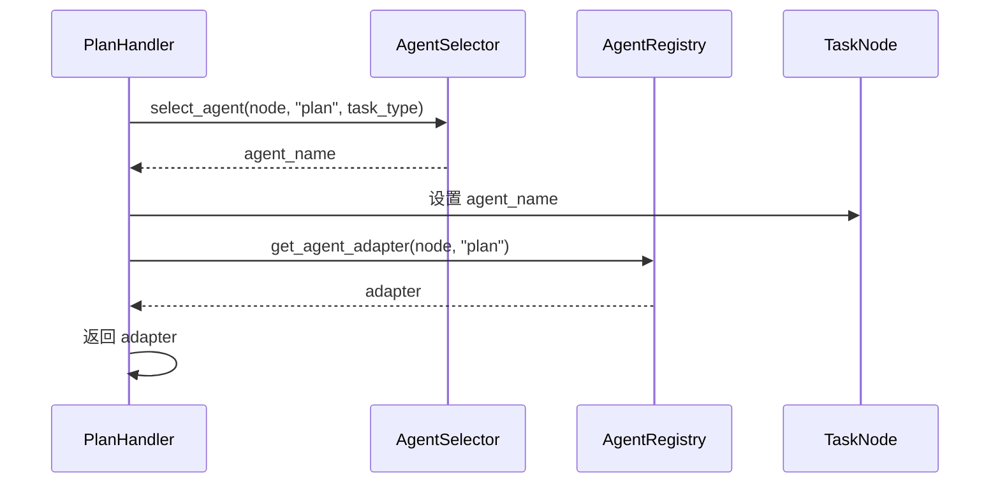
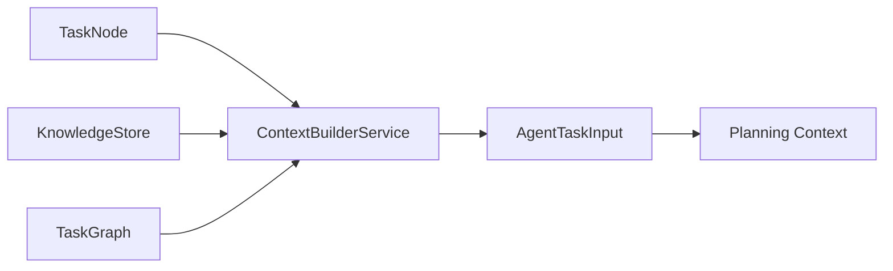
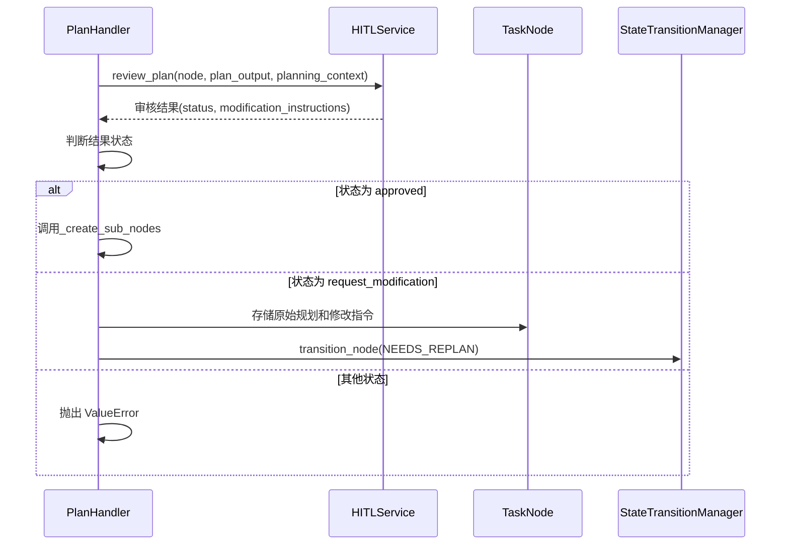
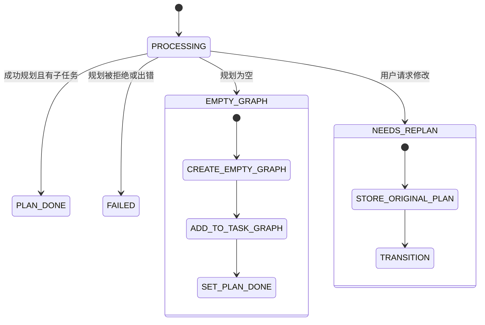

# 规划处理器

<cite>
**本文档中引用的文件**
- [plan_handler.py](file://src\sentientresearchagent\hierarchical_agent_framework\node_handlers\plan_handler.py)
- [base_handler.py](file://src\sentientresearchagent\hierarchical_agent_framework\node_handlers\base_handler.py)
- [task_node.py](file://src\sentientresearchagent\hierarchical_agent_framework\node\task_node.py)
- [types.py](file://src\sentientresearchagent\hierarchical_agent_framework\types.py)
- [agent_io_models.py](file://src\sentientresearchagent\hierarchical_agent_framework\context\agent_io_models.py)
- [state_transition_manager.py](file://src\sentientresearchagent\hierarchical_agent_framework\orchestration\state_transition_manager.py)
- [task_graph.py](file://src\sentientresearchagent\hierarchical_agent_framework\graph\task_graph.py)
</cite>

## 目录
1. [引言](#引言)
2. [核心机制概述](#核心机制概述)
3. [继承与基础处理流程](#继承与基础处理流程)
4. [_planning阶段核心逻辑详解](#_planning阶段核心逻辑详解)
5. 动态代理获取机制
6. 规划上下文构建流程
7. 子任务网络生成策略
8. HITL评审流程介入路径
9. 递归深度控制机制
10. 空规划或拒绝状态转换策略
11. [总结](#总结)

## 引言
`PlanHandler` 是分层智能体框架中的关键组件，负责处理需要进行任务分解的节点。该处理器实现了从高层目标到可执行子任务的转化过程，并集成了人工干预（HITL）机制以确保规划质量。本文将深入解析其内部实现机制，重点阐述其如何继承基础处理器、执行规划阶段的核心逻辑、动态获取代理、构建上下文、创建子节点以及处理人工评审和递归限制等关键功能。

## 核心机制概述
`PlanHandler` 类继承自 `BaseNodeHandler`，专门用于处理类型为 `PLAN` 的任务节点。其主要职责包括：
- 验证节点是否处于适合规划的状态
- 获取合适的规划代理（Planner Agent）
- 构建规划所需的上下文信息
- 执行规划并生成子任务列表
- 创建对应的子任务网络
- 支持人工评审（HITL）流程
- 处理空规划或被拒绝的情况

该处理器通过一系列异步方法协调这些步骤，确保整个规划过程既高效又可靠。

**Section sources**
- [plan_handler.py](file://src\sentientresearchagent\hierarchical_agent_framework\node_handlers\plan_handler.py#L15-L217)

## 继承与基础处理流程
`PlanHandler` 继承了 `BaseNodeHandler` 提供的通用处理框架，包括前置处理、主处理和后置处理三个阶段。这种设计模式保证了所有处理器具有一致的接口和行为规范。

在初始化时，`PlanHandler` 调用父类构造函数并传入名称 "PlanHandler"，以便于日志记录和调试追踪。

**Diagram sources**
- [plan_handler.py](file://src\sentientresearchagent\hierarchical_agent_framework\node_handlers\plan_handler.py#L27-L28)
- [base_handler.py](file://src\sentientresearchagent\hierarchical_agent_framework\node_handlers\base_handler.py#L43-L372)

## _planning阶段核心逻辑详解
`_process` 方法是 `PlanHandler` 的核心，它定义了完整的规划工作流。此方法首先检查当前节点的层级是否超过最大递归深度，然后获取规划代理，构建上下文，执行规划，并根据结果决定后续操作。

整个流程遵循严格的验证和错误处理机制，确保系统的健壮性。

**Diagram sources**
- [plan_handler.py](file://src\sentientresearchagent\hierarchical_agent_framework\node_handlers\plan_handler.py#L42-L113)

**Section sources**
- [plan_handler.py](file://src\sentientresearchagent\hierarchical_agent_framework\node_handlers\plan_handler.py#L42-L113)

## 动态代理获取机制
`_get_agent_for_node` 方法实现了根据节点类型动态选择规划代理的功能。该方法利用 `AgentSelector` 服务基于节点的任务类型和动作动词（如 "plan"）来确定最合适的代理名称，随后通过 `AgentRegistry` 获取相应的适配器实例。

这一机制支持灵活的代理配置和扩展，允许系统根据不同场景自动选用最优的规划策略。

**Diagram sources**
- [base_handler.py](file://src\sentientresearchagent\hierarchical_agent_framework\node_handlers\base_handler.py#L256-L295)

## 规划上下文构建流程
`_build_context_for_node` 方法负责准备规划所需的数据环境。它调用 `ContextBuilderService` 来生成特定类型的上下文（此处为 "planning"），并注入知识库和任务图等必要资源。

构建好的上下文不仅包含当前节点的信息，还整合了历史数据和依赖关系，为规划器提供全面的决策依据。

**Diagram sources**
- [base_handler.py](file://src\sentientresearchagent\hierarchical_agent_framework\node_handlers\base_handler.py#L297-L319)

## 子任务网络生成策略
`_create_sub_nodes` 方法负责将规划输出转化为实际的子任务结构。虽然由于架构限制，真正的子节点创建需由外部系统完成，但该方法仍承担着重要的中间角色：

- 将规划结果存储在节点的 `result` 和 `aux_data` 字段中
- 生成简洁的任务摘要，便于前端展示
- 更新节点状态为 `PLAN_DONE`
- 为后续的聚合操作做好准备

当规划为空时，系统会创建一个空的子图ID，确保即使没有子任务也能正常进入聚合阶段。

**Section sources**
- [plan_handler.py](file://src\sentientresearchagent\hierarchical_agent_framework\node_handlers\plan_handler.py#L128-L162)

## HITL评审流程介入路径
人工在环（HITL）评审流程通过 `_review_plan` 方法无缝集成到自动化规划过程中。当系统检测到 `hitl_service` 可用时，会暂停自动执行并将规划方案提交给人类审核员。

评审结果分为三种情况：
- **批准**：继续创建子节点
- **请求修改**：设置修改标志并转入重规划状态
- **拒绝/取消**：终止流程并抛出异常

这种设计平衡了自动化效率与人类监督的需求，提升了系统的可信度和可控性。

**Diagram sources**
- [plan_handler.py](file://src\sentientresearchagent\hierarchical_agent_framework\node_handlers\plan_handler.py#L115-L126)
- [plan_handler.py](file://src\sentientresearchagent\hierarchical_agent_framework\node_handlers\plan_handler.py#L164-L184)

## 递归深度控制机制
为了防止无限递归导致系统崩溃，`PlanHandler` 实现了 `_max_recursion_depth` 控制机制。该参数从配置中读取，默认值为5。

一旦发现节点层级达到或超过此限制，系统会发出警告，并自动将其类型更改为 `EXECUTE`，状态重置为 `READY`，从而避免进一步的规划尝试。这既是安全防护措施，也是一种降级策略，确保高阶任务仍能被执行。

**Section sources**
- [plan_handler.py](file://src\sentientresearchagent\hierarchical_agent_framework\node_handlers\plan_handler.py#L42-L113)

## 空规划或拒绝状态转换策略
针对规划为空或被拒绝的特殊情况，系统采用差异化的处理策略：

- **空规划**：接受为空的有效结果，创建空子图并标记为 `PLAN_DONE`，以便后续聚合。
- **拒绝/取消**：直接抛出异常，中断当前流程。
- **请求修改**：保存原规划和用户指令，将节点状态转为 `NEEDS_REPLAN`，等待重新规划。

此外，在 `_post_process` 阶段还会调用 `_handle_agent_result` 进行最终的状态管理和结果汇总，确保所有路径都能正确更新节点状态和知识库。

**Diagram sources**
- [plan_handler.py](file://src\sentientresearchagent\hierarchical_agent_framework\node_handlers\plan_handler.py#L186-L217)
- [base_handler.py](file://src\sentientresearchagent\hierarchical_agent_framework\node_handlers\base_handler.py#L321-L372)

## 总结
`PlanHandler` 作为分层任务系统的核心调度单元，展现了高度模块化和可扩展的设计理念。通过对 `BaseNodeHandler` 的继承，它复用了通用的处理框架；通过 `_process` 方法的精心编排，实现了复杂的规划逻辑；借助 HITL 机制，增强了人机协作能力；并通过递归深度限制和多种状态转换策略，保障了系统的稳定运行。

该处理器不仅是技术实现的典范，也为未来引入更多智能决策机制奠定了坚实的基础。