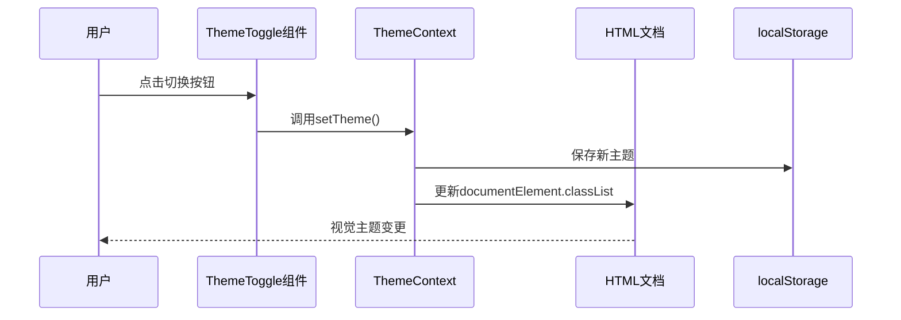

# 主题与样式架构

<cite>
**本文档中引用的文件**  
- [tailwind.config.js](file://frontend/tailwind.config.js)
- [postcss.config.js](file://frontend/postcss.config.js)
- [index.css](file://frontend/src/index.css)
- [ThemeToggle.tsx](file://frontend/src/components/theme/ThemeToggle.tsx)
- [ThemeContext.tsx](file://frontend/src/contexts/ThemeContext.tsx)
</cite>

## 目录
1. [简介](#简介)
2. [项目结构概览](#项目结构概览)
3. [Tailwind CSS 与 PostCSS 集成方案](#tailwind-css-与-postcss-集成方案)
4. [主题配置详解](#主题配置详解)
5. [暗色模式实现机制](#暗色模式实现机制)
6. [全局样式重置与变量注入](#全局样式重置与变量注入)
7. [响应式断点与跨设备适配](#响应式断点与跨设备适配)
8. [自定义主题扩展指南](#自定义主题扩展指南)
9. [结论](#结论)

## 简介
本项目采用 Tailwind CSS 作为核心样式框架，结合 PostCSS 实现现代化的前端样式管理。通过 `tailwind.config.js` 进行深度定制，支持动态主题切换、颜色系统扩展和动画控制。系统实现了基于类名的暗色模式（darkMode: 'class'），并通过 React 上下文（Context）驱动 UI 组件进行主题切换。整体架构兼顾开发效率与运行时性能。

## 项目结构概览
前端部分位于 `frontend/` 目录下，主要样式相关文件集中于根目录及 `src/` 子目录中：
- `tailwind.config.js`：Tailwind 核心配置文件
- `postcss.config.js`：PostCSS 插件配置
- `src/index.css`：全局样式入口
- `src/contexts/ThemeContext.tsx`：主题状态管理
- `src/components/theme/ThemeToggle.tsx`：主题切换组件

**Section sources**
- [tailwind.config.js](file://frontend/tailwind.config.js#L1-L75)
- [postcss.config.js](file://frontend/postcss.config.js#L1-L5)

## Tailwind CSS 与 PostCSS 集成方案
项目通过 PostCSS 构建管道集成 Tailwind CSS，确保样式处理流程标准化与可扩展性。

### 配置文件分析
```js
// postcss.config.js
export default {
  plugins: {
    tailwindcss: {},
    autoprefixer: {},
  },
}
```
该配置启用两个关键插件：
- `tailwindcss`：解析并生成实用类
- `autoprefixer`：自动添加浏览器厂商前缀，提升兼容性

此集成方式允许 Vite 构建工具无缝调用 PostCSS 流程，在编译阶段完成样式转换。

**Section sources**
- [postcss.config.js](file://frontend/postcss.config.js#L1-L5)

## 主题配置详解
Tailwind 的主题系统在 `tailwind.config.js` 中通过 `theme.extend` 进行扩展，支持颜色、动画、边框半径等属性的自定义。

### 自定义颜色系统
使用 CSS 变量（HSL 模式）定义设计系统中的颜色语义：

```js
colors: {
  primary: {
    DEFAULT: "hsl(var(--primary))",
    foreground: "hsl(var(--primary-foreground))"
  },
  background: "hsl(var(--background))",
  // ...其他颜色
}
```

所有颜色均映射至 `:root` 或 `.dark` 中定义的 CSS 变量，便于运行时动态修改。

### 动画与过渡效果
配置了开箱即用的动画集，如手风琴展开/收起：

```js
keyframes: {
  "accordion-down": {
    from: { height: 0 },
    to: { height: "var(--radix-accordion-content-height)" }
  }
},
animation: {
  "accordion-down": "accordion-down 0.2s ease-out"
}
```

这些动画可通过 `animate-accordion-down` 类直接应用。

**Section sources**
- [tailwind.config.js](file://frontend/tailwind.config.js#L15-L70)

## 暗色模式实现机制
系统采用 `darkMode: ['class']` 策略，通过在 `<html>` 元素上切换 `dark` 类来触发主题变化。

### 切换逻辑流程


**Diagram sources**
- [ThemeToggle.tsx](file://frontend/src/components/theme/ThemeToggle.tsx#L1-L22)
- [ThemeContext.tsx](file://frontend/src/contexts/ThemeContext.tsx#L45-L60)

### 主题上下文实现
`ThemeProvider` 使用 React Context 管理主题状态，并监听本地存储：

```ts
const [theme, setTheme] = useState<Theme>(
  () => (localStorage.getItem(storageKey) as Theme) || defaultTheme
);

useEffect(() => {
  const root = window.document.documentElement;
  root.classList.remove('light', 'dark');
  root.classList.add(theme);
}, [theme]);
```

当 `theme` 状态更新时，自动同步到 DOM 和本地存储。

**Section sources**
- [ThemeContext.tsx](file://frontend/src/contexts/ThemeContext.tsx#L45-L72)

## 全局样式重置与变量注入
`src/index.css` 是样式的入口文件，负责基础重置、变量定义和层管理。

### CSS 层结构
```css
@tailwind base;
@tailwind components;
@tailwind utilities;
```
三层次序确保：
1. **base**：原生元素样式重置
2. **components**：复合组件封装
3. **utilities**：原子类覆盖优先级

### 变量注入机制
`:root` 定义浅色主题变量，`.dark` 类覆盖为暗色值：

```css
:root {
  --background: 0 0% 100%;
  --foreground: 240 10% 3.9%;
}

.dark {
  --background: 240 10% 3.9%;
  --foreground: 0 0% 98%;
}
```

配合 Tailwind 的 `bg-background text-foreground` 类实现主题感知渲染。

### 增强功能
- 自定义滚动条样式
- 支持 `backdrop-blur` 并提供降级方案
- 定义统一的过渡时间变量（`--transition-base`）

**Section sources**
- [index.css](file://frontend/src/index.css#L1-L245)

## 响应式断点与跨设备适配
Tailwind 默认断点已扩展至 `2xl`，满足现代多端需求。

### 断点配置
```js
screens: {
  "2xl": "1400px",
}
```

结合容器中心化布局：
```js
container: {
  center: true,
  padding: "2rem",
  screens: { "2xl": "1400px" }
}
```

实现响应式内容区域控制，适用于桌面大屏场景。

### 实际应用示例
```html
<div class="container mx-auto px-4">
  <div class="grid md:grid-cols-2 lg:grid-cols-3 gap-6">
    <!-- 响应式网格布局 -->
  </div>
</div>
```

不同屏幕尺寸下自动调整列数与间距。

**Section sources**
- [tailwind.config.js](file://frontend/tailwind.config.js#L8-L14)

## 自定义主题扩展指南
系统设计支持灵活的主题扩展，开发者可安全地新增配色方案或动态加载主题。

### 新增配色方案步骤
1. 在 `index.css` 的 `:root` 中添加新变量：
   ```css
   --primary-alternate: 200 20% 30%;
   --primary-alternate-foreground: 0 0% 98%;
   ```
2. 在 `tailwind.config.js` 中扩展颜色：
   ```js
   extend: {
     colors: {
       "primary-alternate": "hsl(var(--primary-alternate))",
       "primary-alternate-foreground": "hsl(var(--primary-alternate-foreground))"
     }
   }
   ```

### 动态主题加载最佳实践
推荐通过 JavaScript 动态注入 `<style>` 标签实现运行时主题切换：

```ts
function loadTheme(themeName) {
  fetch(`/themes/${themeName}.css`)
    .then(r => r.text())
    .then(css => {
      const style = document.getElementById('dynamic-theme');
      if (style) style.innerHTML = css;
      else {
        const el = document.createElement('style');
        el.id = 'dynamic-theme';
        el.textContent = css;
        document.head.appendChild(el);
      }
    });
}
```

避免频繁操作 DOM 类名，提升性能与灵活性。

**Section sources**
- [index.css](file://frontend/src/index.css#L2-L40)
- [tailwind.config.js](file://frontend/tailwind.config.js#L15-L30)

## 结论
本项目的主题与样式系统构建于 Tailwind CSS 与 PostCSS 的坚实基础之上，具备高度可维护性与扩展性。通过 `darkMode: 'class'` 实现无闪烁的主题切换，利用 CSS 变量与 HSL 色彩模型达成精细的颜色控制。全局样式文件合理组织了重置、变量与增强功能，而响应式配置则保障了跨设备一致性体验。整体架构为未来主题定制与品牌化提供了清晰路径。