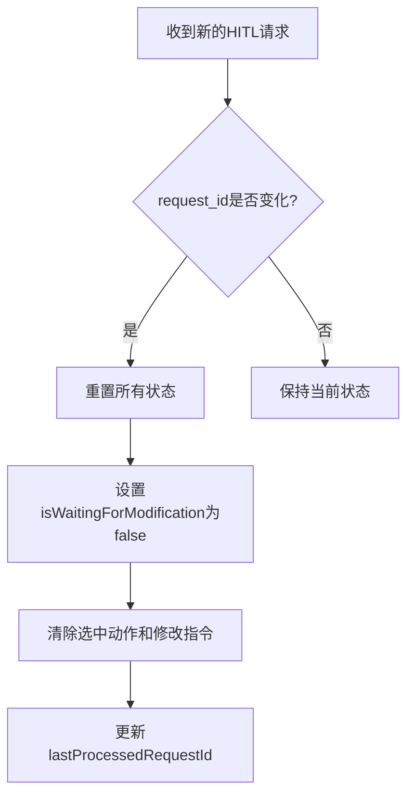
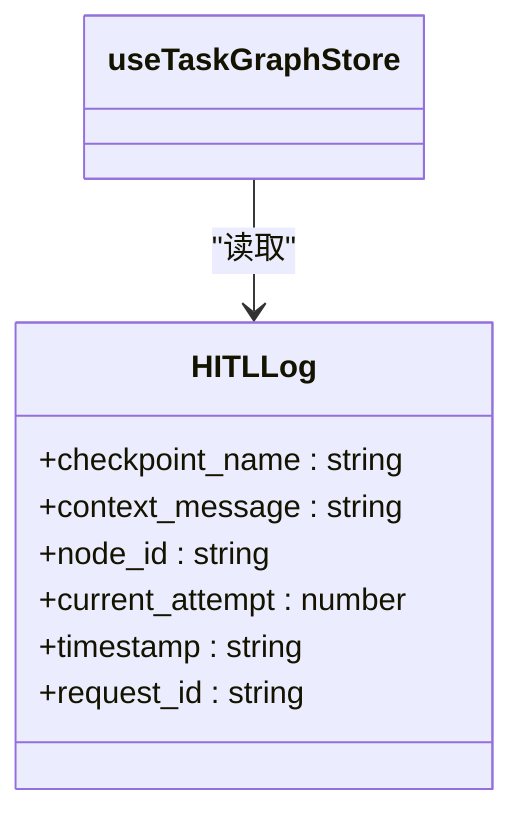
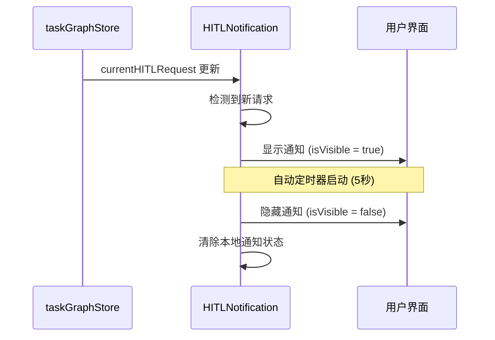
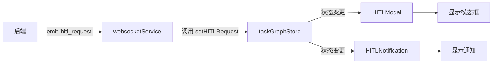
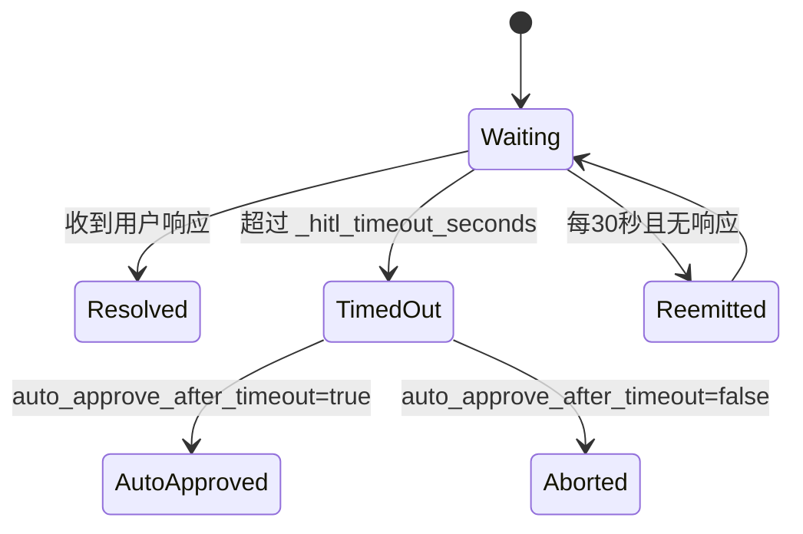

# 人机协作界面

<cite>
**本文档引用文件**
- [HITLModal.tsx](file://frontend/src/components/hitl/HITLModal.tsx)
- [HITLLog.tsx](file://frontend/src/components/hitl/HITLLog.tsx)
- [HITLNotification.tsx](file://frontend/src/components/hitl/HITLNotification.tsx)
- [websocketService.ts](file://frontend/src/services/websocketService.ts)
- [taskGraphStore.ts](file://frontend/src/stores/taskGraphStore.ts)
- [index.ts](file://frontend/src/types/index.ts)
- [websocket.ts](file://frontend/src/types/websocket.ts)
</cite>

## 目录
1. [简介](#简介)
2. [核心组件协同机制](#核心组件协同机制)
3. [WebSocket事件监听与UI更新](#websocket事件监听与ui更新)
4. [表单验证、响应提交与状态重置流程](#表单验证响应提交与状态重置流程)
5. [典型使用场景示例](#典型使用场景示例)
6. [错误处理与超时恢复策略](#错误处理与超时恢复策略)

## 简介
本文档详细说明了人机协作（Human-in-the-Loop, HITL）界面的实现机制，聚焦于`HITLModal`、`HITLLog`和`HITLNotification`三个核心组件的协同工作原理。系统通过`websocketManager`监听后端发出的`human_intervention_required`事件，触发前端UI的实时更新。当代理执行流程需要人工干预时，`HITLModal`会拦截当前流程并收集用户输入，`HITLLog`用于展示历史决策记录，而`HITLNotification`则提供即时的视觉提醒。

**中文(中文)**
- **Table of Contents**: 目录
- **Section sources**: 本节来源
- **Diagram sources**: 图表来源

## 核心组件协同机制

该系统由三个主要UI组件构成，它们共同实现了无缝的人机交互体验。

### HITLModal：拦截与输入收集
`HITLModal`组件是人机交互的核心入口。它通过订阅`taskGraphStore`中的`hitlRequest`状态来感知何时需要人工干预。一旦接收到有效的`HITLRequest`，模态框便会自动打开，其内部逻辑确保了对新请求的精确检测和状态重置。



**图表来源**
- [HITLModal.tsx](file://frontend/src/components/hitl/HITLModal.tsx#L372-L738)

**本节来源**
- [HITLModal.tsx](file://frontend/src/components/hitl/HITLModal.tsx#L372-L738)

### HITLLog：历史决策记录
`HITLLog`组件负责在侧边栏显示最近的人工干预记录。它从`taskGraphStore`中获取`hitlLogs`数组，并将其渲染为一个简洁的时间线视图，最多保留最近的20条日志。



**图表来源**
- [taskGraphStore.ts](file://frontend/src/stores/taskGraphStore.ts#L15-L22)
- [HITLLog.tsx](file://frontend/src/components/hitl/HITLLog.tsx#L6-L44)

**本节来源**
- [HITLLog.tsx](file://frontend/src/components/hitl/HITLLog.tsx#L6-L44)

### HITLNotification：实时提醒
`HITLNotification`组件提供了一个非侵入式的桌面通知，当有新的HITL请求到达时，会在屏幕右上角短暂弹出，持续5秒后自动消失，但不会清除主模态框中的请求，确保用户不会错过任何重要提示。



**图表来源**
- [HITLNotification.tsx](file://frontend/src/components/hitl/HITLNotification.tsx#L6-L88)

**本节来源**
- [HITLNotification.tsx](file://frontend/src/components/hitl/HITLNotification.tsx#L6-L88)

## WebSocket事件监听与UI更新

整个HITL系统的实时性依赖于WebSocket连接。`websocketService`作为单例服务，负责管理与后端的通信。

### 事件监听流程
1.  **初始化**：`websocketService`在应用启动时由`main.tsx`调用`connect()`方法进行初始化。
2.  **注册监听器**：`setupEventListeners`方法为`hitl_request`等关键事件注册回调函数。
3.  **接收请求**：当后端触发`hitl_request`事件时，前端接收到`HITLRequest`对象。
4.  **更新状态**：`websocketService`将请求数据传递给`taskGraphStore`，调用`setHITLRequest`方法。
5.  **UI响应**：`HITLModal`和`HITLNotification`因订阅了store的变化而自动重新渲染。



**图表来源**
- [websocketService.ts](file://frontend/src/services/websocketService.ts#L972-L990)
- [taskGraphStore.ts](file://frontend/src/stores/taskGraphStore.ts#L754-L867)

**本节来源**
- [websocketService.ts](file://frontend/src/services/websocketService.ts#L972-L990)
- [taskGraphStore.ts](file://frontend/src/stores/taskGraphStore.ts#L754-L867)

## 表单验证、响应提交与状态重置流程

`HITLModal`内部实现了完整的用户交互闭环。

### 响应提交流程
当用户选择“批准”、“修改”或“终止”时，会触发`handleResponse`函数：
1.  **防重复提交**：检查`isSubmitting`标志位，防止重复发送。
2.  **构建响应**：根据用户选择，构造符合`HITLResponse`接口的数据。
3.  **发送响应**：通过`webSocketService.sendHITLResponse()`将响应发送回后端。
4.  **状态管理**：
    -   若选择“修改”，则进入等待状态(`isWaitingForModification = true`)，不关闭模态框。
    -   若选择“批准”或“终止”，则调用`clearHITLRequest()`清除store中的请求，从而关闭模态框。

```mermaid
flowchart TD
Start([用户点击按钮]) --> Validate{正在提交吗?}
Validate --> |是| End
Validate --> |否| SetSubmit[设置 isSubmitting = true]
SetSubmit --> Send[发送HITL响应]
Send --> CheckAction{操作是"modify"?}
CheckAction --> |是| Wait[设置 isWaitingForModification = true]
Wait --> Reset[重置表单]
CheckAction --> |否| Clear[调用 clearHITLRequest()]
Reset --> End
Clear --> End
```

**图表来源**
- [HITLModal.tsx](file://frontend/src/components/hitl/HITLModal.tsx#L372-L738)
- [websocketService.ts](file://frontend/src/services/websocketService.ts#L536-L579)

**本节来源**
- [HITLModal.tsx](file://frontend/src/components/hitl/HITLModal.tsx#L372-L738)

## 典型使用场景示例

### 场景一：纠正搜索关键词
1.  代理在规划阶段生成一个包含模糊或错误关键词的搜索任务。
2.  后端触发`hitl_request`，`checkpoint_name`为"Plan Review"。
3.  `HITLModal`弹出，展示原始计划，用户在“修改指令”文本框中输入：“请将搜索关键词'AI trends'改为'AI market growth 2024'”。
4.  用户点击“提交更改”，响应被发送。
5.  代理收到反馈，重新生成计划，并再次发送`hitl_request`，此时`current_attempt`为2。
6.  `HITLModal`显示“Review Modified Plan”，用户确认无误后点击“批准”。

### 场景二：选择优先信息源
1.  代理在执行多个信息源抓取任务时，不确定哪个最可靠。
2.  触发`hitl_request`，`checkpoint_name`为"Source Selection"。
3.  `HITLModal`展示各个信息源的摘要和可信度评分。
4.  用户直接选择“批准”以接受默认排序，或选择“修改”并指定：“优先使用学术论文数据库，其次是官方报告”。

## 错误处理与超时恢复策略

系统具备健壮的错误处理和恢复能力。

### 前端错误处理
-   **连接丢失**：`websocketService`内置指数退避算法，在断开连接后尝试重新连接，最多10次。
-   **无效请求**：`setHITLRequest`方法会对传入的`HITLRequest`进行严格校验，确保`request_id`、`checkpoint_name`等关键字段存在。
-   **提交失败**：`sendHITLResponse`方法会检查WebSocket连接状态，若未连接则记录错误，避免程序崩溃。

### 后端超时恢复
后端的`websocket_hitl_utils.py`模块实现了超时机制：
-   **全局超时**：通过`_hitl_timeout_seconds`配置项定义最长等待时间（默认30分钟）。
-   **轮询机制**：如果WebSocket连接不稳定，系统会降级为HTTP轮询模式，定期向服务器查询响应。
-   **周期性重发**：为了应对客户端临时离线，系统会每隔30秒重新发送一次`hitl_request`事件，直到收到响应或超时。



**本节来源**
- [websocketService.ts](file://frontend/src/services/websocketService.ts#L536-L579)
- [taskGraphStore.ts](file://frontend/src/stores/taskGraphStore.ts#L754-L867)
- [websocket_hitl_utils.py](file://src/sentientresearchagent/hierarchical_agent_framework/utils/websocket_hitl_utils.py#L0-L40)