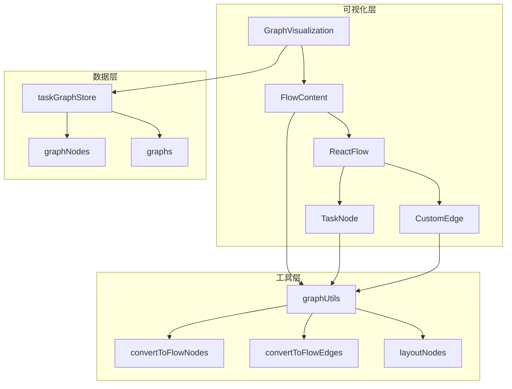
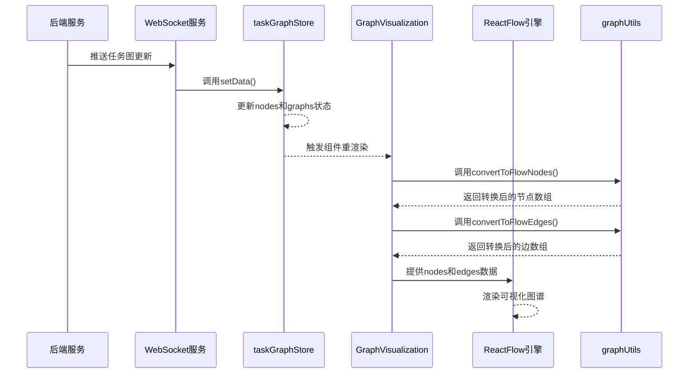
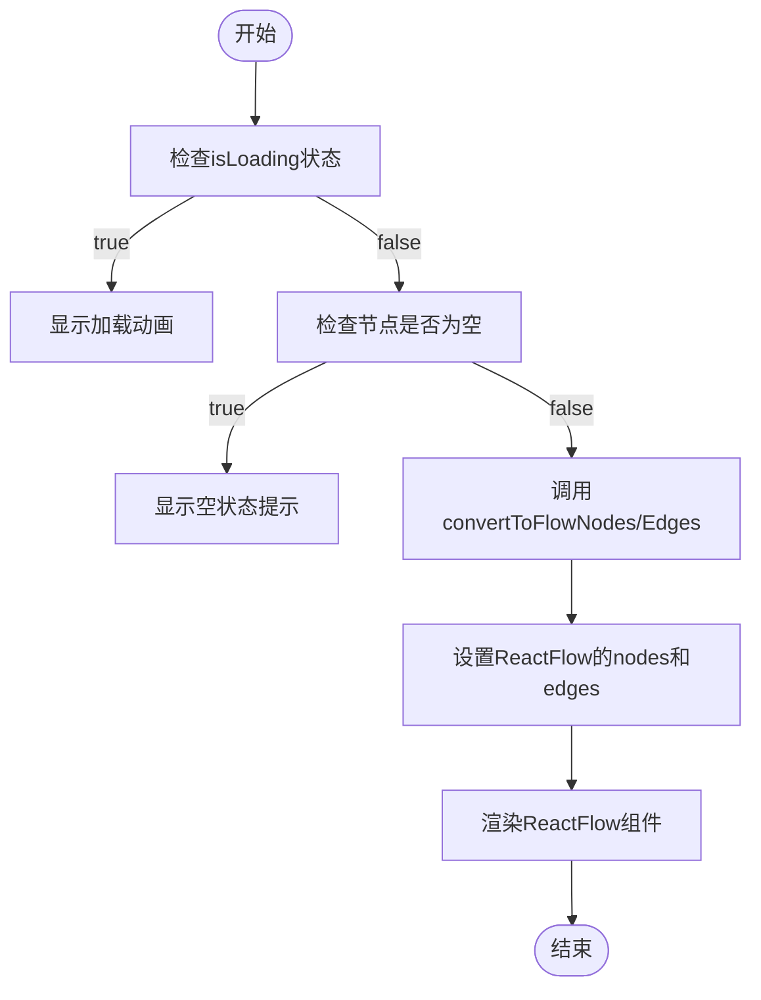
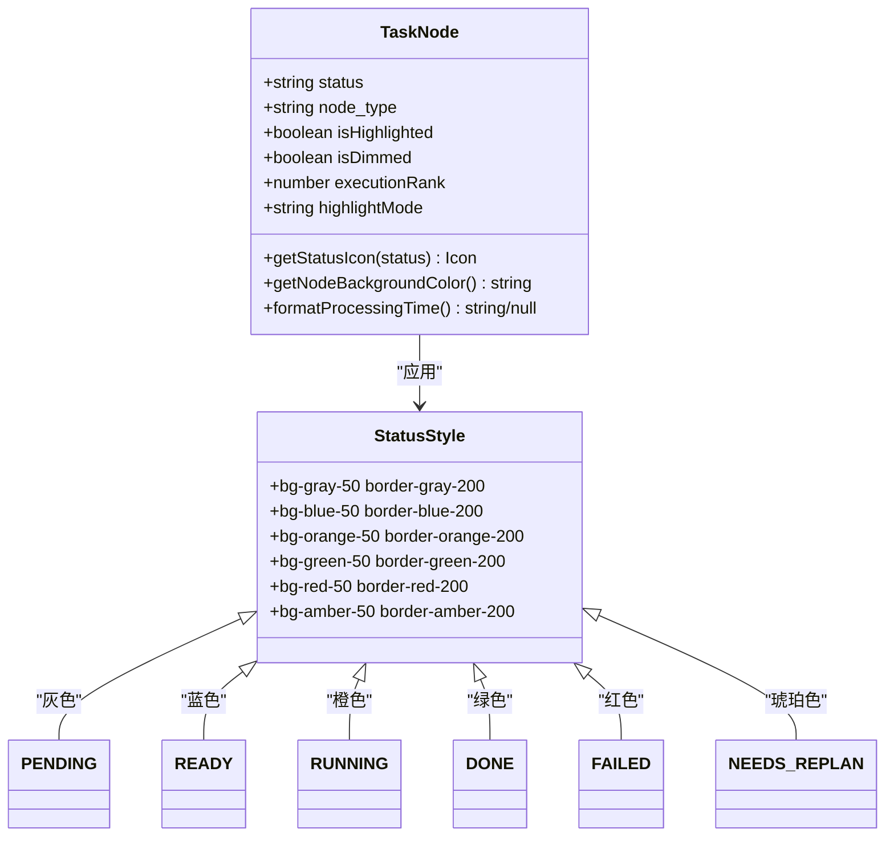
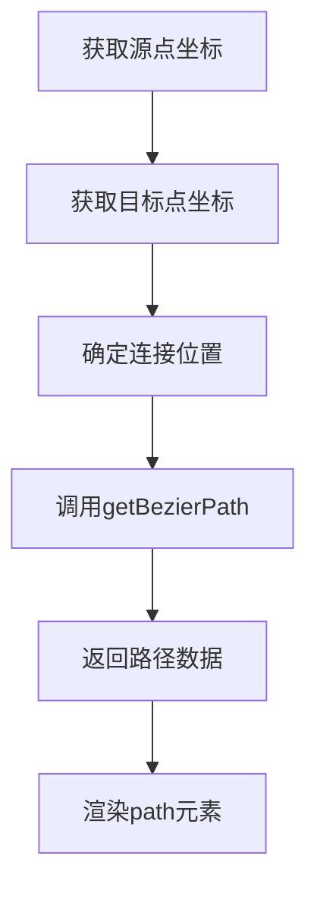
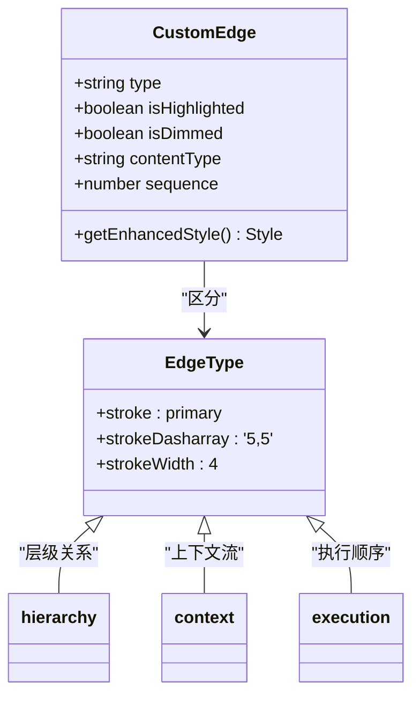
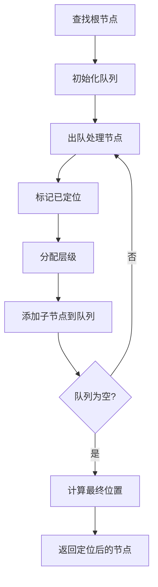
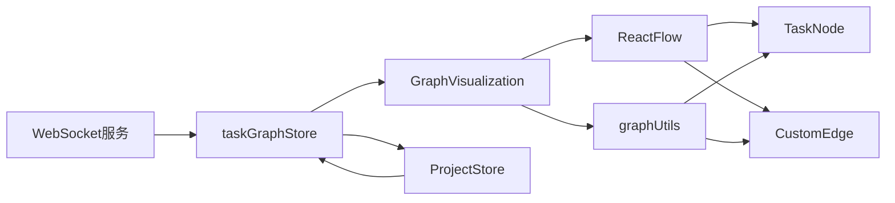

# 任务图可视化

<cite>
**本文档引用的文件**
- [GraphVisualization.tsx](file://frontend/src/components/graph/GraphVisualization.tsx)
- [TaskNode.tsx](file://frontend/src/components/graph/nodes/TaskNode.tsx)
- [CustomEdge.tsx](file://frontend/src/components/graph/edges/CustomEdge.tsx)
- [graphUtils.ts](file://frontend/src/lib/graphUtils.ts)
- [taskGraphStore.ts](file://frontend/src/stores/taskGraphStore.ts)
</cite>

## 目录
1. [简介](#简介)
2. [项目结构](#项目结构)
3. [核心组件](#核心组件)
4. [架构概述](#架构概述)
5. [详细组件分析](#详细组件分析)
6. [依赖分析](#依赖分析)
7. [性能考虑](#性能考虑)
8. [故障排除指南](#故障排除指南)
9. [结论](#结论)

## 简介
本技术文档详细描述了基于React Flow库实现的任务图谱动态渲染模块。该系统通过`GraphVisualization`组件将任务状态数据与图形界面绑定，实现了AI代理系统的实时可视化监控。文档重点阐述了从后端数据到前端可视化的完整流程，包括节点与边的数据转换、多类型节点渲染逻辑、自定义边路径计算以及布局算法的应用。

## 项目结构
任务图可视化功能主要集中在`frontend/src/components/graph`目录下，采用分层架构设计，各组件职责明确：

**Diagram sources**
- [GraphVisualization.tsx](file://frontend/src/components/graph/GraphVisualization.tsx#L0-L231)
- [taskGraphStore.ts](file://frontend/src/stores/taskGraphStore.ts#L0-L799)
- [graphUtils.ts](file://frontend/src/lib/graphUtils.ts#L0-L143)

**Section sources**
- [GraphVisualization.tsx](file://frontend/src/components/graph/GraphVisualization.tsx#L0-L231)
- [taskGraphStore.ts](file://frontend/src/stores/taskGraphStore.ts#L0-L799)

## 核心组件
任务图可视化系统由多个核心组件构成，其中`GraphVisualization`作为主入口组件，负责协调数据流和渲染流程。`TaskNode`组件实现多状态节点的差异化渲染，`CustomEdge`处理复杂流向的视觉表现，而`graphUtils`提供数据转换和布局算法支持。

**Section sources**
- [GraphVisualization.tsx](file://frontend/src/components/graph/GraphVisualization.tsx#L0-L231)
- [TaskNode.tsx](file://frontend/src/components/graph/nodes/TaskNode.tsx#L0-L281)
- [CustomEdge.tsx](file://frontend/src/components/graph/edges/CustomEdge.tsx#L0-L110)

## 架构概述
系统采用状态驱动的架构模式，通过Zustand状态管理库实现数据流的单向流动。当后端通过WebSocket推送更新时，`taskGraphStore`接收并存储最新的任务图数据，触发`GraphVisualization`组件重新渲染。

**Diagram sources**
- [taskGraphStore.ts](file://frontend/src/stores/taskGraphStore.ts#L0-L799)
- [GraphVisualization.tsx](file://frontend/src/components/graph/GraphVisualization.tsx#L0-L231)
- [graphUtils.ts](file://frontend/src/lib/graphUtils.ts#L0-L143)

## 详细组件分析
### GraphVisualization组件分析
`GraphVisualization`组件是任务图谱的主容器，负责加载和绑定`taskGraphStore`中的节点与边数据。组件首先检查加载状态，显示相应的占位符或空状态提示，然后通过`useMemo`优化数据转换过程。

#### 数据绑定机制
组件使用`useTaskGraphStore` Hook订阅全局状态，当`graphNodes`发生变化时，通过`convertToFlowNodes`和`convertToFlowEdges`函数将原始任务数据转换为React Flow兼容的格式。

**Diagram sources**
- [GraphVisualization.tsx](file://frontend/src/components/graph/GraphVisualization.tsx#L0-L231)

**Section sources**
- [GraphVisualization.tsx](file://frontend/src/components/graph/GraphVisualization.tsx#L0-L231)

### TaskNode组件分析
`TaskNode`组件负责渲染任务图中的各个节点，根据任务状态和类型应用不同的视觉样式和动画效果。

#### 多类型渲染逻辑
组件通过`node.status`属性判断当前节点状态，并应用相应的颜色方案和图标。不同状态的视觉特征如下：

**Diagram sources**
- [TaskNode.tsx](file://frontend/src/components/graph/nodes/TaskNode.tsx#L0-L281)

#### CSS动画效果
`TaskNode`组件实现了多种CSS动画效果来增强用户体验：
- **运行中状态**：使用`animate-spin`和`pulse-glow`类创建旋转和脉冲发光效果
- **选择状态**：通过`ring-2 ring-primary scale-105 shadow-xl`实现选中节点的放大和阴影效果
- **高亮状态**：应用`transform scale-105 z-10`使高亮节点突出显示
- **进入动画**：使用`animate-fade-in`和`animate-slide-in`创建平滑的入场动画

**Section sources**
- [TaskNode.tsx](file://frontend/src/components/graph/nodes/TaskNode.tsx#L0-L281)

### CustomEdge组件分析
`CustomEdge`组件实现了复杂流向的路径计算与标签定位机制，支持多种边类型和交互状态。

#### 路径计算机制
组件利用React Flow提供的`getBezierPath`函数计算贝塞尔曲线路径，确保边的平滑连接：

#### 标签定位机制
边标签的位置由`getBezierPath`返回的`labelX`和`labelY`坐标确定，确保标签始终位于边的中心位置。标签样式根据边类型动态调整：

**Diagram sources**
- [CustomEdge.tsx](file://frontend/src/components/graph/edges/CustomEdge.tsx#L0-L110)

**Section sources**
- [CustomEdge.tsx](file://frontend/src/components/graph/edges/CustomEdge.tsx#L0-L110)

### graphUtils工具分析
`graphUtils`模块提供了布局算法辅助函数，支持任务图的层次化排列和数据转换。

#### 布局算法应用场景
`layoutNodes`函数实现简单的层次布局算法，通过BFS遍历确定每个节点的层级和位置：

**Section sources**
- [graphUtils.ts](file://frontend/src/lib/graphUtils.ts#L0-L143)

## 依赖分析
任务图可视化模块与其他系统组件存在明确的依赖关系，形成了清晰的数据流和控制流。

**Diagram sources**
- [taskGraphStore.ts](file://frontend/src/stores/taskGraphStore.ts#L0-L799)
- [GraphVisualization.tsx](file://frontend/src/components/graph/GraphVisualization.tsx#L0-L231)

## 性能考虑
为应对大规模任务图谱的渲染挑战，系统采用了多项性能优化策略：

### 虚拟滚动与懒加载
虽然当前实现未直接使用虚拟滚动，但通过`useMemo`和`useCallback`等React优化Hook减少了不必要的重新渲染。建议在节点数量超过一定阈值时引入虚拟滚动技术。

### 大规模图谱渲染调优
1. **数据转换优化**：使用`useMemo`缓存转换结果，避免重复计算
2. **状态更新批处理**：通过Zustand的状态合并减少渲染次数
3. **事件处理优化**：使用`useCallback`记忆化事件处理器
4. **初始加载优化**：仅在首次加载或节点数从0变为非0时自动适配视图

### 建议的性能改进
1. 实现节点懒加载，仅渲染视口内的节点
2. 引入Web Worker进行复杂的数据转换和布局计算
3. 使用更轻量级的渲染策略处理大量节点
4. 实现增量更新，避免全量重绘

## 故障排除指南
### 常见问题及解决方案
1. **节点不显示**：检查`taskGraphStore`中的`nodes`数据是否正确加载
2. **边连接错误**：验证`parent_node_id`字段是否存在且正确
3. **状态更新延迟**：确认WebSocket连接正常，检查后端数据推送频率
4. **布局混乱**：检查`layer`字段是否正确设置，确保层次结构完整

### 调试工具
系统内置了多个调试组件：
- `StoreMonitor`：监控全局状态变化
- `StoreSubscriptionTest`：测试状态订阅机制
- `ReactFlowDebug`：调试React Flow渲染状态
- `DebugPanel`：提供手动操作和测试功能

**Section sources**
- [taskGraphStore.ts](file://frontend/src/stores/taskGraphStore.ts#L0-L799)
- [DebugPanel.tsx](file://frontend/src/components/debug/DebugPanel.tsx#L0-L158)

## 结论
任务图可视化模块成功实现了基于React Flow的动态图谱渲染功能，通过合理的架构设计和组件划分，提供了直观的任务状态监控界面。系统具备良好的扩展性和维护性，未来可通过引入虚拟滚动、Web Worker等技术进一步提升大规模图谱的渲染性能。