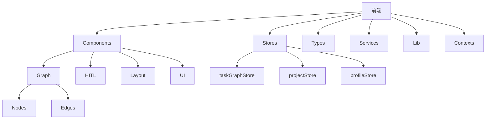
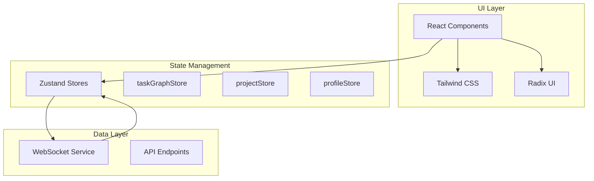
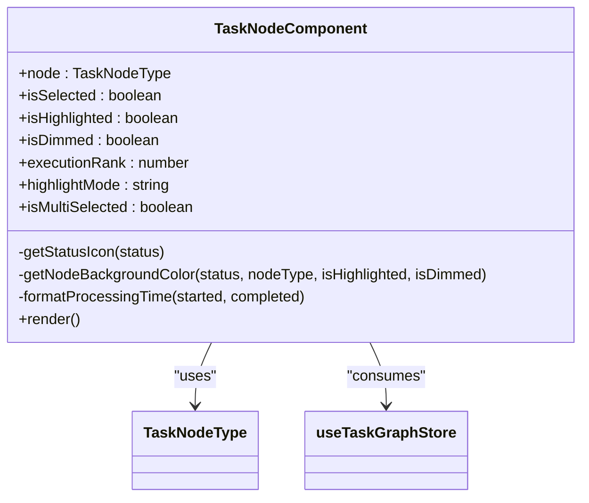
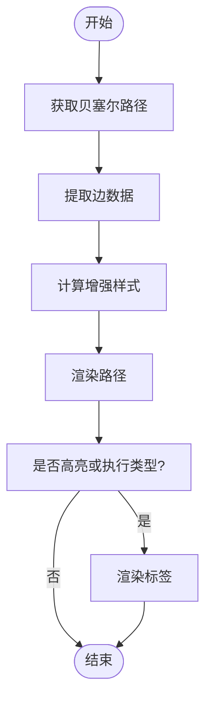
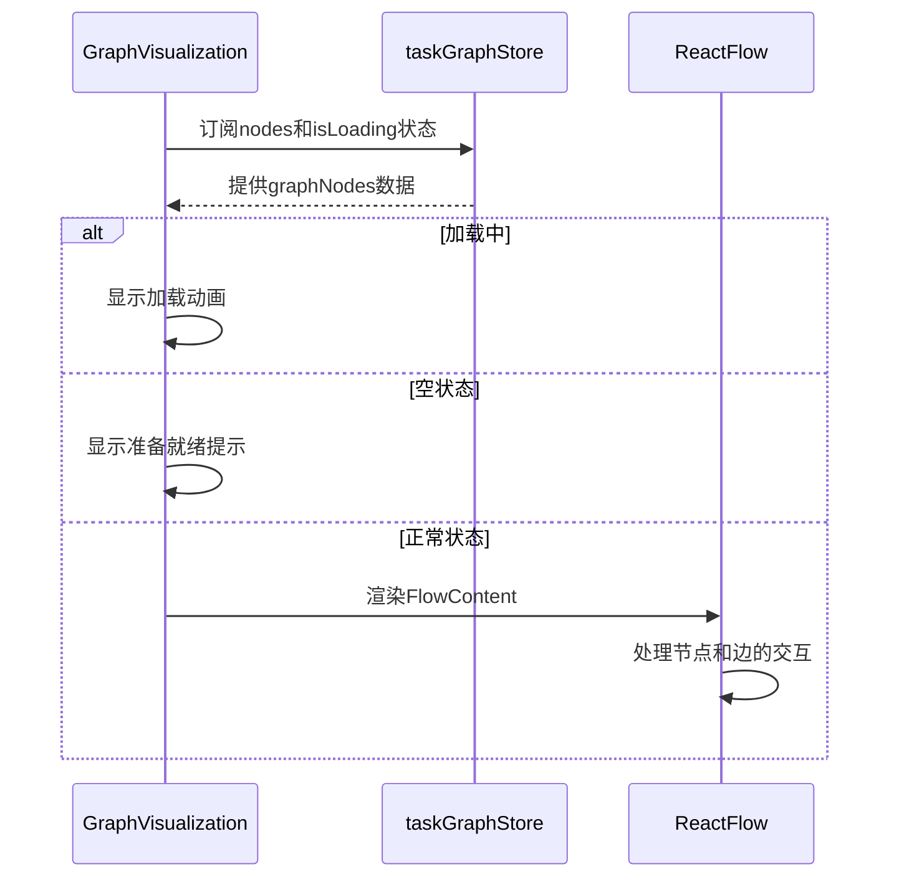
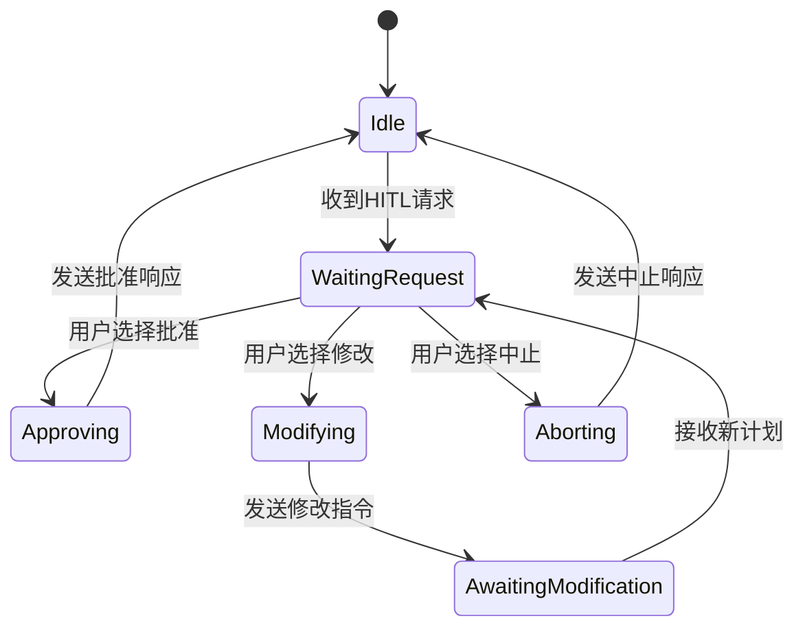
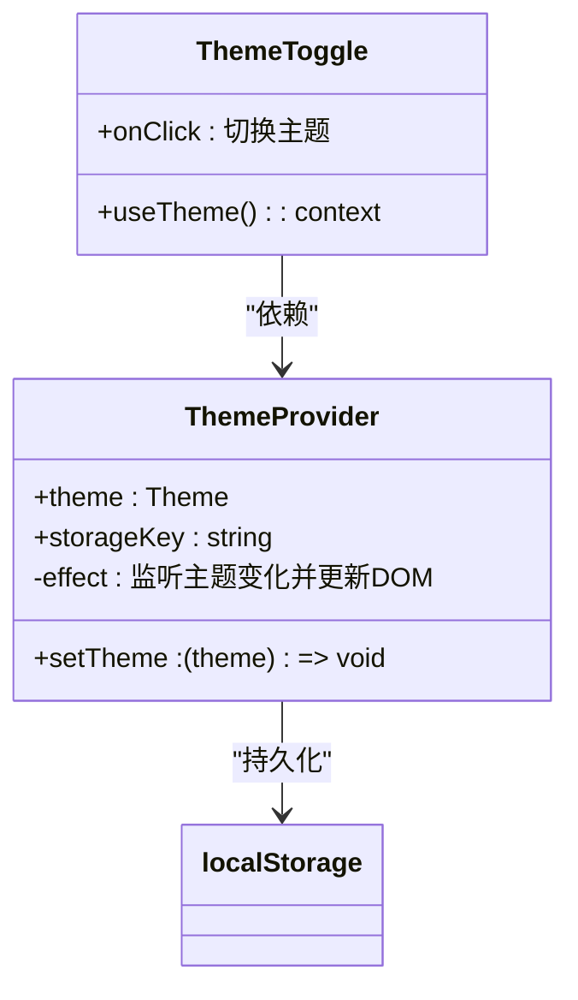
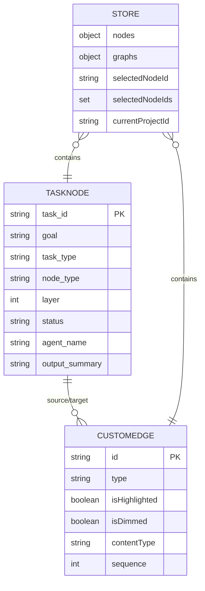

# 前端架构

<cite>
**本文档中引用的文件 **  
- [TaskNode.tsx](file://frontend/src/components/graph/nodes/TaskNode.tsx)
- [CustomEdge.tsx](file://frontend/src/components/graph/edges/CustomEdge.tsx)
- [GraphVisualization.tsx](file://frontend/src/components/graph/GraphVisualization.tsx)
- [HITLModal.tsx](file://frontend/src/components/hitl/HITLModal.tsx)
- [ThemeToggle.tsx](file://frontend/src/components/theme/ThemeToggle.tsx)
- [ThemeContext.tsx](file://frontend/src/contexts/ThemeContext.tsx)
- [taskGraphStore.ts](file://frontend/src/stores/taskGraphStore.ts)
- [projectStore.ts](file://frontend/src/stores/projectStore.ts)
- [profileStore.ts](file://frontend/src/stores/profileStore.ts)
- [index.ts](file://frontend/src/types/index.ts)
</cite>

## 目录
1. [项目结构](#项目结构)
2. [核心组件](#核心组件)
3. [架构概述](#架构概述)
4. [详细组件分析](#详细组件分析)
5. [依赖分析](#依赖分析)
6. [性能考虑](#性能考虑)
7. [故障排除指南](#故障排除指南)
8. [结论](#结论)

## 项目结构
前端代码库采用功能模块化组织方式，主要包含以下目录：
- `components`：存放所有UI组件，按功能划分为graph、hitl、layout等子目录
- `stores`：Zustand状态管理存储定义
- `types`：TypeScript类型定义
- `services`：WebSocket和API服务
- `lib`：工具函数库
- `contexts`：React上下文定义
- `debug`：调试专用组件

构建系统基于Vite，配置了TypeScript、React、Tailwind CSS和PostCSS。通过`vite.config.ts`进行构建流程配置，`tsconfig.json`提供类型安全保障。

**Diagram sources**
- [frontend/src/components](file://frontend/src/components)
- [frontend/src/stores](file://frontend/src/stores)

## 核心组件
文档聚焦于三大核心UI组件体系：任务图可视化、人机交互模态框和主题切换功能。状态管理通过Zustand实现全局状态共享，包括项目状态、任务图状态和用户配置状态。UI工程化实践采用Radix UI组件库与Tailwind CSS结合的方式，确保一致的设计语言和响应式体验。

**Section sources**
- [GraphVisualization.tsx](file://frontend/src/components/graph/GraphVisualization.tsx)
- [HITLModal.tsx](file://frontend/src/components/hitl/HITLModal.tsx)
- [ThemeToggle.tsx](file://frontend/src/components/theme/ThemeToggle.tsx)

## 架构概述
系统采用现代化React架构，基于Vite构建，使用TypeScript提供静态类型检查。UI组件体系围绕任务图可视化展开，通过React Flow实现动态图形渲染。状态管理采用Zustand库，避免了传统Redux的复杂性，同时保持了全局状态的一致性。

**Diagram sources**
- [taskGraphStore.ts](file://frontend/src/stores/taskGraphStore.ts)
- [projectStore.ts](file://frontend/src/stores/projectStore.ts)
- [profileStore.ts](file://frontend/src/stores/profileStore.ts)

## 详细组件分析

### 任务节点组件分析
TaskNode组件是任务图可视化的核心单元，负责渲染单个任务节点及其状态信息。组件根据任务状态显示不同的颜色编码和图标，支持多选模式下的叠加效果。

**Diagram sources**
- [TaskNode.tsx](file://frontend/src/components/graph/nodes/TaskNode.tsx)
- [index.ts](file://frontend/src/types/index.ts)

### 自定义边组件分析
CustomEdge组件实现了任务图中不同类型的连接线，支持层次关系、上下文流和执行顺序三种连接类型，每种类型具有独特的视觉样式。

**Diagram sources**
- [CustomEdge.tsx](file://frontend/src/components/graph/edges/CustomEdge.tsx)

### 任务图可视化分析
GraphVisualization组件作为任务图的容器，管理加载状态和空状态，并集成React Flow提供完整的图形交互功能。

**Diagram sources**
- [GraphVisualization.tsx](file://frontend/src/components/graph/GraphVisualization.tsx)
- [taskGraphStore.ts](file://frontend/src/stores/taskGraphStore.ts)

### HITL模态框分析
HITLModal组件处理人机交互请求，允许用户审查、修改或终止AI代理的决策过程，是系统的关键干预点。

**Diagram sources**
- [HITLModal.tsx](file://frontend/src/components/hitl/HITLModal.tsx)
- [taskGraphStore.ts](file://frontend/src/stores/taskGraphStore.ts)

### 主题切换组件分析
ThemeToggle组件实现暗色主题切换功能，通过ThemeProvider上下文管理应用的整体外观主题。

**Diagram sources**
- [ThemeToggle.tsx](file://frontend/src/components/theme/ThemeToggle.tsx)
- [ThemeContext.tsx](file://frontend/src/contexts/ThemeContext.tsx)

## 依赖分析
前端组件间存在清晰的依赖关系，状态存储作为中心枢纽连接各个UI组件。React Flow提供图形渲染能力，Zustand管理全局状态，WebSocket服务实现实时数据同步。

**Diagram sources**
- [taskGraphStore.ts](file://frontend/src/stores/taskGraphStore.ts)
- [TaskNode.tsx](file://frontend/src/components/graph/nodes/TaskNode.tsx)
- [CustomEdge.tsx](file://frontend/src/components/graph/edges/CustomEdge.tsx)

## 性能考虑
系统在性能方面进行了多项优化：使用React.memo避免不必要的重新渲染，通过useMemo优化计算密集型操作，采用虚拟滚动处理大量数据。WebSocket连接保持长连接以减少网络开销，状态更新经过批处理以提高效率。

## 故障排除指南
常见问题包括WebSocket连接失败、状态更新延迟和图形渲染异常。建议检查网络连接、验证WebSocket服务状态，并确认Zustand存储的订阅机制正常工作。对于图形渲染问题，检查React Flow的节点和边数据格式是否正确。

**Section sources**
- [websocketManager.ts](file://frontend/src/services/websocketManager.ts)
- [taskGraphStore.ts](file://frontend/src/stores/taskGraphStore.ts)

## 结论
该前端架构成功实现了复杂的AI代理系统可视化界面，通过合理的组件划分和状态管理，提供了流畅的用户体验。未来可进一步优化性能，增加更多交互功能，并完善测试覆盖。