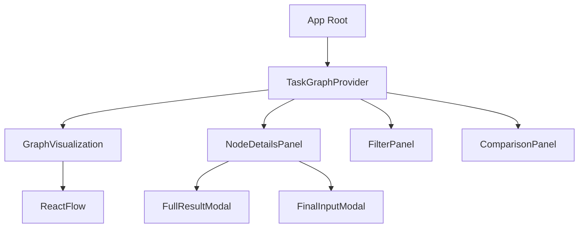
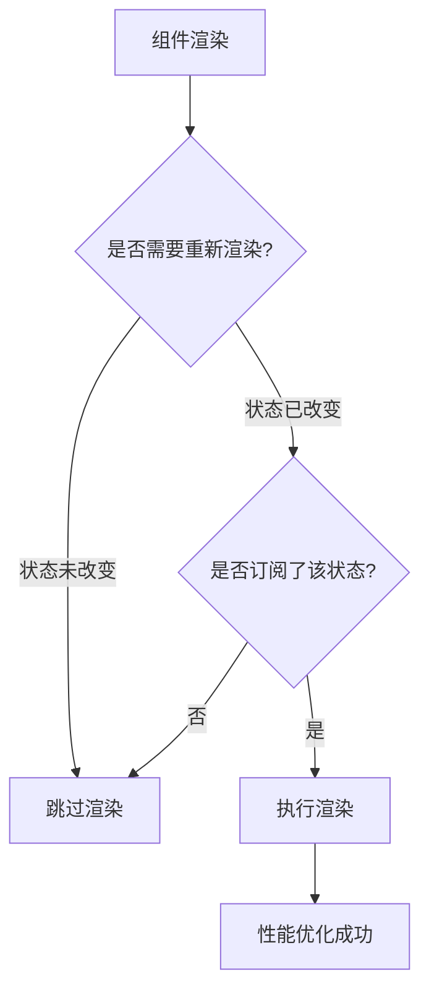
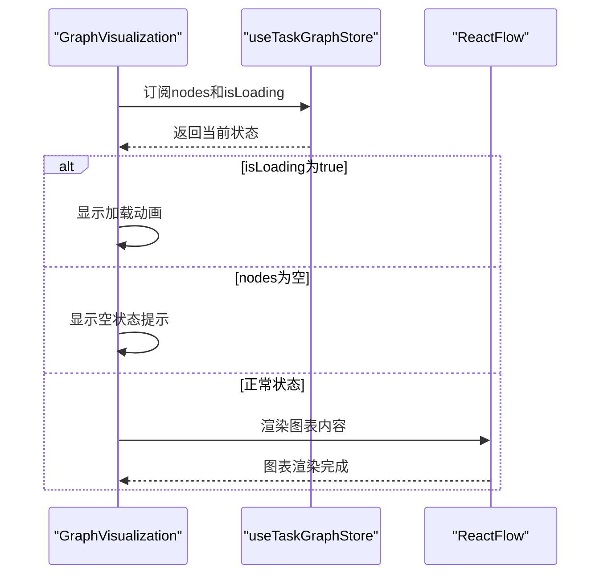

# React上下文集成

<cite>
**本文档中引用的文件**  
- [TaskGraphContext.tsx](file://frontend/src/contexts/TaskGraphContext.tsx)
- [taskGraphStore.ts](file://frontend/src/stores/taskGraphStore.ts)
- [GraphVisualization.tsx](file://frontend/src/components/graph/GraphVisualization.tsx)
- [NodeDetailsPanel.tsx](file://frontend/src/components/panels/NodeDetailsPanel.tsx)
</cite>

## 目录
1. [简介](#简介)
2. [核心组件分析](#核心组件分析)
3. [状态管理与依赖注入机制](#状态管理与依赖注入机制)
4. [Provider与Consumer协作模式](#provider与consumer协作模式)
5. [性能优化策略](#性能优化策略)
6. [实际组件中的应用示例](#实际组件中的应用示例)
7. [最佳实践总结](#最佳实践总结)

## 简介
本文档详细阐述了`TaskGraphContext`如何封装Zustand store并为React组件提供依赖注入能力。通过分析上下文集成机制，揭示其在大型组件树中实现高效状态管理和性能优化的核心原理。

## 核心组件分析

### TaskGraphContext上下文定义
`TaskGraphContext`使用React的`createContext`创建了一个空值上下文，用于在整个应用中传递任务图相关状态。该上下文由`TaskGraphProvider`组件提供，并被所有需要访问任务图状态的子组件消费。

**Section sources**
- [TaskGraphContext.tsx](file://frontend/src/contexts/TaskGraphContext.tsx#L7-L7)

### Zustand Store结构
`useTaskGraphStore`是基于Zustand库创建的状态管理store，它维护了任务图的完整状态，包括节点数据、过滤条件、选择状态、HITL请求等。store通过`subscribeWithSelector`中间件支持细粒度订阅，允许组件仅监听特定状态变化。

```mermaid
classDiagram
class TaskGraphState {
+nodes : Record<string, TaskNode>
+graphs : Record<string, any>
+overallProjectGoal? : string
+currentProjectId? : string
+projectData : Record<string, ProjectData>
+isConnected : boolean
+isLoading : boolean
+selectedNodeId? : string
+showContextFlow : boolean
+filters : GraphFilters
+contextFlowMode : 'none' | 'dataFlow' | 'executionPath' | 'subtree'
+focusNodeId? : string
+selectedNodeIds : Set<string>
+isMultiSelectMode : boolean
+comparisonView : 'cards' | 'table' | 'timeline' | 'metrics'
+isComparisonPanelOpen : boolean
+isToolCallsModalOpen : boolean
+currentHITLRequest : HITLRequest | undefined
+isHITLModalOpen : boolean
+hitlLogs : HITLLog[]
+setData(data : APIResponse) : void
+setConnectionStatus(status : boolean) : void
+setLoading(loading : boolean) : void
+selectNode(nodeId? : string) : void
+toggleContextFlow() : void
+setCurrentProject(projectId : string) : void
+setProjectData(projectId : string, data : APIResponse) : void
+getProjectData(projectId : string) : ProjectData | null
+clearProjectData(projectId : string) : void
+switchToProject(projectId : string) : void
+updateFilters(newFilters : Partial<GraphFilters>) : void
+resetFilters() : void
+toggleFilterPanel() : void
+setSearchTerm(term : string) : void
+showActiveNodes() : void
+showProblematicNodes() : void
+showCompletedNodes() : void
+showCurrentLayer() : void
+setContextFlowMode(mode : 'none' | 'dataFlow' | 'executionPath' | 'subtree') : void
+setFocusNode(nodeId? : string) : void
+zoomToSubtree(nodeId : string) : void
+toggleNodeSelection(nodeId : string, isMultiSelect? : boolean) : void
+selectAllNodes() : void
+selectFilteredNodes() : void
+clearSelection() : void
+invertSelection() : void
+setMultiSelectMode(enabled : boolean) : void
+setComparisonView(view : 'cards' | 'table' | 'timeline' | 'metrics') : void
+openToolCallsModal() : void
+closeToolCallsModal() : void
+toggleComparisonPanel() : void
+getFilteredNodes() : Record<string, TaskNode>
+getAvailableFilters() : { statuses : string[]; taskTypes : string[]; nodeTypes : ('PLAN' | 'EXECUTE')[]; layers : number[]; agentNames : string[] }
+getSelectedNodes() : TaskNode[]
+getSelectionStats() : { total : number; byStatus : Record<string, number>; byTaskType : Record<string, number>; byLayer : Record<number, number>; avgExecutionTime : number; successRate : number }
+setHITLRequest(request : HITLRequest | null) : void
+clearHITLRequest() : void
+respondToHITL(response : HITLResponse) : void
+closeHITLModal() : void
+addHITLLog(log : HITLLog) : void
+clearHITLLogs() : void
+hitlRequest : HITLRequest | null
}
```

**Diagram sources**
- [taskGraphStore.ts](file://frontend/src/stores/taskGraphStore.ts#L158-L869)

**Section sources**
- [taskGraphStore.ts](file://frontend/src/stores/taskGraphStore.ts#L158-L869)

## 状态管理与依赖注入机制

### 上下文层抽象价值
`TaskGraphContext`作为状态访问的抽象层，实现了以下关键价值：
- **解耦合**：将状态管理逻辑与UI组件分离，提高代码可维护性
- **单一数据源**：确保整个应用使用统一的状态来源，避免数据不一致
- **易于测试**：可以轻松地为不同场景创建mock状态进行单元测试
- **跨层级通信**：无需通过props逐层传递，实现任意深度的组件间通信

### 状态更新策略
store采用不可变更新模式，每次状态变更都创建新的对象引用，确保React能正确检测到变化。对于复杂对象如`nodes`和`projectData`，使用浅拷贝保证引用唯一性，防止不必要的重渲染。

## Provider与Consumer协作模式

### Provider挂载时机与作用范围
`TaskGraphProvider`通常在应用根组件或任务图功能模块的顶层挂载，其作用范围覆盖所有后代组件。一旦挂载，它会立即初始化store并开始监听状态变化，为子组件提供实时更新的能力。



**Diagram sources**
- [TaskGraphContext.tsx](file://frontend/src/contexts/TaskGraphContext.tsx#L9-L15)

### Consumer安全订阅机制
消费者组件通过`useTaskGraphStore` hook安全地订阅特定状态片段。利用Zustand的选择器功能，组件可以精确指定关心的状态字段，避免因无关状态变化导致的重渲染。

#### 选择性订阅示例
```typescript
// 只订阅selectedNodeId和nodes
const { selectedNodeId, nodes } = useTaskGraphStore(state => ({
  selectedNodeId: state.selectedNodeId,
  nodes: state.nodes
}));
```

## 性能优化策略

### Memoization应用
在大型组件树中，合理使用memoization技术至关重要。通过`useMemo`和`useCallback`缓存计算结果和函数引用，减少重复计算和不必要的渲染。

### 选择性订阅最佳实践
- **最小化订阅**：只订阅组件真正需要的状态字段
- **组合选择器**：对于多个相关状态，使用单一选择器函数返回对象
- **避免匿名函数**：在依赖数组中使用稳定的选择器函数而非内联箭头函数



**Diagram sources**
- [taskGraphStore.ts](file://frontend/src/stores/taskGraphStore.ts#L158-L869)

## 实际组件中的应用示例

### GraphVisualization组件
`GraphVisualization`组件展示了上下文与store hook的协作模式。它首先检查加载状态，然后获取过滤后的节点数据，最后渲染React Flow图表。通过选择性订阅`nodes`和`isLoading`状态，确保只有当这些特定状态变化时才触发重渲染。



**Diagram sources**
- [GraphVisualization.tsx](file://frontend/src/components/graph/GraphVisualization.tsx#L184-L229)

**Section sources**
- [GraphVisualization.tsx](file://frontend/src/components/graph/GraphVisualization.tsx#L184-L229)

### NodeDetailsPanel组件
`NodeDetailsPanel`组件充分利用了上下文提供的状态信息，展示选中节点的详细信息。它订阅了`selectedNodeId`、`nodes`等多个状态字段，并根据节点类型和状态动态渲染不同的信息区块。通过精细化的状态订阅，即使其他节点状态发生变化，只要选中节点不变，就不会触发不必要的重渲染。

**Section sources**
- [NodeDetailsPanel.tsx](file://frontend/src/components/panels/NodeDetailsPanel.tsx#L245-L736)

## 最佳实践总结
1. **尽早挂载Provider**：在应用启动时就初始化上下文提供者
2. **精细控制订阅**：始终使用选择器函数限制订阅范围
3. **合理使用memo**：对复杂计算结果进行记忆化处理
4. **避免过度拆分**：平衡组件粒度与性能开销
5. **监控性能影响**：定期使用React DevTools分析渲染行为
6. **错误边界保护**：为关键组件添加错误边界以增强健壮性