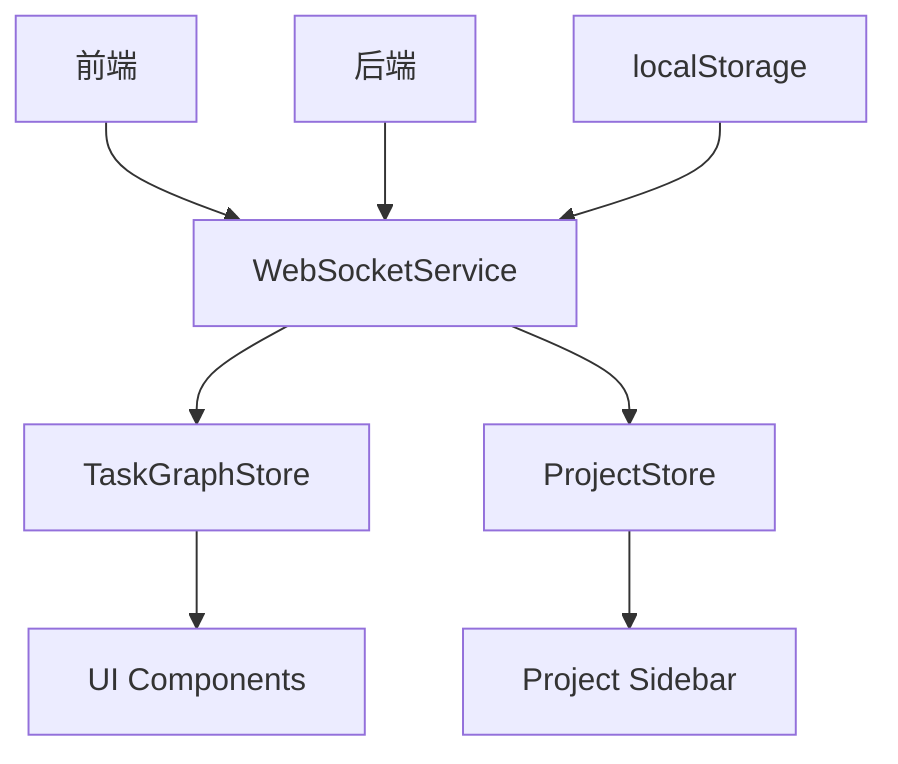
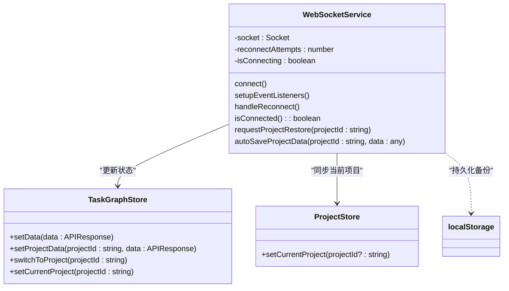
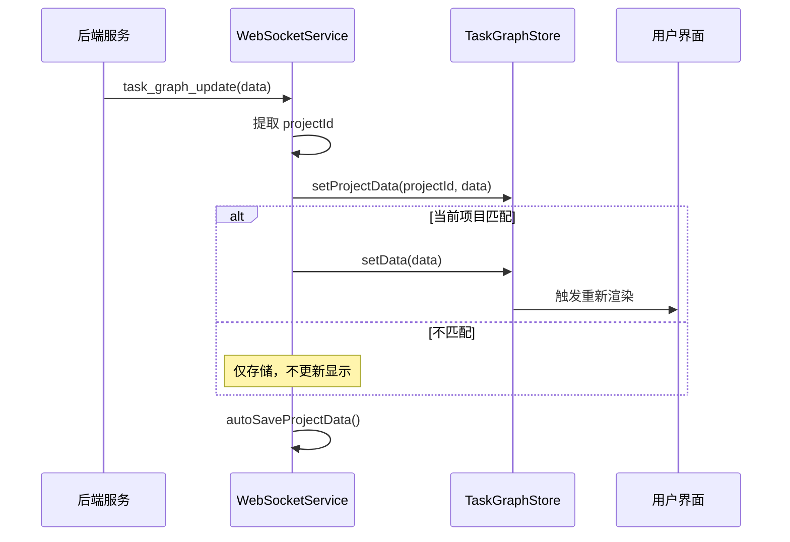
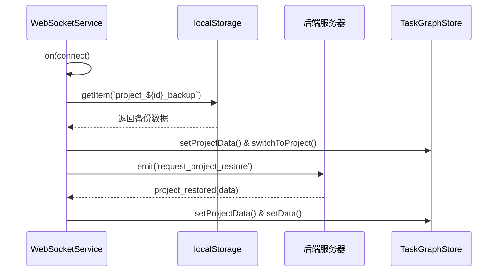

# 前后端状态同步

<cite>
**本文档引用的文件**   
- [websocketService.ts](file://frontend/src/services/websocketService.ts)
- [taskGraphStore.ts](file://frontend/src/stores/taskGraphStore.ts)
- [projectStore.ts](file://frontend/src/stores/projectStore.ts)
- [websocketManager.ts](file://frontend/src/services/websocketManager.ts)
- [ConnectionStatus.tsx](file://frontend/src/components/status/ConnectionStatus.tsx)
- [main.tsx](file://frontend/src/main.tsx)
</cite>

## 目录
1. [项目结构](#项目结构)  
2. [WebSocket 服务核心机制](#websocket-服务核心机制)  
3. [实时状态同步流程](#实时状态同步流程)  
4. [消息序列化与事件处理](#消息序列化与事件处理)  
5. [心跳检测与自动重连机制](#心跳检测与自动重连机制)  
6. [状态合并与冲突解决策略](#状态合并与冲突解决策略)  
7. [网络中断恢复与一致性校验](#网络中断恢复与一致性校验)  
8. [调试与监控工具](#调试与监控工具)

## 项目结构

本系统采用前后端分离架构，前端基于 React + TypeScript 构建，通过 WebSocket 实现与后端的实时通信。核心状态管理使用 Zustand 存储模式，确保跨组件状态一致性。



**图源**
- [websocketService.ts](file://frontend/src/services/websocketService.ts#L5-L966)
- [taskGraphStore.ts](file://frontend/src/stores/taskGraphStore.ts#L158-L869)
- [projectStore.ts](file://frontend/src/stores/projectStore.ts#L41-L114)

**节源**
- [websocketService.ts](file://frontend/src/services/websocketService.ts#L5-L966)
- [taskGraphStore.ts](file://frontend/src/stores/taskGraphStore.ts#L158-L869)

## WebSocket 服务核心机制

`WebSocketService` 类负责建立和维护与后端的 WebSocket 连接，监听各类事件并更新本地状态。该服务在应用启动时由 `main.tsx` 初始化，并通过单例模式全局可用。

关键特性包括：
- 自动连接与重连机制
- 多项目状态隔离存储
- 本地持久化备份（localStorage）
- 全局事件分发



**图源**
- [websocketService.ts](file://frontend/src/services/websocketService.ts#L5-L966)
- [taskGraphStore.ts](file://frontend/src/stores/taskGraphStore.ts#L158-L869)
- [projectStore.ts](file://frontend/src/stores/projectStore.ts#L41-L114)

**节源**
- [websocketService.ts](file://frontend/src/services/websocketService.ts#L5-L966)
- [main.tsx](file://frontend/src/main.tsx#L10-L14)

## 实时状态同步流程

当后端发生状态变更（如任务更新、节点添加）时，通过 `task_graph_update` 事件推送至前端。前端接收到消息后执行以下逻辑：

1. 解析项目 ID（支持多种来源：data.project_id、current_project.id 等）
2. 将数据存入 `projectData` 映射中，按 projectId 隔离
3. 检查当前项目是否匹配，若匹配则触发 UI 更新
4. 执行自动保存（localStorage + 后端）

此机制防止了多项目间的状态污染，并确保仅当前项目才渲染到界面。



**图源**
- [websocketService.ts](file://frontend/src/services/websocketService.ts#L100-L200)
- [taskGraphStore.ts](file://frontend/src/stores/taskGraphStore.ts#L158-L869)

**节源**
- [websocketService.ts](file://frontend/src/services/websocketService.ts#L100-L200)
- [taskGraphStore.ts](file://frontend/src/stores/taskGraphStore.ts#L158-L869)

## 消息序列化与事件处理

系统定义了标准化的消息格式用于状态同步，主要事件类型如下：

| 事件名称 | 载荷类型 | 描述 |
|--------|--------|------|
| task_graph_update | APIResponse & { project_id?: string } | 任务图状态更新 |
| hitl_request | HITLRequest | 人工干预请求 |
| project_switched | { project_id: string, project_data?: APIResponse } | 项目切换通知 |
| project_restored | any | 项目状态恢复响应 |
| error | any | 错误通知 |

其中 `APIResponse` 包含 `all_nodes`, `graphs`, `overall_project_goal` 等字段，构成完整任务图状态。

**节源**
- [websocketService.ts](file://frontend/src/services/websocketService.ts#L200-L500)
- [types/websocket.ts](file://frontend/src/types/websocket.ts#L1-L8)

## 心跳检测与自动重连机制

为保障连接稳定性，系统实现了健壮的重连策略：

- **指数退避 + 随机抖动**：避免雪崩效应
- 最大尝试次数限制（默认 10 次）
- 连接成功后主动请求状态恢复
- 页面卸载时自动断开连接

```mermaid
flowchart TD
Start([开始连接]) --> IsConnected{已连接?}
IsConnected --> |是| End([连接成功])
IsConnected --> |否| CanReconnect{可重连?}
CanReconnect --> |否| Fail([连接失败])
CanReconnect --> |是| Delay["计算延迟 = min(1000 * 1.5^n + jitter, 30s)"]
Delay --> Reconnect[发起重连]
Reconnect --> WaitTimer["等待定时器到期"]
WaitTimer --> Connect[调用 connect()]
Connect --> IsConnected
```

**图源**
- [websocketService.ts](file://frontend/src/services/websocketService.ts#L539-L558)
- [websocketManager.ts](file://frontend/src/services/websocketManager.ts#L5-L39)

**节源**
- [websocketService.ts](file://frontend/src/services/websocketService.ts#L539-L558)

## 状态合并与冲突解决策略

为防止本地未提交变更被远程覆盖，系统采用以下策略：

1. **项目级状态隔离**：每个项目的数据独立存储于 `projectData` 映射中
2. **双源真相校验**：比较 `taskGraphStore.currentProjectId` 与 `projectStore.currentProjectId`，以后者为准
3. **延迟渲染机制**：非当前项目仅存储不渲染
4. **强制引用更新**：通过 `_updateTimestamp` 字段确保 React 重新渲染

此外，在设置新状态前会进行深度日志记录与验证，确保更新完整性。

**节源**
- [websocketService.ts](file://frontend/src/services/websocketService.ts#L150-L180)
- [taskGraphStore.ts](file://frontend/src/stores/taskGraphStore.ts#L158-L869)

## 网络中断恢复与一致性校验

连接恢复后，系统执行两阶段状态恢复：

1. **优先从 localStorage 恢复**：读取最近一次自动备份
2. **向服务器请求最新状态**：通过 `request_project_restore` 获取权威状态

同时提供手动清理 localStorage 的调试接口（`cleanLocalStorage()`），便于问题排查。



**图源**
- [websocketService.ts](file://frontend/src/services/websocketService.ts#L750-L760)
- [websocketService.ts](file://frontend/src/services/websocketService.ts#L350-L370)

**节源**
- [websocketService.ts](file://frontend/src/services/websocketService.ts#L750-L760)
- [websocketService.ts](file://frontend/src/services/websocketService.ts#L350-L370)

## 调试与监控工具

系统内置丰富的调试能力：

- **全局访问入口**：`window.websocketService` 可用于控制台调试
- **详细日志输出**：包含时间戳、项目ID、节点变化等信息
- **模拟功能**：`simulateProjectUpdate()` 可测试更新逻辑
- **连接状态提示**：UI 组件显示连接状态（Connected / Disconnected）

这些工具极大提升了开发与故障排查效率。

**节源**
- [websocketService.ts](file://frontend/src/services/websocketService.ts#L969-L969)
- [ConnectionStatus.tsx](file://frontend/src/components/status/ConnectionStatus.tsx#L1-L48)
- [ProjectDebugPanel.tsx](file://frontend/src/components/debug/ProjectDebugPanel.tsx#L10-L33)