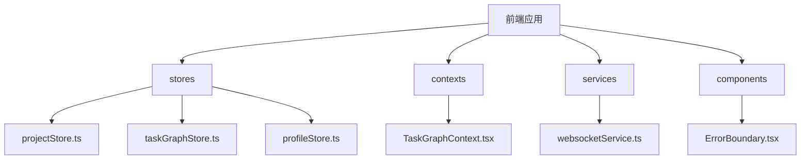
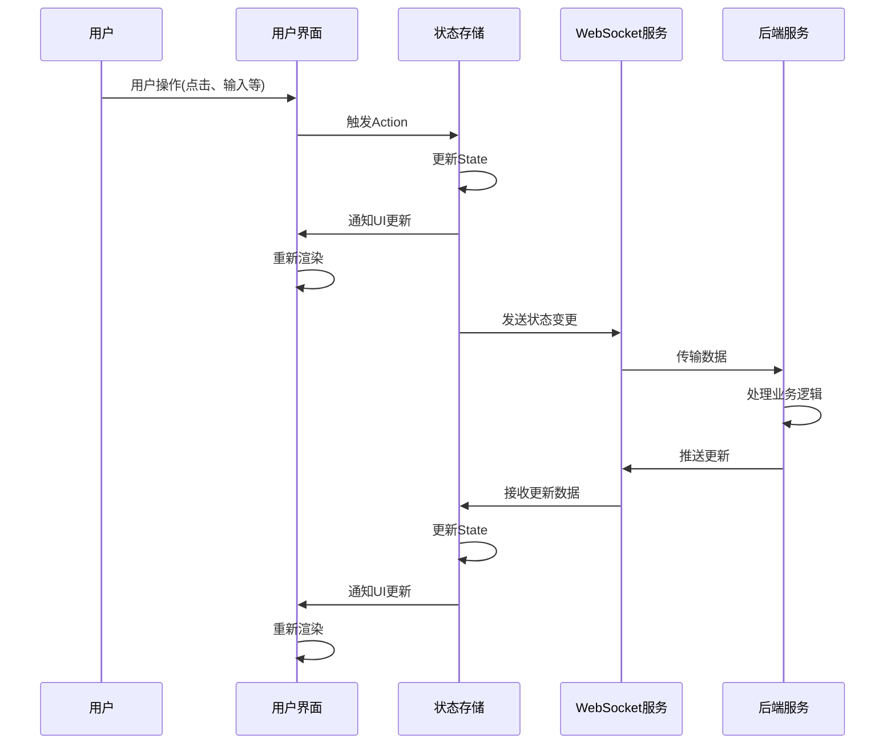

# 状态管理

<cite>
**本文档引用的文件**
- [projectStore.ts](file://frontend/src/stores/projectStore.ts)
- [taskGraphStore.ts](file://frontend/src/stores/taskGraphStore.ts)
- [profileStore.ts](file://frontend/src/stores/profileStore.ts)
- [TaskGraphContext.tsx](file://frontend/src/contexts/TaskGraphContext.tsx)
- [websocketService.ts](file://frontend/src/services/websocketService.ts)
- [ErrorBoundary.tsx](file://frontend/src/components/ErrorBoundary.tsx)
</cite>

## 目录
1. [项目结构](#项目结构)
2. [核心状态存储机制](#核心状态存储机制)
3. [ProjectStore 详解](#projectstore-详解)
4. [TaskGraphStore 详解](#taskgraphstore-详解)
5. [ProfileStore 详解](#profilestore-详解)
6. [上下文依赖注入](#上下文依赖注入)
7. [实时同步机制](#实时同步机制)
8. [异常处理与边界捕获](#异常处理与边界捕获)
9. [状态流追踪示意图](#状态流追踪示意图)
10. [常见问题调试方法](#常见问题调试方法)

## 项目结构

前端状态管理相关代码主要位于 `frontend/src/stores` 目录下，包含三大核心状态存储模块：`projectStore.ts`、`taskGraphStore.ts` 和 `profileStore.ts`。这些模块基于 Zustand 库构建，实现了应用的核心状态管理功能。



**Diagram sources**
- [projectStore.ts](file://frontend/src/stores/projectStore.ts)
- [taskGraphStore.ts](file://frontend/src/stores/taskGraphStore.ts)
- [profileStore.ts](file://frontend/src/stores/profileStore.ts)

## 核心状态存储机制

本系统采用 Zustand 作为状态管理解决方案，通过创建独立的状态存储（store）来管理不同领域的应用状态。三大核心存储分别负责项目管理、任务图谱和用户配置文件的状态管理。

Zustand 的优势在于其轻量级、无样板代码的特点，同时支持中间件扩展功能。在本项目中，`subscribeWithSelector` 中间件用于优化组件订阅，`devtools` 中间件用于开发调试。

**Section sources**
- [projectStore.ts](file://frontend/src/stores/projectStore.ts)
- [taskGraphStore.ts](file://frontend/src/stores/taskGraphStore.ts)
- [profileStore.ts](file://frontend/src/stores/profileStore.ts)

## ProjectStore 详解

`projectStore` 负责管理项目相关的状态数据，包括项目列表、当前项目、加载状态等。该存储定义了完整的项目数据结构和相应的操作动作。

### 状态结构

`ProjectState` 接口定义了项目存储的完整状态结构：

```typescript
interface ProjectState {
  projects: Project[]
  currentProjectId?: string
  isLoading: boolean
  isSidebarOpen: boolean
  isCreatingProject: boolean
}
```

其中 `Project` 接口包含项目的基本信息，如 ID、标题、描述、创建时间、更新时间、状态、目标、最大步骤数等。

### 操作逻辑

`projectStore` 提供了一系列操作函数来更新状态：

- `setProjects`: 设置项目列表
- `setCurrentProject`: 设置当前项目
- `addProject`: 添加新项目
- `updateProject`: 更新指定项目
- `removeProject`: 删除指定项目
- `setLoading`: 设置加载状态
- `setSidebarOpen`: 设置侧边栏打开状态
- `setCreatingProject`: 设置创建项目状态

这些操作通过 Zustand 的 `set` 函数实现不可变更新，确保状态变更的可预测性。

### 持久化策略

虽然 `projectStore` 本身不直接处理持久化，但它与后端 API 配合，通过 WebSocket 实时同步项目状态。项目数据的持久化由后端服务负责，前端通过事件监听保持状态同步。

**Section sources**
- [projectStore.ts](file://frontend/src/stores/projectStore.ts#L0-L114)

## TaskGraphStore 详解

`taskGraphStore` 是系统中最复杂的状态存储，负责管理任务图谱的完整状态，包括节点、图形数据、过滤器、选择状态等。

### 状态结构

`TaskGraphState` 接口定义了任务图谱存储的完整状态：

```typescript
interface TaskGraphState {
  nodes: Record<string, TaskNode>
  graphs: Record<string, any>
  overallProjectGoal?: string
  currentProjectId?: string
  projectData: Record<string, ProjectData>
  isConnected: boolean
  isLoading: boolean
  selectedNodeId?: string
  showContextFlow: boolean
  filters: GraphFilters
  isFilterPanelOpen: boolean
  contextFlowMode: 'none' | 'dataFlow' | 'executionPath' | 'subtree'
  focusNodeId?: string
  selectedNodeIds: Set<string>
  isMultiSelectMode: boolean
  comparisonView: 'cards' | 'table' | 'timeline' | 'metrics'
  isComparisonPanelOpen: boolean
  isToolCallsModalOpen: boolean
  currentHITLRequest: HITLRequest | undefined
  isHITLModalOpen: boolean
  hitlLogs: HITLLog[]
}
```

### 操作逻辑

`taskGraphStore` 提供了丰富的操作函数来管理任务图谱状态：

#### 数据更新操作
- `setData`: 设置任务图谱数据
- `setConnectionStatus`: 设置连接状态
- `setLoading`: 设置加载状态
- `selectNode`: 选择节点

#### 项目相关操作
- `setCurrentProject`: 设置当前项目
- `setProjectData`: 设置项目数据
- `getProjectData`: 获取项目数据
- `clearProjectData`: 清除项目数据
- `switchToProject`: 切换到指定项目

#### 过滤操作
- `updateFilters`: 更新过滤器
- `resetFilters`: 重置过滤器
- `toggleFilterPanel`: 切换过滤面板
- `setSearchTerm`: 设置搜索词
- `showActiveNodes`: 显示活动节点
- `showProblematicNodes`: 显示有问题的节点
- `showCompletedNodes`: 显示已完成节点
- `showCurrentLayer`: 显示当前层

#### 上下文流操作
- `setContextFlowMode`: 设置上下文流模式
- `setFocusNode`: 设置焦点节点
- `zoomToSubtree`: 缩放到子树

#### 多选操作
- `toggleNodeSelection`: 切换节点选择
- `selectAllNodes`: 选择所有节点
- `selectFilteredNodes`: 选择过滤后的节点
- `clearSelection`: 清除选择
- `invertSelection`: 反向选择
- `setMultiSelectMode`: 设置多选模式

#### 比较面板操作
- `setComparisonView`: 设置比较视图
- `toggleComparisonPanel`: 切换比较面板

#### 工具调用模态框操作
- `openToolCallsModal`: 打开工具调用模态框
- `closeToolCallsModal`: 关闭工具调用模态框

#### HITL 操作
- `setHITLRequest`: 设置 HITL 请求
- `clearHITLRequest`: 清除 HITL 请求
- `respondToHITL`: 响应 HITL
- `closeHITLModal`: 关闭 HITL 模态框

#### HITL 日志操作
- `addHITLLog`: 添加 HITL 日志
- `clearHITLLogs`: 清除 HITL 日志

### 计算属性

`taskGraphStore` 还提供了一些计算属性函数：

- `getFilteredNodes`: 获取过滤后的节点
- `getAvailableFilters`: 获取可用的过滤选项
- `getSelectedNodes`: 获取选中的节点
- `getSelectionStats`: 获取选择统计信息

### 持久化策略

`taskGraphStore` 实现了多层次的持久化策略：

1. **内存持久化**: 使用 `projectData` 字段存储各个项目的数据，实现项目间的快速切换。
2. **本地存储**: 通过 `localStorage` 自动保存项目数据备份，防止页面刷新导致数据丢失。
3. **服务器持久化**: 通过 WebSocket 与后端实时同步数据，确保数据的安全性和一致性。

**Section sources**
- [taskGraphStore.ts](file://frontend/src/stores/taskGraphStore.ts#L0-L997)

## ProfileStore 详解

`profileStore` 负责管理用户配置文件的状态，包括可用的配置文件列表、当前配置文件、加载状态等。

### 状态结构

`ProfileState` 接口定义了配置文件存储的完整状态：

```typescript
interface ProfileState {
  profiles: Profile[]
  currentProfile: string | null
  isLoading: boolean
  error: string | null
}
```

其中 `Profile` 接口包含配置文件的详细信息，如名称、描述、规划器映射、执行器映射、原子化器、聚合器、计划修改器、默认规划器、默认执行器等。

### 操作逻辑

`profileStore` 提供了以下操作函数：

- `setProfiles`: 设置配置文件列表
- `setCurrentProfile`: 设置当前配置文件
- `setLoading`: 设置加载状态
- `setError`: 设置错误信息
- `switchProfile`: 切换配置文件
- `loadProfiles`: 加载配置文件列表

`switchProfile` 操作是异步的，它会向后端发送 POST 请求来切换配置文件，并根据响应结果更新本地状态。

### 持久化策略

`profileStore` 的持久化主要依赖于后端服务。配置文件的定义和管理都在服务器端进行，前端通过 API 调用获取和切换配置文件。这种设计确保了配置文件的一致性和安全性。

**Section sources**
- [profileStore.ts](file://frontend/src/stores/profileStore.ts#L0-L113)

## 上下文依赖注入

`TaskGraphContext` 组件为 React 组件树提供了上下文依赖注入机制，使得深层嵌套的组件能够访问任务图谱的状态和操作。

### 实现原理

`TaskGraphContext` 使用 React 的 Context API 实现：

```typescript
const TaskGraphContext = createContext<null>(null)

export function TaskGraphProvider({ children }: TaskGraphContextProps) {
  return (
    <TaskGraphContext.Provider value={null}>
      {children}
    </TaskGraphContext.Provider>
  )
}
```

尽管当前实现中 `value` 为 `null`，但其设计意图是为将来可能的功能扩展提供基础架构。组件可以通过 `useContext(TaskGraphContext)` 钩子访问上下文值。

### 使用场景

上下文依赖注入的主要使用场景包括：

1. **跨层级组件通信**: 允许深层嵌套的组件直接访问状态，而无需通过 props 逐层传递。
2. **状态共享**: 多个组件可以共享同一份状态，确保数据的一致性。
3. **减少 prop drilling**: 避免将状态和回调函数通过多个中间组件传递。

**Section sources**
- [TaskGraphContext.tsx](file://frontend/src/contexts/TaskGraphContext.tsx#L7-L15)

## 实时同步机制

系统通过 WebSocket 服务实现前端与后端的实时状态同步，确保用户界面始终反映最新的应用状态。

### WebSocket 服务

`WebSocketService` 类封装了 WebSocket 客户端的所有功能：

```typescript
class WebSocketService {
  private socket: Socket | null = null
  // ...
}
```

该服务负责建立连接、处理各种事件、发送消息以及管理重连逻辑。

### 事件监听

`websocketService` 监听了多种后端推送的事件：

- `connect`: 连接成功
- `disconnect`: 断开连接
- `connect_error`: 连接错误
- `task_graph_update`: 任务图谱更新
- `hitl_request`: HITL 请求
- `project_started`: 项目开始
- `error`: 错误
- `project_switched`: 项目切换
- `project_switch_success`: 项目切换成功
- `project_switch_error`: 项目切换错误
- `project_restored`: 项目恢复
- `project_restore_error`: 项目恢复错误

### 状态同步流程

当收到 `task_graph_update` 事件时，系统执行以下同步流程：

1. 解析包含项目 ID 的更新数据
2. 将数据存储到对应项目的 `projectData` 中
3. 如果是当前项目，则更新显示数据
4. 触发 UI 重新渲染

这种设计确保了多项目环境下的状态隔离和正确同步。

**Section sources**
- [websocketService.ts](file://frontend/src/services/websocketService.ts#L0-L1012)

## 异常处理与边界捕获

系统通过 `ErrorBoundary` 组件实现异常边界捕获，确保单个组件的错误不会导致整个应用崩溃。

### ErrorBoundary 实现

`ErrorBoundary` 是一个 React 类组件，实现了错误边界的功能：

```typescript
class ErrorBoundary extends Component<Props, State> {
  public state: State = {
    hasError: false,
    error: null,
    errorInfo: null
  }

  public static getDerivedStateFromError(error: Error): State {
    return { hasError: true, error, errorInfo: null }
  }

  public componentDidCatch(error: Error, errorInfo: ErrorInfo) {
    console.error('ErrorBoundary caught an error:', error, errorInfo)
    this.setState({
      error,
      errorInfo
    })
  }
  // ...
}
```

### 错误处理流程

当组件树中发生错误时，`ErrorBoundary` 会：

1. 捕获错误并更新自身状态
2. 显示友好的错误界面
3. 记录错误日志
4. 提供重试或返回首页的选项

在开发环境中，还会显示详细的堆栈跟踪信息，便于开发者调试。

### 用户体验

错误界面设计注重用户体验，包含：

- 醒目的错误图标
- 清晰的错误提示
- 错误详情展示
- 重试按钮
- 返回首页按钮
- 开发环境下的堆栈跟踪

这种设计既保证了应用的稳定性，又提供了良好的用户反馈。

**Section sources**
- [ErrorBoundary.tsx](file://frontend/src/components/ErrorBoundary.tsx#L16-L105)

## 状态流追踪示意图

以下是用户操作到 UI 响应的完整状态流追踪：



**Diagram sources**
- [projectStore.ts](file://frontend/src/stores/projectStore.ts)
- [taskGraphStore.ts](file://frontend/src/stores/taskGraphStore.ts)
- [websocketService.ts](file://frontend/src/services/websocketService.ts)

## 常见问题调试方法

### 状态不一致问题

#### 现象
- 页面刷新后数据丢失
- 多标签页间状态不同步
- 项目切换后数据显示错误

#### 调试方法
1. 检查 `localStorage` 中的项目备份数据
2. 查看 WebSocket 连接状态和消息日志
3. 验证 `projectData` 存储是否正确
4. 确认项目 ID 的匹配情况

#### 解决方案
- 确保 `autoSaveProjectData` 正常工作
- 检查网络连接和 WebSocket 重连机制
- 验证项目切换逻辑的正确性

### 性能问题

#### 现象
- 界面响应缓慢
- 高频状态更新导致卡顿
- 内存占用过高

#### 调试方法
1. 使用 `StoreMonitor` 组件监控状态更新频率
2. 分析 `console.log` 中的状态变更日志
3. 检查不必要的重新渲染

#### 解决方案
- 优化 `subscribeWithSelector` 的选择器
- 减少不必要的状态更新
- 实现更精细的组件更新控制

### 连接问题

#### 现象
- 无法连接到 WebSocket
- 连接频繁断开
- 数据同步延迟

#### 调试方法
1. 检查网络连接和防火墙设置
2. 查看 WebSocket 服务日志
3. 验证后端服务状态

#### 解决方案
- 优化重连策略和退避算法
- 增加连接状态指示
- 实现离线模式和数据缓存

**Section sources**
- [taskGraphStore.ts](file://frontend/src/stores/taskGraphStore.ts)
- [websocketService.ts](file://frontend/src/services/websocketService.ts)
- [StoreMonitor.tsx](file://frontend/src/components/debug/StoreMonitor.tsx)