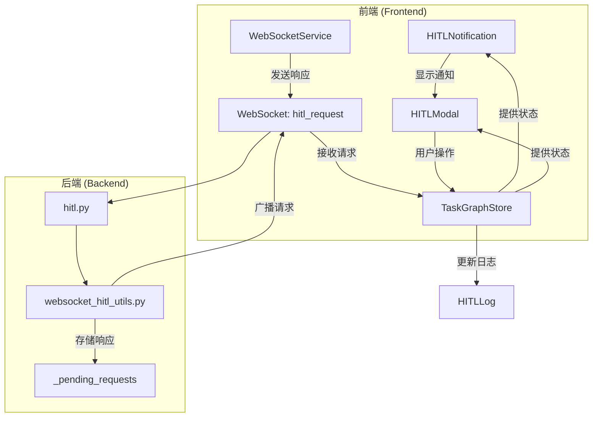
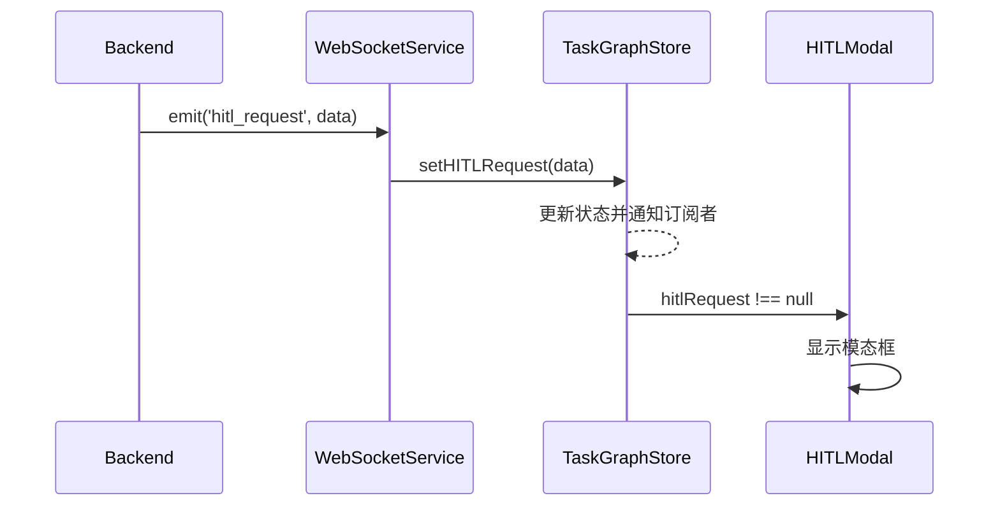
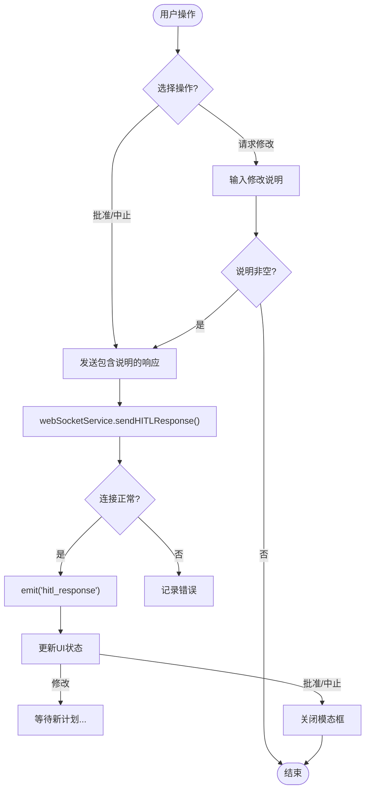
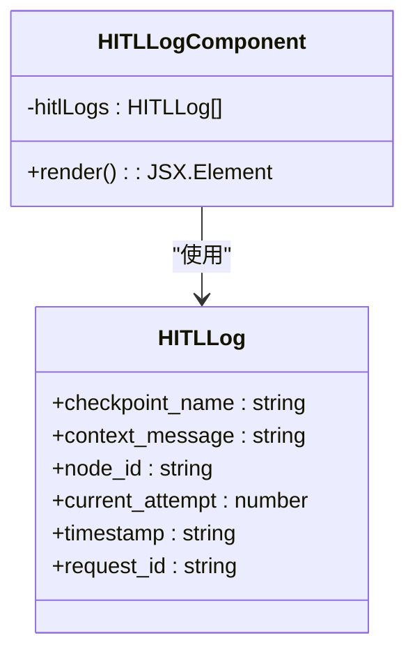
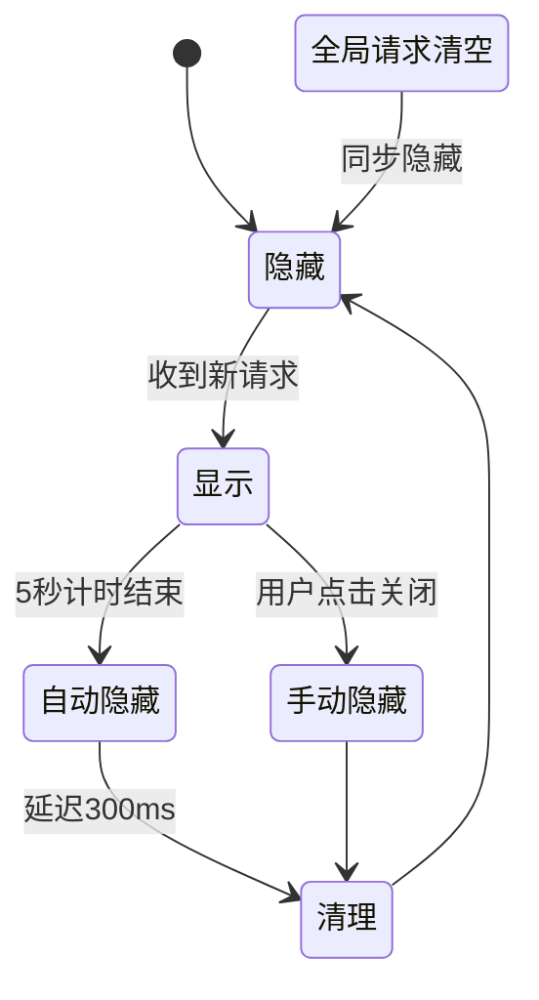
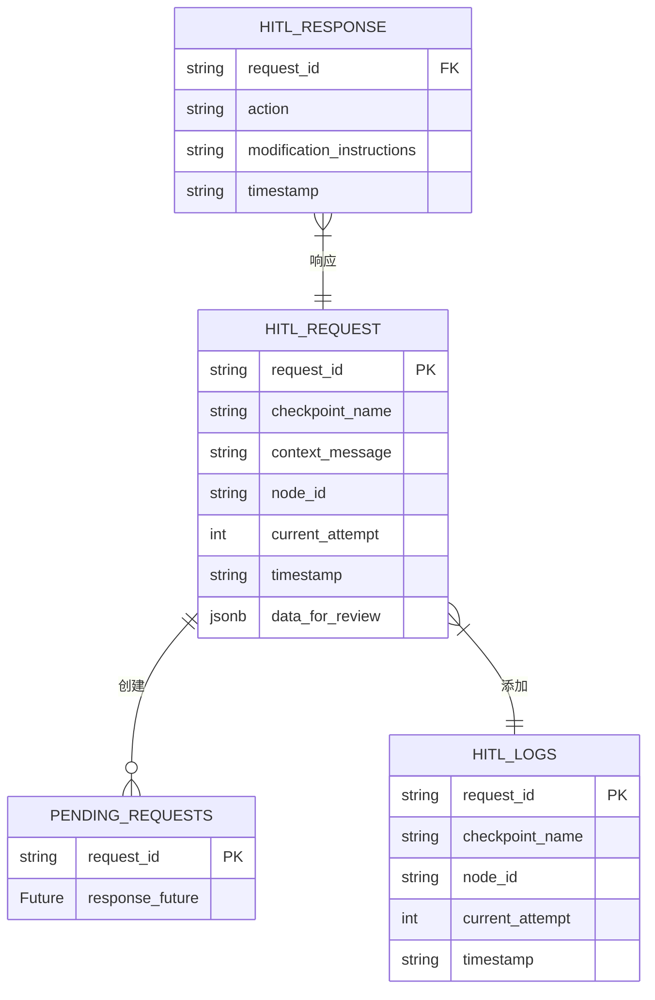

# 人机交互组件

<cite>
**本文档引用的文件**
- [HITLModal.tsx](file://frontend/src/components/hitl/HITLModal.tsx)
- [HITLLog.tsx](file://frontend/src/components/hitl/HITLLog.tsx)
- [HITLNotification.tsx](file://frontend/src/components/hitl/HITLNotification.tsx)
- [taskGraphStore.ts](file://frontend/src/stores/taskGraphStore.ts)
- [websocketService.ts](file://frontend/src/services/websocketService.ts)
- [websocket.ts](file://frontend/src/types/websocket.ts)
- [index.ts](file://frontend/src/types/index.ts)
- [hitl.py](file://src/sentientresearchagent/server/websocket/hitl.py)
- [websocket_hitl_utils.py](file://src/sentientresearchagent/hierarchical_agent_framework/utils/websocket_hitl_utils.py)
</cite>

## 目录
1. [简介](#简介)
2. [核心组件分析](#核心组件分析)
3. [架构概览](#架构概览)
4. [详细组件分析](#详细组件分析)
5. [依赖关系分析](#依赖关系分析)
6. [性能与安全注意事项](#性能与安全注意事项)
7. [集成示例](#集成示例)
8. [结论](#结论)

## 简介
本文档全面解析了人机协作（Human-in-the-Loop, HITL）前端组件的设计与实现。重点阐述了`HITLModal`弹窗的触发机制、用户输入处理及响应确认流程，说明了`HITLLog`日志面板如何结构化展示人工干预记录，以及`HITLNotification`通知组件在系统事件中的提示策略。文档详细描述了这些组件如何通过WebSocket与后端`hitl.py`服务进行双向通信，包括消息格式、状态更新与超时处理，并提供了集成示例和安全注意事项。

## 核心组件分析
本节分析了人机交互系统中的三个核心前端组件：`HITLModal`、`HITLLog`和`HITLNotification`，它们共同构成了用户与自动化系统之间的关键交互界面。

**本节来源**
- [HITLModal.tsx](file://frontend/src/components/hitl/HITLModal.tsx)
- [HITLLog.tsx](file://frontend/src/components/hitl/HITLLog.tsx)
- [HITLNotification.tsx](file://frontend/src/components/hitl/HITLNotification.tsx)

## 架构概览
下图展示了人机交互系统的整体架构，包括前端组件、状态管理、WebSocket服务和后端处理模块之间的数据流和控制流。



**图表来源**
- [HITLModal.tsx](file://frontend/src/components/hitl/HITLModal.tsx)
- [HITLLog.tsx](file://frontend/src/components/hitl/HITLLog.tsx)
- [HITLNotification.tsx](file://frontend/src/components/hitl/HITLNotification.tsx)
- [taskGraphStore.ts](file://frontend/src/stores/taskGraphStore.ts)
- [websocketService.ts](file://frontend/src/services/websocketService.ts)
- [hitl.py](file://src/sentientresearchagent/server/websocket/hitl.py)
- [websocket_hitl_utils.py](file://src/sentientresearchagent/hierarchical_agent_framework/utils/websocket_hitl_utils.py)

## 详细组件分析
本节对每个核心组件进行深入的技术剖析，解释其内部逻辑和与其他系统的交互方式。

### HITLModal 弹窗组件分析
`HITLModal`组件是用户与系统进行深度交互的主要界面，负责展示待审查的计划或执行结果，并收集用户的决策。

#### 触发与状态管理
`HITLModal`的打开由全局状态`useTaskGraphStore`中的`hitlRequest`决定。当后端通过WebSocket发送`hitl_request`事件时，`websocketService`会调用`setHITLRequest`方法，将请求数据存入状态管理器，从而触发模态框的显示。



**图表来源**
- [websocketService.ts](file://frontend/src/services/websocketService.ts#L300-L350)
- [taskGraphStore.ts](file://frontend/src/stores/taskGraphStore.ts#L158-L200)
- [HITLModal.tsx](file://frontend/src/components/hitl/HITLModal.tsx#L372-L738)

#### 用户输入处理与响应流程
用户可以通过点击“批准”、“请求修改”或“中止”按钮来做出决策。对于“请求修改”，用户可以输入详细的指令。



**图表来源**
- [HITLModal.tsx](file://frontend/src/components/hitl/HITLModal.tsx#L500-L650)
- [websocketService.ts](file://frontend/src/services/websocketService.ts#L750-L780)

### HITLLog 日志面板分析
`HITLLog`组件以简洁的列表形式展示最近的人工干预记录，帮助用户快速回顾历史操作。

#### 结构化展示
该组件从`useTaskGraphStore`获取`hitlLogs`数组，仅显示最近的5条记录。每条记录包含检查点名称、节点ID、尝试次数和时间戳。



**图表来源**
- [taskGraphStore.ts](file://frontend/src/stores/taskGraphStore.ts#L15-L22)
- [HITLLog.tsx](file://frontend/src/components/hitl/HITLLog.tsx#L6-L44)

### HITLNotification 通知组件分析
`HITLNotification`是一个轻量级的桌面通知，用于在不打断用户当前工作流的情况下提醒有新的审查请求。

#### 提示策略
该组件采用自动消失的策略，在收到新的`currentHITLRequest`后显示5秒，然后自动隐藏。它不会清除全局的HITL请求，确保用户稍后仍能通过`HITLModal`查看详情。



**图表来源**
- [HITLNotification.tsx](file://frontend/src/components/hitl/HITLNotification.tsx#L6-L88)

## 依赖关系分析
本节分析了人机交互系统各组件间的依赖关系，揭示了数据流动和控制权转移的关键路径。



**图表来源**
- [websocket_hitl_utils.py](file://src/sentientresearchagent/hierarchical_agent_framework/utils/websocket_hitl_utils.py#L300-L340)
- [hitl.py](file://src/sentientresearchagent/server/websocket/hitl.py#L1-L56)
- [taskGraphStore.ts](file://frontend/src/stores/taskGraphStore.ts#L158-L869)

## 性能与安全注意事项
本节讨论了系统在实际部署中需要注意的性能和安全问题。

### WebSocket 双向通信
前端与后端通过WebSocket进行实时双向通信，消息格式遵循特定规范。

#### 消息格式
- **前端 -> 后端 (`hitl_response`)**
  ```json
  {
    "request_id": "string",
    "action": "approve | modify | abort",
    "modification_instructions": "string",
    "timestamp": "ISO8601"
  }
  ```
- **后端 -> 前端 (`hitl_request`)**
  ```json
  {
    "request_id": "string",
    "checkpoint_name": "string",
    "context_message": "string",
    "data_for_review": "any",
    "node_id": "string",
    "current_attempt": "number",
    "timestamp": "ISO8601"
  }
  ```

#### 状态更新与超时处理
后端`websocket_hitl_utils.py`使用`_pending_requests`字典存储待处理的请求，并为每个请求设置最长30分钟的超时。如果超时未收到响应，则返回`"timeout"`状态。

**本节来源**
- [hitl.py](file://src/sentientresearchagent/server/websocket/hitl.py)
- [websocket_hitl_utils.py](file://src/sentientresearchagent/hierarchical_agent_framework/utils/websocket_hitl_utils.py)

### 安全注意事项
在集成HITL流程时，必须考虑以下安全因素：

| 注意事项 | 描述 |
|--------|------|
| 权限控制 | 确保只有授权用户才能访问HITL功能，防止未授权的审批或中止操作。 |
| 并发请求处理 | 系统应能正确处理同一节点的并发HITL请求，避免状态冲突。`HITLModal`通过`lastProcessedRequestId`确保每次只处理一个请求。 |
| 输入验证 | 对用户输入的修改说明进行严格验证，防止注入攻击。 |
| 连接稳定性 | WebSocket连接可能中断，系统需具备重连和状态恢复能力。`WebSocketService`实现了指数退避重连机制。 |

**本节来源**
- [HITLModal.tsx](file://frontend/src/components/hitl/HITLModal.tsx)
- [websocketService.ts](file://frontend/src/services/websocketService.ts)

## 集成示例
要将HITL流程集成到项目中，开发者需要在适当的业务逻辑点调用后端的`websocket_human_review`函数。

```python
from hierarchical_agent_framework.utils.websocket_hitl_utils import websocket_human_review

async def execute_task(task):
    # ... 执行任务的前期准备 ...
    
    # 在关键决策点插入HITL检查
    hitl_result = await websocket_human_review(
        checkpoint_name="Plan Review",
        context_message="请审查此任务的执行计划。",
        data_for_review=plan_data,
        node_id=task.task_id,
        current_attempt=1
    )
    
    if hitl_result["user_choice"] == "approved":
        # 继续执行
        pass
    elif hitl_result["user_choice"] == "request_modification":
        # 根据feedback重新生成计划
        new_plan = adjust_plan(plan_data, hitl_result["modification_instructions"])
    else:
        # 中止任务
        raise Exception("任务被用户中止")
```

**本节来源**
- [websocket_hitl_utils.py](file://src/sentientresearchagent/hierarchical_agent_framework/utils/websocket_hitl_utils.py)

## 结论
本文档详细解析了人机交互组件的完整设计与实现。从前端的`HITLModal`、`HITLLog`和`HITLNotification`三个核心组件，到后端的`hitl.py`和`websocket_hitl_utils.py`服务，整个系统通过WebSocket实现了高效、可靠的双向通信。该设计不仅提供了直观的用户交互体验，还通过完善的状态管理和超时机制保证了系统的健壮性。在集成时，开发者应重点关注权限控制和并发处理等安全事项，以确保系统的稳定运行。