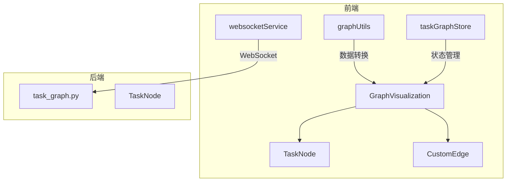
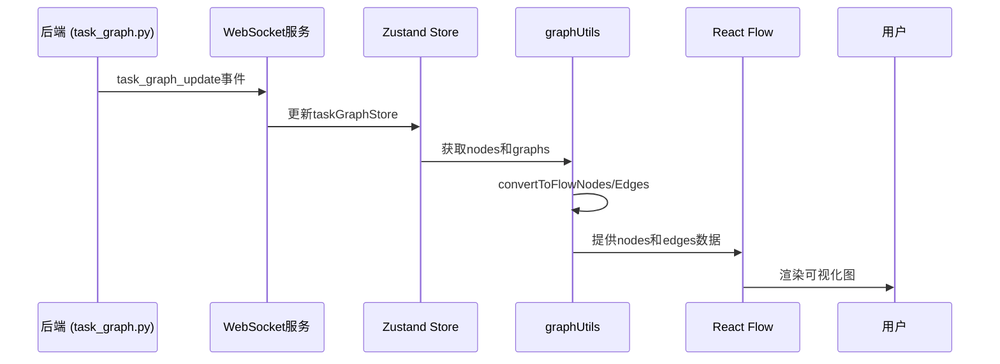
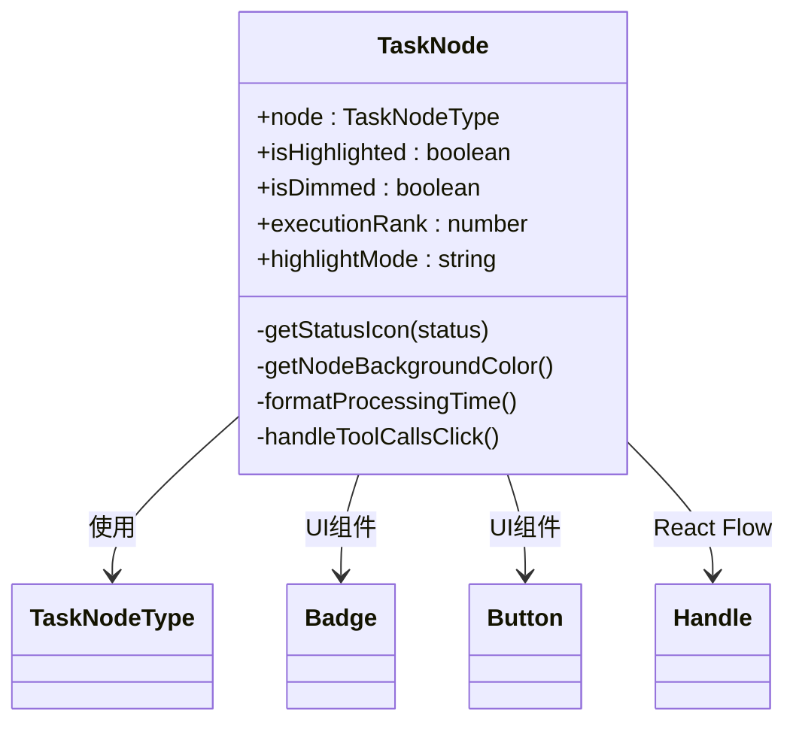
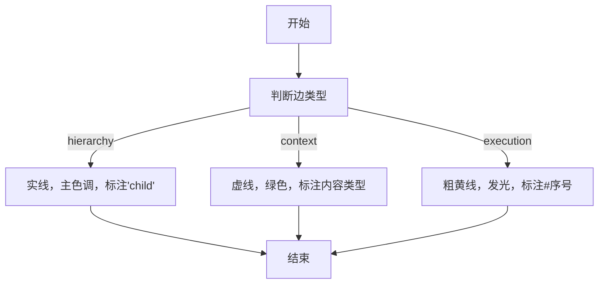
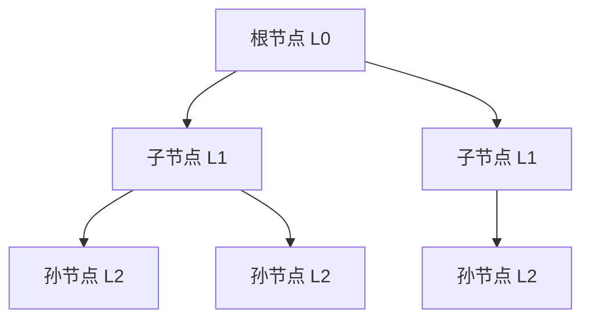

# 可视化组件

<cite>
**本文档中引用的文件**  
- [GraphVisualization.tsx](file://frontend/src/components/graph/GraphVisualization.tsx)
- [TaskGraphVisualization.tsx](file://frontend/src/components/TaskGraphVisualization.tsx)
- [TaskNode.tsx](file://frontend/src/components/graph/nodes/TaskNode.tsx)
- [CustomEdge.tsx](file://frontend/src/components/graph/edges/CustomEdge.tsx)
- [task_graph.py](file://src/sentientresearchagent/hierarchical_agent_framework/graph/task_graph.py)
- [websocketService.ts](file://frontend/src/services/websocketService.ts)
- [graphUtils.ts](file://frontend/src/lib/graphUtils.ts)
- [taskGraphStore.ts](file://frontend/src/stores/taskGraphStore.ts)
</cite>

## 目录
1. [简介](#简介)
2. [项目结构](#项目结构)
3. [核心组件](#核心组件)
4. [架构概述](#架构概述)
5. [详细组件分析](#详细组件分析)
6. [依赖分析](#依赖分析)
7. [性能考虑](#性能考虑)
8. [故障排除指南](#故障排除指南)
9. [结论](#结论)

## 简介
本技术文档深入分析了任务图可视化系统的实现机制，重点描述基于React Flow库构建的`GraphVisualization`和`TaskGraphVisualization`组件。文档详细说明了自定义节点`TaskNode`如何通过动态样式、状态映射和工具调用展示代理执行流程，以及`CustomEdge`如何实现带标签的连接线与交互反馈。同时解释了节点布局算法、缩放平移控制、路径高亮等用户体验优化策略，并结合后端`task_graph.py`与前端`websocketService.ts`阐述了前后端实时同步机制。

## 项目结构
该系统采用前后端分离架构，前端位于`frontend`目录，后端逻辑在`src/sentientresearchagent`中实现。可视化功能集中在`frontend/src/components/graph`目录下，包括节点、边、布局转换等核心模块。状态管理使用Zustand存储在`stores`目录，WebSocket服务负责实时通信。



**图表来源**
- [GraphVisualization.tsx](file://frontend/src/components/graph/GraphVisualization.tsx)
- [task_graph.py](file://src/sentientresearchagent/hierarchical_agent_framework/graph/task_graph.py)

**章节来源**
- [GraphVisualization.tsx](file://frontend/src/components/graph/GraphVisualization.tsx)
- [task_graph.py](file://src/sentientresearchagent/hierarchical_agent_framework/graph/task_graph.py)

## 核心组件
系统的核心是`GraphVisualization`组件，它作为React Flow的容器，处理加载状态、空状态并提供主画布。`TaskGraphVisualization`则负责集成HITL（人类干预）模态框，实现人机协作功能。这两个组件共同构成了可视化系统的入口点。

**章节来源**
- [GraphVisualization.tsx](file://frontend/src/components/graph/GraphVisualization.tsx#L184-L229)
- [TaskGraphVisualization.tsx](file://frontend/src/components/TaskGraphVisualization.tsx#L3-L15)

## 架构概述
整个可视化系统基于React Flow库构建，从前端到后端形成完整闭环。后端`TaskGraph`类维护任务节点的有向无环图（DAG），通过`GraphSerializer`序列化为前端可读格式。WebSocket服务建立持久连接，将后端状态变更实时推送到前端。前端通过Zustand全局状态管理接收数据，经由`graphUtils`转换为React Flow所需格式，在`GraphVisualization`中渲染。



**图表来源**
- [task_graph.py](file://src/sentientresearchagent/hierarchical_agent_framework/graph/task_graph.py)
- [websocketService.ts](file://frontend/src/services/websocketService.ts)
- [taskGraphStore.ts](file://frontend/src/stores/taskGraphStore.ts)
- [graphUtils.ts](file://frontend/src/lib/graphUtils.ts)

## 详细组件分析
### TaskNode 分析
`TaskNode`组件是可视化系统中最复杂的UI元素，它根据任务状态动态改变外观，直观展示AI代理的执行流程。

#### 自定义节点实现


**图表来源**
- [TaskNode.tsx](file://frontend/src/components/graph/nodes/TaskNode.tsx#L0-L281)

**章节来源**
- [TaskNode.tsx](file://frontend/src/components/graph/nodes/TaskNode.tsx#L0-L281)
- [types/index.ts](file://frontend/src/types/index.ts#L0-L22)

#### 动态样式与状态映射
`TaskNode`通过`getNodeBackgroundColor`函数根据任务状态（如PENDING、RUNNING、DONE、FAILED等）应用不同的背景色和边框颜色。每个状态还对应特定图标：绿色对勾表示完成，红色叉号表示失败，橙色旋转图标表示运行中。这种视觉编码使用户能快速识别任务健康状况。

当节点被选中或高亮时，会添加发光效果和缩放动画，增强交互反馈。多选模式下，右上角显示蓝色复选标记。

#### 工具调用展示
对于包含工具调用的节点，底部会显示“🔧 X tool calls”标签，点击可打开详细面板。执行详情中还会显示模型名称、处理时间和上下文源数量，提供丰富的执行元数据。

### CustomEdge 分析
`CustomEdge`组件实现了带标签的连接线，支持多种类型和交互反馈。

#### 带标签的连接线


**图表来源**
- [CustomEdge.tsx](file://frontend/src/components/graph/edges/CustomEdge.tsx#L4-L108)

**章节来源**
- [CustomEdge.tsx](file://frontend/src/components/graph/edges/CustomEdge.tsx#L4-L108)

#### 边类型与样式
- **层次边**(hierarchy)：实线，灰色，表示父子节点关系
- **上下文边**(context)：虚线，绿色，表示上下文传递
- **执行边**(execution)：粗黄线，发光效果，用于高亮执行路径

当边被高亮或为执行类型时，会在路径中点显示标签，包含序号、内容类型缩写或"child"字样，提升可读性。

### 用户体验优化策略
#### 节点布局算法
系统采用分层布局算法，按`layer`字段将节点分组排列。同一层的节点水平居中分布，垂直间距固定。根节点（无父节点）位于顶层，子节点逐层向下展开，形成清晰的树状结构。



#### 缩放平移控制
通过React Flow内置的`Controls`组件提供缩放按钮，支持鼠标滚轮缩放和平移拖拽。初始加载时自动调用`fitView`方法，确保整个图谱适配视窗。最小缩放0.1倍，最大4倍，满足不同粒度查看需求。

#### 路径高亮策略
系统支持四种高亮模式：
- **无高亮**：正常视图
- **数据流**：显示从选定节点出发的数据流向
- **执行路径**：按执行顺序编号高亮节点和边
- **子树**：聚焦于选定节点及其后代

这些模式通过`contextFlowMode`状态控制，帮助用户理解复杂的数据流动和执行顺序。

## 依赖分析
系统各组件间存在紧密依赖关系，从前端UI到后端数据形成完整链条。

```mermaid
dependency-graph
GraphVisualization --> TaskNode
GraphVisualization --> CustomEdge
GraphVisualization --> graphUtils
TaskGraphVisualization --> HITLModal
graphUtils --> taskGraphStore
websocketService --> taskGraphStore
taskGraphStore --> TaskNode
taskGraphStore --> CustomEdge
```

**图表来源**
- [go.mod](file://frontend/package.json)
- [GraphVisualization.tsx](file://frontend/src/components/graph/GraphVisualization.tsx)

**章节来源**
- [GraphVisualization.tsx](file://frontend/src/components/graph/GraphVisualization.tsx)
- [taskGraphStore.ts](file://frontend/src/stores/taskGraphStore.ts)

## 性能考虑
对于大型任务图，建议实施以下优化措施：

1. **虚拟滚动**：仅渲染视口内的节点，大幅减少DOM元素
2. **节点懒加载**：初始只加载高层级节点，展开时再加载子节点
3. **防抖更新**：对频繁的状态更新进行节流，避免过度重渲染
4. **Web Worker**：将复杂计算（如布局算法）移至Worker线程

常见渲染问题及调试方法：
- **节点重叠**：检查`layer`值是否正确，确认布局算法未被破坏
- **位置错位**：验证坐标计算逻辑，特别是多屏环境下的偏移
- **更新延迟**：检查WebSocket连接状态和消息频率
- **内存泄漏**：监控组件卸载时的事件监听器清理情况

## 故障排除指南
针对常见的可视化问题，可采取以下排查步骤：

1. 检查`websocketService`连接状态，确保实时通信正常
2. 验证`taskGraphStore`中的原始数据是否正确
3. 确认`graphUtils`转换函数输出符合React Flow要求
4. 查看浏览器控制台是否有渲染错误或警告
5. 使用`ProjectDebugPanel`等调试工具检查状态一致性

特别注意项目切换时的状态同步问题，确保`currentProjectId`在多个store间保持一致。

**章节来源**
- [websocketService.ts](file://frontend/src/services/websocketService.ts#L5-L966)
- [taskGraphStore.ts](file://frontend/src/stores/taskGraphStore.ts)

## 结论
该任务图可视化系统通过精心设计的组件架构和高效的前后端协同，成功实现了复杂AI代理执行流程的直观展示。`TaskNode`和`CustomEdge`的定制化实现提供了丰富的视觉反馈，而基于WebSocket的实时同步机制保证了状态的一致性。未来可通过引入虚拟化技术进一步提升大规模图谱的渲染性能。