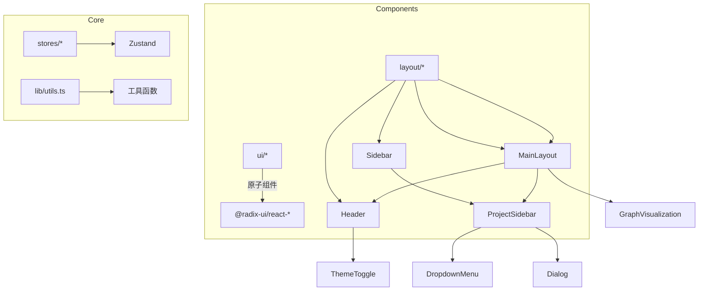
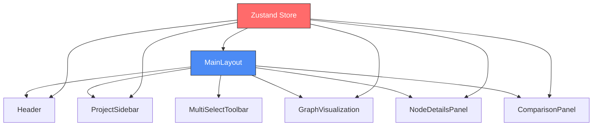
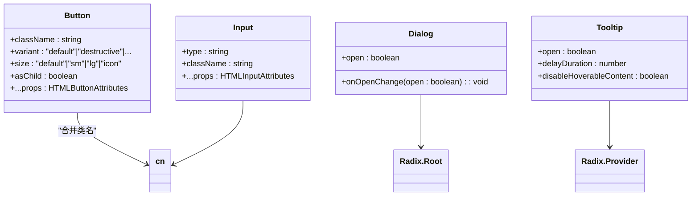

# 基础UI组件

<cite>
**本文档中引用的文件**  
- [button.tsx](file://frontend/src/components/ui/button.tsx)
- [dialog.tsx](file://frontend/src/components/ui/dialog.tsx)
- [tooltip.tsx](file://frontend/src/components/ui/tooltip.tsx)
- [MainLayout.tsx](file://frontend/src/components/layout/MainLayout.tsx)
- [Header.tsx](file://frontend/src/components/layout/Header.tsx)
- [ProjectSidebar.tsx](file://frontend/src/components/sidebar/ProjectSidebar.tsx)
- [utils.ts](file://frontend/src/lib/utils.ts)
- [input.tsx](file://frontend/src/components/ui/input.tsx)
- [textarea.tsx](file://frontend/src/components/ui/textarea.tsx)
- [scroll-area.tsx](file://frontend/src/components/ui/scroll-area.tsx)
- [card.tsx](file://frontend/src/components/ui/card.tsx)
- [label.tsx](file://frontend/src/components/ui/label.tsx)
- [dropdown-menu.tsx](file://frontend/src/components/ui/dropdown-menu.tsx)
- [select.tsx](file://frontend/src/components/ui/select.tsx)
</cite>

## 目录
1. [简介](#简介)
2. [项目结构](#项目结构)
3. [核心原子组件设计原则](#核心原子组件设计原则)
4. [MainLayout布局组件分析](#mainlayout布局组件分析)
5. [类型安全与样式隔离机制](#类型安全与样式隔离机制)
6. [自定义UI组件最佳实践](#自定义ui组件最佳实践)
7. [常用组合模式示例](#常用组合模式示例)
8. [结论](#结论)

## 简介
本文件系统化介绍了基于Radix UI封装的基础组件库的设计原则与复用模式。重点阐述了`button`、`dialog`、`tooltip`等原子组件的Props接口规范、可访问性支持及主题适配机制。同时分析了`MainLayout`如何整合`Header`、`Sidebar`和`Content`区域以实现响应式断点与路由导航功能。强调了组件在TypeScript下的类型安全性以及使用Tailwind CSS实现的样式隔离，并提供了创建新UI组件的最佳实践指南，包括命名约定、目录结构和测试策略。

## 项目结构
前端代码位于`frontend/src`目录下，采用模块化组织方式。核心UI组件集中于`components/ui`路径，布局相关组件存放于`components/layout`，侧边栏逻辑由`components/sidebar`管理。所有工具函数通过`lib/utils.ts`统一导出，状态管理依赖Zustand存储于`stores`目录中。整体架构遵循清晰的职责分离原则，便于维护和扩展。



**Diagram sources**
- [MainLayout.tsx](file://frontend/src/components/layout/MainLayout.tsx#L1-L182)
- [Header.tsx](file://frontend/src/components/layout/Header.tsx#L1-L104)
- [ProjectSidebar.tsx](file://frontend/src/components/sidebar/ProjectSidebar.tsx#L1-L799)

**Section sources**
- [MainLayout.tsx](file://frontend/src/components/layout/MainLayout.tsx#L1-L182)
- [Header.tsx](file://frontend/src/components/layout/Header.tsx#L1-L104)
- [ProjectSidebar.tsx](file://frontend/src/components/sidebar/ProjectSidebar.tsx#L1-L799)

## 核心原子组件设计原则

### Button组件接口规范
`Button`组件通过`cva`（Class Variance Authority）定义多态变体，支持`variant`（default, destructive, outline等）和`size`（default, sm, lg, icon）两种维度配置。其Props继承自原生HTML按钮属性并融合变体类型，确保类型安全的同时提供高度定制能力。通过`asChild`布尔值控制是否渲染为Slot插槽，实现内容嵌套灵活性。

**Section sources**
- [button.tsx](file://frontend/src/components/ui/button.tsx#L1-L55)

### Dialog组件可访问性支持
`Dialog`组件基于Radix UI构建，完整实现了WAI-ARIA模态对话框标准。包含`DialogTitle`、`DialogDescription`、`DialogClose`等语义化子组件，自动处理焦点锁定、键盘导航（ESC关闭）、屏幕阅读器标签（sr-only）等功能。动画状态通过`data-[state]`属性驱动，结合Tailwind的`animate-in`/`animate-out`类实现平滑过渡效果。

**Section sources**
- [dialog.tsx](file://frontend/src/components/ui/dialog.tsx#L1-L119)

### Tooltip组件主题适配机制
`Tooltip`组件利用Radix的`Provider`上下文传递全局配置（如延迟时间），并通过`sideOffset`控制提示框偏移量。样式上采用`z-50`层级叠加，配合`backdrop-blur-sm`背景模糊增强视觉层次。内容区域使用`text-popover-foreground`颜色变量，确保在不同主题下保持良好对比度。

**Section sources**
- [tooltip.tsx](file://frontend/src/components/ui/tooltip.tsx#L1-L27)

## MainLayout布局组件分析
`MainLayout`作为应用主容器，协调多个功能模块：顶部`Header`提供系统控制，左侧`ProjectSidebar`管理项目列表，中央`GraphVisualization`展示任务图谱，右侧面板动态显示节点详情或比较信息。通过Zustand状态仓库同步连接状态、加载指示、选中节点等共享数据，实现跨组件通信。

响应式设计采用`grid-cols-1 lg:grid-cols-[1fr_400px]`断点规则，在大屏设备上固定右侧面板宽度，小屏则堆叠排列。条件渲染逻辑精细控制各区域可见性——例如仅当存在多个选中节点时才激活`ComparisonPanel`。



**Diagram sources**
- [MainLayout.tsx](file://frontend/src/components/layout/MainLayout.tsx#L1-L182)
- [Header.tsx](file://frontend/src/components/layout/Header.tsx#L1-L104)
- [ProjectSidebar.tsx](file://frontend/src/components/sidebar/ProjectSidebar.tsx#L1-L799)

**Section sources**
- [MainLayout.tsx](file://frontend/src/components/layout/MainLayout.tsx#L1-L182)

## 类型安全与样式隔离机制
所有组件均使用TypeScript严格定义接口。例如`InputProps`扩展自`React.InputHTMLAttributes<HTMLInputElement>`，保证原生属性完整性；`VariantProps<typeof buttonVariants>`从CVA配置中提取合法变体值，杜绝非法传参。联合类型与泛型广泛应用于复杂组件（如`SelectItem`），提升开发体验。

样式方面完全依赖Tailwind CSS实用类，避免全局CSS污染。通过`cn()`工具函数合并动态类名，内部调用`clsx`与`tailwind-merge`解决类冲突问题。每个组件封装独立作用域，修改不影响其他部分，真正实现样式隔离。



**Diagram sources**
- [button.tsx](file://frontend/src/components/ui/button.tsx#L1-L55)
- [input.tsx](file://frontend/src/components/ui/input.tsx#L1-L24)
- [dialog.tsx](file://frontend/src/components/ui/dialog.tsx#L1-L119)
- [tooltip.tsx](file://frontend/src/components/ui/tooltip.tsx#L1-L27)
- [utils.ts](file://frontend/src/lib/utils.ts#L1-L52)

**Section sources**
- [button.tsx](file://frontend/src/components/ui/button.tsx#L1-L55)
- [input.tsx](file://frontend/src/components/ui/input.tsx#L1-L24)
- [dialog.tsx](file://frontend/src/components/ui/dialog.tsx#L1-L119)
- [tooltip.tsx](file://frontend/src/components/ui/tooltip.tsx#L1-L27)
- [utils.ts](file://frontend/src/lib/utils.ts#L1-L52)

## 自定义UI组件最佳实践

### 命名约定
遵循PascalCase命名法，文件与组件名一致（如`Card.tsx`导出`Card`）。复合组件使用连字符分隔角色（如`CardHeader`、`CardContent`）。工具函数采用camelCase（如`cn`、`truncateText`）。

### 目录结构
新组件应置于`components/ui`下，配套类型定义写入同级`.ts`文件。若涉及复杂交互，可建立独立子目录（如`dropdown-menu`包含触发器、内容区、菜单项）。样式常量统一维护于`tailwind.config.js`主题扩展中。

### 测试策略
建议为每个原子组件编写单元测试，验证：
- 不同props组合下的渲染正确性
- 事件回调是否被正确触发
- 可访问性属性（aria-*）生成合规
- 动画类名随状态变化准确更新

使用Vitest+Testing Library进行快照测试与行为断言，确保重构不破坏现有功能。

**Section sources**
- [button.tsx](file://frontend/src/components/ui/button.tsx#L1-L55)
- [card.tsx](file://frontend/src/components/ui/card.tsx#L1-L69)
- [dropdown-menu.tsx](file://frontend/src/components/ui/dropdown-menu.tsx#L1-L131)
- [utils.ts](file://frontend/src/lib/utils.ts#L1-L52)

## 常用组合模式示例

### 表单组（Form Group）
将`Label`、`Input`/`Textarea`、验证提示封装为带间距的垂直组，利用`peer`伪类实现聚焦联动样式：

```tsx
<div className="space-y-2">
  <Label htmlFor="goal">Project Goal</Label>
  <Input id="goal" placeholder="Research objective..." />
</div>
```

### 卡片列表（Card List）
使用`ScrollArea`包裹`Card`数组，每张卡片包含标题、描述与操作按钮，适合展示项目概览：

```tsx
<ScrollArea className="h-96 p-4">
  {projects.map(p => (
    <Card key={p.id} className="mb-4">
      <CardHeader>
        <CardTitle>{p.title}</CardTitle>
        <CardDescription>{p.description}</CardDescription>
      </CardHeader>
    </Card>
  ))}
</ScrollArea>
```

**Section sources**
- [ProjectSidebar.tsx](file://frontend/src/components/sidebar/ProjectSidebar.tsx#L1-L799)
- [card.tsx](file://frontend/src/components/ui/card.tsx#L1-L69)
- [scroll-area.tsx](file://frontend/src/components/ui/scroll-area.tsx#L1-L29)
- [label.tsx](file://frontend/src/components/ui/label.tsx#L1-L19)
- [input.tsx](file://frontend/src/components/ui/input.tsx#L1-L24)

## 结论
该UI组件库通过Radix UI保障基础交互的健壮性与无障碍兼容，借助Tailwind实现高效样式开发，结合TypeScript确保API类型精确。`MainLayout`展示了复杂布局的组织范式，而原子化设计允许灵活组装各类界面。未来新增组件应延续现有模式，注重可复用性、可测试性与文档完整性，持续提升前端工程化水平。