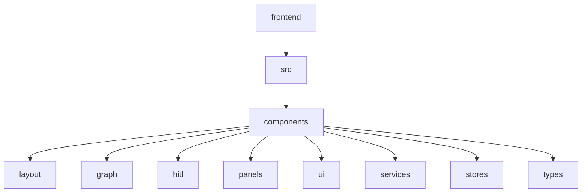
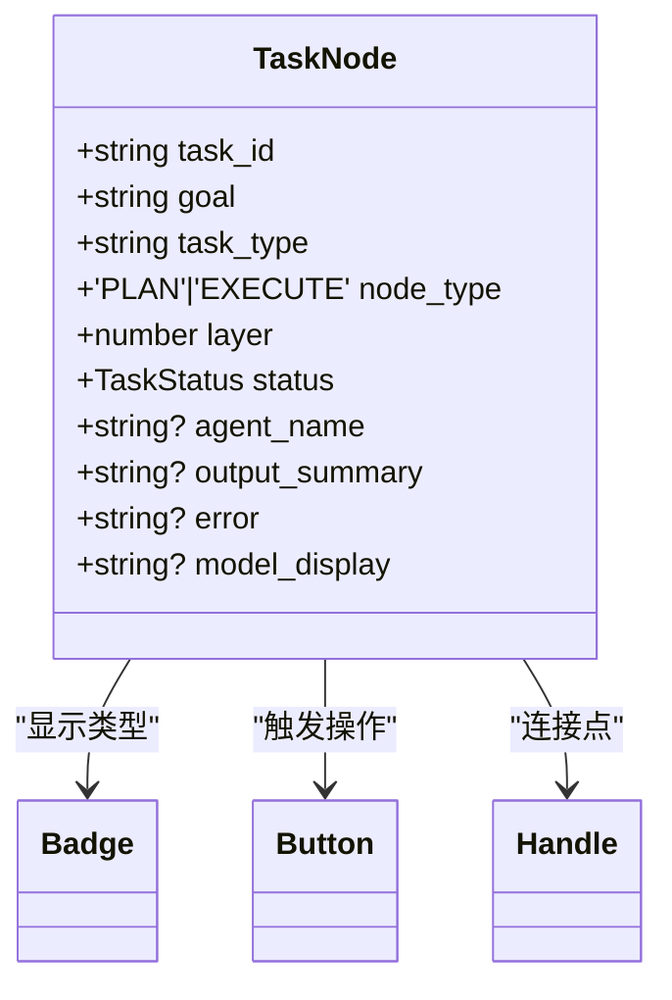
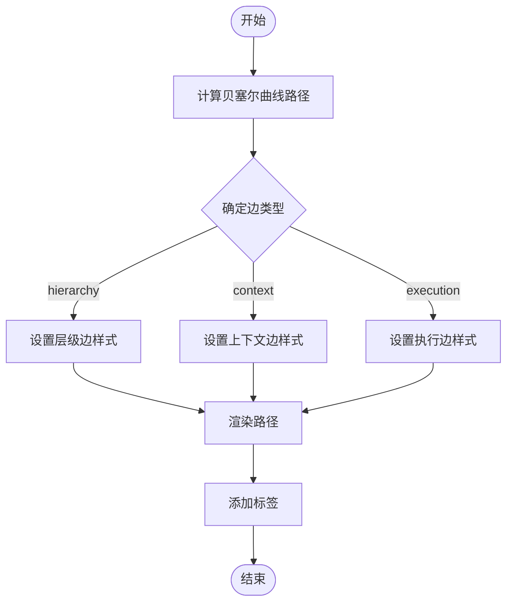
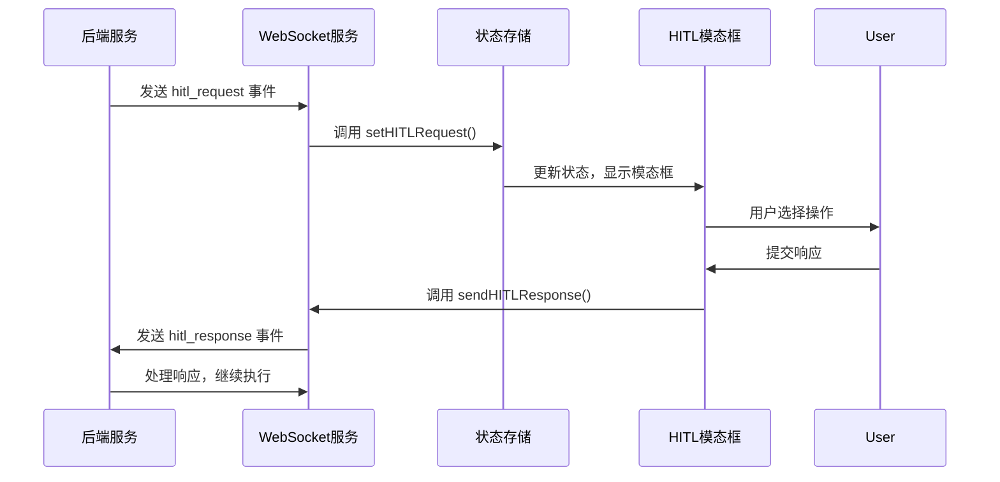
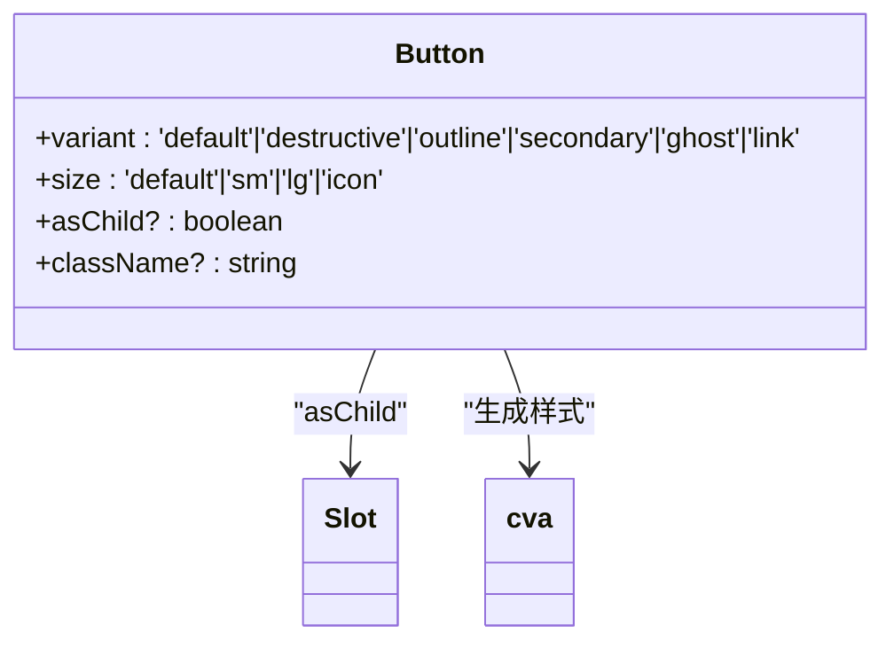
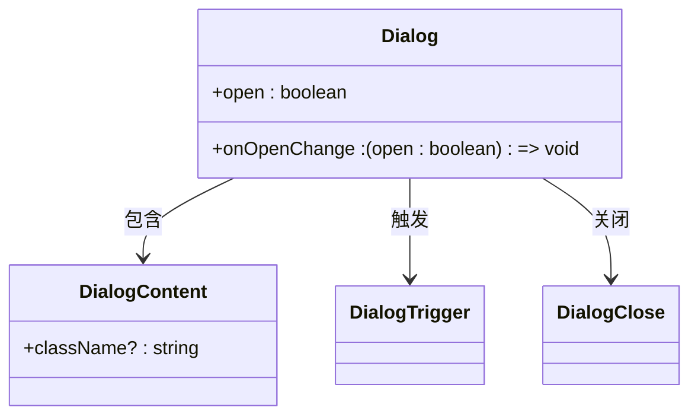
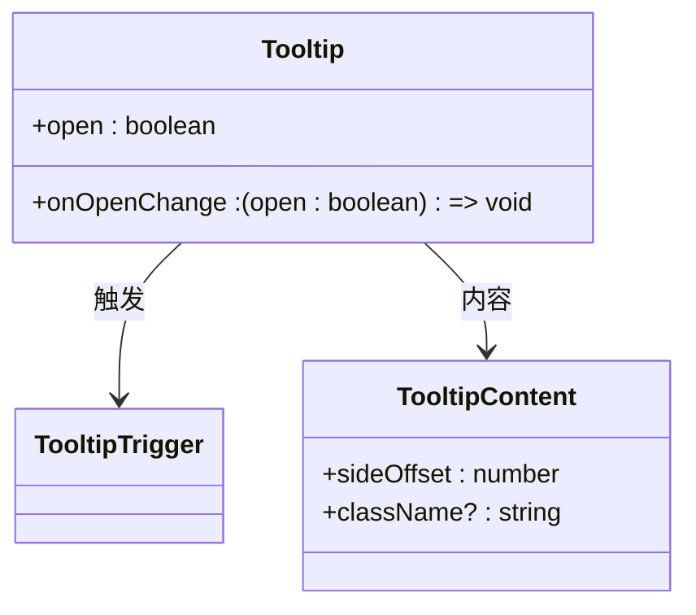
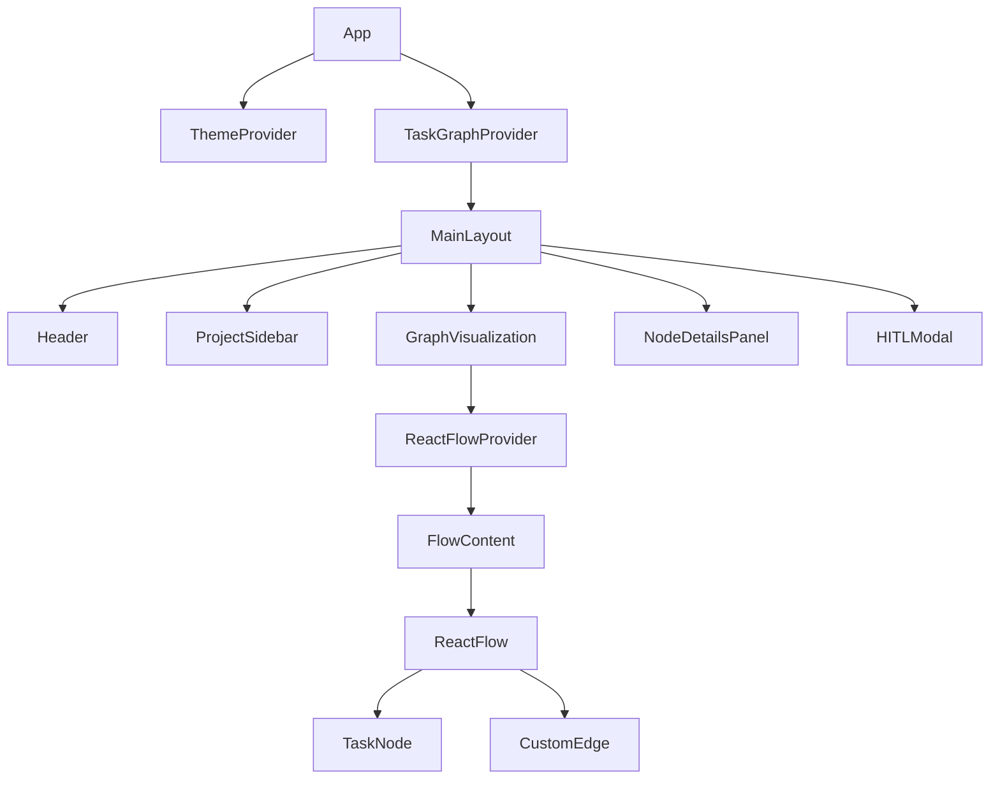

# 组件体系

<cite>
**本文档中引用的文件**  
- [TaskNode.tsx](file://frontend/src/components/graph/nodes/TaskNode.tsx)
- [CustomEdge.tsx](file://frontend/src/components/graph/edges/CustomEdge.tsx)
- [HITLModal.tsx](file://frontend/src/components/hitl/HITLModal.tsx)
- [button.tsx](file://frontend/src/components/ui/button.tsx)
- [dialog.tsx](file://frontend/src/components/ui/dialog.tsx)
- [tooltip.tsx](file://frontend/src/components/ui/tooltip.tsx)
- [MainLayout.tsx](file://frontend/src/components/layout/MainLayout.tsx)
- [GraphVisualization.tsx](file://frontend/src/components/graph/GraphVisualization.tsx)
- [graphUtils.ts](file://frontend/src/lib/graphUtils.ts)
- [App.tsx](file://frontend/src/App.tsx)
- [taskGraphStore.ts](file://frontend/src/stores/taskGraphStore.ts)
- [websocketService.ts](file://frontend/src/services/websocketService.ts)
- [index.ts](file://frontend/src/types/index.ts)
</cite>

## 目录
1. [项目结构概览](#项目结构概览)
2. [分层组件设计](#分层组件设计)
3. [核心可视化组件](#核心可视化组件)
4. [人机交互组件](#人机交互组件)
5. [基础UI组件封装](#基础ui组件封装)
6. [组件树与嵌套关系](#组件树与嵌套关系)
7. [开发新组件的建议](#开发新组件的建议)

## 项目结构概览

前端代码库采用功能驱动的目录组织方式，将组件按职责划分为多个逻辑目录。`layout` 目录包含应用的整体布局结构；`graph` 目录负责任务图谱的可视化渲染；`hitl` 目录处理人机交互流程；`panels` 目录提供各种信息面板；`ui` 目录则封装了可复用的基础UI组件。



**Diagram sources**
- [MainLayout.tsx](file://frontend/src/components/layout/MainLayout.tsx#L1-L183)

**Section sources**
- [MainLayout.tsx](file://frontend/src/components/layout/MainLayout.tsx#L1-L183)

## 分层组件设计

### layout 目录
`layout` 目录中的组件定义了应用的整体框架和导航结构。`MainLayout.tsx` 是应用的主要布局容器，它整合了头部、侧边栏、主内容区以及状态指示器等元素，为其他功能组件提供了统一的展示环境。

### graph 目录
`graph` 目录专注于任务图谱的可视化呈现。该目录下的 `nodes` 和 `edges` 子目录分别存放节点和连接线的自定义渲染组件，通过 React Flow 库实现复杂的图形化交互界面。

### hitl 目录
`hitl` 目录（Human-in-the-Loop）专门处理需要人工干预的关键决策点。`HITLModal.tsx` 组件在系统需要用户确认或修改计划时弹出，确保关键操作的安全性和可控性。

### panels 目录
`panels` 目录包含了多种信息展示面板，如 `NodeDetailsPanel.tsx` 显示选中节点的详细信息，`ComparisonPanel.tsx` 允许用户对比多个节点的状态，`ToolCallsModal.tsx` 展示工具调用详情。

### ui 目录
`ui` 目录基于 Radix UI 封装了一系列基础UI组件，如按钮、对话框、标签等。这些组件遵循统一的设计规范，保证了整个应用的视觉一致性，并支持主题切换。

**Section sources**
- [MainLayout.tsx](file://frontend/src/components/layout/MainLayout.tsx#L1-L183)
- [GraphVisualization.tsx](file://frontend/src/components/graph/GraphVisualization.tsx#L1-L232)
- [HITLModal.tsx](file://frontend/src/components/hitl/HITLModal.tsx#L1-L738)
- [NodeDetailsPanel.tsx](file://frontend/src/components/panels/NodeDetailsPanel.tsx)
- [button.tsx](file://frontend/src/components/ui/button.tsx#L1-L56)

## 核心可视化组件

### TaskNode 自定义节点

`TaskNode` 组件是任务图谱中的基本单元，用于可视化单个任务的状态和属性。该组件根据任务状态动态改变背景色和图标，提供直观的视觉反馈。



**Diagram sources**
- [TaskNode.tsx](file://frontend/src/components/graph/nodes/TaskNode.tsx#L1-L282)
- [index.ts](file://frontend/src/types/index.ts#L1-L22)

**Section sources**
- [TaskNode.tsx](file://frontend/src/components/graph/nodes/TaskNode.tsx#L1-L282)
- [index.ts](file://frontend/src/types/index.ts#L1-L22)

### CustomEdge 自定义连接线

`CustomEdge` 组件实现了不同类型的连接线样式，以区分任务之间的层级、上下文和执行关系。通过动态计算贝塞尔曲线路径，确保连接线平滑且不重叠。



**Diagram sources**
- [CustomEdge.tsx](file://frontend/src/components/graph/edges/CustomEdge.tsx#L1-L108)
- [graphUtils.ts](file://frontend/src/lib/graphUtils.ts#L1-L144)

**Section sources**
- [CustomEdge.tsx](file://frontend/src/components/graph/edges/CustomEdge.tsx#L1-L108)
- [graphUtils.ts](file://frontend/src/lib/graphUtils.ts#L1-L144)

## 人机交互组件

### HITLModal 与 WebSocket 通信

`HITLModal` 组件通过 `websocketService` 与后端服务进行实时通信。当系统需要人工干预时，会通过 WebSocket 接收 `hitl_request` 事件并显示模态框。用户做出选择后，组件会调用 `sendHITLResponse` 方法将响应发送回服务器。



**Diagram sources**
- [HITLModal.tsx](file://frontend/src/components/hitl/HITLModal.tsx#L372-L738)
- [websocketService.ts](file://frontend/src/services/websocketService.ts#L1-L799)

**Section sources**
- [HITLModal.tsx](file://frontend/src/components/hitl/HITLModal.tsx#L372-L738)
- [websocketService.ts](file://frontend/src/services/websocketService.ts#L1-L799)

## 基础UI组件封装

### 基于 Radix UI 的封装模式

所有基础UI组件均基于 Radix UI 构建，通过 `cva` (Class Variance Authority) 定义样式变体，确保组件在不同状态下的表现一致。这种封装模式提高了组件的可复用性和可维护性。

#### Button 按钮组件



**Diagram sources**
- [button.tsx](file://frontend/src/components/ui/button.tsx#L1-L56)

#### Dialog 对话框组件



**Diagram sources**
- [dialog.tsx](file://frontend/src/components/ui/dialog.tsx#L1-L120)

#### Tooltip 工具提示组件



**Diagram sources**
- [tooltip.tsx](file://frontend/src/components/ui/tooltip.tsx#L1-L28)

**Section sources**
- [button.tsx](file://frontend/src/components/ui/button.tsx#L1-L56)
- [dialog.tsx](file://frontend/src/components/ui/dialog.tsx#L1-L120)
- [tooltip.tsx](file://frontend/src/components/ui/tooltip.tsx#L1-L28)

## 组件树与嵌套关系

从 `App` 根组件到具体功能组件，形成了清晰的嵌套结构。`App` 组件作为入口点，包裹了主题和任务图谱的上下文提供者，然后渲染 `MainLayout` 主布局。



**Diagram sources**
- [App.tsx](file://frontend/src/App.tsx#L1-L21)
- [MainLayout.tsx](file://frontend/src/components/layout/MainLayout.tsx#L1-L183)
- [GraphVisualization.tsx](file://frontend/src/components/graph/GraphVisualization.tsx#L1-L232)

**Section sources**
- [App.tsx](file://frontend/src/App.tsx#L1-L21)
- [MainLayout.tsx](file://frontend/src/components/layout/MainLayout.tsx#L1-L183)
- [GraphVisualization.tsx](file://frontend/src/components/graph/GraphVisualization.tsx#L1-L232)

## 开发新组件的建议

### TypeScript 接口规范

新组件应遵循严格的 TypeScript 类型定义。对于与后端交互的数据模型，应在 `types/index.ts` 中定义接口。例如，`TaskNode` 接口定义了任务的所有属性及其类型。

```typescript
export interface TaskNode {
  task_id: string
  goal: string
  task_type: string
  node_type: 'PLAN' | 'EXECUTE'
  agent_name?: string
  layer: number
  parent_node_id?: string
  sub_graph_id?: string
  status: TaskStatus
  // ... 其他属性
}
```

### Props 设计建议

1. **明确类型定义**：所有 props 都应有明确的 TypeScript 类型。
2. **使用默认值**：为可选 props 提供合理的默认值。
3. **避免过度传递**：只传递组件真正需要的 props，避免不必要的重新渲染。
4. **使用 asChild 模式**：对于包装类组件，考虑使用 Radix UI 的 `Slot` 实现 `asChild` 模式，提高灵活性。

**Section sources**
- [index.ts](file://frontend/src/types/index.ts#L1-L167)
- [button.tsx](file://frontend/src/components/ui/button.tsx#L1-L56)