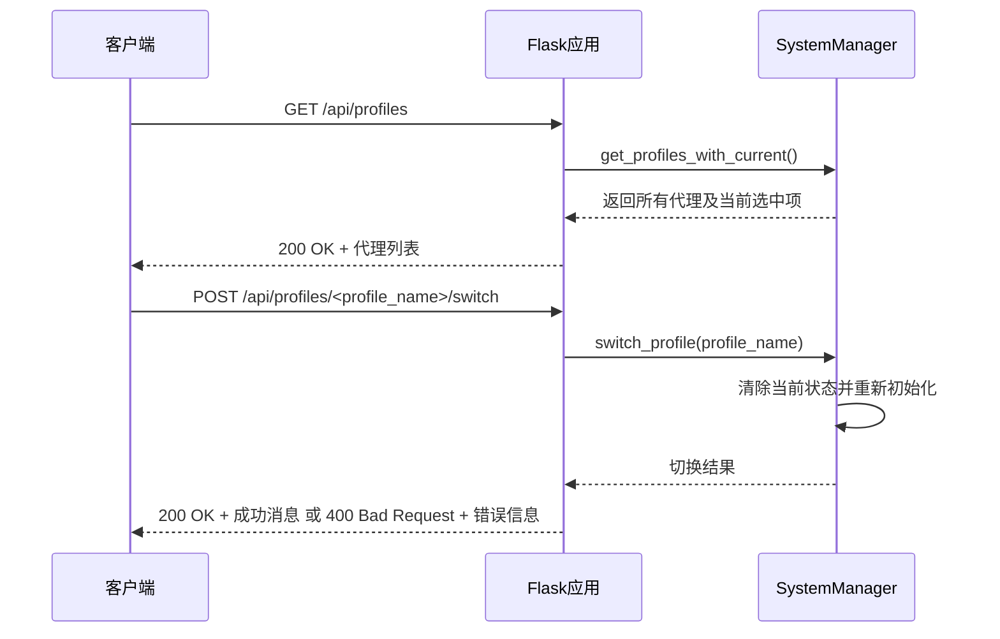
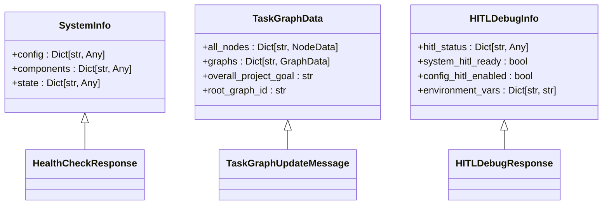
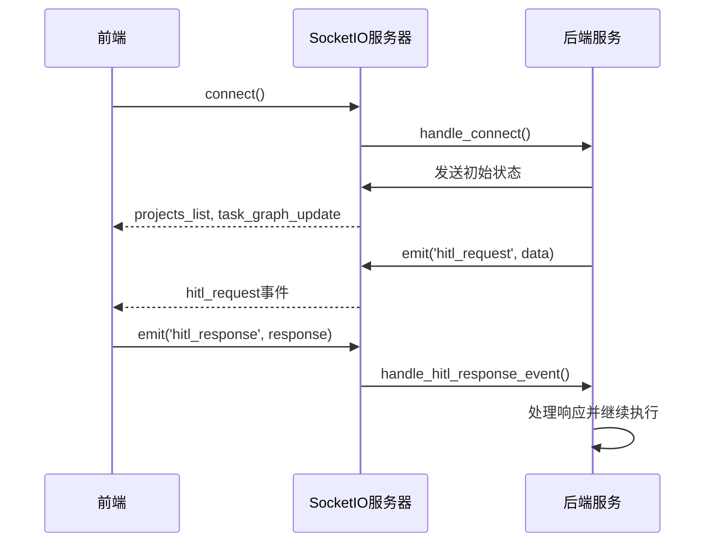

# API服务

<cite>
**本文档中引用的文件**  
- [projects.py](file://src/sentientresearchagent/server/api/projects.py)
- [profiles.py](file://src/sentientresearchagent/server/api/profiles.py)
- [system.py](file://src/sentientresearchagent/server/api/system.py)
- [simple_api.py](file://src/sentientresearchagent/server/api/simple_api.py)
- [app.py](file://src/sentientresearchagent/server/app.py)
- [events.py](file://src/sentientresearchagent/server/websocket/events.py)
- [hitl.py](file://src/sentientresearchagent/server/websocket/hitl.py)
</cite>

## 目录
1. [简介](#简介)
2. [项目管理API](#项目管理api)
3. [代理配置API](#代理配置api)
4. [系统状态接口](#系统状态接口)
5. [简化调用入口](#简化调用入口)
6. [WebSocket实时通信接口](#websocket实时通信接口)
7. [路由注册与中间件](#路由注册与中间件)
8. [安全策略与性能优化](#安全策略与性能优化)

## 简介
本API文档详细介绍了基于Flask框架构建的智能研究代理系统的RESTful端点和WebSocket实时通信接口。系统通过`app.py`中的应用工厂模式创建Flask实例，并利用CORS中间件实现跨域资源共享，支持前端在开发环境中无缝连接。

核心功能模块包括：`projects.py`提供的项目全生命周期管理、`profiles.py`实现的代理配置切换、`system.py`暴露的系统健康检查与调试信息，以及`simple_api.py`封装的简化调用入口。所有HTTP端点均采用JSON格式进行请求和响应，通过统一的错误处理机制返回标准化的错误码。

实时通信方面，系统通过SocketIO实现了双向WebSocket连接，支持任务更新、节点状态变化和人机交互请求（HITL）等事件的即时推送。前端可通过订阅特定事件类型来获取执行过程中的动态信息，实现近乎实时的可视化追踪。

**Section sources**
- [app.py](file://src/sentientresearchagent/server/app.py#L1-L126)

## 项目管理API
`projects.py`模块提供了对项目资源的完整CRUD操作，是系统的核心RESTful接口之一。这些端点允许客户端创建新项目、查询现有项目列表、获取特定项目的详细信息、切换当前工作项目以及删除不再需要的项目。

项目创建时需提供核心目标（goal），系统会自动初始化一个包含根节点的任务图。每个项目都有独立的执行上下文，确保多项目并行运行时的状态隔离。此外，系统还提供了项目结果的持久化保存和报告下载功能，支持Markdown、JSON和HTML等多种格式。

```mermaid
flowchart TD
A[客户端] --> B[/api/projects GET]
A --> C[/api/projects POST]
A --> D[/api/projects/<project_id> GET]
A --> E[/api/projects/<project_id>/switch POST]
A --> F[/api/projects/<project_id> DELETE]
A --> G[/api/projects/<project_id>/save-results POST]
A --> H[/api/projects/<project_id>/load-results GET]
A --> I[/api/projects/<project_id>/download-report GET]
B --> J[返回所有项目列表]
C --> K[创建新项目并启动执行]
D --> L[返回指定项目详情]
E --> M[切换到指定项目]
F --> N[删除指定项目]
G --> O[保存项目结果]
H --> P[加载已保存的结果]
I --> Q[下载项目报告]
```

**Diagram sources**
- [projects.py](file://src/sentientresearchagent/server/api/projects.py#L0-L589)

**Section sources**
- [projects.py](file://src/sentientresearchagent/server/api/projects.py#L0-L589)

## 代理配置API
`profiles.py`模块负责管理不同的代理配置文件，允许用户根据任务需求动态切换AI代理的行为模式。系统预置了多种配置，如`deep_research_agent`用于深度研究，`general_agent`适用于通用分析。

通过该API，客户端可以获取所有可用的代理列表，查看某个代理的详细配置（包括使用的LLM模型、温度参数、规划器和执行器映射等），并发起切换请求。切换操作会重置当前任务图并重新初始化执行引擎，以确保新的配置被正确应用。



**Diagram sources**
- [profiles.py](file://src/sentientresearchagent/server/api/profiles.py#L0-L110)

**Section sources**
- [profiles.py](file://src/sentientresearchagent/server/api/profiles.py#L0-L110)

## 系统状态接口
`system.py`模块暴露了一系列用于监控和诊断系统运行状况的接口。这些端点对于前端展示系统信息、进行健康检查以及调试人机交互（HITL）流程至关重要。

`/api/system-info`返回系统的综合信息，包括当前激活的代理配置、HITL启用状态和最大执行步数。`/api/task-graph`提供当前任务图的序列化数据，供前端渲染可视化图形。`/api/health`和`/readiness`是标准的健康检查端点，可用于容器编排平台的探活。

特别地，系统还提供了一套完整的HITL调试接口，允许开发者触发测试请求、检查WebSocket连接状态，并通过HTTP轮询获取HITL响应，为复杂的人机协作流程提供了强大的调试能力。



**Diagram sources**
- [system.py](file://src/sentientresearchagent/server/api/system.py#L0-L345)

**Section sources**
- [system.py](file://src/sentientresearchagent/server/api/system.py#L0-L345)

## 简化调用入口
`simple_api.py`模块为快速执行和常见任务提供了简洁的API封装，降低了用户的使用门槛。它主要面向希望以最少配置完成特定任务的场景。

`/api/simple/execute`端点接受一个目标（goal）并立即开始执行，非常适合一次性任务。`/api/simple/research`和`/api/simple/analysis`是更高级的便利端点，分别针对“研究”和“分析”类任务进行了优化，内部调用了框架的便捷函数。

这些接口默认禁用HITL，以实现完全自动化。但用户可以通过请求体中的`enable_hitl`字段显式启用，从而在自动化和人工干预之间取得平衡。`/api/simple/status`端点则用于检查简化API自身的可用性，帮助前端判断是否可以使用这些快捷方式。

```mermaid
flowchart LR
A[客户端] --> B[simple_execute]
A --> C[simple_research]
A --> D[simple_analysis]
A --> E[simple_api_status]
B --> F[SimpleSentientAgent.execute()]
C --> G[quick_research()]
D --> H[quick_analysis()]
E --> I[检查组件就绪状态]
F --> J[返回执行结果]
G --> K[返回研究结果]
H --> L[返回分析结果]
I --> M[返回API状态]
```

**Diagram sources**
- [simple_api.py](file://src/sentientresearchagent/server/api/simple_api.py#L0-L175)

**Section sources**
- [simple_api.py](file://src/sentientresearchagent/server/api/simple_api.py#L0-L175)

## WebSocket实时通信接口
系统通过SocketIO实现了强大的WebSocket实时通信能力，由`events.py`和`hitl.py`两个模块共同提供支持。`register_websocket_events`函数注册了所有通用事件处理器，而`register_hitl_events`则专门处理人机交互相关的消息。

关键的事件类型包括：
- `task_graph_update`: 当任务图发生变化时，向所有客户端广播最新的图数据。
- `hitl_request`: 向前端推送需要人工干预的请求，包含检查点名称、上下文信息和待审查的数据。
- `hitl_response`: 前端通过此事件将用户的决策（批准、修改或中止）回传给后端。
- `project_switched`: 广播项目切换事件，通知所有客户端当前活动项目已变更。

这种设计实现了真正的实时同步，前端UI能够几乎无延迟地反映后端执行引擎的状态变化，极大地提升了用户体验。



**Diagram sources**
- [events.py](file://src/sentientresearchagent/server/websocket/events.py#L0-L747)
- [hitl.py](file://src/sentientresearchagent/server/websocket/hitl.py#L0-L56)

**Section sources**
- [events.py](file://src/sentientresearchagent/server/websocket/events.py#L0-L747)
- [hitl.py](file://src/sentientresearchagent/server/websocket/hitl.py#L0-L56)

## 路由注册与中间件
`app.py`是整个Web服务的入口点，它定义了`create_app`、`create_socketio`和`register_routes`三个核心函数。`create_app`函数使用Flask的应用工厂模式创建并配置应用实例，同时通过`flask_cors`扩展启用CORS，允许来自`localhost:3000`等开发环境的跨域请求。

`register_routes`函数是路由注册的中枢，它按顺序导入并调用各个API模块的`create_xxx_routes`函数，将RESTful端点和WebSocket事件处理器全部挂载到应用上。这种模块化的注册方式使得代码结构清晰，易于维护和扩展。

```mermaid
graph TB
A[create_app] --> B[Flask(__name__)]
A --> C[app.config.update(...)]
A --> D[CORS(app, origins=cors_origins)]
A --> E[返回app]
F[create_socketio] --> G[SocketIO(app, ...)]
F --> H[返回socketio]
I[register_routes] --> J[create_system_routes]
I --> K[create_project_routes]
I --> L[create_simple_api_routes]
I --> M[register_websocket_events]
I --> N[register_hitl_events]
```

**Diagram sources**
- [app.py](file://src/sentientresearchagent/server/app.py#L1-L126)

**Section sources**
- [app.py](file://src/sentientresearchagent/server/app.py#L1-L126)

## 安全策略与性能优化
系统实施了多层次的安全和性能优化策略。在输入验证层面，`validation.py`模块提供了统一的请求校验工具，对项目目标长度、最大步数范围和配置结构进行严格检查，防止无效或恶意数据进入系统。

速率限制虽未在代码中直接体现，但其架构设计为未来集成`flask-limiter`等库预留了空间。所有API端点都遵循RESTful最佳实践，使用恰当的HTTP状态码（如201表示创建成功，400表示客户端错误，500表示服务器内部错误）进行响应。

在性能方面，系统采用了异步非阻塞的执行模型，通过`threading.Thread`在后台运行耗时的项目执行任务，避免阻塞主线程。`RealtimeExecutionWrapper`类实现了周期性更新机制，确保前端能及时获得进度反馈，同时最小化对主执行流程的影响。对于大规模数据传输，如任务图序列化，系统也考虑了压缩和增量更新的可能性。

**Section sources**
- [validation.py](file://src/sentientresearchagent/server/utils/validation.py#L11-L113)
- [execution_service.py](file://src/sentientresearchagent/server/services/execution_service.py#L184-L718)