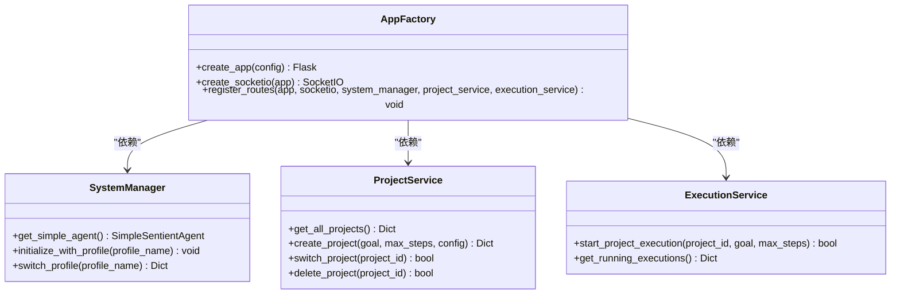
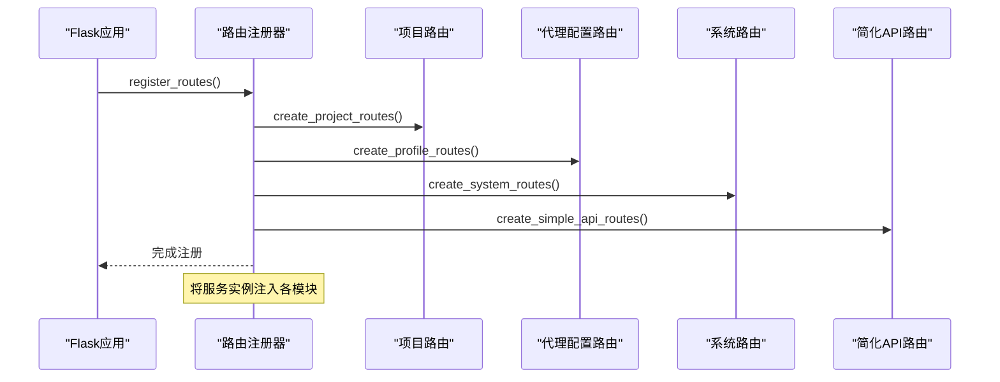
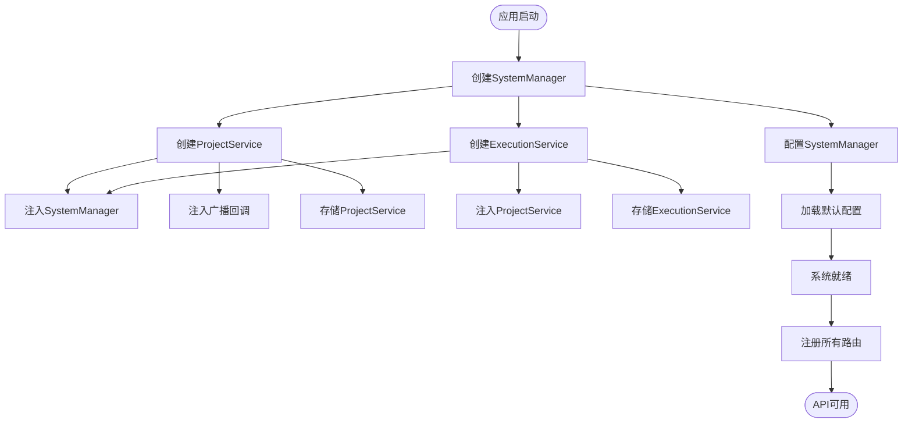
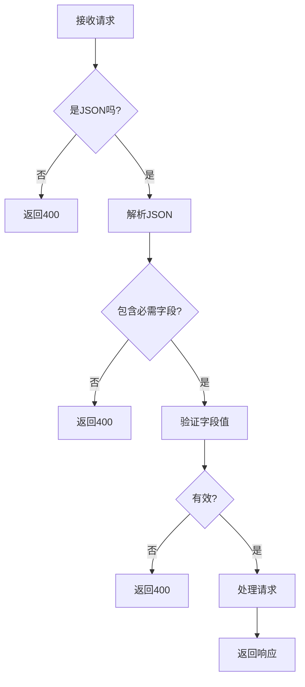
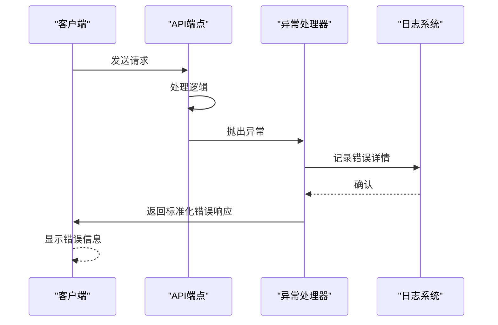
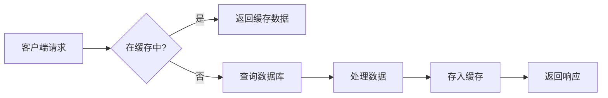

# REST API接口

<cite>
**本文档引用的文件**   
- [app.py](file://src/sentientresearchagent/server/app.py)
- [projects.py](file://src/sentientresearchagent/server/api/projects.py)
- [profiles.py](file://src/sentientresearchagent/server/api/profiles.py)
- [system.py](file://src/sentientresearchagent/server/api/system.py)
- [simple_api.py](file://src/sentientresearchagent/server/api/simple_api.py)
- [project_service.py](file://src/sentientresearchagent/server/services/project_service.py)
- [execution_service.py](file://src/sentientresearchagent/server/services/execution_service.py)
- [validation.py](file://src/sentientresearchagent/server/utils/validation.py)
</cite>

## 目录
1. [简介](#简介)
2. [项目管理端点](#项目管理端点)
3. [代理配置操作](#代理配置操作)
4. [系统状态监控接口](#系统状态监控接口)
5. [简化调用入口](#简化调用入口)
6. [路由注册与依赖注入](#路由注册与依赖注入)
7. [认证与安全](#认证与安全)
8. [错误处理与常见问题](#错误处理与常见问题)
9. [性能优化建议](#性能优化建议)
10. [使用示例](#使用示例)

## 简介
本文档详细描述了基于FastAPI构建的REST API接口，涵盖了项目管理、代理配置、系统监控和简化调用等核心功能。API通过模块化设计实现了高内聚低耦合的架构，所有端点均遵循统一的请求验证、错误处理和响应格式规范。

**Section sources**
- [app.py](file://src/sentientresearchagent/server/app.py#L1-L125)

## 项目管理端点

### 创建项目
创建新项目并启动执行流程。

**HTTP方法**: `POST`  
**URL路径**: `/api/projects`  
**请求头要求**:
- `Content-Type: application/json`

**请求体结构**:
```json
{
  "goal": "string",
  "max_steps": "integer"
}
```

**字段说明**:
- `goal`: 项目目标描述（必填，3-1000字符）
- `max_steps`: 最大执行步骤数（可选，默认250）

**成功响应 (201)**:
```json
{
  "project": {
    "id": "string",
    "title": "string",
    "goal": "string",
    "status": "running",
    "created_at": "datetime"
  },
  "message": "Project created and started"
}
```

**错误响应**:
- `400 Bad Request`: 输入验证失败
- `500 Internal Server Error`: 服务器内部错误

**Section sources**
- [projects.py](file://src/sentientresearchagent/server/api/projects.py#L35-L108)
- [validation.py](file://src/sentientresearchagent/server/utils/validation.py#L43-L62)

### 创建配置化项目
创建带有自定义配置的新项目。

**HTTP方法**: `POST`  
**URL路径**: `/api/projects/configured`  
**请求头要求**:
- `Content-Type: application/json`

**请求体结构**:
```json
{
  "goal": "string",
  "config": {
    "llm": {
      "provider": "string",
      "model": "string",
      "temperature": "number"
    },
    "execution": {
      "max_concurrent_nodes": "integer",
      "enable_hitl": "boolean"
    },
    "cache": {
      "enabled": "boolean",
      "ttl_seconds": "integer"
    }
  },
  "max_steps": "integer"
}
```

**字段说明**:
- `config`: 自定义配置对象（必填）
  - `llm`: LLM配置
  - `execution`: 执行配置
  - `cache`: 缓存配置

**成功响应 (201)**:
```json
{
  "project": { /* 项目信息 */ },
  "message": "Configured project created and started",
  "config_applied": true
}
```

**Section sources**
- [projects.py](file://src/sentientresearchagent/server/api/projects.py#L110-L180)
- [projects.py](file://src/sentientresearchagent/server/api/projects.py#L358-L393)

### 查询项目列表
获取所有项目的列表。

**HTTP方法**: `GET`  
**URL路径**: `/api/projects`  
**成功响应 (200)**:
```json
{
  "projects": [
    {
      "id": "string",
      "title": "string",
      "goal": "string",
      "status": "string",
      "has_saved_results": "boolean",
      "last_saved": "datetime"
    }
  ],
  "current_project_id": "string"
}
```

**Section sources**
- [projects.py](file://src/sentientresearchagent/server/api/projects.py#L18-L33)

### 获取特定项目
获取指定ID的项目详情。

**HTTP方法**: `GET`  
**URL路径**: `/api/projects/{project_id}`  
**成功响应 (200)**:
```json
{
  "project": { /* 项目信息 */ },
  "state": { /* 项目状态 */ }
}
```
**错误响应**:
- `404 Not Found`: 项目不存在

**Section sources**
- [projects.py](file://src/sentientresearchagent/server/api/projects.py#L182-L198)

### 切换项目
切换到指定的项目。

**HTTP方法**: `POST`  
**URL路径**: `/api/projects/{project_id}/switch`  
**成功响应 (200)**:
```json
{
  "project": { /* 项目信息 */ },
  "message": "Switched to project {project_id}"
}
```

**Section sources**
- [projects.py](file://src/sentientresearchagent/server/api/projects.py#L200-L218)

### 删除项目
删除指定的项目及其相关数据。

**HTTP方法**: `DELETE`  
**URL路径**: `/api/projects/{project_id}`  
**成功响应 (200)**:
```json
{
  "message": "Project deleted successfully"
}
```
**错误响应**:
- `404 Not Found`: 项目不存在

**Section sources**
- [projects.py](file://src/sentientresearchagent/server/api/projects.py#L220-L238)
- [project_service.py](file://src/sentientresearchagent/server/services/project_service.py#L479-L508)

### 保存项目结果
保存项目执行结果以实现持久化。

**HTTP方法**: `POST`  
**URL路径**: `/api/projects/{project_id}/save-results`  
**成功响应 (200)**:
```json
{
  "message": "Project results saved successfully",
  "saved_at": "datetime",
  "metadata": {
    "total_nodes": "integer",
    "completion_status": "string"
  }
}
```

**Section sources**
- [projects.py](file://src/sentientresearchagent/server/api/projects.py#L240-L284)

### 加载项目结果
加载已保存的项目结果。

**HTTP方法**: `GET`  
**URL路径**: `/api/projects/{project_id}/load-results`  
**成功响应 (200)**:
```json
{
  "project": { /* 项目信息 */ },
  "saved_at": "datetime",
  "graph_data": { /* 图形数据 */ },
  "metadata": { /* 元数据 */ }
}
```

**Section sources**
- [projects.py](file://src/sentientresearchagent/server/api/projects.py#L286-L303)

### 下载项目报告
下载项目报告文件。

**HTTP方法**: `GET`  
**URL路径**: `/api/projects/{project_id}/download-report`  
**查询参数**:
- `format`: 报告格式（markdown, json, html，默认markdown）

**成功响应**: 文件下载流

**Section sources**
- [projects.py](file://src/sentientresearchagent/server/api/projects.py#L305-L355)

## 代理配置操作

### 获取所有代理配置
获取所有可用的代理配置。

**HTTP方法**: `GET`  
**URL路径**: `/api/profiles`  
**成功响应 (200)**:
```json
{
  "current_profile": "string",
  "profiles": [
    {
      "name": "string",
      "description": "string",
      "is_current": "boolean",
      "planner_mappings": { "key": "value" },
      "executor_mappings": { "key": "value" }
    }
  ],
  "total_count": "integer"
}
```

**Section sources**
- [profiles.py](file://src/sentientresearchagent/server/api/profiles.py#L12-L31)

### 获取特定代理配置详情
获取指定代理配置的详细信息。

**HTTP方法**: `GET`  
**URL路径**: `/api/profiles/{profile_name}`  
**成功响应 (200)**:
```json
{
  "name": "string",
  "description": "string",
  "root_planner": "string",
  "planner_mappings": { "key": "value" },
  "executor_mappings": { "key": "value" },
  "is_current": "boolean"
}
```

**Section sources**
- [profiles.py](file://src/sentientresearchagent/server/api/profiles.py#L33-L51)

### 切换代理配置
切换到指定的代理配置。

**HTTP方法**: `POST`  
**URL路径**: `/api/profiles/{profile_name}/switch`  
**成功响应 (200)**:
```json
{
  "success": true,
  "profile": "string",
  "message": "Successfully switched to {profile_name}",
  "system_info": { /* 系统信息 */ },
  "profile_details": { /* 配置详情 */ }
}
```
**错误响应**:
- `400 Bad Request`: 切换失败

**Section sources**
- [profiles.py](file://src/sentientresearchagent/server/api/profiles.py#L53-L82)
- [system_manager.py](file://src/sentientresearchagent/core/system_manager.py#L280-L330)

### 获取当前代理配置
获取当前激活的代理配置。

**HTTP方法**: `GET`  
**URL路径**: `/api/profiles/current`  
**成功响应 (200)**:
```json
{ /* 代理配置详情 */ }
```
**错误响应**:
- `404 Not Found`: 无激活配置

**Section sources**
- [profiles.py](file://src/sentientresearchagent/server/api/profiles.py#L84-L100)

### 验证代理配置
验证指定代理配置的有效性。

**HTTP方法**: `GET`  
**URL路径**: `/api/profiles/validate/{profile_name}`  
**成功响应 (200)**:
```json
{
  "profile": "string",
  "validation": { /* 验证结果 */ },
  "is_valid": "boolean"
}
```

**Section sources**
- [profiles.py](file://src/sentientresearchagent/server/api/profiles.py#L102-L110)

## 系统状态监控接口

### 获取系统信息
获取系统运行时信息和统计。

**HTTP方法**: `GET`  
**URL路径**: `/api/system-info`  
**成功响应 (200)**:
```json
{
  "config": {
    "hitl_enabled": "boolean",
    "max_steps": "integer",
    "profile": "string"
  },
  "components": { /* 组件指标 */ },
  "state": { /* 状态统计 */ }
}
```

**Section sources**
- [system.py](file://src/sentientresearchagent/server/api/system.py#L17-L31)

### 获取任务图数据
获取当前任务图的可视化数据。

**HTTP方法**: `GET`  
**URL路径**: `/api/task-graph`  
**成功响应 (200)**:
```json
{
  "all_nodes": { /* 节点数据 */ },
  "graphs": { /* 图形数据 */ },
  "overall_project_goal": "string"
}
```

**Section sources**
- [system.py](file://src/sentientresearchagent/server/api/system.py#L33-L59)

### 健康检查
检查系统健康状态。

**HTTP方法**: `GET`  
**URL路径**: `/api/health`  
**成功响应 (200)**:
```json
{
  "status": "healthy",
  "initialized": "boolean",
  "timestamp": "datetime"
}
```

**Section sources**
- [system.py](file://src/sentientresearchagent/server/api/system.py#L61-L74)

### 系统就绪状态
获取系统就绪状态。

**HTTP方法**: `GET`  
**URL路径**: `/readiness`  
**成功响应 (200)**:
```json
{
  "ready": "boolean",
  "components": { /* 组件状态 */ },
  "websocket_hitl_status": { /* HITL状态 */ }
}
```

**Section sources**
- [system.py](file://src/sentientresearchagent/server/api/system.py#L76-L115)

### HITL调试信息
获取HITL调试信息。

**HTTP方法**: `GET`  
**URL路径**: `/api/system/hitl-debug`  
**成功响应 (200)**:
```json
{
  "hitl_status": { /* 状态信息 */ },
  "system_hitl_ready": "boolean",
  "config_hitl_enabled": "boolean"
}
```

**Section sources**
- [system.py](file://src/sentientresearchagent/server/api/system.py#L117-L145)

## 简化调用入口

### 简单执行
简化的目标执行接口。

**HTTP方法**: `POST`  
**URL路径**: `/api/simple/execute`  
**请求体结构**:
```json
{
  "goal": "string",
  "options": { "key": "value" },
  "enable_hitl": "boolean"
}
```

**成功响应 (200)**:
```json
{ /* 执行结果 */ }
```

**Section sources**
- [simple_api.py](file://src/sentientresearchagent/server/api/simple_api.py#L16-L54)

### 快速研究
便捷的研究任务接口。

**HTTP方法**: `POST`  
**URL路径**: `/api/simple/research`  
**请求体结构**:
```json
{
  "topic": "string",
  "options": { "key": "value" },
  "enable_hitl": "boolean"
}
```

**成功响应 (200)**:
```json
{
  "topic": "string",
  "result": { /* 研究结果 */ },
  "status": "completed"
}
```

**Section sources**
- [simple_api.py](file://src/sentientresearchagent/server/api/simple_api.py#L56-L81)

### 快速分析
便捷的分析任务接口。

**HTTP方法**: `POST`  
**URL路径**: `/api/simple/analysis`  
**请求体结构**:
```json
{
  "data_description": "string",
  "options": { "key": "value" },
  "enable_hitl": "boolean"
}
```

**成功响应 (200)**:
```json
{
  "data_description": "string",
  "result": { /* 分析结果 */ },
  "status": "completed"
}
```

**Section sources**
- [simple_api.py](file://src/sentientresearchagent/server/api/simple_api.py#L83-L110)

### 简化API状态
获取简化API系统的状态。

**HTTP方法**: `GET`  
**URL路径**: `/api/simple/status`  
**成功响应 (200)**:
```json
{
  "framework_available": "boolean",
  "simple_agent_ready": "boolean",
  "endpoints": ["string"]
}
```

**Section sources**
- [simple_api.py](file://src/sentientresearchagent/server/api/simple_api.py#L112-L138)

## 路由注册与依赖注入

### FastAPI应用初始化
FastAPI应用通过工厂模式创建和配置。



**Diagram sources**
- [app.py](file://src/sentientresearchagent/server/app.py#L1-L125)

### 模块化路由注册
API路由通过模块化方式注册。



**Diagram sources**
- [app.py](file://src/sentientresearchagent/server/app.py#L100-L125)

### 依赖注入机制
系统组件通过构造函数注入依赖。



**Diagram sources**
- [app.py](file://src/sentientresearchagent/server/app.py#L100-L125)
- [project_service.py](file://src/sentientresearchagent/server/services/project_service.py#L28-L100)
- [execution_service.py](file://src/sentientresearchagent/server/services/execution_service.py#L184-L200)

**Section sources**
- [app.py](file://src/sentientresearchagent/server/app.py#L100-L125)
- [project_service.py](file://src/sentientresearchagent/server/services/project_service.py#L28-L100)
- [execution_service.py](file://src/sentientresearchagent/server/services/execution_service.py#L184-L200)

## 认证与安全

### 认证方式
系统支持多种认证机制：

- **API Key**: 通过环境变量配置
- **JWT**: 可扩展支持
- **CORS**: 开发环境允许localhost和ngrok域名

**安全措施**:
- 请求内容类型验证
- 输入数据格式验证
- 敏感信息环境变量管理

**Section sources**
- [app.py](file://src/sentientresearchagent/server/app.py#L50-L85)

### 输入验证规则
所有API端点都进行严格的输入验证。



**验证规则**:
- 项目目标：3-1000字符字符串
- 最大步骤：1-10000之间的整数
- 配置对象：包含必需的LLM、执行和缓存部分

**Section sources**
- [validation.py](file://src/sentientresearchagent/server/utils/validation.py#L11-L113)

## 错误处理与常见问题

### 常见错误码
| 错误码 | 含义 | 解决建议 |
|-------|------|----------|
| 400 | 请求无效 | 检查请求格式和必填字段 |
| 404 | 资源未找到 | 确认资源ID是否存在 |
| 500 | 服务器内部错误 | 检查日志并重试 |
| 401 | 未授权 | 检查认证信息 |
| 429 | 请求过多 | 降低请求频率 |

### 异常处理中间件
系统采用统一的异常处理机制。



**错误响应格式**:
```json
{
  "error": "错误描述"
}
```

**Section sources**
- [projects.py](file://src/sentientresearchagent/server/api/projects.py#L35-L355)
- [profiles.py](file://src/sentientresearchagent/server/api/profiles.py#L10-L110)
- [system.py](file://src/sentientresearchagent/server/api/system.py#L15-L344)
- [simple_api.py](file://src/sentientresearchagent/server/api/simple_api.py#L14-L174)

## 性能优化建议

### 缓存策略
针对读取密集型接口实施缓存。



**建议**:
- 对`/api/projects`和`/api/profiles`启用缓存
- 设置合理的TTL（如300秒）
- 使用文件或内存缓存后端

**Section sources**
- [config.py](file://src/sentientresearchagent/config/config.py#L378-L590)

### 速率限制配置
防止滥用和保护系统资源。

**建议配置**:
- 全局限流：100次/分钟
- 用户级限流：根据API Key区分
- 突发流量处理：允许短时间内的突发请求

**实现方式**:
- 使用Redis计数器
- 基于令牌桶算法
- 返回适当的`Retry-After`头部

## 使用示例

### curl命令行调用
```bash
# 创建项目
curl -X POST http://localhost:5000/api/projects \
  -H "Content-Type: application/json" \
  -d '{
    "goal": "研究人工智能发展趋势",
    "max_steps": 100
  }'

# 获取所有项目
curl -X GET http://localhost:5000/api/projects

# 切换代理配置
curl -X POST http://localhost:5000/api/profiles/deep_research_agent/switch
```

### 前端fetch代码片段
```javascript
// 创建项目
async function createProject(goal, maxSteps = 250) {
  const response = await fetch('/api/projects', {
    method: 'POST',
    headers: {
      'Content-Type': 'application/json',
    },
    body: JSON.stringify({ goal, max_steps: maxSteps }),
  });
  
  if (!response.ok) {
    throw new Error(`HTTP error! status: ${response.status}`);
  }
  
  return await response.json();
}

// 获取系统信息
async function getSystemInfo() {
  const response = await fetch('/api/system-info');
  return await response.json();
}

// 错误处理示例
async function safeApiCall(url) {
  try {
    const response = await fetch(url);
    if (!response.ok) {
      const errorData = await response.json();
      console.error('API Error:', errorData.error);
      return null;
    }
    return await response.json();
  } catch (error) {
    console.error('Network error:', error);
    return null;
  }
}
```

**Section sources**
- [projects.py](file://src/sentientresearchagent/server/api/projects.py#L35-L355)
- [profiles.py](file://src/sentientresearchagent/server/api/profiles.py#L10-L110)
- [system.py](file://src/sentientresearchagent/server/api/system.py#L15-L344)
- [simple_api.py](file://src/sentientresearchagent/server/api/simple_api.py#L14-L174)