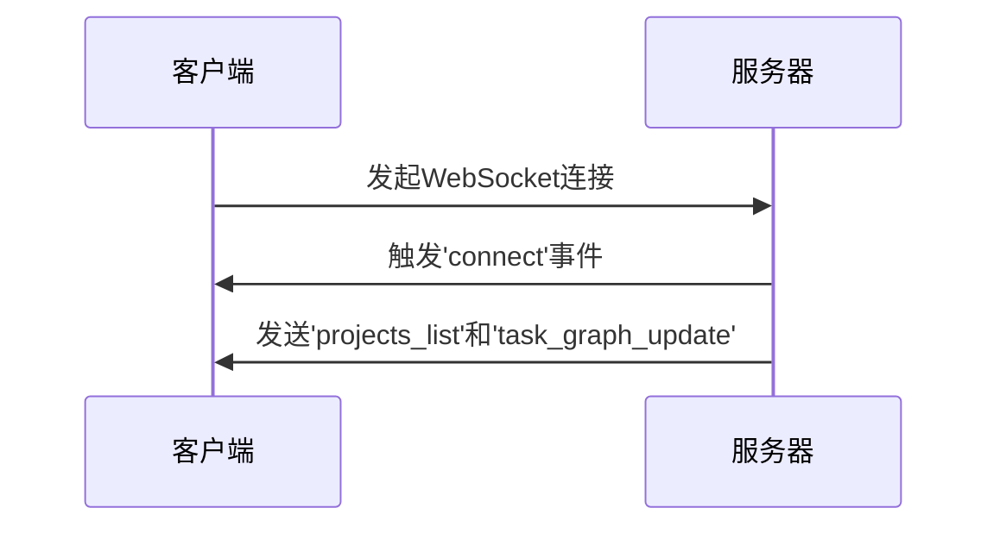
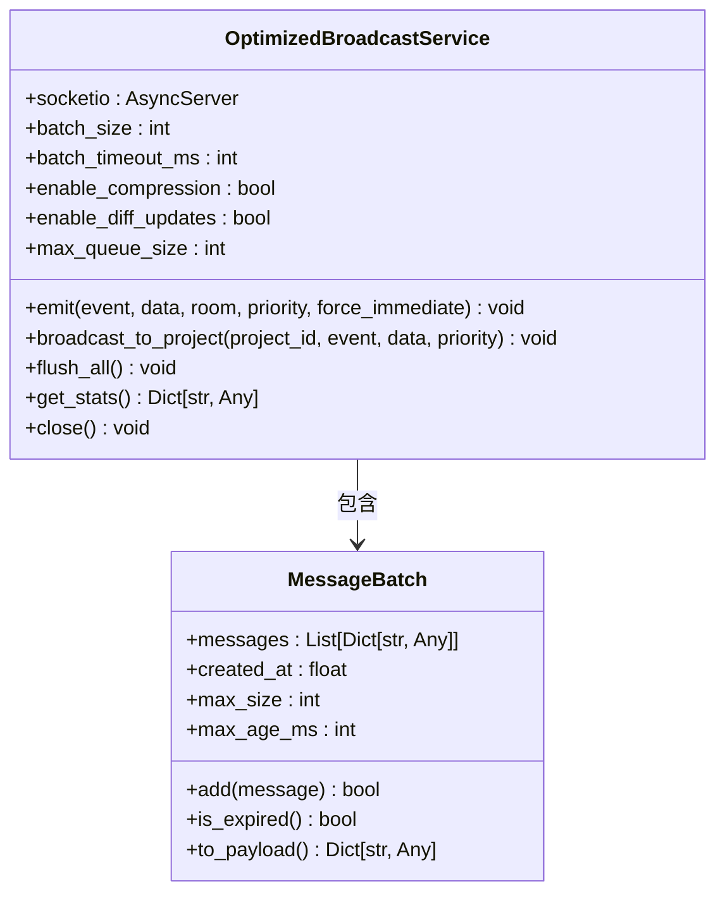

# WebSocket实时通信接口

<cite>
**本文档引用的文件**
- [app.py](file://src/sentientresearchagent/server/app.py)
- [events.py](file://src/sentientresearchagent/server/websocket/events.py)
- [optimized_broadcast_service.py](file://src/sentientresearchagent/server/services/optimized_broadcast_service.py)
</cite>

## 目录
1. [简介](#简介)
2. [WebSocket连接与身份验证](#websocket连接与身份验证)
3. [核心事件类型](#核心事件类型)
4. [服务端广播机制优化](#服务端广播机制优化)
5. [客户端连接示例](#客户端连接示例)
6. [SocketIO实例配置](#socketio实例配置)
7. [容错设计](#容错设计)

## 简介
本技术文档详细描述了基于Flask-SocketIO实现的WebSocket API，用于支持实时消息通道。系统通过WebSocket协议为前端提供低延迟、高并发的实时数据推送能力，主要应用于任务状态更新、节点执行进度、人机协作请求和错误通知等场景。

## WebSocket连接与身份验证
客户端通过标准WebSocket协议与服务器建立长连接。连接建立后，服务器会自动触发`connect`事件，并立即发送初始状态信息，包括项目列表和当前项目的图结构。身份验证目前通过应用级别的会话管理实现，结合CORS策略确保开发环境下的安全性。



**Diagram sources**
- [events.py](file://src/sentientresearchagent/server/websocket/events.py#L15-L709)

**Section sources**
- [events.py](file://src/sentientresearchagent/server/websocket/events.py#L15-L709)

## 核心事件类型
`events.py`文件中定义了多个核心事件，用于实现实时通信。

### task_update（任务状态更新）
当任务状态发生变化时，服务器会向所有订阅的客户端广播此事件。

**JSON消息结构：**
```json
{
  "event": "task_update",
  "data": {
    "task_id": "string",
    "status": "pending|running|completed|failed",
    "progress": 0-100,
    "timestamp": "ISO8601"
  }
}
```

### node_status（节点执行进度）
用于报告工作流中各个节点的执行进度。

**JSON消息结构：**
```json
{
  "event": "node_status",
  "data": {
    "node_id": "string",
    "project_id": "string",
    "status": "initialized|processing|completed|error",
    "current_stage": "atomization|planning|execution",
    "progress_percentage": 0-100,
    "details": {}
  }
}
```

### hitl_request（人机协作请求）
当系统需要人工干预时，会发出此事件。

**JSON消息结构：**
```json
{
  "event": "hitl_request",
  "data": {
    "request_id": "string",
    "node_id": "string",
    "project_id": "string",
    "question": "string",
    "options": [],
    "timeout_seconds": 300
  }
}
```

### error_notification（错误通知）
用于向客户端推送系统错误或警告信息。

**JSON消息结构：**
```json
{
  "event": "error_notification",
  "data": {
    "error_id": "string",
    "severity": "info|warning|error",
    "message": "string",
    "timestamp": "ISO8601",
    "context": {}
  }
}
```

**Section sources**
- [events.py](file://src/sentientresearchagent/server/websocket/events.py#L15-L709)

## 服务端广播机制优化
`OptimizedBroadcastService`类实现了高级的广播机制，旨在提高高并发场景下的性能和效率。

### 批处理（Batching）
服务将多个小消息合并成一个批次发送，减少网络开销。默认批处理大小为50条消息，超时时间为100毫秒。

### 差异化更新（Differential Updates）
对于状态更新类消息，服务会计算新旧状态之间的差异，仅发送变化部分，显著减少数据传输量。

### 消息压缩
启用压缩功能，对有效载荷进行GZIP压缩，进一步降低带宽消耗。



**Diagram sources**
- [optimized_broadcast_service.py](file://src/sentientresearchagent/server/services/optimized_broadcast_service.py#L52-L359)

**Section sources**
- [optimized_broadcast_service.py](file://src/sentientresearchagent/server/services/optimized_broadcast_service.py#L52-L359)

## 客户端连接示例
以下展示了Python和JavaScript客户端如何连接到WebSocket服务器并监听特定事件。

### Python客户端示例
```python
import socketio

sio = socketio.Client()

@sio.event
def connect():
    print('Connected to server')

@sio.on('task_update')
def on_task_update(data):
    print(f'Task update received: {data}')

@sio.on('node_status')
def on_node_status(data):
    print(f'Node status update: {data}')

sio.connect('http://localhost:5000')
sio.wait()
```

### JavaScript客户端示例
```javascript
const socket = io('http://localhost:5000');

socket.on('connect', () => {
    console.log('Connected to server');
});

socket.on('task_update', (data) => {
    console.log('Task update:', data);
});

socket.on('node_status', (data) => {
    console.log('Node status:', data);
});
```

**Section sources**
- [events.py](file://src/sentientresearchagent/server/websocket/events.py#L15-L709)

## SocketIO实例配置
在`app.py`中，通过`create_socketio`函数初始化SocketIO实例。

### 序列化格式
使用JSON作为默认序列化格式，确保跨平台兼容性。

### 传输协议选择
支持WebSocket和长轮询（Long Polling）两种传输方式。优先尝试WebSocket，若不支持则降级到长轮询。

### 心跳机制
配置了心跳检测以维持连接活跃，防止因网络空闲导致的连接中断。

```python
socketio = SocketIO(
    app,
    cors_allowed_origins="*",
    async_mode='threading',
    logger=False,
    engineio_logger=False
)
```

**Section sources**
- [app.py](file://src/sentientresearchagent/server/app.py#L0-L125)

## 容错设计
系统包含完善的容错机制，确保通信的可靠性。

### 连接超时
客户端设置合理的连接超时时间，避免无限期等待。

### 重连策略
客户端实现指数退避算法进行自动重连，提高网络波动下的稳定性。

### 消息丢失恢复
通过差异化更新的状态跟踪和定期全量同步，确保即使发生消息丢失也能快速恢复到正确状态。

**Section sources**
- [events.py](file://src/sentientresearchagent/server/websocket/events.py#L15-L709)
- [optimized_broadcast_service.py](file://src/sentientresearchagent/server/services/optimized_broadcast_service.py#L52-L359)