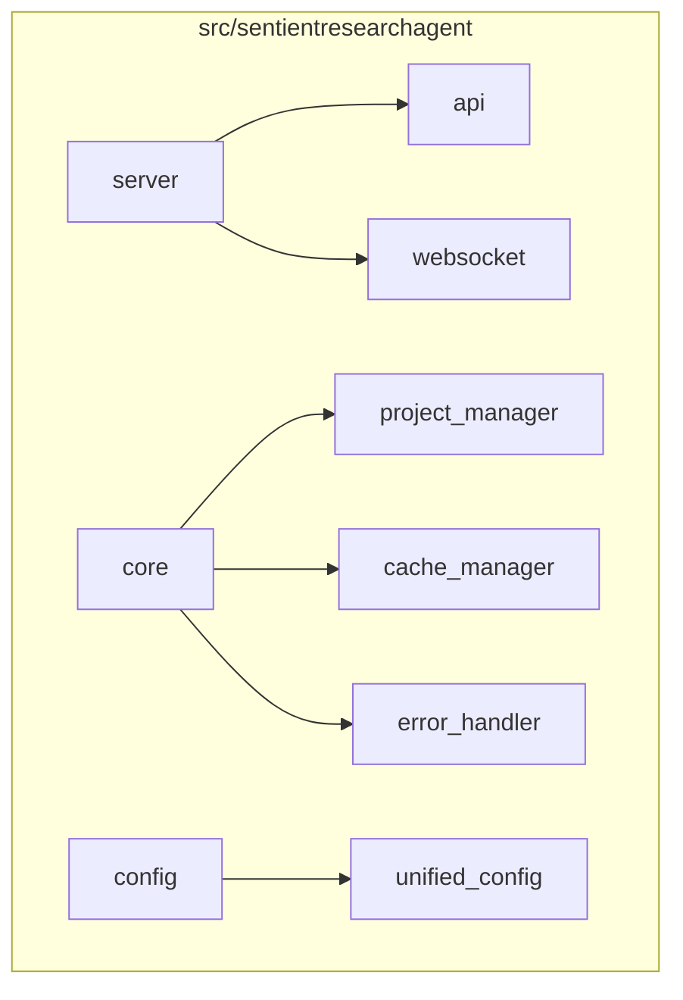
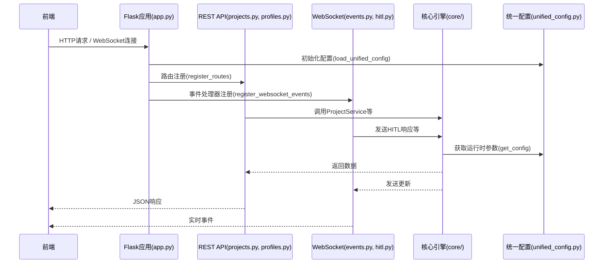
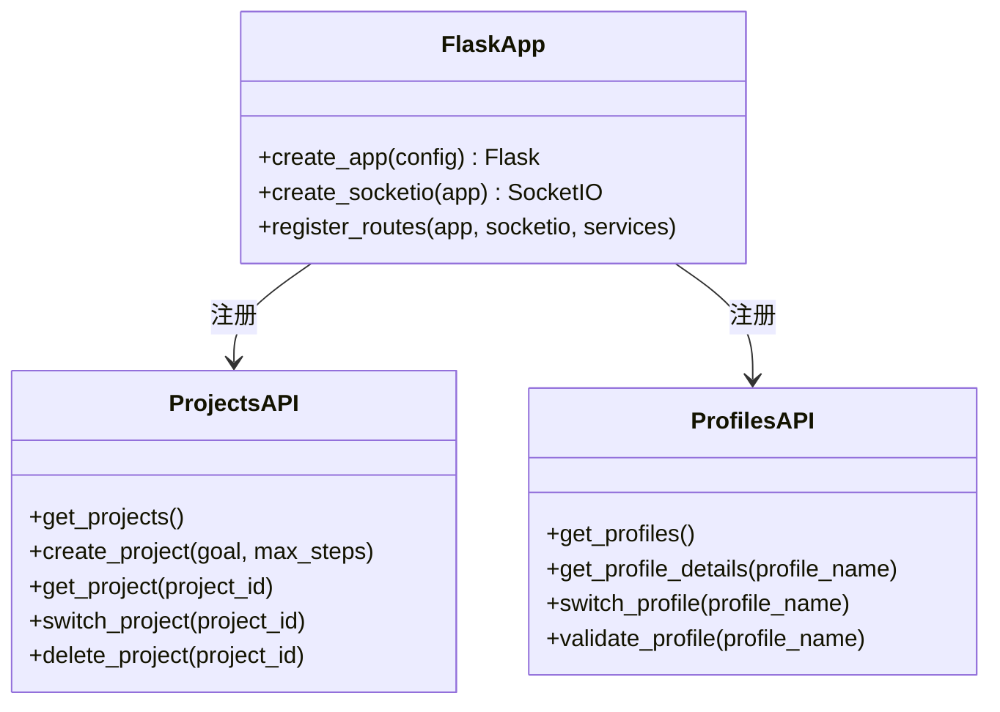
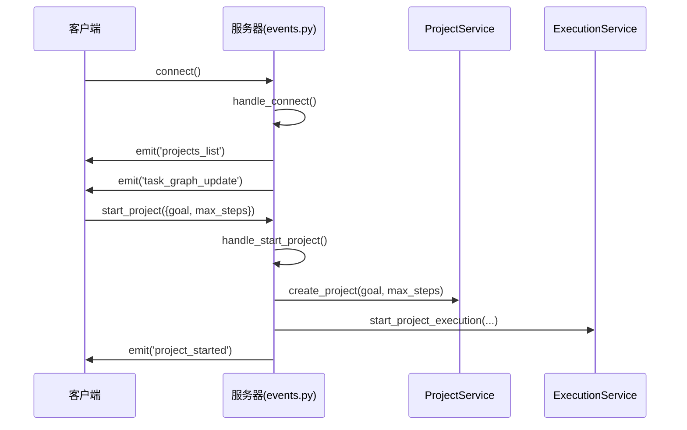
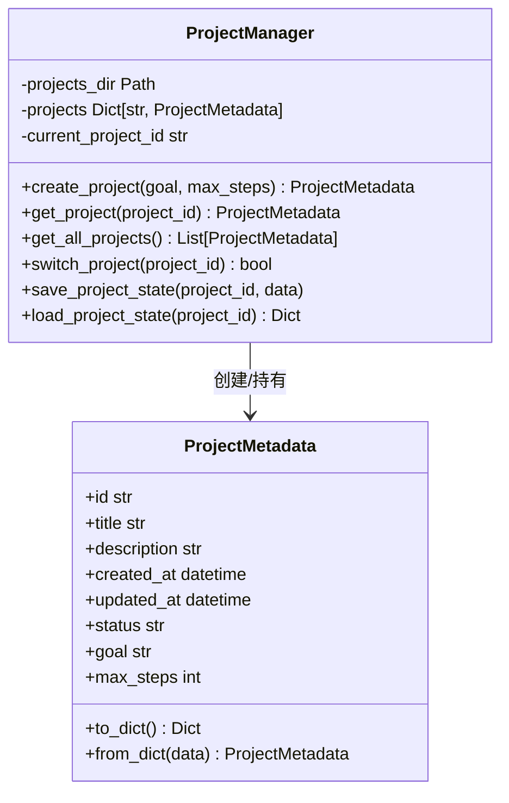
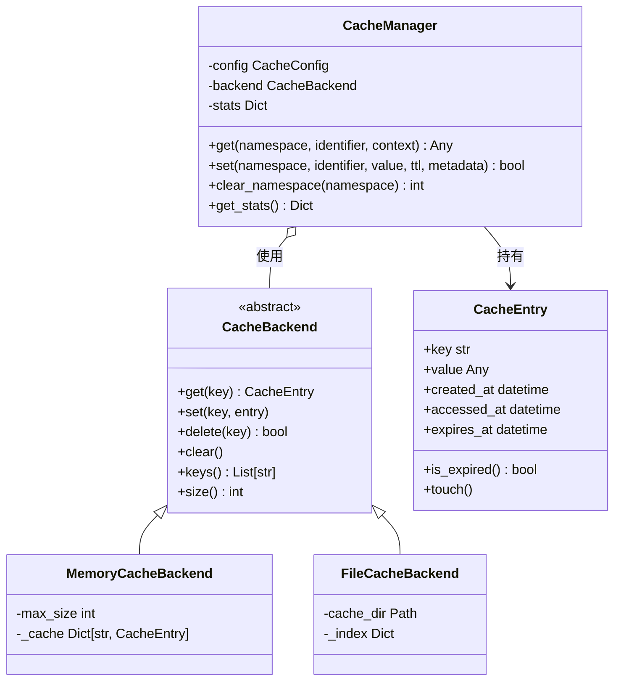
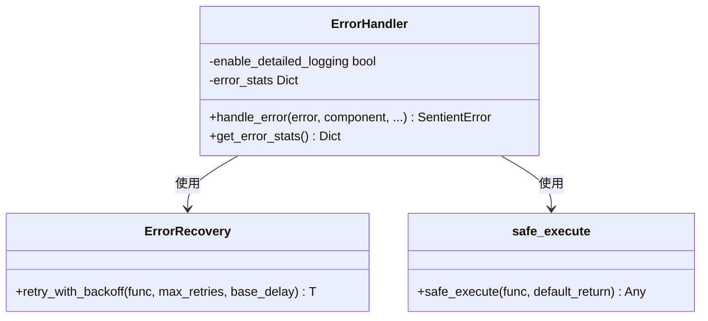
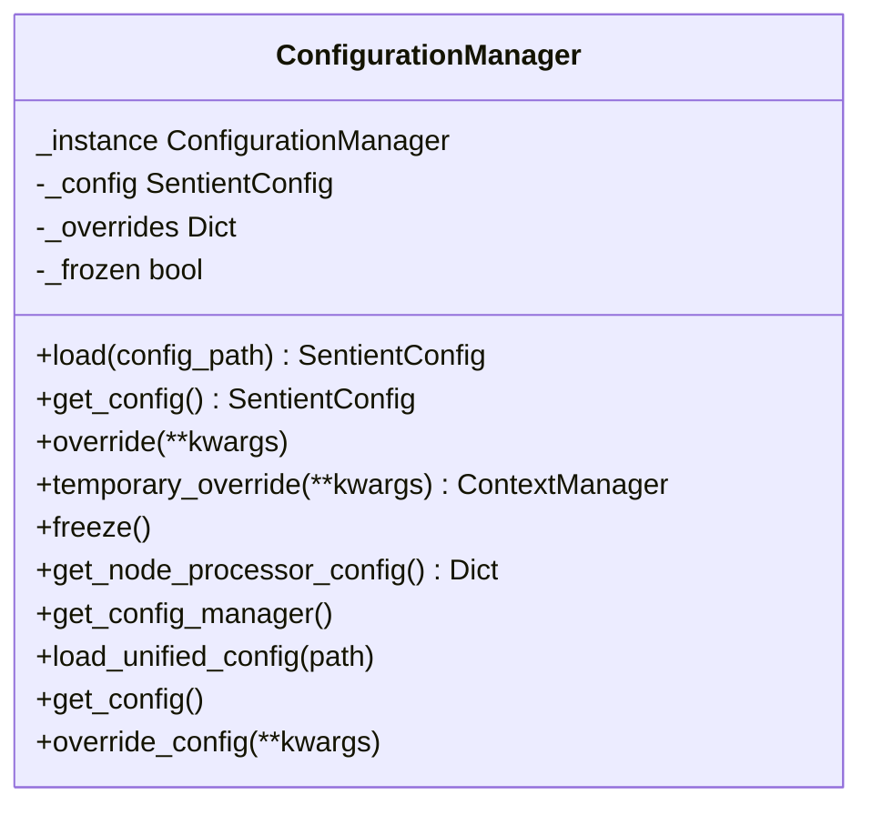
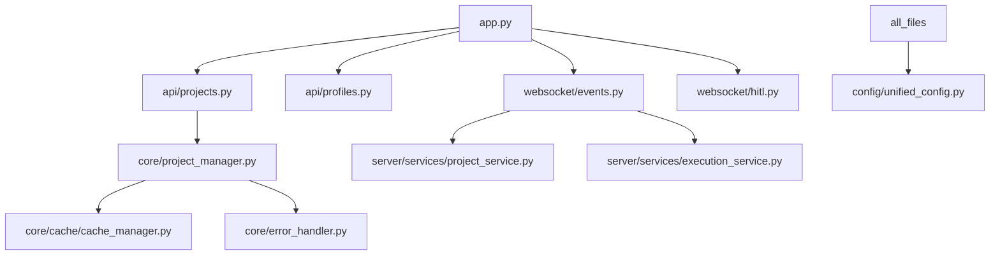

# 后端架构

<cite>
**本文档中引用的文件**  
- [app.py](file://src/sentientresearchagent/server/app.py)
- [projects.py](file://src/sentientresearchagent/server/api/projects.py)
- [profiles.py](file://src/sentientresearchagent/server/api/profiles.py)
- [websocket/events.py](file://src/sentientresearchagent/server/websocket/events.py)
- [websocket/hitl.py](file://src/sentientresearchagent/server/websocket/hitl.py)
- [project_manager.py](file://src/sentientresearchagent/core/project_manager.py)
- [cache_manager.py](file://src/sentientresearchagent/core/cache/cache_manager.py)
- [error_handler.py](file://src/sentientresearchagent/core/error_handler.py)
- [unified_config.py](file://src/sentientresearchagent/config/unified_config.py)
- [sentient.yaml](file://sentient.yaml)
</cite>

## 目录
1. [简介](#简介)
2. [项目结构](#项目结构)
3. [核心组件](#核心组件)
4. [架构概览](#架构概览)
5. [详细组件分析](#详细组件分析)
6. [依赖分析](#依赖分析)
7. [性能考量](#性能考量)
8. [故障排除指南](#故障排除指南)
9. [结论](#结论)

## 简介
本技术文档深入解析了Sentient研究代理系统的后端架构，涵盖服务器入口、服务层、核心引擎与统一配置系统。文档重点阐述了基于Flask/FastAPI的应用路由设计（如`projects.py`, `profiles.py`）和WebSocket事件处理机制（`websocket.py`, `hitl.py`）。同时，详尽描述了核心模块（`core/`）的功能，包括项目管理（`project_manager.py`）、缓存管理（`cache_manager.py`）与错误处理（`error_handler.py`），并解释了分层代理框架如何作为后端核心业务逻辑被集成。通过UML类图和序列图展示了关键服务间的调用关系，并为开发者提供了扩展新API端点或修改系统行为的指导，以及生产环境下的安全与稳定性考量。

## 项目结构
该后端项目采用清晰的分层目录结构，主要分为以下几个部分：
- **docker/**: 包含Docker相关的配置文件，用于容器化部署。
- **evals/**: 存放评估脚本，用于模型或系统的性能测试。
- **frontend/**: 前端代码，使用TypeScript和React构建。
- **src/sentientresearchagent/**: 核心源代码目录，包含所有后端逻辑。
  - **config/**: 配置管理模块，负责加载和解析`sentient.yaml`。
  - **core/**: 核心功能模块，包括项目、缓存和错误处理。
  - **hierarchical_agent_framework/**: 分层代理框架的核心实现。
  - **server/**: 服务器入口和服务，包含API路由和WebSocket处理。
- **根目录文件**: 如`sentient.yaml`（主配置文件）、`pyproject.toml`（Python项目配置）等。

**Diagram sources**
- [src/sentientresearchagent/server](file://src/sentientresearchagent/server)
- [src/sentientresearchagent/core](file://src/sentientresearchagent/core)
- [src/sentientresearchagent/config](file://src/sentientresearchagent/config)

**Section sources**
- [src/sentientresearchagent/server](file://src/sentientresearchagent/server)
- [src/sentientresearchagent/core](file://src/sentientresearchagent/core)
- [src/sentientresearchagent/config](file://src/sentientresearchagent/config)

## 核心组件

本节将深入分析后端架构中的几个核心组件：服务器入口、项目管理、缓存管理、错误处理和统一配置系统。

**Section sources**
- [app.py](file://src/sentientresearchagent/server/app.py)
- [project_manager.py](file://src/sentientresearchagent/core/project_manager.py)
- [cache_manager.py](file://src/sentientresearchagent/core/cache/cache_manager.py)
- [error_handler.py](file://src/sentientresearchagent/core/error_handler.py)
- [unified_config.py](file://src/sentientresearchagent/config/unified_config.py)

## 架构概览

整个后端系统以一个Flask应用为核心，通过`app.py`创建和配置。系统启动时，会从`sentient.yaml`加载配置，并初始化全局的单例管理器，如`ConfigurationManager`、`CacheManager`和`ErrorHandler`。项目生命周期由`ProjectManager`管理，每个项目拥有独立的执行上下文（`ProjectExecutionContext`），确保状态隔离。API请求和WebSocket事件分别由`projects.py`、`profiles.py`和`events.py`、`hitl.py`处理，这些服务最终调用核心引擎进行任务分解和执行。

**Diagram sources**
- [app.py](file://src/sentientresearchagent/server/app.py)
- [projects.py](file://src/sentientresearchagent/server/api/projects.py)
- [events.py](file://src/sentientresearchagent/server/websocket/events.py)
- [unified_config.py](file://src/sentientresearchagent/config/unified_config.py)

## 详细组件分析

### 服务器入口与路由设计
服务器入口在`app.py`中定义，通过`create_app`函数创建Flask实例，并配置CORS和SocketIO。`register_routes`函数负责注册所有的REST API和WebSocket事件处理器。REST API路由分散在`api/`子目录下，例如`projects.py`定义了`/api/projects`系列端点，用于项目的创建、查询、切换和删除；`profiles.py`则处理代理配置文件的管理。

#### API路由类图

**Diagram sources**
- [app.py](file://src/sentientresearchagent/server/app.py)
- [projects.py](file://src/sentientresearchagent/server/api/projects.py)
- [profiles.py](file://src/sentientresearchagent/server/api/profiles.py)

**Section sources**
- [app.py](file://src/sentientresearchagent/server/app.py)
- [projects.py](file://src/sentientresearchagent/server/api/projects.py)
- [profiles.py](file://src/sentientresearchagent/server/api/profiles.py)

### WebSocket事件处理
WebSocket通信是前后端实时交互的关键。`events.py`注册了如`connect`、`start_project`、`request_initial_state`等核心事件，用于同步项目状态和启动执行。`hitl.py`专门处理“人在回路”（HITL）的响应，当系统需要人工干预时，前端会发送`hitl_response`事件，后端将其存储并供工作流继续执行。

#### WebSocket事件序列图

**Diagram sources**
- [events.py](file://src/sentientresearchagent/server/websocket/events.py)
- [projects.py](file://src/sentientresearchagent/server/api/projects.py)

**Section sources**
- [events.py](file://src/sentientresearchagent/server/websocket/events.py)
- [hitl.py](file://src/sentientresearchagent/server/websocket/hitl.py)

### 核心模块分析
#### 项目管理 (ProjectManager)
`project_manager.py`中的`ProjectManager`类是项目生命周期的核心。它维护一个内存中的项目列表，并持久化到磁盘。`create_project`方法生成唯一的ID，创建项目目录结构，并返回`ProjectMetadata`对象。`get_all_projects`按更新时间排序返回所有项目，支持前端的项目列表展示。

**Diagram sources**
- [project_manager.py](file://src/sentientresearchagent/core/project_manager.py)

**Section sources**
- [project_manager.py](file://src/sentientresearchagent/core/project_manager.py)

#### 缓存管理 (CacheManager)
`cache_manager.py`实现了灵活的缓存系统。`CacheManager`根据`CacheConfig`选择后端（内存或文件），并通过`get`和`set`方法提供接口。`_generate_key`方法结合命名空间、标识符和上下文生成唯一键，`CacheEntry`类封装了值及其元数据（如过期时间）。这有效避免了重复的LLM调用，提升了性能。

**Diagram sources**
- [cache_manager.py](file://src/sentientresearchagent/core/cache/cache_manager.py)

**Section sources**
- [cache_manager.py](file://src/sentientresearchagent/core/cache/cache_manager.py)

#### 错误处理 (ErrorHandler)
`error_handler.py`中的`ErrorHandler`提供了统一的错误处理机制。`handle_error`方法接收异常，将其转换为`SentientError`，记录日志，并更新统计信息。`@handle_task_errors`和`@handle_agent_errors`装饰器可方便地为函数添加错误处理。`ErrorRecovery.retry_with_backoff`方法实现了带指数退避的重试逻辑，增强了系统的健壮性。

**Diagram sources**
- [error_handler.py](file://src/sentientresearchagent/core/error_handler.py)

**Section sources**
- [error_handler.py](file://src/sentientresearchagent/core/error_handler.py)

### 统一配置系统
`unified_config.py`中的`ConfigurationManager`是一个单例模式的配置管理器，确保了配置的单一事实来源。`load()`方法从`sentient.yaml`和环境变量加载配置，`override()`允许动态覆盖，`temporary_override()`提供了一个上下文管理器来临时修改配置。`get_node_processor_config()`方法集中了为`NodeProcessor`生成配置的逻辑。

**Diagram sources**
- [unified_config.py](file://src/sentientresearchagent/config/unified_config.py)

**Section sources**
- [unified_config.py](file://src/sentientresearchagent/config/unified_config.py)

## 依赖分析

系统各组件间存在明确的依赖关系。`app.py`直接依赖于`api/`和`websocket/`模块来注册路由和事件。`api/`和`websocket/`模块又依赖于`core/`中的`ProjectManager`和`ExecutionService`来执行业务逻辑。`core/`模块内部，`ProjectManager`可能间接依赖`CacheManager`和`ErrorHandler`。最底层的`config/`模块被几乎所有上层模块所依赖，以获取运行时参数。

**Diagram sources**
- [app.py](file://src/sentientresearchagent/server/app.py)
- [projects.py](file://src/sentientresearchagent/server/api/projects.py)
- [events.py](file://src/sentientresearchagent/server/websocket/events.py)
- [project_manager.py](file://src/sentientresearchagent/core/project_manager.py)
- [unified_config.py](file://src/sentientresearchagent/config/unified_config.py)

**Section sources**
- [app.py](file://src/sentientresearchagent/server/app.py)
- [projects.py](file://src/sentientresearchagent/server/api/projects.py)
- [events.py](file://src/sentientresearchagent/server/websocket/events.py)

## 性能考量
- **缓存策略**: 启用文件缓存(`cache_type: "file"`)可以跨会话持久化结果，显著减少对LLM的重复调用。合理的TTL（如7200秒）平衡了新鲜度和性能。
- **并发控制**: `execution.max_concurrent_nodes`和`max_parallel_nodes`配置项控制了并行执行的节点数量，防止资源耗尽。
- **状态批处理**: `state_batch_size`和`ws_batch_size`等配置减少了I/O操作频率，提高了效率。
- **超时机制**: 详细的超时策略（警告、软超时、硬超时）确保了长时间运行的任务不会无限挂起。

## 故障排除指南
- **项目无法创建**: 检查`projects_dir`是否有写入权限，确认`ProjectStructure.create_project_structure`是否成功。
- **WebSocket连接失败**: 确认CORS配置正确，检查`ngrok_url`环境变量是否设置。
- **缓存未生效**: 验证`cache.enabled`为`true`，检查`cache_dir`路径是否正确且可访问。
- **配置加载失败**: 确保`sentient.yaml`格式正确，环境变量名拼写无误。
- **错误日志**: 查看`runtime/logs/sentient.log`，利用`ErrorHandler`的详细日志定位问题。

**Section sources**
- [error_handler.py](file://src/sentientresearchagent/core/error_handler.py)
- [logging_config.py](file://src/sentientresearchagent/core/logging_config.py)

## 结论
本技术文档全面剖析了Sentient研究代理的后端架构。系统通过清晰的分层设计，将服务器入口、API服务、核心引擎和配置系统解耦。`ConfigurationManager`作为单一配置源，`ProjectManager`管理项目生命周期，`CacheManager`提升性能，`ErrorHandler`保障稳定性。开发者可以通过理解`projects.py`和`profiles.py`的路由设计来扩展API，或通过`unified_config.py`和`sentient.yaml`调整系统行为。在生产环境中，应重点关注配置的安全性（如API密钥）、缓存的有效性以及错误处理的完备性，以确保系统的可靠运行。