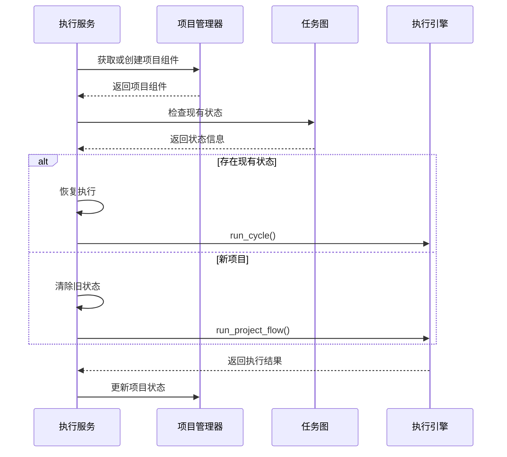
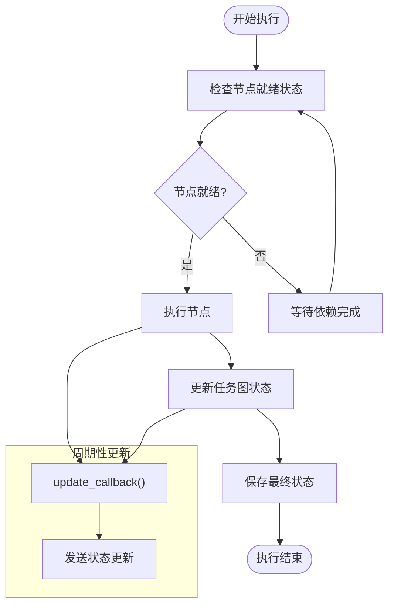
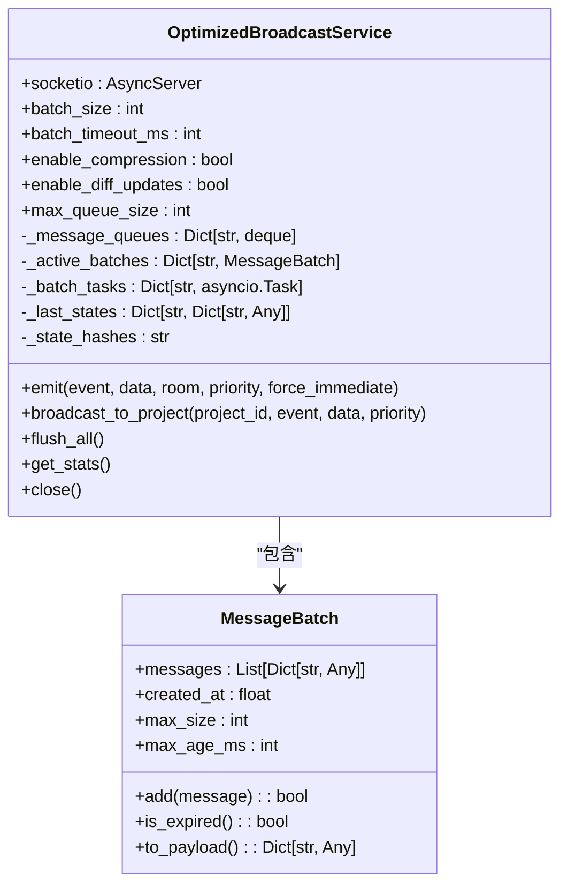
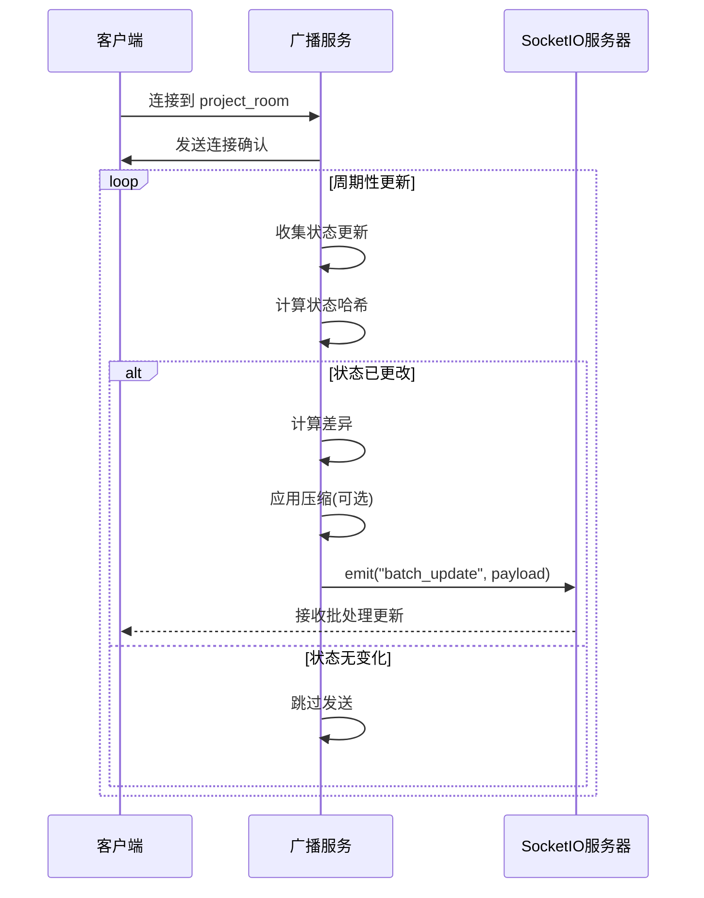
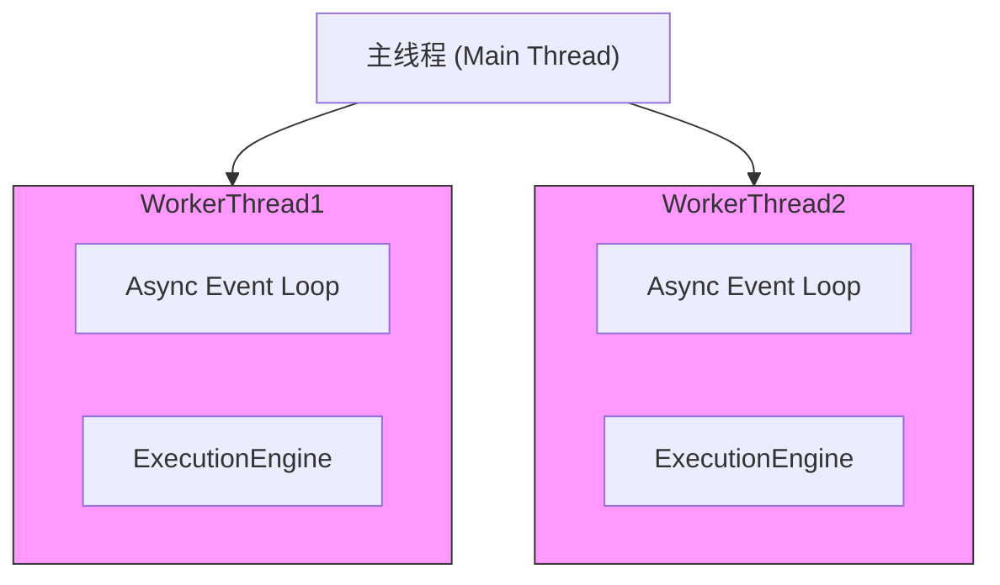
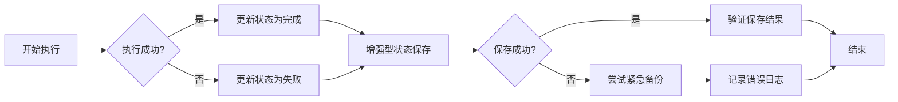
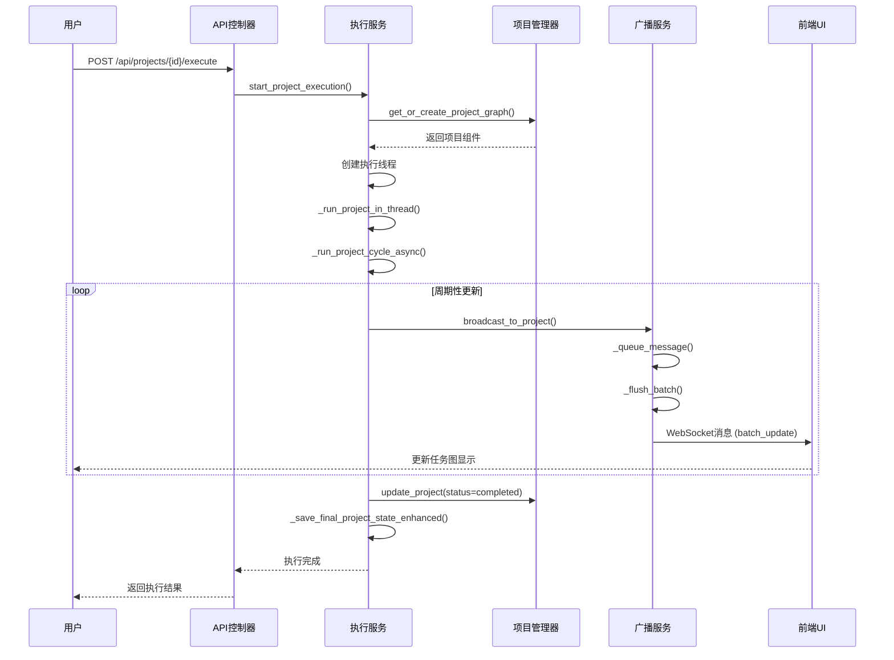
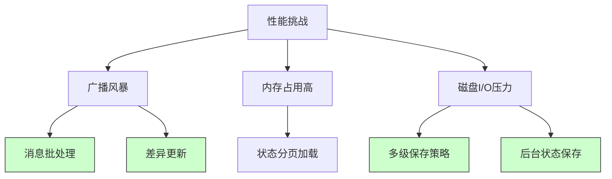

# 执行服务

<cite>
**本文档中引用的文件**
- [execution_service.py](file://src\sentientresearchagent\server\services\execution_service.py)
- [optimized_broadcast_service.py](file://src\sentientresearchagent\server\services\optimized_broadcast_service.py)
</cite>

## 目录
1. [简介](#简介)
2. [核心组件分析](#核心组件分析)
3. [任务图状态机流转机制](#任务图状态机流转机制)
4. [实时广播与WebSocket推送](#实时广播与websocket推送)
5. [异步协调与资源隔离策略](#异步协调与资源隔离策略)
6. [服务间调用示例与完整事件流](#服务间调用示例与完整事件流)
7. [性能瓶颈与缓解措施](#性能瓶颈与缓解措施)
8. [结论](#结论)

## 简介
本技术文档深入剖析了执行服务（Execution Service）的技术实现，重点讲解`execution_service.py`如何驱动任务图的状态机流转，包括节点就绪检测、调度决策、执行触发与结果回写。同时结合`optimized_broadcast_service.py`说明系统如何高效地将执行状态变更通过WebSocket实时推送到前端UI。文档还分析了任务执行过程中的异步协调机制、超时控制与资源隔离策略，提供了从REST API控制器触发执行的服务间调用示例，并绘制了从用户请求到前端更新的完整事件流序列图。最后，指出了潜在的性能瓶颈（如广播风暴）及其缓解措施。

## 核心组件分析

`execution_service.py`和`optimized_broadcast_service.py`是系统执行引擎的核心组件。`ExecutionService`类负责管理项目执行的生命周期，包括启动、停止和监控执行过程。它通过创建后台线程来运行项目，并利用`RealtimeExecutionWrapper`提供实时更新功能。`OptimizedBroadcastService`则专注于优化WebSocket通信，通过消息批处理、队列管理和差异更新等技术减少网络开销，确保前端能够及时接收到最新的执行状态。

**Section sources**
- [execution_service.py](file://src\sentientresearchagent\server\services\execution_service.py#L1-L719)
- [optimized_broadcast_service.py](file://src\sentientresearchagent\server\services\optimized_broadcast_service.py#L1-L359)

## 任务图状态机流转机制

### 节点就绪检测与调度决策
`ExecutionService`通过`_run_project_cycle_async`方法实现任务图的状态机流转。该方法首先检查是否存在现有项目状态，如果存在则恢复执行，否则启动新项目。在执行过程中，系统会定期检查每个节点的依赖关系和状态，以确定哪些节点已经就绪可以执行。调度决策由`project_execution_engine`负责，它根据预定义的规则选择下一个要执行的节点。

**Diagram sources**
- [execution_service.py](file://src\sentientresearchagent\server\services\execution_service.py#L388-L516)

### 执行触发与结果回写
当一个节点被选中执行时，`RealtimeExecutionWrapper`会启动一个异步任务来运行该节点，并同时创建一个周期性更新任务。这个更新任务每隔0.5秒检查一次执行进度，并通过`update_callback`回调函数通知前端界面。一旦节点执行完成，其结果会被立即写回到任务图中，并触发最终的状态保存操作。

**Diagram sources**
- [execution_service.py](file://src\sentientresearchagent\server\services\execution_service.py#L51-L100)
- [execution_service.py](file://src\sentientresearchagent\server\services\execution_service.py#L149-L172)

## 实时广播与WebSocket推送

### 高效状态变更推送
`OptimizedBroadcastService`通过多种优化技术实现了高效的WebSocket状态推送。首先，它使用消息批处理机制，将多个小消息合并成一个批次发送，从而减少了网络往返次数。其次，服务支持差异更新，只发送状态变化的部分而不是完整的数据包，这大大降低了传输的数据量。此外，消息压缩功能进一步减小了有效载荷大小。

**Diagram sources**
- [optimized_broadcast_service.py](file://src\sentientresearchagent\server\services\optimized_broadcast_service.py#L1-L359)

### 差异更新与压缩
差异更新机制通过计算前后状态的哈希值来判断是否需要发送更新。如果状态未变，则跳过发送；如果状态改变，则计算具体的差异部分并仅发送这些变化。对于较大的数据包，服务还会应用GZIP压缩，只有当压缩后大小至少减少20%时才启用压缩，以避免不必要的CPU开销。

**Diagram sources**
- [optimized_broadcast_service.py](file://src\sentientresearchagent\server\services\optimized_broadcast_service.py#L208-L261)

## 异步协调与资源隔离策略

### 多线程与事件循环管理
`ExecutionService`采用多线程架构，在主线程之外为每个项目创建独立的执行线程。每个线程都有自己的异步事件循环，确保不同项目的执行相互隔离。这种设计不仅提高了系统的并发能力，还防止了一个项目的问题影响到其他项目。

**Diagram sources**
- [execution_service.py](file://src\sentientresearchagent\server\services\execution_service.py#L329-L356)

### 资源清理与错误处理
系统实现了严格的资源管理和错误处理机制。在项目执行完成后，相关的线程对象会被自动清理。如果执行过程中发生异常，系统会捕获错误，更新项目状态为“失败”，并记录详细的错误日志。此外，`_save_final_project_state_enhanced`方法提供了多重保存尝试和紧急备份功能，确保即使在极端情况下也不会丢失重要数据。

**Diagram sources**
- [execution_service.py](file://src\sentientresearchagent\server\services\execution_service.py#L545-L703)

## 服务间调用示例与完整事件流

### REST API触发执行
以下序列图展示了从REST API控制器触发执行到前端UI更新的完整事件流。用户通过API发起执行请求，`ExecutionService`启动项目执行，期间通过`OptimizedBroadcastService`将状态变更实时推送到前端。

**Diagram sources**
- [execution_service.py](file://src\sentientresearchagent\server\services\execution_service.py#L207-L250)
- [optimized_broadcast_service.py](file://src\sentientresearchagent\server\services\optimized_broadcast_service.py#L324-L332)

## 性能瓶颈与缓解措施

### 潜在性能瓶颈
尽管系统采用了多项优化措施，但仍可能存在一些性能瓶颈：
1. **广播风暴**：当大量项目同时执行且频繁更新状态时，可能会产生大量的WebSocket消息，导致网络拥塞。
2. **内存占用过高**：每个项目都维护独立的状态副本，对于大型项目可能导致较高的内存消耗。
3. **磁盘I/O压力**：频繁的状态保存操作可能对磁盘I/O造成较大压力。

### 缓解措施
针对上述问题，系统采取了以下缓解措施：
- **消息批处理**：通过将多个小消息合并发送，显著减少了网络请求数量。
- **差异更新**：只发送状态的变化部分，大幅降低了传输数据量。
- **多级保存策略**：采用普通保存、综合结果保存和紧急备份三种方式，确保数据安全的同时平衡性能。
- **后台状态保存**：对于非当前显示的项目，降低状态保存频率至每5秒一次，减轻系统负担。

**Diagram sources**
- [optimized_broadcast_service.py](file://src\sentientresearchagent\server\services\optimized_broadcast_service.py#L109-L145)
- [execution_service.py](file://src\sentientresearchagent\server\services\execution_service.py#L149-L172)

## 结论
通过对`execution_service.py`和`optimized_broadcast_service.py`的深入分析，可以看出该系统在任务执行和状态同步方面采用了先进的架构设计和技术手段。通过多线程异步执行、实时状态更新、消息批处理和差异更新等机制，系统实现了高效、可靠的任务管理能力。同时，多重状态保存策略和严格的错误处理机制确保了数据的安全性和系统的稳定性。未来可以通过引入更智能的调度算法和更精细的资源控制来进一步提升系统性能。