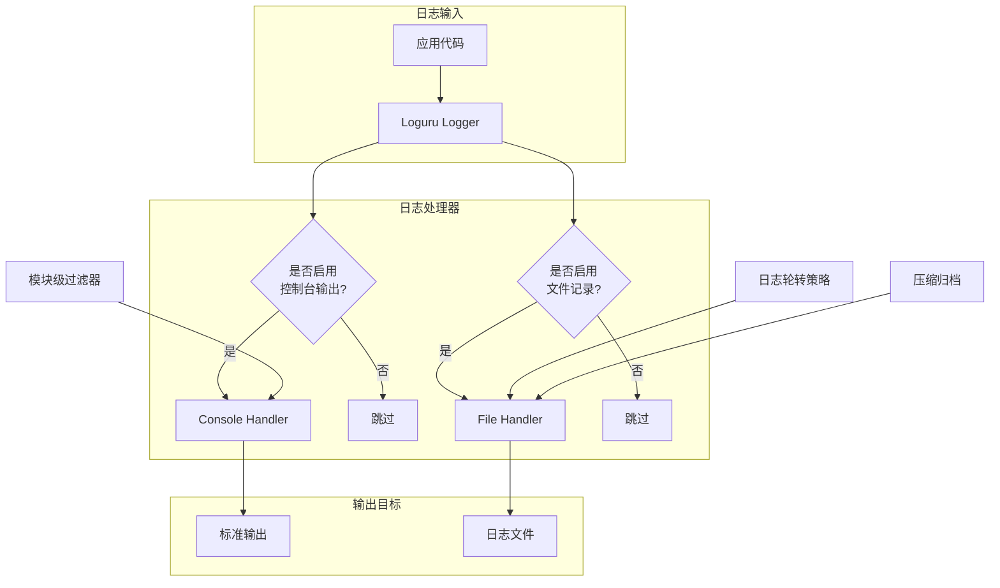
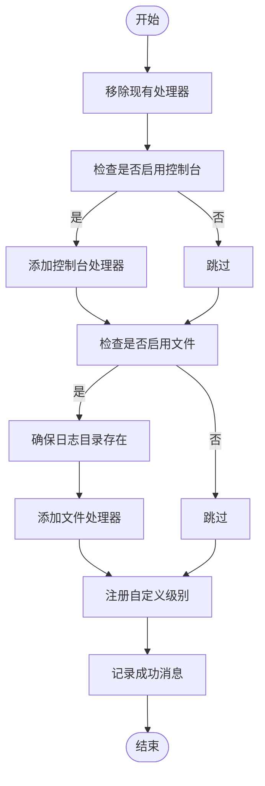
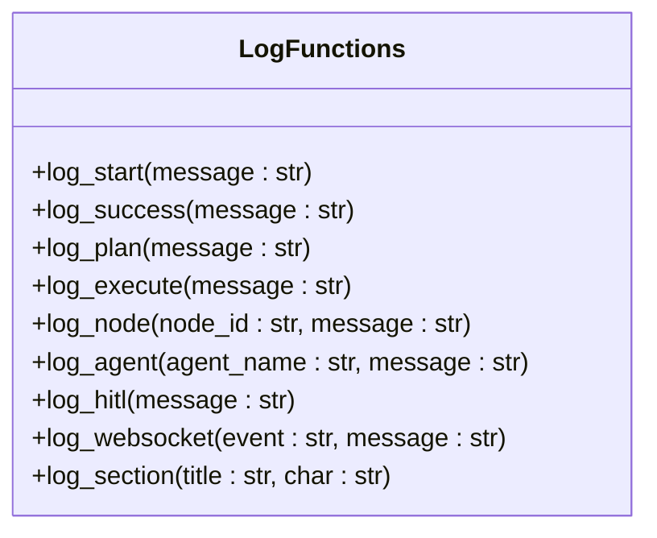
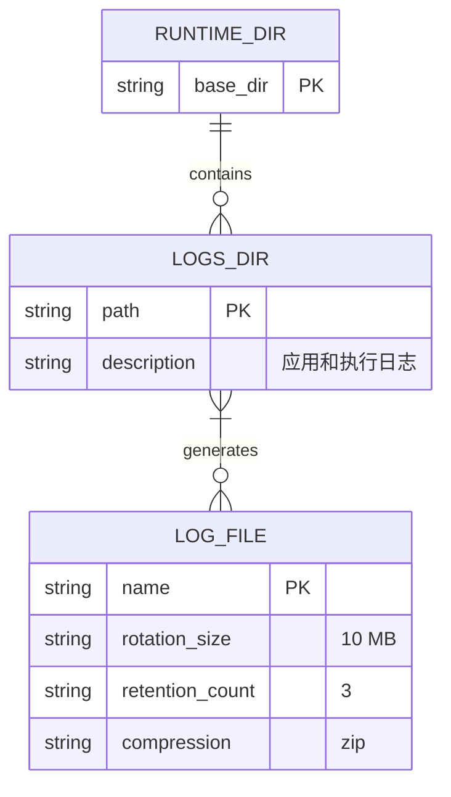

# 日志配置

<cite>
**本文档中引用的文件**
- [logging_config.py](file://src/sentientresearchagent/core/logging_config.py)
- [config.py](file://src/sentientresearchagent/config/config.py)
- [paths.py](file://src/sentientresearchagent/config/paths.py)
</cite>

## 目录
1. [简介](#简介)
2. [日志系统架构](#日志系统架构)
3. [核心配置详解](#核心配置详解)
4. [日志级别与应用场景](#日志级别与应用场景)
5. [日志格式与关键字段](#日志格式与关键字段)
6. [多处理器日志系统初始化](#多处理器日志系统初始化)
7. [模块化日志记录器使用指南](#模块化日志记录器使用指南)
8. [日志轮转与磁盘管理](#日志轮转与磁盘管理)
9. [生产环境操作建议](#生产环境操作建议)
10. [附录：便捷日志函数](#附录：便捷日志函数)

## 简介
本项目采用基于Loguru库构建的增强型日志系统，通过字典式配置实现多处理器输出（控制台、文件），支持自定义日志级别和智能过滤机制。该系统旨在提供清晰可读的日志输出，结合上下文表情符号提升信息识别效率，并确保线程安全的异步写入能力。

## 日志系统架构



**Diagram sources**
- [logging_config.py](file://src/sentientresearchagent/core/logging_config.py#L137-L217)
- [config.py](file://src/sentientresearchagent/config/config.py#L300-L327)

**Section sources**
- [logging_config.py](file://src/sentientresearchagent/core/logging_config.py#L1-L290)
- [config.py](file://src/sentientresearchagent/config/config.py#L300-L327)

## 核心配置详解

### 配置结构
日志系统由`LoggingConfig`类驱动，该类定义了完整的日志行为参数：

```python
class LoggingConfig(BaseModel):
    level: str = "INFO"
    file_path: Optional[str] = None
    file_rotation: str = "10 MB"
    file_retention: int = 3
    enable_console: bool = True
    enable_file: bool = True
    module_levels: Optional[Dict[str, str]] = None
    console_style: str = "clean"
```

### 配置项说明
- **level**: 默认日志级别，支持TRACE/DEBUG/INFO/SUCCESS/WARNING/ERROR/CRITICAL
- **file_path**: 自定义日志文件路径，默认为`runtime/logs/sentient.log`
- **file_rotation**: 文件轮转大小阈值，默认10MB
- **file_retention**: 保留历史日志文件数量，默认3个
- **enable_console/file**: 控制控制台与文件输出开关
- **module_levels**: 模块级日志级别控制映射表
- **console_style**: 控制台显示风格（clean/timestamp/detailed）

**Section sources**
- [config.py](file://src/sentientresearchagent/config/config.py#L300-L327)

## 日志级别与应用场景

### 内置日志级别
| 日志级别 | 应用场景 | 输出示例 |
|---------|--------|--------|
| DEBUG | 调试信息，开发阶段使用 | `<dim>加载环境变量...</dim>` |
| INFO | 常规运行信息 | `启动服务器...` |
| WARNING | 警告情况，不影响继续运行 | `<yellow>缓存未命中</yellow>` |
| ERROR | 错误事件，功能受影响 | `<red>数据库连接失败</red>` |
| CRITICAL | 严重错误，可能导致程序终止 | `<red>系统无法启动</red>` |

### 自定义日志级别
系统扩展了两个专用级别：
- **PLAN (蓝色)**: 规划决策过程
- **EXECUTE (洋红色)**: 执行动作追踪

这些级别有助于区分智能体的思考与执行阶段。

**Section sources**
- [logging_config.py](file://src/sentientresearchagent/core/logging_config.py#L180-L198)
- [config.py](file://src/sentientresearchagent/config/config.py#L314-L318)

## 日志格式与关键字段

### 控制台输出格式
根据`console_style`设置三种模式：
- **clean**: 纯净模式（默认）
- **timestamp**: 包含时间戳
- **detailed**: 详细模式含模块信息

#### 清洁模式示例
```
🚀 Starting server...
✅ Server ready on port 8000
⚠️  Cache miss for query 'latest crypto trends'
❌ Database connection failed
```

### 文件输出格式
文件日志包含完整结构化信息：
```
2024-01-15 14:30:22.123 | INFO     | sentientresearchagent.server.main | start_server       | Starting server...
2024-01-15 14:30:22.456 | WARNING  | sentientresearchagent.core.cache_manager | get_cache          | Cache miss for key 'trend_analysis_001'
```

#### 字段说明
| 字段 | 描述 |
|------|------|
| 时间戳 | 精确到毫秒的ISO格式时间 |
| 日志级别 | 八位对齐的级别标识 |
| 模块名 | 完整的Python模块路径 |
| 函数名 | 发生日志调用的函数名称 |
| 消息内容 | 实际日志文本 |

**Section sources**
- [logging_config.py](file://src/sentientresearchagent/core/logging_config.py#L150-L155)
- [logging_config.py](file://src/sentientresearchagent/core/logging_config.py#L205-L212)

## 多处理器日志系统初始化

### 初始化流程


**Diagram sources**
- [logging_config.py](file://src/sentientresearchagent/core/logging_config.py#L137-L217)

**Section sources**
- [logging_config.py](file://src/sentientresearchagent/core/logging_config.py#L137-L217)

### 初始化代码路径
系统通过`setup_logging()`函数完成初始化，接收`LoggingConfig`实例作为参数，并可选地应用模块过滤器。

## 模块化日志记录器使用指南

### 获取命名记录器
开发者应在各模块中使用统一方式获取记录器：

```python
from loguru import logger

def my_module_function():
    logger.info("This is a standard info message")
```

### 使用便捷函数
系统提供了一系列语义化日志函数：



**Diagram sources**
- [logging_config.py](file://src/sentientresearchagent/core/logging_config.py#L220-L289)

**Section sources**
- [logging_config.py](file://src/sentientresearchagent/core/logging_config.py#L220-L289)

### 最佳实践示例
```python
# 在任务节点中
log_node("TASK-001", "开始数据收集")

# 在智能体中
log_agent("ResearchAgent", "生成初步分析报告")

# 在人机交互中
log_hitl("等待用户确认搜索方向")
```

## 日志轮转与磁盘管理

### 轮转策略
- **触发条件**: 单个日志文件达到10MB
- **保留策略**: 最多保留3个历史文件
- **压缩方式**: 旧日志自动ZIP压缩

### 存储位置
日志文件存储于标准化运行时目录：



**Diagram sources**
- [paths.py](file://src/sentientresearchagent/config/paths.py#L56-L58)
- [config.py](file://src/sentientresearchagent/config/config.py#L305-L307)

**Section sources**
- [paths.py](file://src/sentientresearchagent/config/paths.py#L26-L26)
- [config.py](file://src/sentientresearchagent/config/config.py#L306-L307)

## 生产环境操作建议

### 安全调整日志级别
在生产环境中动态调整日志级别应遵循以下步骤：

1. 修改配置文件中的`level`字段
2. 重启服务使变更生效
3. 或使用热重载机制（如支持）

避免在运行时直接修改日志级别，以防影响性能。

### 性能注意事项
- **诊断信息**: 生产环境下禁用`diagnose=True`以防止敏感数据泄露
- **线程安全**: 所有日志操作均启用`enqueue=True`保证线程安全
- **I/O优化**: 文件写入采用异步队列减少阻塞

### 远程传输扩展
虽然当前配置未直接实现远程传输，但可通过以下方式扩展：
- 配置日志聚合工具（如Fluentd、Logstash）监控日志目录
- 使用外部脚本定期上传压缩日志
- 集成云原生日志服务SDK

**Section sources**
- [logging_config.py](file://src/sentientresearchagent/core/logging_config.py#L208-L210)
- [logging_config.py](file://src/sentientresearchagent/core/logging_config.py#L167-L168)

## 附录：便捷日志函数

### 函数列表
| 函数名 | 用途 | 示例 |
|-------|------|------|
| `log_start()` | 标记流程启动 | `log_start("服务器")` |
| `log_success()` | 标记成功完成 | `log_success("项目保存成功")` |
| `log_plan()` | 记录规划活动 | `log_plan("制定研究计划")` |
| `log_execute()` | 记录执行动作 | `log_execute("执行网络搜索")` |
| `log_node()` | 节点特定日志 | `log_node("NODE-001", "状态更新")` |
| `log_agent()` | 智能体专属日志 | `log_agent("Analyzer", "完成数据分析")` |
| `log_hitl()` | 人机交互日志 | `log_hitl("请求用户输入")` |
| `log_websocket()` | WebSocket事件 | `log_websocket("connect", "客户端接入")` |
| `log_section()` | 分节标题 | `log_section("初始化阶段")` |

这些函数封装了常见的日志模式，提高了代码可读性和一致性。

**Section sources**
- [logging_config.py](file://src/sentientresearchagent/core/logging_config.py#L220-L289)