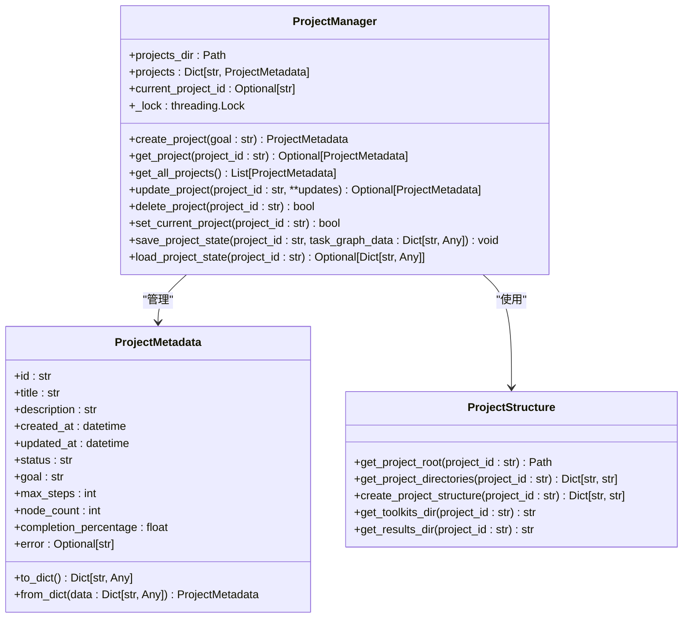
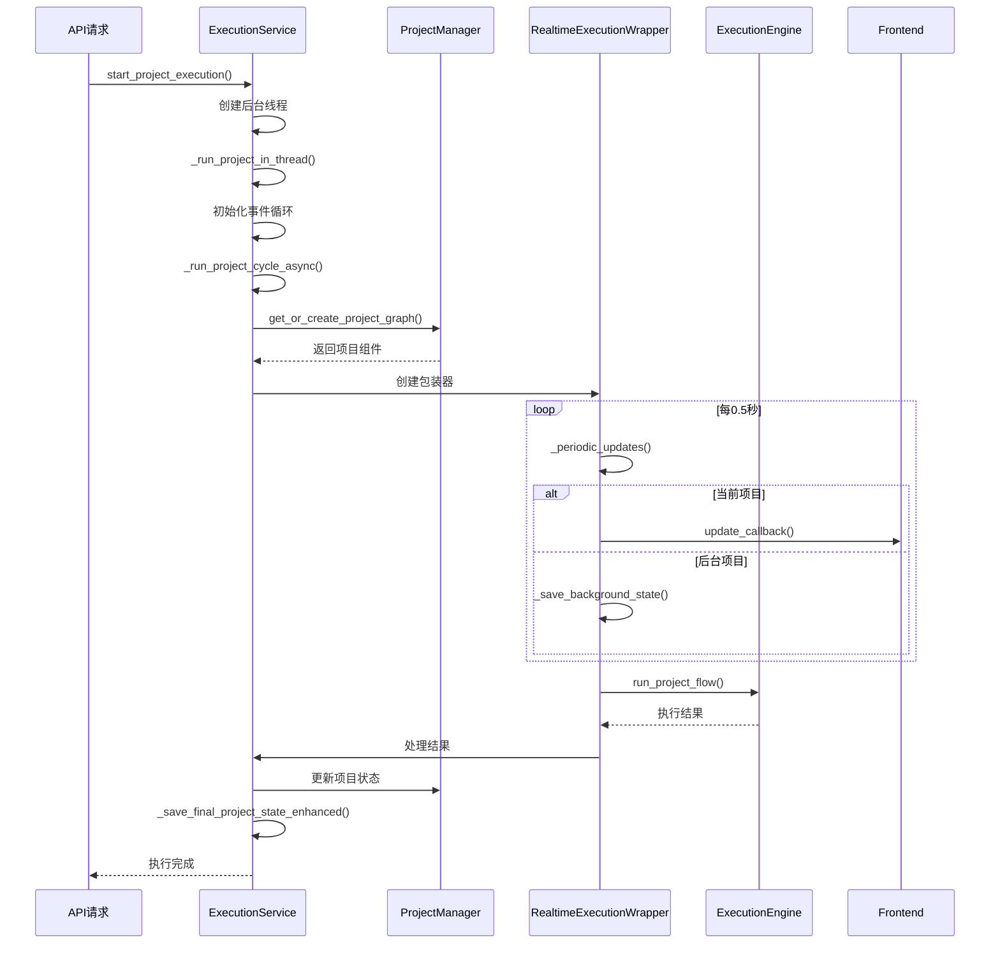
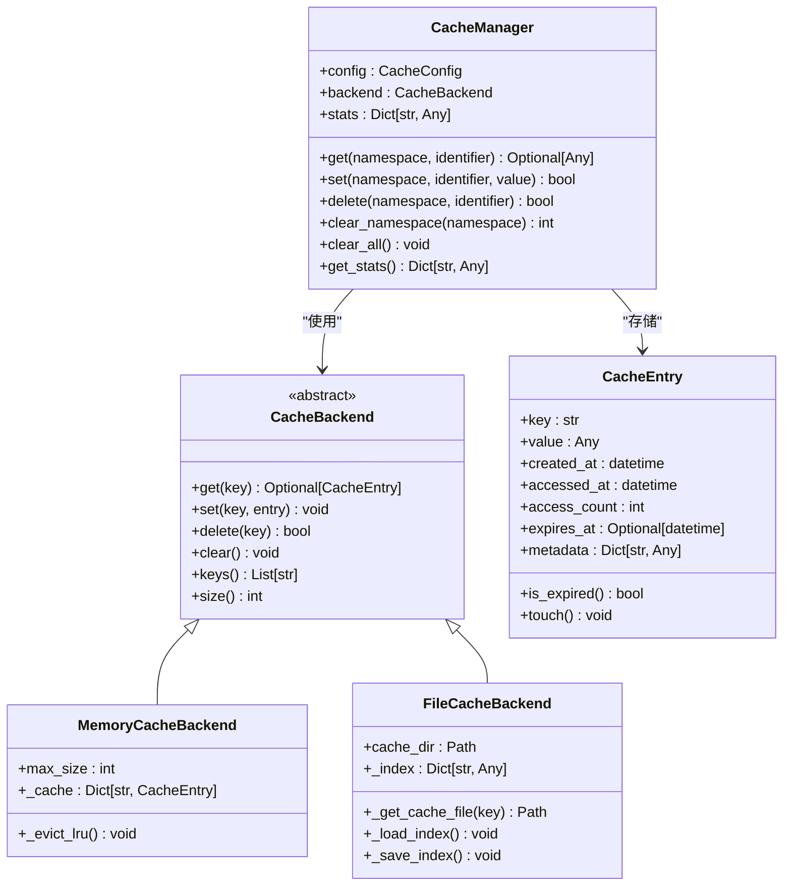
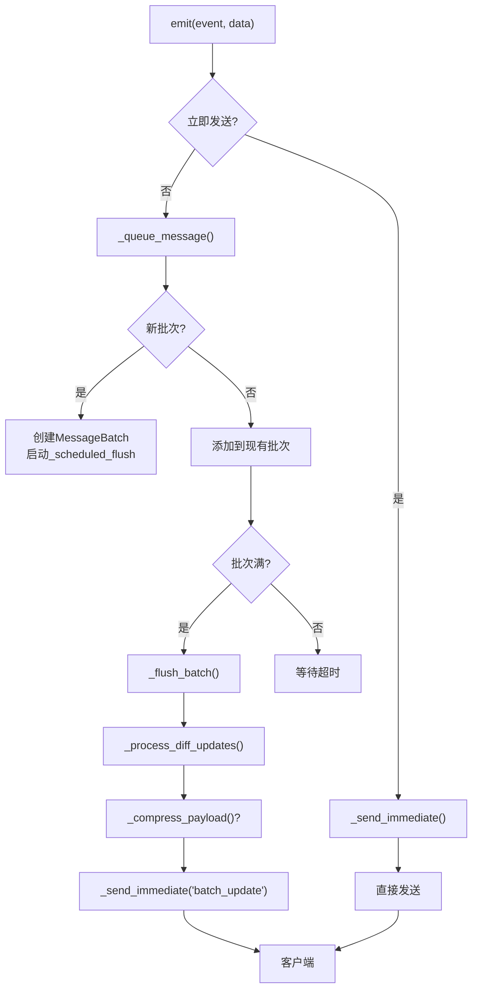
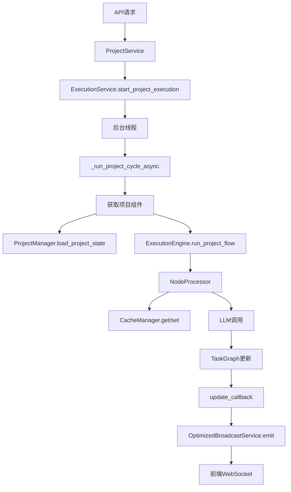

# 核心引擎

<cite>
**本文档引用文件**  
- [project_manager.py](file://src\sentientresearchagent\core\project_manager.py)
- [project_structure.py](file://src\sentientresearchagent\core\project_structure.py)
- [cache_manager.py](file://src\sentientresearchagent\core\cache\cache_manager.py)
- [error_handler.py](file://src\sentientresearchagent\core\error_handler.py)
- [execution_service.py](file://src\sentientresearchagent\server\services\execution_service.py)
- [optimized_broadcast_service.py](file://src\sentientresearchagent\server\services\optimized_broadcast_service.py)
</cite>

## 目录
1. [项目生命周期管理](#项目生命周期管理)
2. [执行调度与运行时服务](#执行调度与运行时服务)
3. [多级缓存策略](#多级缓存策略)
4. [异常处理机制](#异常处理机制)
5. [任务协调与状态更新](#任务协调与状态更新)
6. [前端高效推送](#前端高效推送)
7. [服务依赖与调用链路](#服务依赖与调用链路)

## 项目生命周期管理

`project_manager.py` 是项目生命周期管理的核心组件，负责项目的创建、加载、切换和持久化。它通过 `ProjectManager` 类实现对多个项目会话的统一管理。

当创建新项目时，`create_project` 方法生成唯一项目ID，并调用 `project_structure.py` 构建标准化目录体系。该方法还设置线程局部的项目上下文，确保各项目间隔离。项目元数据（如标题、目标、状态）被封装在 `ProjectMetadata` 数据类中，支持序列化存储于磁盘的 `projects.json` 文件。

项目结构由 `ProjectStructure` 类集中管理，提供单点控制的目录创建逻辑。通过 `get_project_root` 方法确定项目根目录（支持S3挂载或本地路径），并利用 `create_project_structure` 创建包含toolkits、results等子目录的完整结构。这种设计保证了所有组件使用一致的路径计算方式。

项目状态的保存与恢复通过 `save_project_state` 和 `load_project_state` 实现，将任务图数据以JSON格式存入项目目录下的 `graph_state.json`。此机制支持项目中断后的无缝续传，同时更新项目统计信息如节点数量。



**图表来源**
- [project_manager.py](file://src\sentientresearchagent\core\project_manager.py#L46-L237)
- [project_structure.py](file://src\sentientresearchagent\core\project_structure.py#L13-L90)

**本节来源**
- [project_manager.py](file://src\sentientresearchagent\core\project_manager.py#L46-L237)
- [project_structure.py](file://src\sentientresearchagent\core\project_structure.py#L13-L90)

## 执行调度与运行时服务

`execution_service.py` 负责协调项目执行流程，管理异步任务与线程安全。其核心是 `ExecutionService` 类，通过后台线程启动项目执行，避免阻塞主线程。

执行流程由 `start_project_execution` 触发，创建独立线程运行 `_run_project_in_thread`。该方法初始化事件循环，调用 `_run_project_cycle_async` 执行具体逻辑。关键设计在于 `RealtimeExecutionWrapper`，它包装执行引擎，提供周期性更新功能。通过 `_periodic_updates` 每0.5秒触发一次状态广播，确保前端实时同步。

对于当前显示的项目，系统频繁更新UI；而对于后台项目，则每5秒保存一次状态，平衡性能与数据完整性。执行结果处理极为严谨：成功时标记为"completed"，失败时记录错误并更新根节点状态。最终状态保存采用多重保障机制，包括常规保存、综合结果包和紧急备份，确保数据不丢失。



**图表来源**
- [execution_service.py](file://src\sentientresearchagent\server\services\execution_service.py#L184-L718)

**本节来源**
- [execution_service.py](file://src\sentientresearchagent\server\services\execution_service.py#L184-L718)

## 多级缓存策略

`cache_manager.py` 实现了内存+磁盘的多级缓存策略，显著降低LLM调用成本。`CacheManager` 类作为主入口，根据配置选择后端：内存缓存（`MemoryCacheBackend`）用于快速访问，文件缓存（`FileCacheBackend`）提供持久化存储。

缓存键通过 `_generate_key` 方法生成，结合命名空间、标识符和上下文哈希，确保唯一性。`get` 和 `set` 方法处理缓存读写，支持TTL过期和命中统计。内存后端采用LRU淘汰策略，而文件后端使用Pickle序列化存储，并维护索引文件跟踪元数据。

全局缓存管理器通过 `init_cache_manager` 初始化，供整个框架共享。统计数据包括命中率、请求数量等，帮助评估缓存效率。`clear_namespace` 方法允许按项目清除缓存（如 `project_{id}`），实现细粒度管理，避免跨项目污染。



**图表来源**
- [cache_manager.py](file://src\sentientresearchagent\core\cache\cache_manager.py#L305-L504)

**本节来源**
- [cache_manager.py](file://src\sentientresearchagent\core\cache\cache_manager.py#L305-L504)

## 异常处理机制

`error_handler.py` 定义了分层异常处理机制，确保系统稳定性和可调试性。`ErrorHandler` 类作为中心枢纽，捕获、记录并统计各类异常。

`handle_error` 方法接收原始异常，转换为框架特定的 `SentientError`，并附加上下文（如组件名、任务ID）。它更新错误统计，区分错误类型和来源组件，便于问题定位。详细日志模式下，输出异常上下文和完整堆栈跟踪。

装饰器如 `handle_task_errors` 和 `handle_agent_errors` 简化了错误处理代码注入，自动提取函数参数作为上下文。`ErrorRecovery` 提供重试逻辑，支持指数退避，增强对外部服务调用的韧性。全局错误处理器通过 `get_error_handler()` 单例访问，保证一致性。

```mermaid
classDiagram
class ErrorHandler {
+enable_detailed_logging : bool
+error_stats : Dict[str, Any]
+handle_error(error, component) Optional[SentientError]
+_log_error(error, component) void
+get_error_stats() Dict[str, Any]
+reset_stats() void
}
class ErrorRecovery {
+retry_with_backoff(func, max_retries) T
+safe_execute(func, default_return) Any
}
class SentientError {
+message : str
+cause : Optional[Exception]
+context : Dict[str, Any]
+to_dict() Dict[str, Any]
}
ErrorHandler --> SentientError : "处理"
ErrorRecovery ..> ErrorHandler : "辅助"
note right of ErrorHandler
全局单例，通过get_error_handler()访问
end note
```

**图表来源**
- [error_handler.py](file://src\sentientresearchagent\core\error_handler.py#L21-L112)

**本节来源**
- [error_handler.py](file://src\sentientresearchagent\core\error_handler.py#L21-L112)

## 任务协调与状态更新

`execution_service.py` 中的 `ExecutionService` 协调任务图执行，通过 `ProjectExecutionContext` 封装所有执行组件（任务图、知识库、状态管理器等）。每个项目拥有独立上下文，防止交叉污染。

`_run_project_cycle_async` 方法是执行核心，先加载现有状态（若存在）则继续执行，否则初始化新项目。它调用执行引擎的 `run_project_flow` 或 `run_cycle`，驱动任务分解与执行。状态更新通过回调函数传递，触发前端刷新。

项目状态保存经过优化，`_save_final_project_state_enhanced` 方法实施多重保存策略：常规保存、综合结果包和紧急备份。验证机制 `_verify_save` 确保数据完整性。知识库和缓存也在项目开始时清除，保证纯净环境。

**本节来源**
- [execution_service.py](file://src\sentientresearchagent\server\services\execution_service.py#L388-L516)

## 前端高效推送

`optimized_broadcast_service.py` 通过批处理和队列优化WebSocket通信。`OptimizedBroadcastService` 类收集消息，按时间或大小批量发送，减少网络开销。

`emit` 方法将消息加入队列，除非指定 `force_immediate`。`_queue_message` 创建或追加到当前批次，`_scheduled_flush` 在超时后发送。`_process_diff_updates` 计算状态差异，仅传输变更部分，大幅减小数据量。

压缩功能启用时，使用Gzip压缩有效负载。统计信息跟踪消息数、字节数和压缩率。`broadcast_to_project` 方法向特定项目房间广播，实现定向更新。关闭时，`flush_all` 确保所有待处理消息被发送。



**图表来源**
- [optimized_broadcast_service.py](file://src\sentientresearchagent\server\services\optimized_broadcast_service.py#L52-L359)

**本节来源**
- [optimized_broadcast_service.py](file://src\sentientresearchagent\server\services\optimized_broadcast_service.py#L52-L359)

## 服务依赖与调用链路

核心服务间通过依赖注入紧密协作。API请求首先由 `ProjectService` 处理，调用 `ExecutionService.start_project_execution` 启动执行。后者依赖 `SystemManager` 获取配置和缓存管理器。

执行过程中，`ExecutionService` 使用 `ProjectManager` 加载/保存状态，通过 `OptimizedBroadcastService.broadcast_to_project` 推送更新。缓存管理器由 `SystemManager` 提供，供各组件减少重复LLM调用。

从API到任务触发的完整流程：用户请求 → ProjectService → ExecutionService（启动线程）→ 创建ProjectExecutionContext → ExecutionEngine驱动任务 → NodeProcessor调用LLM（经缓存检查）→ 状态变更 → BroadcastService推送至前端。



**图表来源**
- [execution_service.py](file://src\sentientresearchagent\server\services\execution_service.py#L184-L718)
- [optimized_broadcast_service.py](file://src\sentientresearchagent\server\services\optimized_broadcast_service.py#L52-L359)

**本节来源**
- [execution_service.py](file://src\sentientresearchagent\server\services\execution_service.py#L184-L718)
- [optimized_broadcast_service.py](file://src\sentientresearchagent\server\services\optimized_broadcast_service.py#L52-L359)